# BSIT Academic LMS architecture

## 1. Document status

This document defines the approved target architecture for the BSIT Academic LMS. The Phase 1 Laravel foundation, human-approved Phase 2 authentication/profile slice, human-approved Phase 3 roles and authorization slice, and human-approved Phase 4A Course foundation are implemented. Phase 4B curriculum and material foundation is implemented and awaiting human review. This document does not create hosted services or payment resources.

The approved stack is:

```text
Laravel 13
PHP 8.4 to 8.5
Blade
Tailwind CSS
MySQL 8.x
Laravel Fortify authentication
Laravel Policies and Gates
Laravel Events, Listeners, and Jobs
Laravel Storage
PayMongo
Composer
```

See `technology-choice.md` for the decision record.

### Beginner reading mode

Do not read this file from beginning to end during early learning.

Read sections 2 through 9 first for system layers, routes, authentication, and authorization. Use sections 10 through 18 as feature reference. Read sections 20 through 24 before security, testing, or deployment work.

## 2. Architecture principles

1. Keep one Laravel application for pages, business logic, and server endpoints.
2. Keep privileged decisions on the server or in the database.
3. Keep controllers, views, policies, and business workflows separate.
4. Use MySQL relationships, constraints, indexes, and transactions.
5. Use Laravel Fortify authentication for browser sessions.
6. Use Policies for resource authorization.
7. Keep PayMongo secrets and payment transitions on the server.
8. Treat Enrollment as the access record and Payment as a separate record.
9. Calculate progress and Quiz scores from persisted data.
10. Keep Quiz answer keys out of Student responses before submission.
11. Issue certificates only after server-side completion checks.
12. Store protected learning files on private disks.
13. Use small, readable modules suitable for a BSIT project.
14. Avoid unnecessary packages, services, and frontend frameworks.
15. Preserve `FOR_UI` as a read-only visual reference.

## 3. System context

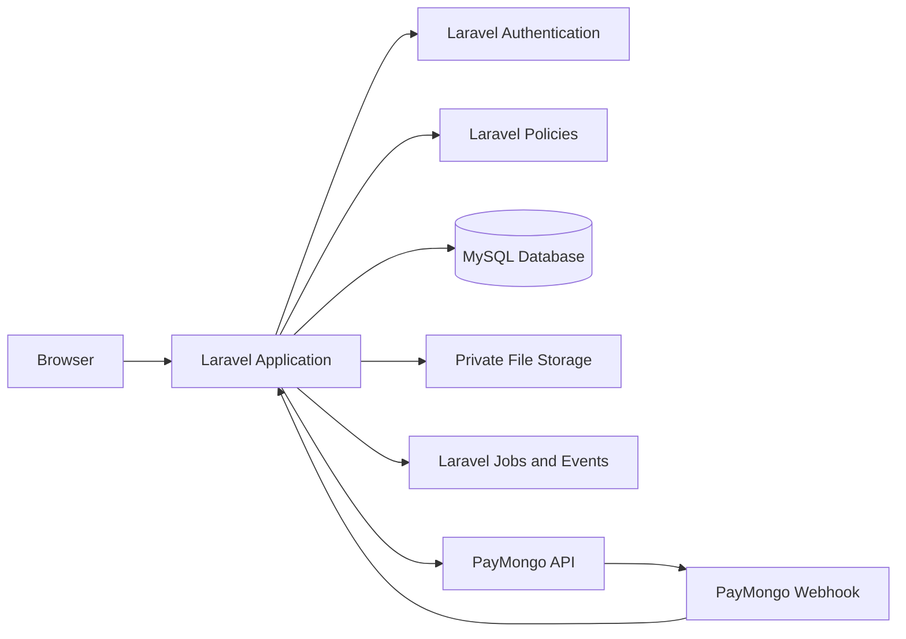

### Trust boundaries

| Boundary | Trusted side | Untrusted side | Required rule |
|---|---|---|---|
| Browser to Laravel | Laravel server | Form fields, IDs, roles, prices, scores, status values | Validate and authorize every request |
| Laravel to MySQL | Eloquent and transactions | Client-supplied state | Use constraints and server-owned transitions |
| Laravel to Storage | Server-only Storage service | File names and object paths | Generate paths and check access before download |
| Laravel to PayMongo | Server-only client and verified webhook | Browser redirects and unverified events | Treat verified webhook data as authoritative |
| Queue to Laravel | Serialized internal job data | External event data | Re-check current database state inside each job |

## 4. Application layers

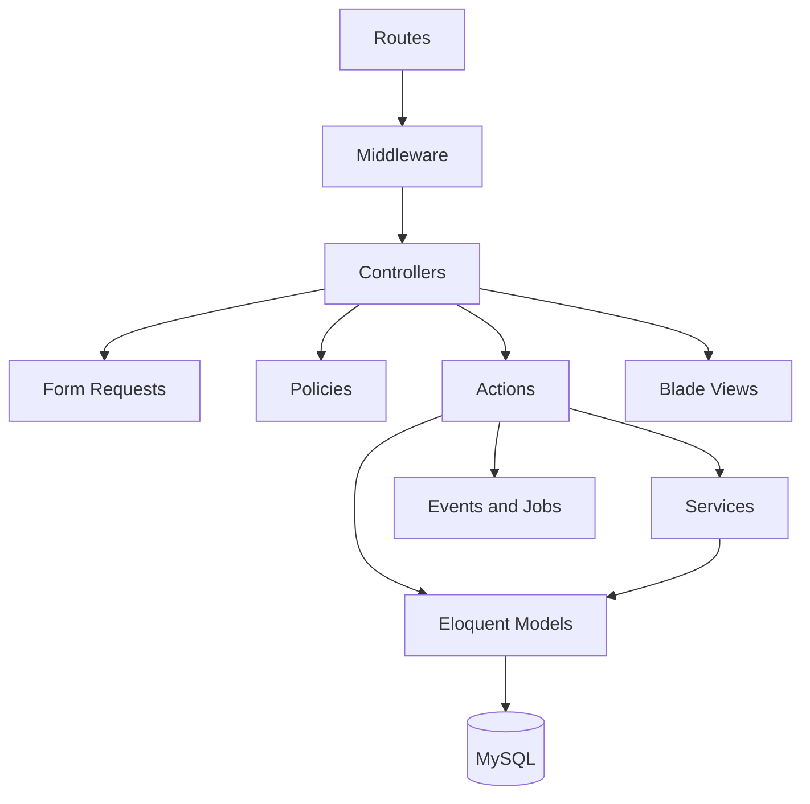

### Layer responsibilities

#### Routes

`routes/web.php` defines browser routes.

Routes should contain route names, middleware, and controller references. Business logic does not belong in route files.

#### Middleware

Middleware handles cross-cutting request concerns:

- Authentication
- Email verification
- Role access
- Throttling
- Request correlation
- Security headers where configured

#### Controllers

Controllers coordinate one request:

1. Receive the request
2. Call Form Request validation
3. Ask a Policy for authorization
4. Call an Action or Service
5. Redirect or return a response

Controllers should not contain long payment, grading, completion, or certificate workflows.

#### Form Requests

Form Requests define:

- Required fields
- Input types
- Allowed values
- File constraints
- Authorization for the request class when appropriate

Sensitive fields such as `role`, `price_minor`, `status`, `score`, and `completed_at` must never be mass-assigned from a normal form.

#### Policies

Policies define actions against resources:

- `CoursePolicy`
- `EnrollmentPolicy`
- `LessonPolicy`
- `QuizPolicy`
- `PaymentPolicy`
- `CertificatePolicy`

A Policy receives the authenticated User and the requested resource.

#### Actions and Services

Actions represent one business operation:

- `EnrollStudent`
- `ActivatePaidEnrollment`
- `MarkLessonComplete`
- `StartQuizAttempt`
- `GradeQuizAttempt`
- `CompleteCourse`
- `IssueCertificate`

Services handle reusable technical work:

- `PayMongoClient`
- `CertificateCodeGenerator`
- `LearningMaterialStorage`
- `ProgressCalculator`
- `CourseCompletionChecker`

Use transactions inside Actions which change multiple records.

#### Models

Eloquent Models represent database records and relationships.

Models must not become large business-logic containers.

#### Blade views

Blade views render authorized data and collect form input.

Views may use `@can` to improve the interface, but controllers, Actions, Jobs, and Policies still enforce access.

## 5. Request lifecycle

A normal authenticated request follows this path:

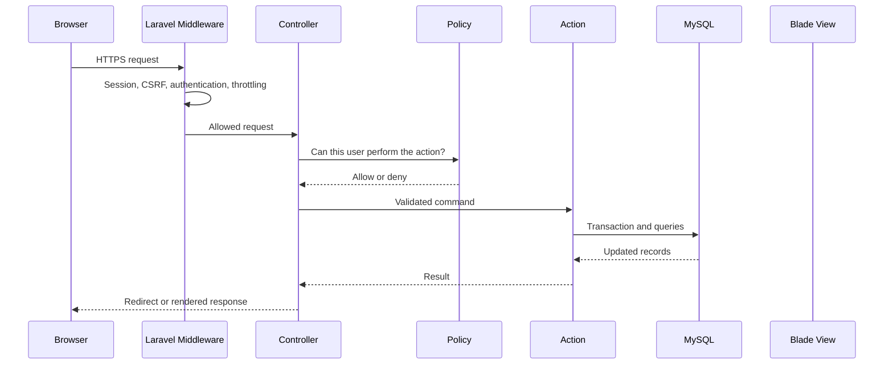

Every protected mutation repeats authorization inside the server workflow. Middleware alone is not enough.

## 6. Route architecture

### Public routes

| Method | URI | Purpose | Access |
|---|---|---|---|
| GET | `/` | Home page | Public |
| GET | `/up` | Application health check | Public |
| GET | `/courses` | Published course catalog | Public |
| GET | `/courses/{course}` | Public course details | Public |
| GET | `/login` | Sign in | Guest |
| POST | `/logout` | Sign out | Authenticated |
| GET | `/register` | Student registration | Guest |
| POST | `/register` | Create Student account | Guest |
| GET | `/forgot-password` | Request password reset | Guest |
| POST | `/forgot-password` | Send reset instructions. One answer either way: `SafePasswordResetLinkResponse` serves both of the package response contracts, so the form cannot reveal which addresses have an account | Guest |
| GET | `/reset-password/{token}` | Reset form | Valid reset token |
| POST | `/reset-password` | Save new password | Valid reset token |
| GET | `/email/verify` | Email verification notice | Authenticated |
| GET | `/email/verify/{id}/{hash}` | Verify signed email link | Signed link |
| GET | `/account/profile` | View own profile | Authenticated |
| PATCH | `/account/profile` | Update approved profile fields | Authenticated |
| GET | `/account/password` | Change temporary or current password | Authenticated |
| POST | `/account/password` | Save a new password | Authenticated |

### Phase 3 role routes

| Method | URI | Purpose | Protection |
|---|---|---|---|
| GET | `/student` | Minimal Student landing page | Student role and active account |
| GET | `/instructor` | Minimal Instructor landing page | Instructor role and active account |
| GET | `/admin` | Minimal Administrator landing page | Administrator role and active account |
| GET | `/admin/users` | Searchable user management list | Administrator role and active account |
| PATCH | `/admin/users/{user}/role` | Assign one approved role | Administrator Policy and verified target |
| PATCH | `/admin/users/{user}/status` | Suspend or reactivate account | Administrator Policy and self/last-admin rules |
| GET | `/admin/activity` | Read-only role and status activity | Administrator role and active account |

Role routes use `auth`, `account.active`, `verified`, `password.change`, and `role` middleware. Controllers and Actions repeat authorization inside the server workflow.

### Phase 5A Instructor Course Outline routes

| Method | URI | Purpose | Protection |
|---|---|---|---|
| GET | `/instructor/courses` | List owned Courses | Instructor role and CoursePolicy |
| GET | `/instructor/courses/new` | Create Course form | Instructor role and CoursePolicy |
| POST | `/instructor/courses` | Create a private draft Course | Instructor role and CoursePolicy |
| GET | `/instructor/courses/{course}` | Read-only owned Course outline | Instructor role and CoursePolicy |

Phase 5A does not expose the later Course edit, publish, curriculum action, upload, or download routes.

### Phase 5B curriculum authoring routes

| Method | URI | Purpose | Protection |
|---|---|---|---|
| POST | `/instructor/courses/{course}/modules` | Add a draft Module | Instructor role and ModulePolicy |
| POST | `/instructor/courses/{course}/modules/{module}/lessons` | Add a draft Lesson | Instructor role and LessonPolicy |

Phase 5B assigns positions, status, parent IDs, and Lesson slugs on the server. It does not add public content, upload, download, enrollment, or payment routes.

### Phase 5C content editing routes

| Method | URI | Purpose | Protection |
|---|---|---|---|
| GET | `/instructor/courses/{course}/edit` | Show the Course edit form | Instructor role and CoursePolicy |
| PATCH | `/instructor/courses/{course}` | Save Course metadata | Instructor role and CoursePolicy |
| GET | `/instructor/courses/{course}/modules/{module}/edit` | Show the Module edit form | Instructor role and ModulePolicy |
| PATCH | `/instructor/courses/{course}/modules/{module}` | Save Module metadata | Instructor role and ModulePolicy |
| GET | `/instructor/courses/{course}/modules/{module}/lessons/{lesson}/edit` | Show the Lesson edit form | Instructor role and LessonPolicy |
| PATCH | `/instructor/courses/{course}/modules/{module}/lessons/{lesson}` | Save Lesson metadata | Instructor role and LessonPolicy |

Phase 5C keeps owner, parent, position, status, currency, and slugs server-owned. It does not add delete, archive, reorder, publish, upload, download, enrollment, or payment routes.


### Instructor learner progress route

| Method | URI | Purpose | Protection |
|---|---|---|---|
| GET | `/instructor/courses/{course}/students` | Every learner on an owned Course, with the progress they have made | Instructor role and `CoursePolicy::viewStudents` |

This is the page behind the "Student progress" item in `plan.md` L785. It sits on
the Course rather than on the dashboard because a dashboard can only carry a
panel's worth of learners, and "how is this cohort doing" is a question about one
Course.

`viewStudents` answers the same as `view` today, and is asked for by name so the
rule is written in one place: a later change to who may open a Course does not
silently change who may read its roster. Administration is not teaching, so an
Administrator does not gain it, which is the line `ConversationPolicy` draws for
course messages.

The progress percentage is produced by `ProgressCalculator`, the same place
every other figure on every page comes from, so the number a teacher sees and the
number a learner sees are produced by one piece of code. Cancelled and unpaid
enrollments are not listed, because they have not started.

### Phase 5D Learning Material routes

| Method | URI | Purpose | Protection |
|---|---|---|---|
| POST | `/instructor/courses/{course}/modules/{module}/lessons/{lesson}/materials` | Add a Learning Material | Instructor role and LearningMaterialPolicy |
| GET | `/instructor/courses/{course}/modules/{module}/lessons/{lesson}/materials/{material}/edit` | Show the Material edit form | Instructor role and LearningMaterialPolicy |
| PATCH | `/instructor/courses/{course}/modules/{module}/lessons/{lesson}/materials/{material}` | Save Material metadata | Instructor role and LearningMaterialPolicy |

Phase 5D accepts only `text`, `code`, `video_link`, and `external_link` materials. It does not add an upload field, a download route, delete, archive, publish, enrollment, or payment routes.

### Phase 5E publishing routes

| Method | URI | Purpose | Protection |
|---|---|---|---|
| POST | `/instructor/courses/{course}/publish` | Publish an owned draft Course | Instructor role and CoursePolicy |
| POST | `/instructor/courses/{course}/unpublish` | Return an owned published Course to draft | Instructor role and CoursePolicy |

Phase 5E sends a POST with no trusted body fields. It does not add a public catalog route, archive, delete, reorder, upload, download, enrollment, or payment route.

### Phase 6E progress flow

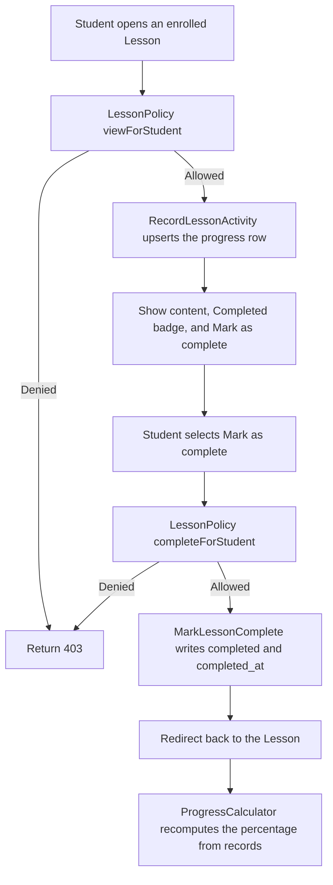

### Phase 6E Input, Process, and Output

**Input**

- Student session with the student role
- Enrolled Course ID
- Lesson ID inside that Course
- No trusted body field on the complete request

**Process**

- Apply `auth`, `account.active`, `verified`, `password.change`, and `role:student` middleware
- Return `404` when the Lesson does not belong to the Course in the URL
- Run LessonPolicy `viewForStudent` and `completeForStudent`
- Find the Student granting enrollment for the Course
- Upsert the progress row on view, setting `last_viewed_at`, and set `in_progress` with `started_at` only when the row is new
- Never downgrade a completed row
- On complete, set `completed` and `completed_at` on the server
- Keep the original `completed_at` when completing twice
- Compute the percentage only from records, using required published Lessons
- Hide the percentage while the Course is unpublished and keep the records

**Output**

- A progress record per enrollment and Lesson
- A Completed badge and a percentage that come from records
- No Continue Learning, quiz, certificate, or payment behavior

### Phase 6D lesson progress foundation

Phase 6D adds no route. It creates the `lesson_progress` table, the `LessonProgressStatus` enum, the `LessonProgress` model, and the Enrollment, Lesson, and User progress relationships.

### Phase 6E progress routes

| Method | URI | Purpose | Protection |
|---|---|---|---|
| POST | `/student/courses/{course}/lessons/{lesson}/complete` | Mark a Lesson complete | Authenticated student group and LessonPolicy `completeForStudent` |

`GET /student/courses/{course}/lessons/{lesson}` also records lesson activity as a side effect. Recording activity never completes a Lesson and never downgrades a completed record.

The complete request carries no trusted fields. `student_id`, `enrollment_id`, `status`, `completed_at`, and every percentage are written by Actions or read from records.

### Progress calculation

`App\Services\ProgressCalculator` is the only place a percentage is produced:

```text
percentage = completed required published Lessons / total required published Lessons
```

Rules:

- Only Lessons in published Modules count, so a draft Module cannot inflate or deflate progress.
- Optional Lessons never count.
- A total of zero returns `0%`. There is no division by zero.
- The result is rounded to the nearest whole percent.
- While a Course is not published, the percentage is hidden and the records are kept. This is Option A.

Phase 6E adds no Continue Learning, quiz, certificate, or payment route.

### Phase 7A reorder routes

| Method | URI | Purpose | Protection |
|---|---|---|---|
| PATCH | `/instructor/courses/{course}/modules/reorder` | Save a new Module order | Instructor group and ModulePolicy `reorder` |
| PATCH | `/instructor/courses/{course}/modules/{module}/lessons/reorder` | Save a new Lesson order | Instructor group and LessonPolicy `reorder` |

The request carries an `order` array of IDs. The Action rebuilds positions inside one transaction and ignores any ID that does not belong to the Course. Positions are never accepted from the browser.

### Phase 7A reorder rules

- The submitted order must be a permutation of the real Module or Lesson IDs for that owner.
- A missing, duplicated, or foreign ID fails validation before any write.
- Positions are renumbered from `1` with no gaps.
- Archived rows keep their position and are never offered for reorder.
- The whole reorder runs in one transaction, so a failure leaves the original order untouched.

### Phase 7B archive routes

| Method | URI | Purpose | Protection |
|---|---|---|---|
| POST | `/instructor/courses/{course}/archive` | Archive a Course | Instructor group and CoursePolicy `archive` |
| POST | `/instructor/courses/{course}/restore` | Return an archived Course to draft | Instructor group and CoursePolicy `restore` |
| POST | `/instructor/courses/{course}/modules/{module}/archive` | Archive a Module | Instructor group and ModulePolicy `archive` |
| POST | `/instructor/courses/{course}/modules/{module}/restore` | Return an archived Module to draft | Instructor group and ModulePolicy `restore` |
| POST | `/instructor/courses/{course}/modules/{module}/lessons/{lesson}/archive` | Archive a Lesson | Instructor group and LessonPolicy `archive` |
| POST | `/instructor/courses/{course}/modules/{module}/lessons/{lesson}/restore` | Return an archived Lesson to draft | Instructor group and LessonPolicy `restore` |

Archive is a status change, never a delete. `archived` is a terminal state for the public catalog. Restoring returns the row to `draft` so the Instructor publishes it deliberately again.

Archived content rules:

- An archived Course, Module, or Lesson leaves the public catalog and the student course page.
- Enrollments, Lesson progress, payments, and certificates are never touched by archiving.
- An archived row cannot be published directly. Restore first.
- `status` is server-owned and is never read from a request.

### Phase 7C private file routes

| Method | URI | Purpose | Protection |
|---|---|---|---|
| POST | `/instructor/courses/{course}/modules/{module}/lessons/{lesson}/materials` | Add a file material | Instructor group and LearningMaterialPolicy `create` |
| GET | `/student/courses/{course}/lessons/{lesson}/materials/{material}/download` | Download a file material | Student group and LearningMaterialPolicy `downloadForStudent` |
| GET | `/instructor/courses/{course}/modules/{module}/lessons/{lesson}/materials/{material}/download` | Download for the owning Instructor | Instructor group and LearningMaterialPolicy `downloadForInstructor` |
| GET | `/admin/materials/{material}/download` | Administrator download | Administrator group and LearningMaterialPolicy `downloadForAdministrator` |

Private file rules:

- Files are stored on the private `local` disk under a generated path. The original filename is never used as a path.
- Only `image`, `pdf`, and `document` types accept a file. Text, code, and link types keep their existing rules.
- Validation rejects executables, scripts, and unknown extensions before the file is stored.
- The stored MIME type is read from the file itself and is never taken from the request.
- `storage_disk`, `storage_path`, `mime_type`, and `byte_size` are written by the server only.
- Downloads are authorized on every request. No route serves a Storage path directly.
- A download uses the stored MIME type and a sanitized filename, and never renders the file inline.

### Phase 6A enrollment foundation

Phase 6A adds no route. It creates the `enrollments` table, the `EnrollmentStatus` enum, the `Enrollment` model, and the `User::enrollments()` and `Course::enrollments()` relationships. The free enrollment UI is Phase 6B.

### Phase 5F public catalog routes

| Method | URI | Purpose | Protection |
|---|---|---|---|
| GET | `/courses` | Public catalog of published Courses | Public, status filter |
| GET | `/courses/{course:slug}` | Public Course details and outline structure | Public, status filter |

These routes sit outside the authenticated middleware groups on purpose, because browsing is public. Safety comes from a `published` status filter in the query, not from a Policy. The details route binds by `slug` so public URLs stay readable and do not expose database IDs.

The catalog does not add an enrollment, payment, progress, certificate, download, upload, delete, or archive route.

### Phase 6B free enrollment routes

| Method | URI | Purpose | Protection |
|---|---|---|---|
| GET | `/student/courses` | Student `My courses` page | Authenticated student group and EnrollmentPolicy |
| POST | `/student/courses/{course}/enroll` | Enroll in a published free Course | Authenticated student group and EnrollmentPolicy |

Both routes sit inside the standard authenticated group, so `auth`, `account.active`, `verified`, and `password.change` all apply, plus `role:student`. The enroll request carries no trusted fields: `student_id`, `status`, and every timestamp come from the session and the server.

Phase 6B does not add a lesson access, progress, payment, cancel, refund, or download route.

### Phase 6C lesson access routes

| Method | URI | Purpose | Protection |
|---|---|---|---|
| GET | `/student/courses/{course}` | Student Course page with published Lessons | Authenticated student group and CoursePolicy `viewCourseForStudent` |
| GET | `/student/courses/{course}/lessons/{lesson}` | Student Lesson page with content and materials | Authenticated student group and LessonPolicy `viewForStudent` |

Access is decided by enrollment, not by publication:

1. The viewer must be an active, verified Student.
2. `App\Support\StudentCourseAccess` must find an enrollment with status `active` or `completed` for the Course.
3. The Lesson and its Module must both be `published`.

Because publication is not part of the gate, an enrolled Student keeps access after an Instructor unpublishes. A Lesson that belongs to another Course in the URL returns `404` before any content loads.

Phase 6C does not add a progress, complete, quiz, payment, cancel, or download route.

### Student routes


| Method | URI | Purpose |
|---|---|---|
| GET | `/dashboard` | Student overview |
| GET | `/student/courses` | Student course list |
| GET | `/student/courses/{course}` | Enrolled course overview |
| POST | `/student/courses/{course}/enroll` | Free enrollment or paid enrollment start |
| GET | `/student/learn/{course}/{lesson}` | Lesson page |
| POST | `/student/lessons/{lesson}/complete` | Mark Lesson complete |
| GET | `/student/assessments` | Available Quizzes |
| GET | `/student/assessments/{quiz}` | Quiz instructions and safe questions |
| POST | `/student/quizzes/{quiz}/attempts` | Start an Attempt |
| POST | `/student/attempts/{attempt}/submit` | Submit answers |
| GET | `/student/attempts/{attempt}` | Result |
| GET | `/student/payments` | Own payment history |
| GET | `/student/certificates` | Own certificates |
| GET | `/student/certificates/{certificate}` | Certificate view and print view |
| GET | `/student/profile` | Profile |
| PATCH | `/student/profile` | Approved profile fields |
| GET | `/student/settings` | Account settings |
| PATCH | `/student/settings` | Supported account settings |

### Instructor routes

| Method | URI | Purpose |
|---|---|---|
| GET | `/instructor` | Instructor dashboard |
| GET | `/instructor/courses` | Owned courses |
| GET | `/instructor/courses/new` | Create course form |
| POST | `/instructor/courses` | Store course |
| GET | `/instructor/courses/{course}` | Owned course overview |
| GET | `/instructor/courses/{course}/edit` | Edit course |
| PUT | `/instructor/courses/{course}` | Update course |
| POST | `/instructor/courses/{course}/publish` | Publish owned course |
| POST | `/instructor/courses/{course}/unpublish` | Unpublish owned course |
| GET | `/instructor/courses/{course}/modules` | Manage Modules |
| POST | `/instructor/courses/{course}/modules` | Create Module |
| PUT | `/instructor/modules/{module}` | Update or reorder Module |
| GET | `/instructor/courses/{course}/lessons/{lesson}/edit` | Edit Lesson |
| PUT | `/instructor/lessons/{lesson}` | Update Lesson |
| POST | `/instructor/lessons/{lesson}/materials` | Upload or link material |
| DELETE | `/instructor/materials/{material}` | Remove authorized material |
| GET | `/instructor/courses/{course}/students` | Enrolled Students |
| GET | `/instructor/courses/{course}/students/{student}/progress` | Authorized progress |
| GET | `/instructor/assessments` | Owned Quizzes |
| GET | `/instructor/assessments/new` | Create Quiz |
| POST | `/instructor/quizzes` | Store Quiz |
| GET | `/instructor/quizzes/{quiz}/edit` | Edit Quiz |
| PUT | `/instructor/quizzes/{quiz}` | Update Quiz |
| GET | `/instructor/quizzes/{quiz}/results` | Assessment results |
| POST | `/instructor/attempts/{attempt}/reset` | Audited Attempt reset |

### Administrator routes

| Method | URI | Purpose |
|---|---|---|
| GET | `/admin` | Administrator dashboard |
| GET | `/admin/users` | User management |
| GET | `/admin/users/{user}` | User detail |
| PATCH | `/admin/users/{user}/role` | Change role |
| PATCH | `/admin/users/{user}/status` | Suspend or reactivate account |
| GET | `/admin/courses` | All courses |
| GET | `/admin/enrollments` | All enrollments |
| PATCH | `/admin/enrollments/{enrollment}/status` | Approved non-payment status change |
| GET | `/admin/payments` | All payments |
| POST | `/admin/payments/{payment}/refund` | Approved refund workflow |
| GET | `/admin/reports` | Operational reports |
| GET | `/admin/activity` | Sanitized activity logs |
| GET | `/admin/settings` | Approved settings |
| PATCH | `/admin/settings` | Update approved settings |
| POST | `/admin/certificates/{certificate}/revoke` | Revoke certificate |
| POST | `/admin/certificates/{certificate}/reissue` | Reissue after fresh validation |

### Payment and file routes

| Method | URI | Purpose | Protection |
|---|---|---|---|
| POST | `/student/checkout` | Create PayMongo checkout | Student Policy and validated Course |
| GET | `/student/payments/return` | Display pending or confirmed state | Student owns payment |
| POST | `/webhooks/paymongo` | Receive PayMongo event | Signature verification and idempotency |
| GET | `/learning-materials/{material}/download` | Authorize and stream private file | Enrollment or ownership Policy |

A public JSON API is not required for V1.

Add API routes only when a separate client or approved mobile application needs one.

During Phase 2, the PayMongo public test key is stored only in the local ignored `.env`. No payment route, package, table, checkout, or webhook is part of the authentication phase.

## 7. Authentication

Laravel built-in authentication owns:

- Registration
- Login
- Logout
- Sessions
- Password hashing
- Password reset
- Email verification
- Login throttling
- Session invalidation

### Registration

1. Guest opens `/register`.
2. Form Request accepts name, email, password, and password confirmation.
3. No role field is accepted.
4. Laravel creates a User with no privileged role field.
5. An Action creates one Profile with `role = student`.
6. The database transaction keeps User and Profile creation consistent.

### Laravel Fortify boundary

Laravel Fortify owns the authentication routes and server flows for:

- Registration
- Login and logout
- Password reset requests
- Password reset links
- Email verification
- Authentication throttling

The project owns the Fortify actions and Blade views. Fortify does not create a role field, payment record, Course, or business authorization rule.

Two-factor authentication remains disabled for V1.

### Local Administrator bootstrap

The first Administrator is provisioned by a local Artisan command, not a public route and not a browser form.

The command must:

1. Refuse to run outside the local environment unless an explicit recovery override is added later.
2. Validate the configured owner name and email.
3. Refuse to silently promote an existing Student or Instructor.
4. Create the User and Profile in one database transaction.
5. Mark the email as verified for the local demo.
6. Generate a random temporary password.
7. Store the temporary password in a DPAPI-protected local file.
8. Set `profiles.must_change_password = true`.
9. Never log or commit the temporary password.

The command is a setup and recovery boundary. Role changes for existing users remain an Administrator action in Phase 3.

### Forced password change

When an authenticated User has `must_change_password = true`, middleware permits only the password change page, logout, and required verification routes. Every other authenticated page redirects to the password change page.

After a successful password change, the action updates the password and clears the flag in one transaction.

### Session rules

- Regenerate the session after login.
- Invalidate and regenerate the CSRF token after logout.
- Use secure cookies in production.
- Suspended accounts cannot authenticate.
- Authentication answers who the user is.

### Phase 2 authentication flow

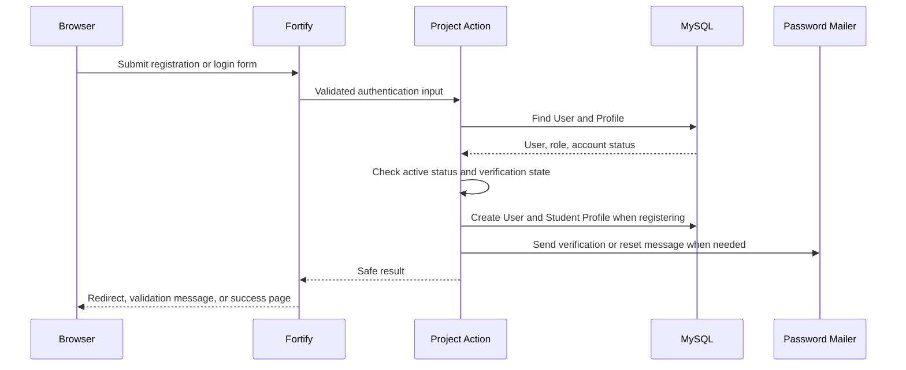

### Temporary password flow

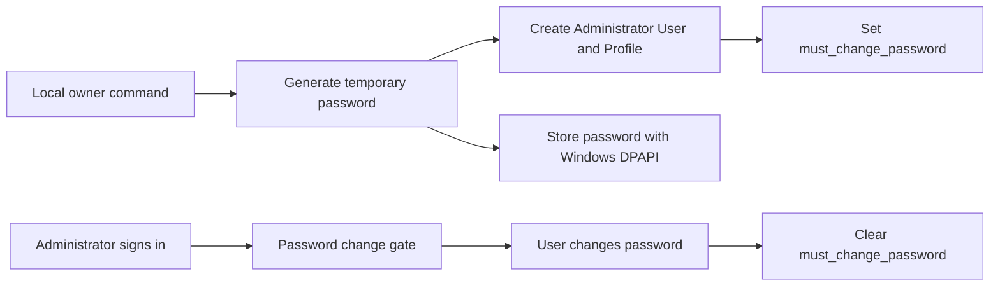

### Phase 3 role and status flow

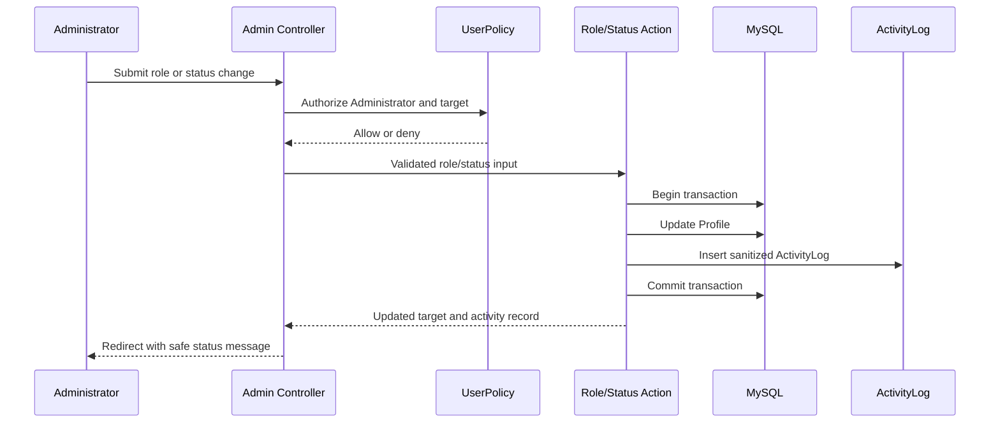

A failed validation, policy denial, or last-Administrator safeguard rolls back both records.

### Phase 4A Course foundation flow

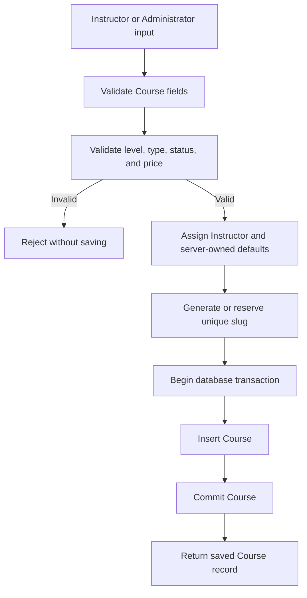

Phase 4A does not publish a Course to the public catalog. A later Course action will own slug generation and publication state changes.

### Phase 4A Input, Process, and Output

**Input**

- Instructor User ID
- Course title
- Description
- Learning objectives
- Category
- Level
- Course type
- Price in minor units
- Currency

**Process**

- Validate the Instructor relationship
- Validate approved enum values
- Validate the price and Course type together
- Apply server-owned defaults
- Generate or reserve a unique slug
- Save the Course in a database transaction

**Output**

- Valid Course record
- Instructor relationship
- Safe draft/free defaults
- Database constraints and indexes
- No public catalog access
- No enrollment, payment, curriculum, or upload record

### Phase 4B curriculum foundation flow

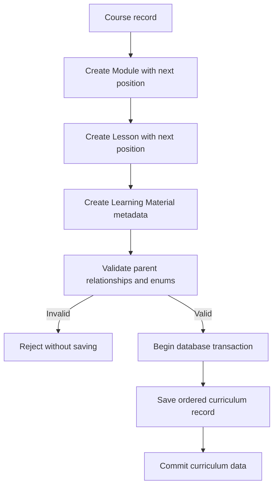

Phase 4B validates database relationships and metadata only. Role authorization, content actions, uploads, URL allowlisting, and private file delivery come later.

### Phase 4B Input, Process, and Output

**Input**

- Parent Course, Module, or Lesson ID
- Title and safe description or summary fields
- Ordered position
- Content status
- Lesson required flag
- Estimated minutes
- Material type and safe metadata

**Process**

- Validate the parent relationship
- Validate approved status and material type values
- Validate positive ordering and duration values
- Enforce parent-scoped uniqueness
- Apply safe defaults
- Save metadata in a database transaction
- Do not accept or serve files in this phase

**Output**

- Ordered Module, Lesson, and Learning Material records
- Course → Module → Lesson → Material relationships
- No public curriculum route
- No upload or private download behavior
- No enrollment or payment record

### Phase 5A Instructor Course Outline flow

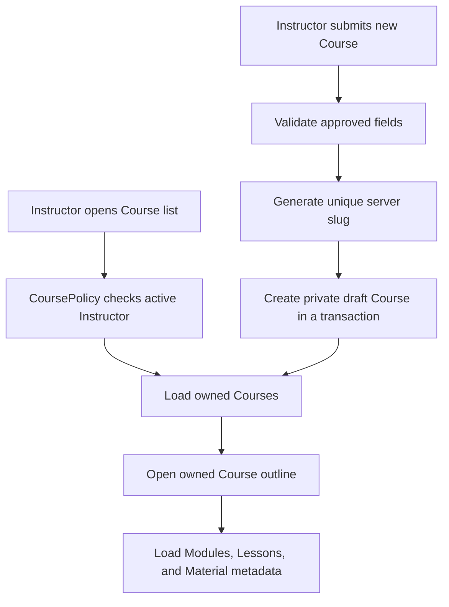

Phase 5A never exposes draft Course data to guests or other Instructors. Public catalog, enrollment, payments, uploads, and curriculum mutations remain later phases.

### Phase 5A Input, Process, and Output

**Input**

- Instructor session
- Course title and safe metadata
- Level and Course type
- Price in integer minor units

**Process**

- Authenticate and verify the active Instructor
- Run CoursePolicy authorization
- Validate the CreateCourse Form Request
- Reject privileged fields
- Validate free/paid price consistency
- Generate a unique slug on the server
- Create a private draft Course in one transaction
- Redirect to the owned Course outline

**Output**

- Owned Course list
- Private draft Course
- Read-only Course outline with Module, Lesson, and Material metadata
- No public Course access
- No enrollment, payment, upload, or curriculum mutation

### Phase 5B curriculum authoring flow

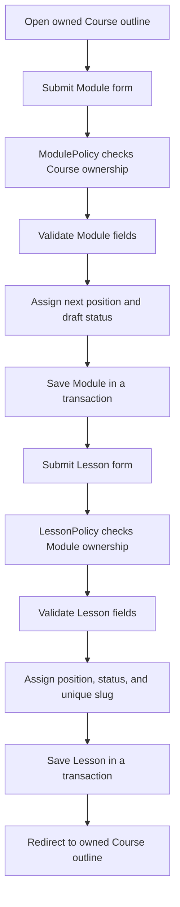

### Phase 5B Input, Process, and Output

**Input**

- Owned Course or Module ID
- Module title and description
- Lesson title, summary, content text, required flag, and estimated minutes

**Process**

- Run ModulePolicy or LessonPolicy
- Validate the Form Request
- Reject parent, position, status, and slug fields from the request
- Assign the next position inside the server
- Generate a unique Lesson slug inside the Module
- Save private draft content in a database transaction

**Output**

- Ordered Module and Lesson records
- Updated owned Course outline
- No public content, upload, download, enrollment, or payment behavior

### Phase 5C content editing flow

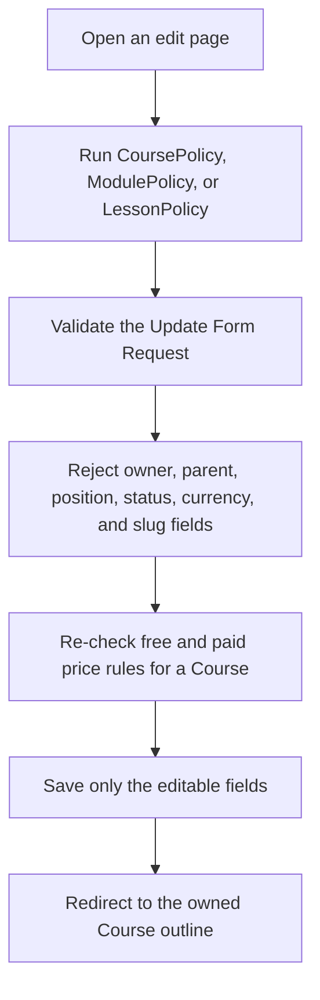

### Phase 5C Input, Process, and Output

**Input**

- Owned Course, Module, or Lesson ID
- Course title, description, learning objectives, category, level, type, and price
- Module title and description
- Lesson title, summary, content, required state, and estimated minutes

**Process**

- Run the matching Policy for the acting Instructor
- Validate the Update Form Request
- Reject `instructor_id`, `course_id`, `module_id`, `position`, `status`, `currency`, `published_at`, `thumbnail_path`, and `slug`
- Re-check the free and paid price rules for a Course
- Keep the stored slug, position, status, and owner unchanged
- Save only the editable fields

**Output**

- Corrected Course, Module, or Lesson records
- Updated owned Course outline
- No delete, archive, reorder, publish, upload, enrollment, or payment behavior

### Phase 5D Learning Material authoring flow

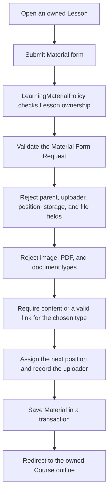

### Phase 5D Input, Process, and Output

**Input**

- Owned Lesson ID
- Material title
- Material type: `text`, `code`, `video_link`, or `external_link`
- Material content text for `text` and `code`
- Material link for `video_link` and `external_link`

**Process**

- Run LearningMaterialPolicy for the acting Instructor
- Validate the Material Form Request
- Reject `lesson_id`, `uploaded_by`, `position`, `storage_disk`, `storage_path`, `mime_type`, `byte_size`, and any `file` input
- Reject image, PDF, and document types with a clear message
- Require content text for text and code materials
- Require a valid link for video link and external link materials
- Assign the next position inside the Lesson and store the acting Instructor as uploader
- Keep all storage metadata empty
- Save inside a database transaction

**Output**

- Ordered Learning Material metadata
- Updated owned Course outline
- Empty storage metadata
- No public content, upload, download, delete, enrollment, or payment behavior

### Phase 5E publishing flow

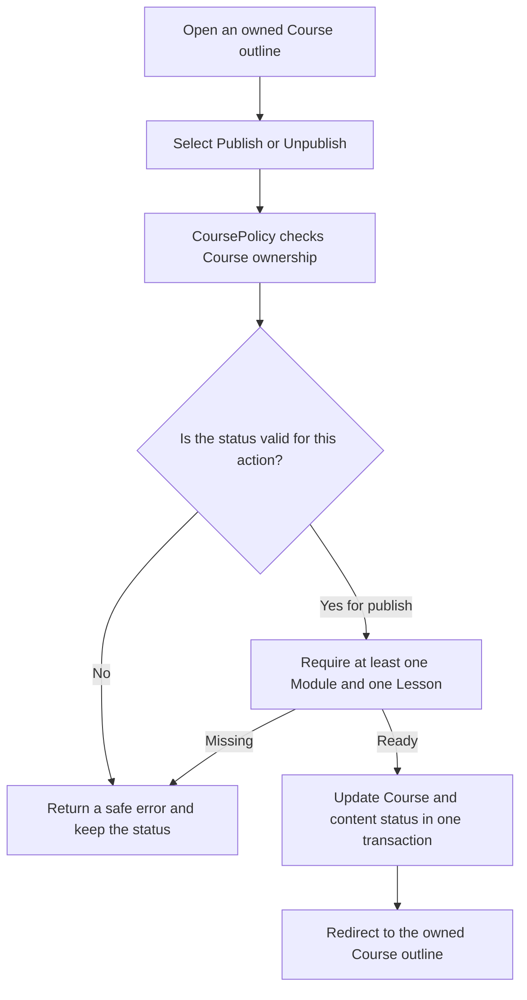

### Phase 5E Input, Process, and Output

**Input**

- Owned Course ID
- No other trusted field

**Process**

- Run CoursePolicy publish or unpublish for the acting Instructor
- Reject publish unless the Course is `draft`
- Reject unpublish unless the Course is `published`
- Reject publish when the Course has no Module or no Lesson
- Update Course, Module, and Lesson status inside one database transaction
- Set `published_at` on the server when publishing and keep it on unpublish
- Ignore any injected `status`, `published_at`, or `instructor_id` value
- Redirect to the owned Course outline

**Output**

- A published or draft Course with matching Module and Lesson status
- A server-owned `published_at` value
- No public page, archive, delete, enrollment, or payment behavior

### Phase 5F public catalog flow

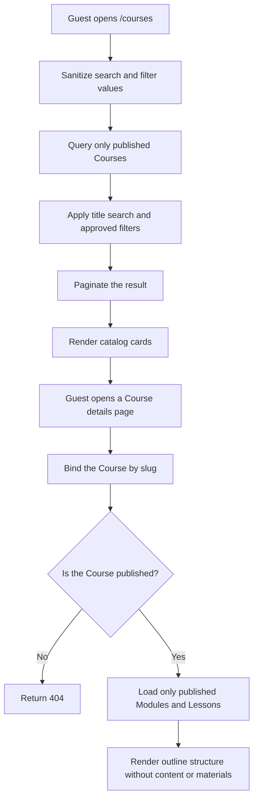

### Phase 5F Input, Process, and Output

**Input**

- Optional `q` search text
- Optional `category`, `level`, and `course_type` filters
- Optional `page` value
- Optional Course slug on the details page

**Process**

- Sanitize filters in a Form Request and drop unknown values
- Query only `status = published`
- Search the title with a bound query value
- Filter by category, level, and course type with bound values
- Order by `published_at` descending
- Load only published Modules and published Lessons for the details page
- Load only the Instructor display name
- Return `404` when the slug is missing or the Course is not published
- Paginate twelve rows per page

**Output**

- A public list of published Courses
- A public details page with outline structure only
- No Lesson content, no material data, no email address, no enrollment, and no payment

### Phase 6B free enrollment flow

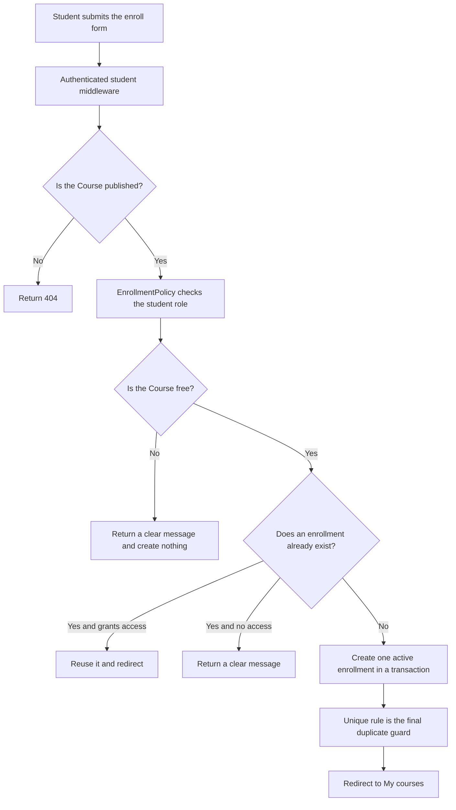

### Phase 6B Input, Process, and Output

**Input**

- Student session with the student role
- Published free Course

**Process**

- Apply `auth`, `account.active`, `verified`, `password.change`, and `role:student` middleware
- Return `404` when the Course is not published
- Run EnrollmentPolicy for the acting Student
- Return a clear message when the Course is paid
- Reuse an existing `active` or `completed` enrollment
- Refuse a `cancelled` or `pending_payment` enrollment
- Create one `active` enrollment with `activated_at` set by the server
- Catch a duplicate key error and reuse the existing enrollment
- Redirect to the Student `My courses` page

**Output**

- One active enrollment per Student and Course
- A student-owned course list scoped to the signed-in Student
- No lesson content, no progress, and no payment

### Phase 6C lesson access flow

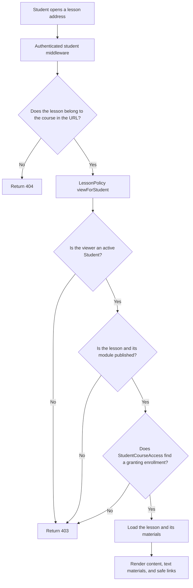

### Phase 6C Input, Process, and Output

**Input**

- Student session with the student role
- Enrolled Course ID
- Lesson ID inside that Course

**Process**

- Apply `auth`, `account.active`, `verified`, `password.change`, and `role:student` middleware
- Return `404` when the Lesson does not belong to the Course in the URL
- Run LessonPolicy `viewForStudent`
- Require an active Student, a published Lesson, a published Module, and a granting enrollment
- Load Learning Materials for that Lesson ordered by position
- Render text and code material content and `http` or `https` links only
- Never render storage disk, storage path, MIME type, or byte size

**Output**

- A Student Course page with published Lesson titles
- A Lesson page with content and Learning Materials
- No progress, no quiz, no payment, and no download

### Phase 13 dashboard and report routes

| Method | URI | Purpose | Protection |
|---|---|---|---|
| GET | `/student` | Student dashboard | Student group |
| GET | `/instructor` | Instructor dashboard | Instructor group |
| GET | `/admin` | Administrator dashboard | Administrator group |
| GET | `/admin/reports` | Enrollment report | Administrator group |

### Dashboard rules

- `App\Services\Reporting\OperationsReport` is the only place a dashboard or report number is produced. Every value is a real query over stored records.
- The Instructor dashboard filters by `instructor_id`, so another instructor's courses and enrollment counts are never visible.
- The Administrator report reads payment amounts from the stored record and never renders a credential.
- Every dashboard has an empty state that names the next action instead of showing a blank grid.
- The report table scrolls inside its own container, so a wide table never widens the page.

### Phase 11 and 12 payment routes

| Method | URI | Purpose | Protection |
|---|---|---|---|
| POST | `/student/courses/{course}/checkout` | Create a pending Payment and a provider checkout | Student group and EnrollmentPolicy `pay` |
| GET | `/student/courses/{course}/checkout/return` | Provider return page | Student group and EnrollmentPolicy `view` |
| POST | `/webhooks/paymongo` | Provider event delivery | Public, signed, throttled |

The webhook route is registered before the authenticated groups on purpose. It is the one route a browser session must never protect, and the one route a signature must always protect.

### Payment security rules

- Money is integer minor units with an ISO currency code. `App\Support\CoursePrice::forCourse` is the only place a chargeable amount is produced, so the amount can never come from a request.
- The idempotency key is derived from the enrollment and is unique with it, so a double click cannot create two charges.
- A checkout is only allowed for a Student's own `pending_payment` enrollment in a paid, published Course. Another Student receives `404`, because the controller resolves the acting Student's own enrollment.
- Activating an enrollment happens in the same transaction as marking the payment paid, so a Student is never left active without a paid record.
- The provider event id is unique per provider. A replayed delivery is recorded and changes nothing, so a duplicate paid event cannot create duplicate access.
- An unverified signature is recorded as `ignored` and changes no state. A tampered body with a valid original signature is rejected by the HMAC check.
- Signature comparison uses `hash_equals`, and a missing or empty signature is never treated as a pass.
- The signature header is not a bare digest. It carries a timestamp and one signature per mode: `t=1496734173,te=<hex>,li=`. The signed message is the timestamp, a period, and the untouched request body, hashed with the endpoint's secret using SHA-256. `te` is compared on a test deployment and `li` on a live one, so a signature from the other mode is never accepted.
- The timestamp is not checked for freshness. PayMongo retries a failed delivery up to twelve times and every retry carries the timestamp of the original event, so a freshness window would reject exactly the deliveries an endpoint most needs to accept. Replay is prevented by the provider event id being recorded once instead.
- A payment-level event carries the correlation key in `external_reference_number` rather than `reference_number`, so both are read. A `payment.paid` event settles the payment, and a `payment.failed` event marks it failed without touching the enrollment. The endpoint subscribes to `checkout_session.payment.paid`, `payment.paid`, and `payment.failed`, because the provider does not send one event for every outcome and a failure that is never delivered leaves a Student waiting on a payment that will not arrive.
- A failed or cancelled payment leaves the enrollment `pending_payment`, so a Student can retry. A refund cancels the enrollment and removes access.
- A Student sees one derived state per enrollment, from `App\Support\StudentPaymentState`: Paid, Included, Awaiting payment, Payment failed, Payment expired, Refunded, or Payment cancelled. A pending payment older than a day reads as expired, because a checkout left open cannot be completed. A declined card offers a retry and never tells a Student to contact an administrator.
- Credentials live only in server-only configuration. They are never rendered, logged, or written to a payment record, and a test asserts both.
- The return page never confirms a payment by itself. It states that the page does not confirm payment, and only a verified webhook can do that. It reloads itself while a payment is pending, because the confirmation arrives by webhook rather than by the browser returning.

### Payment flow

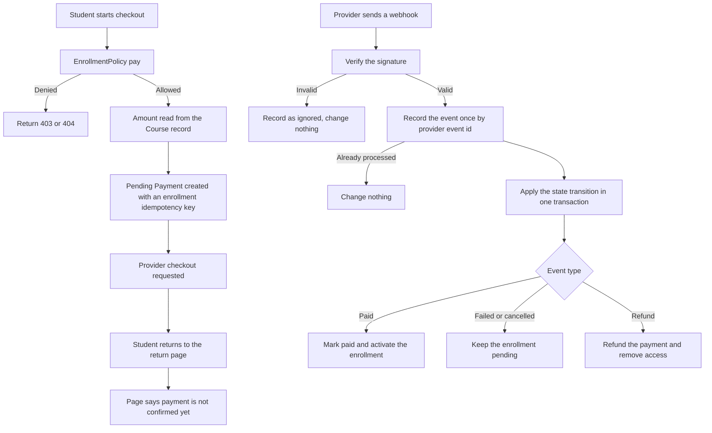

### Phase 10 completion and certificate routes

| Method | URI | Purpose | Protection |
|---|---|---|---|
| GET | `/student/certificates` | Certificate list with a live completion summary | Student group |
| GET | `/student/certificates/{certificate}` | Printable certificate | CertificatePolicy `view` |
| POST | `/student/courses/{course}/complete` | Complete a Course and claim a certificate | Student group and EnrollmentPolicy `complete` |
| GET | `/admin/certificates` | Administrator certificate list | Administrator group |
| POST | `/admin/certificates/{certificate}/revoke` | Revoke with a reason | Administrator group and CertificatePolicy `revoke` |
| POST | `/admin/certificates/{certificate}/reissue` | Reissue as a linked replacement | Administrator group and CertificatePolicy `reissue` |

### Completion and certificate rules

- `App\Services\Learning\CourseCompletionChecker` is the only definition of "finished". It reads stored Lesson progress and Quiz attempts.
- Default requirements: every required published Lesson, plus a pass on every required published Quiz. Draft content never blocks a Student.
- `certificate_enabled` on `course_requirements` turns issuance off for a Course without touching completion.
- Issuance is idempotent. A second call returns the existing certificate, and `CompleteCourse` runs inside a transaction.
- Exactly one valid certificate per enrollment is enforced by the database through `active_slot`: it is `1` while the certificate is valid and `NULL` once revoked. MySQL ignores NULLs in a unique index, so any number of revoked rows is allowed but only one valid certificate can exist.
- Revoking records the reason and the time. Nothing is deleted.
- Reissue re-runs the full eligibility check first, so a revoked certificate is not replaced after new requirements appear.
- The student and course names are stored as snapshots, so a later rename never rewrites history.
- `certificate_code` is server-generated and unique. A Student cannot submit one.
- Only the Student who owns the enrollment can complete it, and only while the enrollment still grants access. Another Student receives `404` because the controller resolves the acting Student's own enrollment.
- A certificate page is visible only to its owner and only while the Student can still read the Course. It is not a public document.

### Phase 9 quiz routes

Instructor:

| Method | URI | Purpose | Protection |
|---|---|---|---|
| POST | `/instructor/courses/{course}/quizzes` | Add a Quiz | Instructor group and QuizPolicy `create` |
| PATCH | `/instructor/courses/{course}/quizzes/{quiz}` | Edit a Quiz | Instructor group and QuizPolicy `update` |
| POST | `/instructor/courses/{course}/quizzes/{quiz}/publish` | Publish a Quiz | Instructor group and QuizPolicy `update` |
| POST | `/instructor/courses/{course}/quizzes/{quiz}/archive` | Archive a Quiz | Instructor group and QuizPolicy `archive` |
| POST | `/instructor/courses/{course}/quizzes/{quiz}/questions` | Add a Question with Options | Instructor group and QuizPolicy `update` |

Student:

| Method | URI | Purpose | Protection |
|---|---|---|---|
| GET | `/student/courses/{course}/quizzes/{quiz}` | Read a Quiz | Student group and QuizPolicy `viewForStudent` |
| POST | `/student/courses/{course}/quizzes/{quiz}/start` | Open an Attempt | Student group and QuizPolicy `startForStudent` |
| GET | `/student/courses/{course}/quizzes/{quiz}/attempts/{attempt}` | Answer an open Attempt | Student group and QuizAttemptPolicy `viewAttemptForStudent` |
| POST | `/student/courses/{course}/quizzes/{quiz}/attempts/{attempt}/submit` | Submit and grade | Student group and QuizAttemptPolicy `viewAttemptForStudent` |
| GET | `/student/courses/{course}/quizzes/{quiz}/attempts/{attempt}/result` | See the graded result | Student group and QuizAttemptPolicy `viewAttemptForStudent` |

### Quiz security rules

- The answer key is stored only in `quiz_options.is_correct` and never reaches a Student before submission. `QuizGrader::studentProjection` hides `is_correct` and both explanation fields.
- The score, percentage, and pass state are calculated by `App\Services\Quizzes\QuizGrader` from the stored Options. `score_points`, `score_percent`, `passed`, `status`, `student_id`, `attempt_number`, and `submitted_at` are `prohibited` in the request, so a spoofed submission is rejected outright.
- A Student reaches only their own Attempt, and only while the Quiz is still readable. A mismatched Quiz and Attempt pair is `404`.
- At most three Attempts per Student per Quiz, and never a new Attempt after passing. `StartQuizAttempt` runs in a transaction with a row lock, and the unique `(quiz_id, student_id, attempt_number)` rule makes a duplicate first Attempt impossible.
- Submitting twice keeps the first result. The Action re-reads the Attempt under a lock and returns it unchanged when it is no longer `in_progress`.
- An Option from another Question, or a Question from another Quiz, fails validation before any Answer row is written.
- A Quiz can only be published when it has at least one Question and every Question has exactly one correct Option.
- V1 has no quiz timer, so an Attempt may stay open indefinitely.

### Phase 9 flow

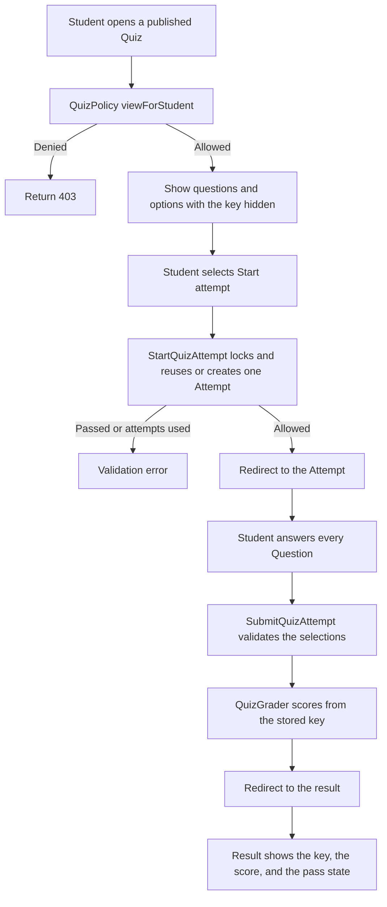

### Phase 9 Input, Process, and Output

**Input**

- Student session with the student role
- Enrolled Course ID and published Quiz ID
- One selected Option ID per Question
- No trusted score, status, or identity field

**Process**

- Apply `auth`, `account.active`, `verified`, `password.change`, and `role:student` middleware
- Return `404` when the Attempt belongs to another Quiz
- Run `QuizPolicy` and `QuizAttemptPolicy`
- Reuse the open Attempt, or create the next Attempt number inside a transaction
- Reject a selection whose Option does not belong to the Question
- Score from the stored key, never from the request
- Keep the first result when an Attempt is submitted twice

**Output**

- One `quiz_answers` row per answered Question
- A server-calculated score, percentage, and pass state
- No timer, no partial credit beyond the Question points, and no certificate

## 8. Authorization

Authorization answers what the user may do.

### Role middleware

Use role middleware for broad route groups:

- `role:student`
- `role:instructor`
- `role:administrator`

Phase 3 also uses:

- `account.active` to block suspended sessions
- `UserPolicy` for Administrator-only user management
- Server-side role and status actions
- A transaction for each account change and its activity record

A role or status change is rejected when:

- The actor is not an Administrator
- The target is the actor
- The target email is not verified
- A role or status value is outside the approved enum
- The change would demote or suspend the final active Administrator

### Resource policies

Use Policies for every resource action.

Examples:

- Student can view only own Enrollment.
- Student can download material only with access-granting Enrollment.
- Instructor can update only an owned Course.
- Instructor can view only an owned Course in Phase 5A.
- Administrator can manage all Courses in a later administration slice.
- Administrator cannot activate a paid Enrollment without verified payment evidence.
- User cannot change own role through a profile form.

### Blade authorization

`@can` and `@cannot` may hide irrelevant controls.

They are usability checks only. The server must repeat authorization.

## 9. Domain boundaries

| Domain | Main records | Boundary |
|---|---|---|
| Identity | User, Profile | Authentication and role storage |
| Course catalog | Course | Published metadata and ownership |
| Curriculum | Module, Lesson, LearningMaterial | Ordered academic content |
| Enrollment | Enrollment | Canonical Student access |
| Payment | Payment, PaymentEvent | Provider attempts and verified results |
| Learning | LessonProgress | Persisted Lesson activity |
| Assessment | Quiz, Question, Option, Attempt, Answer | Safe delivery and server grading |
| Certificate | Certificate | Verified completion record |
| Administration | ActivityLog, SystemSetting | Audited operations and approved settings |
| Reporting | Read-only queries | Operational summaries only |

Assignments, grading, announcements, notifications, forums, and live classes are outside V1.

## 10. Database conventions

### General rules

- Use InnoDB tables.
- Use unsigned BIGINT primary keys for Laravel records.
- Use foreign keys for relationships.
- Index columns used by authorization and frequent filters.
- Use `created_at` and `updated_at` timestamps.
- Use UTC timestamps.
- Use database ENUM or constrained strings for finite statuses.
- Store money as unsigned BIGINT minor units plus ISO currency.
- Use transactions for multi-record state changes.
- Preserve historical learning and payment records.
- Prefer controlled archive states over hard deletion.

### Indexing strategy

Add indexes for frequent authorization, relationship, ordering, and reporting queries:

```text
courses(instructor_id, status)
courses(status, course_type, published_at)
modules(course_id, position)
modules(course_id, status)
lessons(module_id, position)
lessons(module_id, status)
learning_materials(lesson_id, position)
learning_materials(storage_disk, storage_path)
enrollments(student_id, status)
enrollments(course_id, status)
payments(student_id, created_at)
payments(course_id, status)
payments(enrollment_id, status)
payment_events(processing_status, received_at)
lesson_progress(student_id, status)
lesson_progress(lesson_id, status)
quizzes(course_id, status)
quizzes(module_id)
quizzes(lesson_id)
quiz_attempts(student_id, created_at)
quiz_attempts(enrollment_id, status)
quiz_answers(attempt_id, question_id)
certificates(student_id, status)
certificates(course_id, status)
certificates(enrollment_id, status)
activity_logs(actor_id, created_at)
activity_logs(entity_type, entity_id)
```

Required unique indexes remain required even when another index has similar columns:

- `courses(slug)`
- `modules(course_id, position)`
- `lessons(module_id, slug)`
- `lessons(module_id, position)`
- `learning_materials(lesson_id, position)`
- `learning_materials(storage_disk, storage_path)`
- `enrollments(student_id, course_id)`
- `payments(provider, provider_payment_id)`
- `payments(enrollment_id, idempotency_key)`
- `payment_events(provider, provider_event_id)`
- `lesson_progress(enrollment_id, lesson_id)`
- `quiz_attempts(quiz_id, student_id, attempt_number)`
- `quiz_answers(attempt_id, question_id)`
- `certificates(certificate_code)`

Paginate Administrator tables and reports. Use `EXPLAIN` before adding or changing indexes.

### Relationship overview

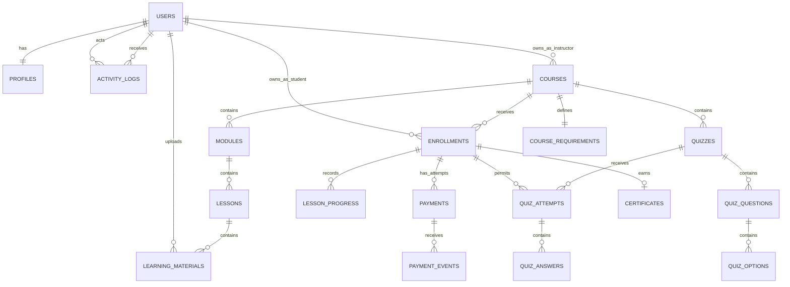

## 11. Database tables

### `users`

Standard Laravel Fortify authentication table.

| Column | Type | Rules |
|---|---|---|
| `id` | BIGINT UNSIGNED | Primary key |
| `name` | VARCHAR | Required |
| `email` | VARCHAR | Unique, required |
| `email_verified_at` | TIMESTAMP | Nullable |
| `password` | VARCHAR | Hashed, at least 60 characters |
| `remember_token` | VARCHAR | Nullable, 100 characters |
| timestamps | TIMESTAMP | Required |

`users.name` is the canonical display name. Do not duplicate it in `profiles`.

### `profiles`

| Column | Type | Rules |
|---|---|---|
| `user_id` | BIGINT UNSIGNED | Primary key, foreign key to users |
| `role` | ENUM | `student`, `instructor`, `administrator` |
| `account_status` | ENUM | `active`, `suspended` |
| `must_change_password` | BOOLEAN | Default false |
| `avatar_path` | VARCHAR | Nullable, private Storage path |
| `bio` | TEXT | Nullable |
| timestamps | TIMESTAMP | Required |

Role and account status cannot be updated by the profile owner.

`avatar_path` is a later private Storage field. It is not part of the Phase 2 migration.

### `courses`

Phase 4A creates the Course table and its ownership relationship. Curriculum, enrollment, payment, and upload behavior stay in later phases.

| Column | Type | Rules |
|---|---|---|
| `id` | BIGINT UNSIGNED | Primary key |
| `instructor_id` | BIGINT UNSIGNED | Foreign key to users, delete restricted |
| `title` | VARCHAR | Required |
| `slug` | VARCHAR | Unique, required, server-generated |
| `description` | TEXT | Nullable while authoring |
| `learning_objectives` | TEXT | Nullable |
| `category` | VARCHAR | Nullable |
| `level` | ENUM | `beginner`, `intermediate`, `advanced`; default `beginner` |
| `course_type` | ENUM | `free`, `paid`; default `free` |
| `price_minor` | BIGINT UNSIGNED | Default 0, server-owned minor units |
| `currency` | CHAR(3) | `PHP`, default `PHP` |
| `status` | ENUM | `draft`, `published`, `archived`; default `draft` |
| `thumbnail_path` | VARCHAR | Nullable, protected by default, server-owned |
| `published_at` | TIMESTAMP | Nullable, server-owned |
| timestamps | TIMESTAMP | Required |

Constraints:

- Free Course has zero price.
- Paid Course has a positive price.
- Currency is always `PHP`.
- Level, Course type, and Course status accept only approved values.
- `slug` is unique.
- Index Instructor, status, type, category, and publication time for later catalog queries.
- `instructor_id`, `slug`, `price_minor`, `currency`, `status`, `published_at`, and `thumbnail_path` are not mass-assigned from a normal request.

### `modules`

Phase 4B creates the ordered Module relationship. Curriculum routes and actions come later.

| Column | Type | Rules |
|---|---|---|
| `id` | BIGINT UNSIGNED | Primary key |
| `course_id` | BIGINT UNSIGNED | Foreign key to courses, delete restricted |
| `title` | VARCHAR | Required |
| `description` | TEXT | Nullable |
| `position` | UNSIGNED INTEGER | Positive, unique within Course |
| `status` | ENUM | `draft`, `published`, `archived`; default `draft` |
| timestamps | TIMESTAMP | Required |

Constraints:

- `course_id`, `position`, and `status` are server-owned.
- Position is positive and unique within the Course.
- Index Course and status for later outline queries.

### `lessons`

| Column | Type | Rules |
|---|---|---|
| `id` | BIGINT UNSIGNED | Primary key |
| `module_id` | BIGINT UNSIGNED | Foreign key to modules, delete restricted |
| `title` | VARCHAR | Required |
| `slug` | VARCHAR | Unique within Module, server-generated |
| `summary` | TEXT | Nullable |
| `content_text` | LONGTEXT | Nullable when content comes from materials |
| `position` | UNSIGNED INTEGER | Positive, unique within Module |
| `status` | ENUM | `draft`, `published`, `archived`; default `draft` |
| `is_required` | BOOLEAN | Default true |
| `estimated_minutes` | UNSIGNED INTEGER | Nullable, positive |
| timestamps | TIMESTAMP | Required |

Constraints:

- `module_id`, `slug`, `position`, and `status` are server-owned.
- Position is positive and unique within the Module.
- Slug is unique within the Module.
- Estimated minutes must be positive when present.
- Index Module and status for later outline queries.

### `learning_materials`

Phase 4B stores Learning Material metadata only. It does not upload, validate, or serve files.

| Column | Type | Rules |
|---|---|---|
| `id` | BIGINT UNSIGNED | Primary key |
| `lesson_id` | BIGINT UNSIGNED | Foreign key to lessons, delete restricted |
| `uploaded_by` | BIGINT UNSIGNED | Foreign key to users, delete restricted |
| `title` | VARCHAR | Required |
| `material_type` | ENUM | `text`, `image`, `pdf`, `document`, `code`, `video_link`, `external_link` |
| `position` | UNSIGNED INTEGER | Positive, unique within Lesson |
| `content_text` | LONGTEXT | Nullable |
| `external_url` | TEXT | Nullable |
| `storage_disk` | VARCHAR | Nullable for links, server-owned |
| `storage_path` | VARCHAR | Nullable for links, unique within disk, server-owned |
| `mime_type` | VARCHAR | Nullable, server-owned |
| `byte_size` | BIGINT UNSIGNED | Nullable, server-owned |
| timestamps | TIMESTAMP | Required |

Constraints:

- `lesson_id`, `uploaded_by`, `position`, `storage_disk`, `storage_path`, `mime_type`, and `byte_size` are server-owned.
- Position is positive and unique within the Lesson.
- Storage path is unique within its disk when present.
- Type-specific content rules, URL allowlisting, file validation, and private downloads belong to later phases.

### `enrollments`

Status: built in Phase 6A. Migration `0001_01_01_000008_create_enrollments_table.php`.

| Column | Type | Rules |
|---|---|---|
| `id` | BIGINT UNSIGNED | Primary key |
| `student_id` | BIGINT UNSIGNED | Foreign key to users, restrict on delete |
| `course_id` | BIGINT UNSIGNED | Foreign key to courses, restrict on delete |
| `status` | ENUM | `pending_payment`, `active`, `completed`, `cancelled`; default `pending_payment` |
| `activated_at` | TIMESTAMP | Nullable, server-owned |
| `completed_at` | TIMESTAMP | Nullable, server-owned |
| `cancelled_at` | TIMESTAMP | Nullable, server-owned |
| `last_accessed_at` | TIMESTAMP | Nullable, server-owned |
| timestamps | TIMESTAMP | Required |

Unique constraint:

```text
(student_id, course_id)
```

Indexes:

- `course_id` for access checks
- `status` for state checks

Server rules:

- `status` and every timestamp are written by Actions, never by a request.
- The unique rule makes a duplicate enrollment impossible even under a double click.
- Restrict on delete keeps student history intact.

### `payments`

| Column | Type | Rules |
|---|---|---|
| `id` | BIGINT UNSIGNED | Primary key |
| `enrollment_id` | BIGINT UNSIGNED | Foreign key to enrollments |
| `student_id` | BIGINT UNSIGNED | Foreign key to users |
| `course_id` | BIGINT UNSIGNED | Foreign key to courses |
| `amount_minor` | BIGINT UNSIGNED | Positive |
| `currency` | CHAR(3) | `PHP` |
| `status` | ENUM | `pending`, `paid`, `failed`, `cancelled`, `refunded` |
| `provider` | VARCHAR | `paymongo` |
| `provider_payment_id` | VARCHAR | Nullable, unique with provider when present |
| `provider_checkout_id` | VARCHAR | Nullable |
| `provider_reference` | VARCHAR | Nullable |
| `idempotency_key` | VARCHAR | Unique with enrollment |
| `failure_code` | VARCHAR | Nullable |
| `failure_message` | VARCHAR | Nullable |
| `paid_at` | TIMESTAMP | Nullable |
| `cancelled_at` | TIMESTAMP | Nullable |
| `refunded_at` | TIMESTAMP | Nullable |
| timestamps | TIMESTAMP | Required |

### `payment_events`

| Column | Type | Rules |
|---|---|---|
| `id` | BIGINT UNSIGNED | Primary key |
| `payment_id` | BIGINT UNSIGNED | Nullable foreign key to payments |
| `provider` | VARCHAR | `paymongo` |
| `provider_event_id` | VARCHAR | Unique with provider |
| `event_type` | VARCHAR | Sanitized provider type |
| `payload` | JSON | Sanitized or hashed, nullable |
| `signature_verified` | BOOLEAN | Required |
| `processing_status` | ENUM | `received`, `processed`, `ignored`, `failed` |
| `processing_error` | TEXT | Nullable, sanitized |
| `received_at` | TIMESTAMP | Required |
| `processed_at` | TIMESTAMP | Nullable |
| timestamps | TIMESTAMP | Required |

### `lesson_progress`

Status: built in Phase 6D. Migration `0001_01_01_000009_create_lesson_progress_table.php`.

| Column | Type | Rules |
|---|---|---|
| `id` | BIGINT UNSIGNED | Primary key |
| `enrollment_id` | BIGINT UNSIGNED | Foreign key to enrollments, restrict on delete |
| `student_id` | BIGINT UNSIGNED | Foreign key to users, restrict on delete |
| `lesson_id` | BIGINT UNSIGNED | Foreign key to lessons, restrict on delete |
| `status` | ENUM | `not_started`, `in_progress`, `completed`; default `not_started` |
| `started_at` | TIMESTAMP | Nullable, server-owned |
| `completed_at` | TIMESTAMP | Nullable, server-owned |
| `last_viewed_at` | TIMESTAMP | Nullable, server-owned |
| timestamps | TIMESTAMP | Required |

Unique constraint:

```text
(enrollment_id, lesson_id)
```

Indexes:

- `lesson_id` for per-lesson lookups
- `student_id` for per-student history

Server rules:

- Every column except the three foreign keys is written by Actions, never by a request.
- Restrict on delete keeps learning history intact.
- Unpublishing a Course keeps the rows and hides the percentage. This is Option A, approved on September 26, 2026.

### `quizzes`

| Column | Type | Rules |
|---|---|---|
| `id` | BIGINT UNSIGNED | Primary key |
| `course_id` | BIGINT UNSIGNED | Foreign key to courses |
| `module_id` | BIGINT UNSIGNED | Nullable foreign key |
| `lesson_id` | BIGINT UNSIGNED | Nullable foreign key |
| `created_by` | BIGINT UNSIGNED | Foreign key to users |
| `title` | VARCHAR | Required |
| `description` | TEXT | Nullable |
| `instructions` | TEXT | Nullable |
| `position` | UNSIGNED INTEGER | Positive, unique within Course |
| `status` | ENUM | `draft`, `published`, `archived` |
| `is_required` | BOOLEAN | Default false |
| `passing_score_percent` | DECIMAL(5,2) | 0 to 100 |
| `max_attempts` | UNSIGNED INTEGER | Default 3, maximum 3 in V1 |
| timestamps | TIMESTAMP | Required |

V1 has no quiz timer field.

### `quiz_questions`

| Column | Type | Rules |
|---|---|---|
| `id` | BIGINT UNSIGNED | Primary key |
| `quiz_id` | BIGINT UNSIGNED | Foreign key to quizzes |
| `prompt` | TEXT | Required |
| `question_type` | ENUM | `multiple_choice` |
| `position` | UNSIGNED INTEGER | Positive, unique within Quiz |
| `points` | DECIMAL(8,2) | Positive |
| `explanation` | TEXT | Nullable, hidden before submission |
| timestamps | TIMESTAMP | Required |

### `quiz_options`

| Column | Type | Rules |
|---|---|---|
| `id` | BIGINT UNSIGNED | Primary key |
| `question_id` | BIGINT UNSIGNED | Foreign key to quiz_questions |
| `option_text` | TEXT | Required |
| `position` | UNSIGNED INTEGER | Positive, unique within Question |
| `is_correct` | BOOLEAN | Required, server-owned |
| `explanation` | TEXT | Nullable, hidden before submission |
| timestamps | TIMESTAMP | Required |

The Question editing Action must validate exactly one correct Option in a transaction.

### `quiz_attempts`

| Column | Type | Rules |
|---|---|---|
| `id` | BIGINT UNSIGNED | Primary key |
| `quiz_id` | BIGINT UNSIGNED | Foreign key to quizzes |
| `student_id` | BIGINT UNSIGNED | Foreign key to users |
| `enrollment_id` | BIGINT UNSIGNED | Foreign key to enrollments |
| `attempt_number` | UNSIGNED INTEGER | 1 to 3 |
| `status` | ENUM | `in_progress`, `passed`, `failed` |
| `started_at` | TIMESTAMP | Required |
| `submitted_at` | TIMESTAMP | Nullable |
| `score_points` | DECIMAL(8,2) | Nullable before submission |
| `total_points` | DECIMAL(8,2) | Nullable before submission |
| `score_percent` | DECIMAL(5,2) | Nullable before submission |
| `passed` | BOOLEAN | Nullable before submission |
| timestamps | TIMESTAMP | Required |

Unique constraint:

```text
(quiz_id, student_id, attempt_number)
```

Attempt creation uses a database transaction and row locking to prevent two concurrent first Attempts.

### `quiz_answers`

| Column | Type | Rules |
|---|---|---|
| `id` | BIGINT UNSIGNED | Primary key |
| `attempt_id` | BIGINT UNSIGNED | Foreign key to quiz_attempts |
| `question_id` | BIGINT UNSIGNED | Foreign key to quiz_questions |
| `selected_option_id` | BIGINT UNSIGNED | Foreign key to quiz_options |
| `is_correct` | BOOLEAN | Server-calculated |
| `points_awarded` | DECIMAL(8,2) | Server-calculated |
| `answered_at` | TIMESTAMP | Required |
| timestamps | TIMESTAMP | Required |

Unique constraint:

```text
(attempt_id, question_id)
```

### `certificates`

| Column | Type | Rules |
|---|---|---|
| `id` | BIGINT UNSIGNED | Primary key |
| `enrollment_id` | BIGINT UNSIGNED | Foreign key to enrollments |
| `student_id` | BIGINT UNSIGNED | Foreign key to users |
| `course_id` | BIGINT UNSIGNED | Foreign key to courses |
| `certificate_code` | VARCHAR | Unique, unpredictable |
| `student_name_snapshot` | VARCHAR | Required |
| `course_title_snapshot` | VARCHAR | Required |
| `completion_date` | DATE | Required |
| `issued_by` | BIGINT UNSIGNED | Nullable foreign key to users |
| `replaces_certificate_id` | BIGINT UNSIGNED | Nullable self-reference |
| `status` | ENUM | `issued`, `revoked` |
| `revoked_at` | TIMESTAMP | Nullable |
| `revocation_reason` | TEXT | Nullable |
| timestamps | TIMESTAMP | Required |

### `course_requirements`

| Column | Type | Rules |
|---|---|---|
| `course_id` | BIGINT UNSIGNED | Primary key and foreign key |
| `require_all_lessons` | BOOLEAN | Default true |
| `minimum_lesson_percent` | DECIMAL(5,2) | 0 to 100 |
| `require_required_quizzes` | BOOLEAN | Default true |
| `require_passing_score` | BOOLEAN | Default true |
| `certificate_enabled` | BOOLEAN | Default true |
| `updated_by` | BIGINT UNSIGNED | Nullable foreign key |
| timestamps | TIMESTAMP | Required |

### `activity_logs`

Phase 3 stores only role and account-status changes.

| Column | Type | Rules |
|---|---|---|
| `id` | BIGINT UNSIGNED | Primary key |
| `actor_id` | BIGINT UNSIGNED | Foreign key to users, required |
| `target_user_id` | BIGINT UNSIGNED | Foreign key to users, required |
| `event_type` | ENUM | `role_changed`, `account_status_changed` |
| `previous_role` | ENUM | Previous Student, Instructor, or Administrator; nullable for status events |
| `new_role` | ENUM | New Student, Instructor, or Administrator; nullable for status events |
| `previous_status` | ENUM | Previous active or suspended; nullable for role events |
| `new_status` | ENUM | New active or suspended; nullable for role events |
| timestamps | TIMESTAMP | Required |

Role and status changes write the Profile update and ActivityLog in one transaction. Activity records are read-only and are not deleted by Phase 3 user-management actions.


### `system_settings`

| Column | Type | Rules |
|---|---|---|
| `key` | VARCHAR | Primary key |
| `value` | JSON | Required |
| `updated_by` | BIGINT UNSIGNED | Nullable foreign key |
| timestamps | TIMESTAMP | Required |

Only allow-listed non-secret settings may be stored.

## 12. Key state machines

### Course

```text
draft → published → archived
  ↑         │
  └─────────┘ through approved unpublish action
```

### Enrollment

```text
pending_payment → active → completed
       │            │         │
       └────────────┴─────────┴→ cancelled
```

### Payment

```text
pending → paid
   ├────→ failed
   ├────→ cancelled
   └────→ refunded after paid
```

### Quiz Attempt

```text
in_progress → passed
            → failed
```

### Certificate

```text
issued → revoked → replacement issued
```

State changes must use an approved Action and a transaction when multiple records change.

## 13. Free enrollment workflow

```mermaid
sequenceDiagram
    participant S as Student
    participant C as Controller
    participant P as EnrollmentPolicy
    participant A as EnrollStudent Action
    participant D as MySQL

    S->>C: Enroll in published free Course
    C->>P: Check Student access
    P-->>C: Allow
    C->>A: Course and Student IDs
    A->>D: Lock or check existing enrollment
    A->>D: Create active enrollment and activity
    D-->>A: Commit
    A-->>C: Enrollment
    C-->>S: Redirect to Course
```

## 14. Payment workflow

```mermaid
sequenceDiagram
    participant S as Student Browser
    participant C as Checkout Controller
    participant A as CreateCheckout Action
    participant P as PayMongo Client
    participant W as Webhook Controller
    participant V as ProcessPayMongoEvent Action
    participant D as MySQL

    S->>C: Start paid enrollment
    C->>A: Student and Course
    A->>D: Load price, enrollment, pending payment
    A->>P: Create server-authenticated checkout
    P-->>A: Checkout reference and redirect
    A-->>S: Redirect to PayMongo
    P->>W: Signed payment event
    W->>W: Verify signature and event identity
    W->>V: Sanitized event
    V->>D: Begin transaction
    V->>D: Store unique event and match payment
    V->>D: Mark paid and activate enrollment
    V->>D: Commit
    W-->>P: Safe success response
```

### Webhook rules

- Verify the event before reading sensitive business fields.
- Store `provider_event_id` under a unique constraint.
- Return a safe success response for a previously processed event.
- Record unmatched events for investigation without granting access.
- Do not activate Enrollment from a browser query parameter.
- Do not mark Payment paid from a browser form.
- Process the critical payment and enrollment transaction before returning success.
- Queue non-critical receipt or notification work only after commit.

## 15. Progress and completion

### Progress calculation

```text
completed required published Lessons
──────────────────────────────────────
total required published Lessons
```

The server calculates this value from `lesson_progress` and current Course content at the time progress is displayed.

### Completion transaction

The `CompleteCourse` Action must:

1. Lock or reload the Enrollment.
2. Confirm active status.
3. Load current Course requirements.
4. Recalculate required Lesson completion.
5. Confirm required Quiz passes.
6. Set Enrollment to `completed`.
7. Record `completed_at`.
8. Write an activity record.
9. Commit.

Later requirement changes do not silently change an existing completed Enrollment.

## 16. Quiz grading

The Student page loads:

- Quiz instructions
- Question prompts
- Option text
- Option identifiers
- Attempt state

The Student page never loads `quiz_options.is_correct` before submission.

The submission Action must:

1. Lock the Attempt.
2. Confirm ownership, Enrollment, Quiz, and in-progress state.
3. Validate Question and Option relationships.
4. Reject duplicate Question answers.
5. Load the server-only answer key.
6. Calculate points and percentage.
7. Compare with passing score.
8. Store answers, score, pass state, and submitted time.
9. Commit.
10. Record an activity event.

## 17. Certificate workflow

The `IssueCertificate` Action must:

1. Lock or reload the Enrollment.
2. Confirm completed status.
3. Re-run approved eligibility checks.
4. Confirm certificate generation is enabled.
5. Confirm no active certificate exists.
6. Generate a unique unpredictable code.
7. Store Student and Course snapshots.
8. Insert one certificate.
9. Record activity.
10. Commit.

Duplicate requests return the existing certificate or a safe completed response.

The V1 certificate is a printable server-rendered view. A PDF package is not required.

## 18. File storage

### Storage disks

| Disk | Development | Production | Access |
|---|---|---|---|
| `local` | Private local disk | Private mounted volume or approved private cloud disk | Server only |
| `learning-materials` | Private local disk | S3-compatible private bucket | Authorized temporary access |
| `profile-avatars` | Private local disk | S3-compatible private bucket | Owner and approved surfaces |
| `certificates` | Private local disk | S3-compatible private bucket | Owner and Administrator |
| `public` | Approved non-sensitive assets | Approved non-sensitive assets | Public |

Do not use `php artisan storage:link` for protected files.

### Upload flow

1. Authenticate User.
2. Authorize Instructor ownership or Administrator scope.
3. Validate Lesson and Course relationship.
4. Validate file size, MIME type, extension, and safe content.
5. For an external link, allow approved HTTPS schemes and hosts. Never fetch the URL on the server.
6. Generate a random server-side path for an uploaded file.
7. Store file on a private disk.
8. Store metadata in `learning_materials`.
9. Commit database record.
10. Delete an orphaned file if database persistence fails.

### Download flow

1. Authenticate User.
2. Resolve Material → Lesson → Module → Course.
3. Check Student access, Instructor ownership, or Administrator scope.
4. Return a streamed response or short-lived authorized URL.
5. Never reveal a permanent public path.

## 19. Events and jobs

### Events

- `RoleChanged`
- `EnrollmentActivated`
- `PaymentPaid`
- `PaymentRefunded`
- `LessonCompleted`
- `QuizPassed`
- `CourseCompleted`
- `CertificateIssued`
- `CertificateRevoked`

### Jobs

Use Jobs for work which should not block the browser response:

- Send payment receipt
- Prepare optional report export
- Send account or role notification
- Remove an orphan file after a failed workflow
- Clean up expired temporary checkout records

The first release does not need a complex event bus. Laravel Events and Listeners are enough.

Use the database queue during early development. Select a production queue driver before Jobs become required for business correctness.

## 20. Security rules

1. Use Laravel Fortify authentication for all protected browser routes.
2. Use Policies for all resource actions.
3. Repeat authorization inside Actions, Jobs, and webhook handlers.
4. Use Form Requests for validation.
5. Keep CSRF protection enabled for web forms.
6. Hash passwords through Laravel.
7. Regenerate sessions after login.
8. Invalidate sessions after logout.
9. Rate-limit login and sensitive endpoints.
10. Use Eloquent or parameter-bound queries.
11. Escape Blade output by default.
12. Sanitize any future rich HTML before rendering.
13. Protect mass assignment with `$fillable` and explicit field rules.
14. Keep `role`, account status, price, payment status, score, and completion server-owned.
15. Use database transactions for protected transitions.
16. Generate file paths on the server.
17. Keep protected files on private disks.
18. Verify PayMongo signatures using current official documentation.
19. Load webhook routes without browser session or CSRF middleware, then require provider signature verification.
20. Allow external resource links only through approved HTTPS and host rules. Never fetch user-supplied URLs on the server.
21. Keep provider secrets in environment variables.
22. Use `APP_DEBUG=false` in production.
23. Never log secrets, passwords, tokens, answer keys, or raw sensitive payment payloads.
24. Return safe user errors without stack traces or database details.
25. Generate temporary bootstrap passwords with a cryptographically secure random source.
26. Store temporary bootstrap passwords with Windows DPAPI outside the repository.
27. Require a password change before normal authenticated access when the profile flag is set.
28. Refuse local owner bootstrap in production by default.
29. Reject self-role and self-status changes.
30. Reject demotion or suspension of the final active Administrator.
31. Require verified target email before role assignment.
32. Write role/status changes and ActivityLog records in one transaction.
33. Keep Phase 3 ActivityLog data limited to role and account-status changes.
34. Enforce free/paid Course price rules in the database.
35. Enforce `PHP` as the Course currency in the database.
36. Generate Course slugs on the server and keep them unique.
37. Keep Course ownership and publication fields server-owned.
38. Keep curriculum positions, Lesson slugs, and content status server-owned.
39. Keep Learning Material storage paths on private metadata only.
40. Never treat a storage path as public access.
41. Validate external material URLs and uploaded files only in later approved actions.
42. Never set `serve` on a private disk. Deliver stored files through a policy-checked controller instead.
43. Refuse every request when the document root is the project directory rather than `public/`.
44. Refuse dotfiles, environment files, private keys, and project files in `public/.htaccess`, while allowing `/.well-known/`.
45. Ignore every `.env*` file in Git except the committed example templates.
46. Ignore private key, certificate, and credential file patterns in Git.
47. Remove `X-Powered-By` at the SAPI level, not only from the response object.
48. Rate-limit account actions such as registration and password reset separately from ordinary writes.
49. Treat a PayMongo signature mismatch as diagnosable: log digest prefixes and byte counts, never the secret or the raw body.
50. Prove each boundary with a test that sends a real request, rather than by reading the source and assuming it works.

### Boundary placement

A control only works at the layer that owns the decision. Placing one in the wrong
layer gives a false sense of safety, so the placement is decided per boundary and
is worth stating.

| Boundary | Enforced by | Why there and not elsewhere |
| --- | --- | --- |
| Which role may open a page | `EnsureUserHasRole` and Policies | The interface already hides what a role may not do. A hidden control is a usability decision, and it is defeated by typing an address. |
| Who may read a stored file | `MaterialDownloadController` plus `LearningMaterialPolicy` | Only the application knows who is entitled. The download looks the record up by id, checks the owning course, lesson, and enrollment, and never takes a path from the request. |
| Whether the project folder is being served | The web server document root, with `RefuseWhenProjectIsWebReadable` as the tripwire | A wrongly rooted server hands out `.env` and `.git` without the framework running, so no middleware can intercept it. The only in-application response is to refuse and say so, which turns a silent disclosure into a reported fault. |
| Whether a static file is exposed | `public/.htaccess` | Static files never reach a controller. The rules also stop working if `AllowOverride` is `None`, which is why the document root check exists as well. |
| Whether a secret is committed | `.gitignore` | A committed secret is reachable to everyone who clones, and removing the file later does not remove it from history. |
| Whether a request is a human or a script | `ThrottleWrites`, decided by HTTP verb | Naming a throttle on each route is the version that gets forgotten, and the forgotten one is the endpoint a script finds. Deciding by verb covers a new write route on the day it is added. |
| Whether a webhook event is genuine | `PayMongoApiClient::verifySignature` | The endpoint is public by design, so the signature is the only thing that makes a request trustworthy. It is checked against the raw body, because re-encoding a parsed payload changes the bytes. |
| Whether a page may be cached publicly | Response cache headers | Every page carries a CSRF meta token, so a shared-cacheable response could hand one person's session token to another. |

### What a control does not do

Naming these keeps a later change from quietly removing a guarantee that is
still being assumed.

- `ThrottleWrites` bounds load. It is not the duplicate-submission defence; the
  database constraints and the row locks in the actions are.
- A rate limit never decides who may do what, and never returns another person's
  data.
- `ConfineDebugOutput` decides on the presence of a forwarded header rather than
  its value, so a client cannot claim to be loopback by sending the header.
- The debug page is confined on a direct loopback request with no proxy headers.
  A tunnel is a proxy, so anything arriving through one loses it.
- `RefuseWhenProjectIsWebReadable` cannot close the exposure it detects. It makes
  the fault visible. Only the document root setting fixes it.
- Uploaded material is stored under a generated path on a private disk, and its
  MIME type is sniffed from the file rather than read from the request. The
  browser's filename and content type are never trusted, and the client filename
  is never used as a path.

## 21. Error handling and observability

### Safe user errors

Examples:

- "You must enroll in this course before accessing its lessons."
- "This payment could not be verified."
- "You do not have permission to perform this action."
- "The selected file type is not allowed."

### Server logs

Use structured logs with:

- Request or correlation ID
- Authenticated User ID when safe
- Route name
- Action name
- Result
- Safe exception class

Do not log secrets or full request bodies.

### Activity logs

Record important actions:

- Role change
- Account suspension
- Course publication
- Enrollment activation
- Payment state change
- Attempt reset
- Certificate issue, revocation, or reissue

Activity metadata must be sanitized.

## 22. Testing architecture

Use one test framework supplied by the selected Laravel starter kit. Do not mix Pest and PHPUnit in one project.

### Unit tests

- Progress calculation
- Quiz scoring
- Completion predicate
- Certificate code generation
- PHP formatting
- Payment amount validation

### Feature tests

- Registration creates Student
- Login and logout
- Password reset
- Suspended account access
- Role middleware
- Course Policies
- Enrollment Actions
- Quiz submission
- Certificate issuance
- Private file download
- Admin role change

### Database tests

- Foreign keys
- Unique enrollment
- Payment event idempotency
- Quiz attempt limit
- Certificate uniqueness
- Transaction rollback

### Webhook tests

- Invalid signature
- Unknown event
- Unmatched payment
- Successful payment
- Failed payment
- Cancelled payment
- Duplicate event
- Repeated delivery
- Amount or currency mismatch

### Browser tests

Test critical paths:

- Register and sign in
- Free enrollment
- Lesson completion
- Quiz submission
- Certificate print view
- Mobile navigation
- Light and dark themes
- Keyboard access

### Security tests

These exist because the interface already hides what a role may not do. A hidden
control is a usability decision, and it is defeated by typing an address, so
each test signs in as the wrong role or the wrong owner and requires the server
to refuse.

`tests/Feature/SecurityBoundaryTest.php`

- Student, instructor, and administrator each refused the other two areas
- Guest redirected to sign in rather than shown a dashboard
- A refused role change leaves the role unchanged
- A request cannot promote itself through a field the model does not fill
- Instructor refused a course they do not own
- Another student's enrollment, certificate, and progress refused
- A material refused through a mismatched course and lesson address
- `.env`, `.env.*`, `.git/config`, logs, and project files refused over HTTP
- The document root enumerated for dotfiles and secrets
- A private disk with no serving route, and a root outside the document root
- Environment values and provider keys absent from responses and the JS bundle
- Path traversal refused in parent, encoded, double-encoded, backslash, null
  byte, and absolute form
- Stored content escaped, and the escaped form asserted so dropping content is
  not mistaken for encoding it
- Session cookie `HttpOnly` and `SameSite`, and `Secure` when the public address
  is https
- Security headers present and a policy without `unsafe-inline` or `unsafe-eval`

`tests/Feature/Hardening/SecretExposureTest.php`

- Secret and credential filenames ignored by Git, and the example template not
- The real `.env` neither tracked nor present in any commit
- No credential-shaped string in shipped code, and any such string confined to
  the test suite and the documentation
- `.htaccess` refuses dotfiles, keeps `/.well-known/`, and refuses project and
  credential files
- No dotfile in the document root that the rule would reject

`tests/Feature/Hardening/AbuseLimitTest.php`

- Registration, password reset, and sign in are refused within their allowance
- The account limit is tighter than the general write ceiling
- A real person's ordinary sequence of requests still succeeds
- A refusal carries `Retry-After` and tells the person to wait
- Reads are not throttled

`tests/Feature/Hardening/DocumentRootTripwireTest.php`

- A correct document root does not trip
- A document root at or above the project directory refuses every request
- The refusal names the fault and leaks no path
- An unknown, empty, or unresolvable document root is left alone
- A separator difference and a similarly named sibling are not treated as the
  same directory

## 23. Quality gates

A change is not complete until:

- Relevant tests pass
- Full test suite passes
- Pint formatting check passes
- Composer audit passes
- Authorization tests cover the changed resource
- Migrations run on a clean test database
- No secret or `.env` file is committed
- Documentation matches the implemented behavior

### Query budget

A page that is comfortable with five rows and slow with five hundred has been
designed against a demonstration dataset. The dashboards and reports are held to
a fixed query count, and `tests/Feature/DashboardQueryBudgetTest.php` fails if a
count starts growing with the data.

| Path | Queries | Grows with data |
| --- | --- | --- |
| Student dashboard counters | 6 | no |
| Student average progress | 3 | no |
| Student agenda | 5 | no |
| Instructor counters | 8 | no |
| Administrator counters | 11 | no |
| Administrator enrollment report, 50 rows | 4 | no |
| Catalog index, paginated | 3 | no |

Two of these were linear before and are the reason the table exists. Progress
was read once per enrollment, so a student with twelve courses cost thirty seven
queries, and the administrator report read the newest payment once per row, so
fifty rows cost fifty three. Both are now single batched reads.

`php tools/verify-large-dataset.php` seeds a few hundred courses and reports the
same table against real data. `php tools/verify-cleanup.php` removes what it
made, identifying its own rows by having no modules and no lessons.

### Concurrency

Two requests arriving together is normal, not exceptional: a double click, a
browser retry, two tabs, a replayed delivery. The rules are:

- **The database decides uniqueness, not the application.** Every rule that must
  hold exactly once has a unique constraint: one enrollment per student and
  course, one progress row per enrollment and lesson, one attempt per number, one
  active certificate per enrollment, one payment per idempotency key, one
  delivery per provider event.
- **Anything derived from a read is written in one statement.** A read followed
  by a write has a window between them. Lesson progress is written with an
  upsert, and a visit record only advances a lesson that is not started, so no
  request can turn a completion back into an unfinished lesson.
- **Anything that allocates a position locks its parent row first.**
  `App\Support\Position` is the only way a position is handed out. It refuses to
  run outside a transaction, because a lock released immediately protects
  nothing.
- **Payment and quiz submission take an explicit row lock** before reading what
  they are about to change.

`tests/Feature/DuplicateRequestTest.php` holds the behaviour of the second
request. `php tools/verify-concurrency.php` proves the lock itself, using two
genuinely separate database sessions: it holds the parent row lock on one
connection and shows the application connection is refused on the other. That
tool is not a test because it deliberately holds a lock open and lets it time
out.

### Load limits

`App\Http\Middleware\ThrottleWrites` bounds writes and ignores reads. Deciding by
verb rather than per route means a new write route is covered the moment it is
added, and a dashboard refresh is never refused for something that costs one
indexed read. The counter is keyed to the account where there is one, so one
person behind a shared address cannot exhaust everyone else's allowance.

This is a backstop, not the duplicate submission defence, and it never decides
who may do what. A refused request leaves no partial row, and a refusal says how
long to wait and carries a `Retry-After` header.

### Loading states

A placeholder is shaped by the same tokens as the content it stands in for, never
by a hand measured box, because a hand drawn placeholder is right on the day it
is written and wrong within one release. `components/skeleton.blade.php` uses the
type scale and the muted surface, so it cannot drift from a card, and its pulse
stops entirely for reduced motion.

A submit button disables itself while its request is in flight, and reopens on a
timer, on `pageshow`, and on `online`. A request that hangs must not leave the
control permanently dead, because that makes the action impossible and the page
looks broken rather than busy.

## 24. Deployment architecture

### Local development

A beginner can use:

```text
PHP 8.4.1 or newer
Composer
MySQL from XAMPP or a local MySQL service
Laravel development server or Apache
Tailwind build watcher
```

The current development workstation uses MySQL Community Server 8.4.11 LTS through the `MySQL84-LMS` service on `127.0.0.1:3307`. The LMS uses the dedicated `lms` and `lms_test` databases. XAMPP MariaDB remains on port 3306 and is not used by the LMS.

Use a dedicated database and dedicated database user.

Never use the MySQL root account in `.env`.

### The public address is served by a pool of workers, not by one

The public address is reached through a tunnel that forwards to a local port.
That local port is Apache, and Apache forwards to a pool of application workers:

```text
Tunnel  ->  Apache on one port  ->  worker on port 9100  (one request at a time)
                                   ->  worker on port 9101  (one request at a time)
                                   ->  ... one per worker
```

`php tools/serve-concurrently.php start` builds and runs this. It is not a
detail of taste. PHP's built in web server answers exactly one request at a
time, and the setting that would change that, `PHP_CLI_SERVER_WORKERS`, needs
`fork()`, which Windows does not have. PHP says so itself when it is asked:
*"forking is not supported on this platform"*.

Measured on this machine, before and after:

| Page | One worker | Pool of six |
|---|---|---|
| Sign in page, at one connection | 40 ms | 38 ms |
| Sign in page, throughput | 23 a second | 77 a second |
| Sign in page, worst case at 48 connections | 2455 ms | 900 ms |
| Signed in dashboard, throughput | 9 a second | 26 a second |
| Signed in dashboard, at 16 connections | 1756 ms | 596 ms |

The old figure that matters is the last one. One page view costs four requests,
so ten quick refreshes put forty requests into a queue that drained nine deep.
Through a tunnel those multi second answers trip the tunnel's own timeouts, and
what a browser shows is a page that never finished. Stop refreshing and the
queue drained, which is why reloading sometimes brought it back.

Two arrangements were tried and rejected, and both are recorded because each
looked correct and was not:

- **php-cgi over FastCGI.** Works, and six processes lifted throughput from 23
  a second to 84. It then collapsed past sixteen concurrent requests with 503s
  and `Got bogus version 0`. php-cgi answers one request on a connection and
  then misreads what arrives next on it, and Apache reuses connections. The
  documented remedy, `ProxySet keepalive=Off`, this Apache build refuses both in
  a virtual host and in a per member section. A ceiling that moves is not a
  ceiling that is gone.
- **A single built in server, made faster.** Makes the queue shorter, not
  absent, and the fault returns at the same load.

#### What the arrangement must get right

**`ProxyPreserveHost On` is required.** Without it Apache replaces the `Host`
header with the worker's own address. Every asset address the application then
generates points at `127.0.0.1:9100` or whichever worker answered, the content
security policy refuses them, and every page arrives with no stylesheet. Every
status code is 200. This is the one fault in the whole change that the test
suite and `tools/probe-routes.php` cannot see, because both run the
application without a web server in front of it. It was found by a browser
driving the public address.

**The document root is `public/`**, and that is the real security boundary. The
`ProxyPass ... !` lines that keep static files local are generated by reading
`public/`, so a new top level file is served by Apache rather than handed to a
worker without anyone editing the configuration.

**The generated Apache configuration lives in `storage/app/apache/`.** It is
generated because it depends on which modules the machine's Apache has, and a
committed copy would be wrong somewhere. The module list is lifted from the
`httpd.conf` that demonstrably works, so a missing module is a startup failure
with a name, not a silent difference.

`--local` marks session cookies not secure so a probe can hold a session over
`http://127.0.0.1`. It is for local plain HTTP only. The public address is
https, where the `Secure` flag is correct and is left alone.

This is a local arrangement and does not settle anything about production. The
plan defers production hosting, and the production diagram in the next section
stands unchanged. What this establishes is narrower and still worth having: the
measurements above are the number a production choice should be made against, and
the fault was in how the application was being served locally, not in the
application.

### Production

```mermaid
flowchart LR
    B[Browser] --> H[HTTPS Load Balancer or Web Server]
    H --> W[PHP-FPM and Nginx or Apache]
    W --> L[Laravel Application]
    L --> D[(Managed MySQL)]
    L --> S[(Private Object Storage)]
    L --> Q[Queue Worker]
    L --> C[Laravel Scheduler]
    L --> PM[PayMongo API]
```

Production requirements:

- Document root points to `public/`
- `APP_DEBUG=false`
- HTTPS
- Secure cookies
- Environment secrets outside source control
- Managed or backed-up MySQL
- Private object storage
- Queue worker when Jobs are used
- Scheduler process when scheduled commands are used
- Database backups
- Application monitoring
- Deployment rollback plan

Laravel Forge or Laravel Cloud can be evaluated before deployment. The final provider remains deferred.

## 25. Deferred architecture decisions

| Decision | Safe default |
|---|---|
| Hosting provider | Do not deploy until a provider is selected |
| Managed database provider | Use a local dedicated MySQL database during development |
| Production Storage driver | Keep files on a private disk |
| Production queue driver | Use database queue until production load requires another driver |
| File-size limits | Reject uploads until approved limits exist |
| PDF generation | Use printable HTML in V1 |
| Public API | Do not add one |
| Public certificate verification | Keep access authenticated |
| Course ownership transfer | Keep one Instructor owner |
| Payment expiry | Keep Enrollment pending until explicit action |

## 26. Architecture definition of done

The architecture is ready for implementation when:

- Laravel 13 runs locally
- MySQL migrations create the approved tables
- Authentication creates Student accounts
- Policies protect every resource action
- Free enrollment works before payment work
- Learning progress persists
- Quiz grading remains server-owned
- Certificate issuance is idempotent
- PayMongo webhook processing is verified and idempotent
- Private files require authorization
- Critical workflows have automated tests
- Deployment documentation is verified
- The team can explain every layer and integration
