# BSIT Academic LMS architecture

## 1. Document status

This document defines the approved target architecture for the BSIT Academic LMS. The Phase 1 Laravel foundation, human-approved Phase 2 authentication/profile slice, human-approved Phase 3 roles and authorization slice, and human-approved Phase 4A Course foundation are implemented. Phase 4B curriculum and material foundation is implemented and awaiting human review. This document does not create hosted services or payment resources.

The approved stack is:

```text
Laravel 13
PHP 8.3 to 8.5
Blade
Tailwind CSS
MySQL 8.x
Laravel Fortify authentication
Laravel Policies and Gates
Laravel Events, Listeners, and Jobs
Laravel Storage
PayMongo
Composer
```

See `technology-choice.md` for the decision record.

### Beginner reading mode

Do not read this file from beginning to end during early learning.

Read sections 2 through 9 first for system layers, routes, authentication, and authorization. Use sections 10 through 18 as feature reference. Read sections 20 through 24 before security, testing, or deployment work.

## 2. Architecture principles

1. Keep one Laravel application for pages, business logic, and server endpoints.
2. Keep privileged decisions on the server or in the database.
3. Keep controllers, views, policies, and business workflows separate.
4. Use MySQL relationships, constraints, indexes, and transactions.
5. Use Laravel Fortify authentication for browser sessions.
6. Use Policies for resource authorization.
7. Keep PayMongo secrets and payment transitions on the server.
8. Treat Enrollment as the access record and Payment as a separate record.
9. Calculate progress and Quiz scores from persisted data.
10. Keep Quiz answer keys out of Student responses before submission.
11. Issue certificates only after server-side completion checks.
12. Store protected learning files on private disks.
13. Use small, readable modules suitable for a BSIT project.
14. Avoid unnecessary packages, services, and frontend frameworks.
15. Preserve `FOR_UI` as a read-only visual reference.

## 3. System context

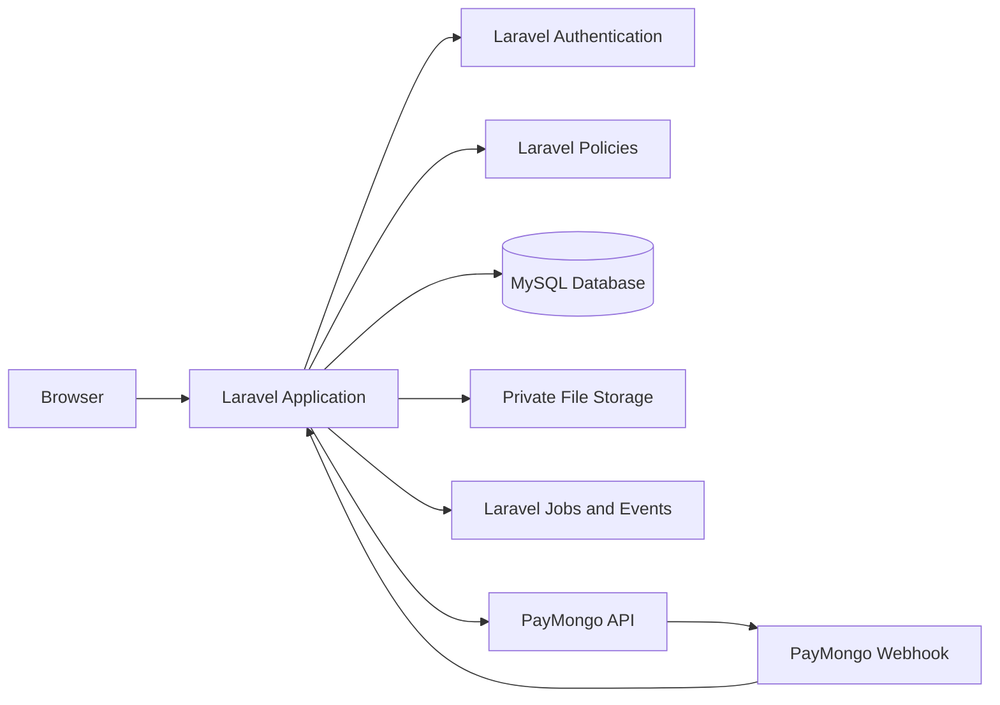

### Trust boundaries

| Boundary | Trusted side | Untrusted side | Required rule |
|---|---|---|---|
| Browser to Laravel | Laravel server | Form fields, IDs, roles, prices, scores, status values | Validate and authorize every request |
| Laravel to MySQL | Eloquent and transactions | Client-supplied state | Use constraints and server-owned transitions |
| Laravel to Storage | Server-only Storage service | File names and object paths | Generate paths and check access before download |
| Laravel to PayMongo | Server-only client and verified webhook | Browser redirects and unverified events | Treat verified webhook data as authoritative |
| Queue to Laravel | Serialized internal job data | External event data | Re-check current database state inside each job |

## 4. Application layers

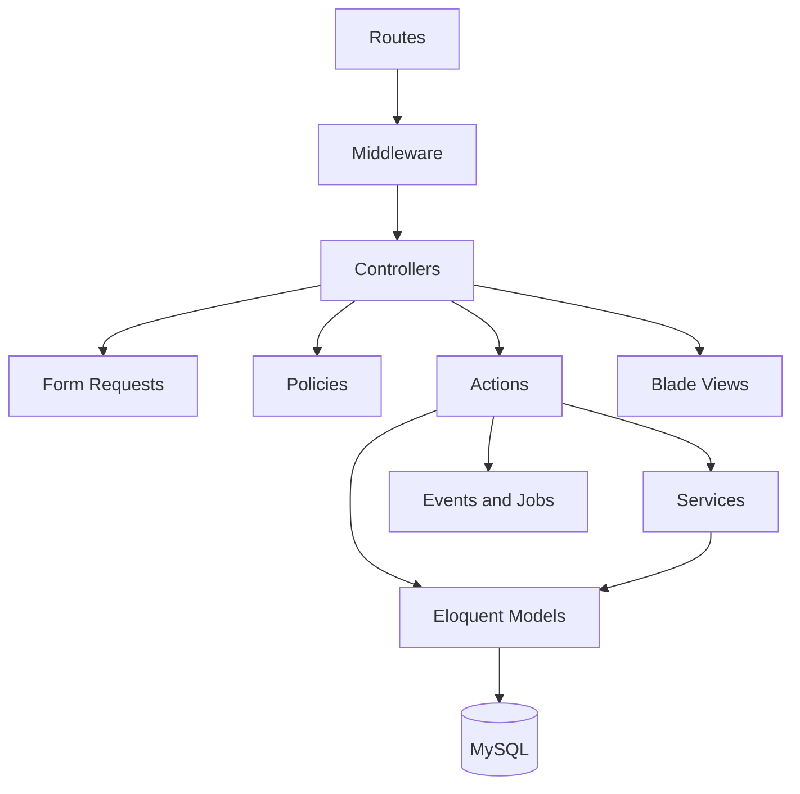

### Layer responsibilities

#### Routes

`routes/web.php` defines browser routes.

Routes should contain route names, middleware, and controller references. Business logic does not belong in route files.

#### Middleware

Middleware handles cross-cutting request concerns:

- Authentication
- Email verification
- Role access
- Throttling
- Request correlation
- Security headers where configured

#### Controllers

Controllers coordinate one request:

1. Receive the request
2. Call Form Request validation
3. Ask a Policy for authorization
4. Call an Action or Service
5. Redirect or return a response

Controllers should not contain long payment, grading, completion, or certificate workflows.

#### Form Requests

Form Requests define:

- Required fields
- Input types
- Allowed values
- File constraints
- Authorization for the request class when appropriate

Sensitive fields such as `role`, `price_minor`, `status`, `score`, and `completed_at` must never be mass-assigned from a normal form.

#### Policies

Policies define actions against resources:

- `CoursePolicy`
- `EnrollmentPolicy`
- `LessonPolicy`
- `QuizPolicy`
- `PaymentPolicy`
- `CertificatePolicy`

A Policy receives the authenticated User and the requested resource.

#### Actions and Services

Actions represent one business operation:

- `EnrollStudent`
- `ActivatePaidEnrollment`
- `MarkLessonComplete`
- `StartQuizAttempt`
- `GradeQuizAttempt`
- `CompleteCourse`
- `IssueCertificate`

Services handle reusable technical work:

- `PayMongoClient`
- `CertificateCodeGenerator`
- `LearningMaterialStorage`
- `ProgressCalculator`
- `CourseCompletionChecker`

Use transactions inside Actions which change multiple records.

#### Models

Eloquent Models represent database records and relationships.

Models must not become large business-logic containers.

#### Blade views

Blade views render authorized data and collect form input.

Views may use `@can` to improve the interface, but controllers, Actions, Jobs, and Policies still enforce access.

## 5. Request lifecycle

A normal authenticated request follows this path:

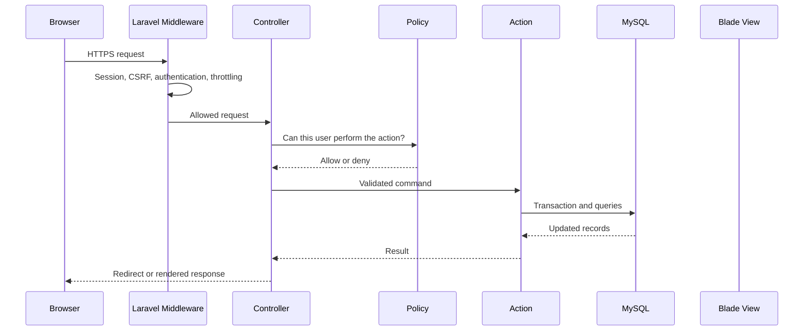

Every protected mutation repeats authorization inside the server workflow. Middleware alone is not enough.

## 6. Route architecture

### Public routes

| Method | URI | Purpose | Access |
|---|---|---|---|
| GET | `/` | Home page | Public |
| GET | `/up` | Application health check | Public |
| GET | `/courses` | Published course catalog | Public |
| GET | `/courses/{course}` | Public course details | Public |
| GET | `/login` | Sign in | Guest |
| POST | `/logout` | Sign out | Authenticated |
| GET | `/register` | Student registration | Guest |
| POST | `/register` | Create Student account | Guest |
| GET | `/forgot-password` | Request password reset | Guest |
| POST | `/forgot-password` | Send reset instructions | Guest |
| GET | `/reset-password/{token}` | Reset form | Valid reset token |
| POST | `/reset-password` | Save new password | Valid reset token |
| GET | `/email/verify` | Email verification notice | Authenticated |
| GET | `/email/verify/{id}/{hash}` | Verify signed email link | Signed link |
| GET | `/account/profile` | View own profile | Authenticated |
| PATCH | `/account/profile` | Update approved profile fields | Authenticated |
| GET | `/account/password` | Change temporary or current password | Authenticated |
| POST | `/account/password` | Save a new password | Authenticated |

### Phase 3 role routes

| Method | URI | Purpose | Protection |
|---|---|---|---|
| GET | `/student` | Minimal Student landing page | Student role and active account |
| GET | `/instructor` | Minimal Instructor landing page | Instructor role and active account |
| GET | `/admin` | Minimal Administrator landing page | Administrator role and active account |
| GET | `/admin/users` | Searchable user management list | Administrator role and active account |
| PATCH | `/admin/users/{user}/role` | Assign one approved role | Administrator Policy and verified target |
| PATCH | `/admin/users/{user}/status` | Suspend or reactivate account | Administrator Policy and self/last-admin rules |
| GET | `/admin/activity` | Read-only role and status activity | Administrator role and active account |

Role routes use `auth`, `account.active`, `verified`, `password.change`, and `role` middleware. Controllers and Actions repeat authorization inside the server workflow.

### Phase 5A Instructor Course Outline routes

| Method | URI | Purpose | Protection |
|---|---|---|---|
| GET | `/instructor/courses` | List owned Courses | Instructor role and CoursePolicy |
| GET | `/instructor/courses/new` | Create Course form | Instructor role and CoursePolicy |
| POST | `/instructor/courses` | Create a private draft Course | Instructor role and CoursePolicy |
| GET | `/instructor/courses/{course}` | Read-only owned Course outline | Instructor role and CoursePolicy |

Phase 5A does not expose the later Course edit, publish, curriculum action, upload, or download routes.

### Phase 5B curriculum authoring routes

| Method | URI | Purpose | Protection |
|---|---|---|---|
| POST | `/instructor/courses/{course}/modules` | Add a draft Module | Instructor role and ModulePolicy |
| POST | `/instructor/courses/{course}/modules/{module}/lessons` | Add a draft Lesson | Instructor role and LessonPolicy |

Phase 5B assigns positions, status, parent IDs, and Lesson slugs on the server. It does not add public content, upload, download, enrollment, or payment routes.

### Student routes


| Method | URI | Purpose |
|---|---|---|
| GET | `/dashboard` | Student overview |
| GET | `/student/courses` | Student course list |
| GET | `/student/courses/{course}` | Enrolled course overview |
| POST | `/student/courses/{course}/enroll` | Free enrollment or paid enrollment start |
| GET | `/student/learn/{course}/{lesson}` | Lesson page |
| POST | `/student/lessons/{lesson}/complete` | Mark Lesson complete |
| GET | `/student/assessments` | Available Quizzes |
| GET | `/student/assessments/{quiz}` | Quiz instructions and safe questions |
| POST | `/student/quizzes/{quiz}/attempts` | Start an Attempt |
| POST | `/student/attempts/{attempt}/submit` | Submit answers |
| GET | `/student/attempts/{attempt}` | Result |
| GET | `/student/payments` | Own payment history |
| GET | `/student/certificates` | Own certificates |
| GET | `/student/certificates/{certificate}` | Certificate view and print view |
| GET | `/student/profile` | Profile |
| PATCH | `/student/profile` | Approved profile fields |
| GET | `/student/settings` | Account settings |
| PATCH | `/student/settings` | Supported account settings |

### Instructor routes

| Method | URI | Purpose |
|---|---|---|
| GET | `/instructor` | Instructor dashboard |
| GET | `/instructor/courses` | Owned courses |
| GET | `/instructor/courses/new` | Create course form |
| POST | `/instructor/courses` | Store course |
| GET | `/instructor/courses/{course}` | Owned course overview |
| GET | `/instructor/courses/{course}/edit` | Edit course |
| PUT | `/instructor/courses/{course}` | Update course |
| POST | `/instructor/courses/{course}/publish` | Publish owned course |
| POST | `/instructor/courses/{course}/unpublish` | Unpublish owned course |
| GET | `/instructor/courses/{course}/modules` | Manage Modules |
| POST | `/instructor/courses/{course}/modules` | Create Module |
| PUT | `/instructor/modules/{module}` | Update or reorder Module |
| GET | `/instructor/courses/{course}/lessons/{lesson}/edit` | Edit Lesson |
| PUT | `/instructor/lessons/{lesson}` | Update Lesson |
| POST | `/instructor/lessons/{lesson}/materials` | Upload or link material |
| DELETE | `/instructor/materials/{material}` | Remove authorized material |
| GET | `/instructor/courses/{course}/students` | Enrolled Students |
| GET | `/instructor/courses/{course}/students/{student}/progress` | Authorized progress |
| GET | `/instructor/assessments` | Owned Quizzes |
| GET | `/instructor/assessments/new` | Create Quiz |
| POST | `/instructor/quizzes` | Store Quiz |
| GET | `/instructor/quizzes/{quiz}/edit` | Edit Quiz |
| PUT | `/instructor/quizzes/{quiz}` | Update Quiz |
| GET | `/instructor/quizzes/{quiz}/results` | Assessment results |
| POST | `/instructor/attempts/{attempt}/reset` | Audited Attempt reset |

### Administrator routes

| Method | URI | Purpose |
|---|---|---|
| GET | `/admin` | Administrator dashboard |
| GET | `/admin/users` | User management |
| GET | `/admin/users/{user}` | User detail |
| PATCH | `/admin/users/{user}/role` | Change role |
| PATCH | `/admin/users/{user}/status` | Suspend or reactivate account |
| GET | `/admin/courses` | All courses |
| GET | `/admin/enrollments` | All enrollments |
| PATCH | `/admin/enrollments/{enrollment}/status` | Approved non-payment status change |
| GET | `/admin/payments` | All payments |
| POST | `/admin/payments/{payment}/refund` | Approved refund workflow |
| GET | `/admin/reports` | Operational reports |
| GET | `/admin/activity` | Sanitized activity logs |
| GET | `/admin/settings` | Approved settings |
| PATCH | `/admin/settings` | Update approved settings |
| POST | `/admin/certificates/{certificate}/revoke` | Revoke certificate |
| POST | `/admin/certificates/{certificate}/reissue` | Reissue after fresh validation |

### Payment and file routes

| Method | URI | Purpose | Protection |
|---|---|---|---|
| POST | `/student/checkout` | Create PayMongo checkout | Student Policy and validated Course |
| GET | `/student/payments/return` | Display pending or confirmed state | Student owns payment |
| POST | `/webhooks/paymongo` | Receive PayMongo event | Signature verification and idempotency |
| GET | `/learning-materials/{material}/download` | Authorize and stream private file | Enrollment or ownership Policy |

A public JSON API is not required for V1.

Add API routes only when a separate client or approved mobile application needs one.

During Phase 2, the PayMongo public test key is stored only in the local ignored `.env`. No payment route, package, table, checkout, or webhook is part of the authentication phase.

## 7. Authentication

Laravel built-in authentication owns:

- Registration
- Login
- Logout
- Sessions
- Password hashing
- Password reset
- Email verification
- Login throttling
- Session invalidation

### Registration

1. Guest opens `/register`.
2. Form Request accepts name, email, password, and password confirmation.
3. No role field is accepted.
4. Laravel creates a User with no privileged role field.
5. An Action creates one Profile with `role = student`.
6. The database transaction keeps User and Profile creation consistent.

### Laravel Fortify boundary

Laravel Fortify owns the authentication routes and server flows for:

- Registration
- Login and logout
- Password reset requests
- Password reset links
- Email verification
- Authentication throttling

The project owns the Fortify actions and Blade views. Fortify does not create a role field, payment record, Course, or business authorization rule.

Two-factor authentication remains disabled for V1.

### Local Administrator bootstrap

The first Administrator is provisioned by a local Artisan command, not a public route and not a browser form.

The command must:

1. Refuse to run outside the local environment unless an explicit recovery override is added later.
2. Validate the configured owner name and email.
3. Refuse to silently promote an existing Student or Instructor.
4. Create the User and Profile in one database transaction.
5. Mark the email as verified for the local demo.
6. Generate a random temporary password.
7. Store the temporary password in a DPAPI-protected local file.
8. Set `profiles.must_change_password = true`.
9. Never log or commit the temporary password.

The command is a setup and recovery boundary. Role changes for existing users remain an Administrator action in Phase 3.

### Forced password change

When an authenticated User has `must_change_password = true`, middleware permits only the password change page, logout, and required verification routes. Every other authenticated page redirects to the password change page.

After a successful password change, the action updates the password and clears the flag in one transaction.

### Session rules

- Regenerate the session after login.
- Invalidate and regenerate the CSRF token after logout.
- Use secure cookies in production.
- Suspended accounts cannot authenticate.
- Authentication answers who the user is.

### Phase 2 authentication flow

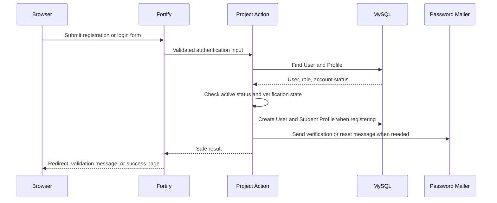

### Temporary password flow

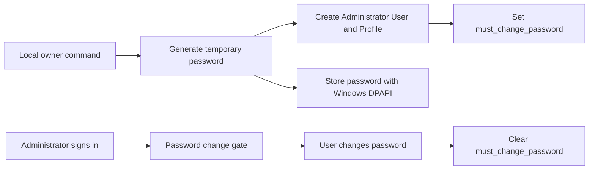

### Phase 3 role and status flow

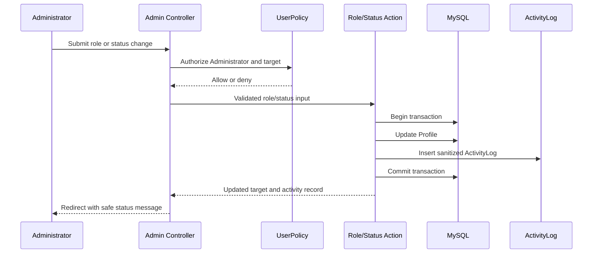

A failed validation, policy denial, or last-Administrator safeguard rolls back both records.

### Phase 4A Course foundation flow

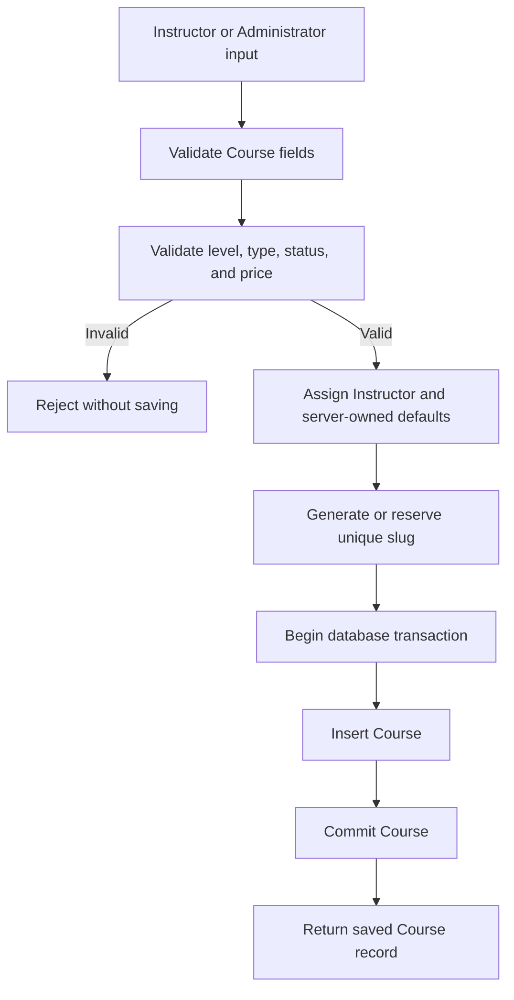

Phase 4A does not publish a Course to the public catalog. A later Course action will own slug generation and publication state changes.

### Phase 4A Input, Process, and Output

**Input**

- Instructor User ID
- Course title
- Description
- Learning objectives
- Category
- Level
- Course type
- Price in minor units
- Currency

**Process**

- Validate the Instructor relationship
- Validate approved enum values
- Validate the price and Course type together
- Apply server-owned defaults
- Generate or reserve a unique slug
- Save the Course in a database transaction

**Output**

- Valid Course record
- Instructor relationship
- Safe draft/free defaults
- Database constraints and indexes
- No public catalog access
- No enrollment, payment, curriculum, or upload record

### Phase 4B curriculum foundation flow

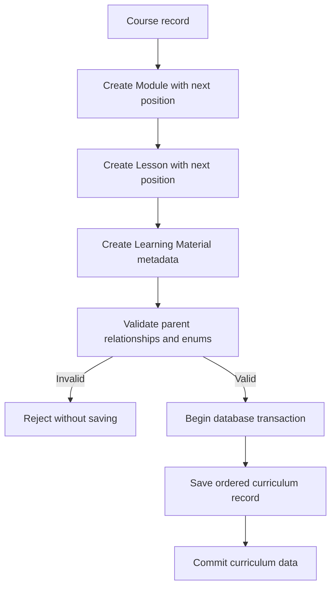

Phase 4B validates database relationships and metadata only. Role authorization, content actions, uploads, URL allowlisting, and private file delivery come later.

### Phase 4B Input, Process, and Output

**Input**

- Parent Course, Module, or Lesson ID
- Title and safe description or summary fields
- Ordered position
- Content status
- Lesson required flag
- Estimated minutes
- Material type and safe metadata

**Process**

- Validate the parent relationship
- Validate approved status and material type values
- Validate positive ordering and duration values
- Enforce parent-scoped uniqueness
- Apply safe defaults
- Save metadata in a database transaction
- Do not accept or serve files in this phase

**Output**

- Ordered Module, Lesson, and Learning Material records
- Course → Module → Lesson → Material relationships
- No public curriculum route
- No upload or private download behavior
- No enrollment or payment record

### Phase 5A Instructor Course Outline flow

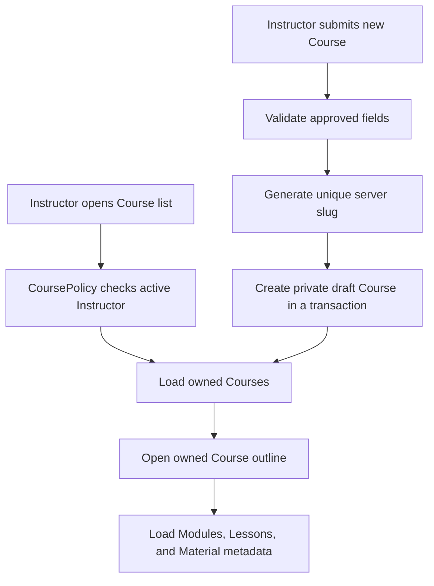

Phase 5A never exposes draft Course data to guests or other Instructors. Public catalog, enrollment, payments, uploads, and curriculum mutations remain later phases.

### Phase 5A Input, Process, and Output

**Input**

- Instructor session
- Course title and safe metadata
- Level and Course type
- Price in integer minor units

**Process**

- Authenticate and verify the active Instructor
- Run CoursePolicy authorization
- Validate the CreateCourse Form Request
- Reject privileged fields
- Validate free/paid price consistency
- Generate a unique slug on the server
- Create a private draft Course in one transaction
- Redirect to the owned Course outline

**Output**

- Owned Course list
- Private draft Course
- Read-only Course outline with Module, Lesson, and Material metadata
- No public Course access
- No enrollment, payment, upload, or curriculum mutation

### Phase 5B curriculum authoring flow

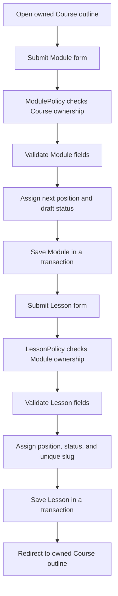

### Phase 5B Input, Process, and Output

**Input**

- Owned Course or Module ID
- Module title and description
- Lesson title, summary, content text, required flag, and estimated minutes

**Process**

- Run ModulePolicy or LessonPolicy
- Validate the Form Request
- Reject parent, position, status, and slug fields from the request
- Assign the next position inside the server
- Generate a unique Lesson slug inside the Module
- Save private draft content in a database transaction

**Output**

- Ordered Module and Lesson records
- Updated owned Course outline
- No public content, upload, download, enrollment, or payment behavior

## 8. Authorization

Authorization answers what the user may do.

### Role middleware

Use role middleware for broad route groups:

- `role:student`
- `role:instructor`
- `role:administrator`

Phase 3 also uses:

- `account.active` to block suspended sessions
- `UserPolicy` for Administrator-only user management
- Server-side role and status actions
- A transaction for each account change and its activity record

A role or status change is rejected when:

- The actor is not an Administrator
- The target is the actor
- The target email is not verified
- A role or status value is outside the approved enum
- The change would demote or suspend the final active Administrator

### Resource policies

Use Policies for every resource action.

Examples:

- Student can view only own Enrollment.
- Student can download material only with access-granting Enrollment.
- Instructor can update only an owned Course.
- Instructor can view only an owned Course in Phase 5A.
- Administrator can manage all Courses in a later administration slice.
- Administrator cannot activate a paid Enrollment without verified payment evidence.
- User cannot change own role through a profile form.

### Blade authorization

`@can` and `@cannot` may hide irrelevant controls.

They are usability checks only. The server must repeat authorization.

## 9. Domain boundaries

| Domain | Main records | Boundary |
|---|---|---|
| Identity | User, Profile | Authentication and role storage |
| Course catalog | Course | Published metadata and ownership |
| Curriculum | Module, Lesson, LearningMaterial | Ordered academic content |
| Enrollment | Enrollment | Canonical Student access |
| Payment | Payment, PaymentEvent | Provider attempts and verified results |
| Learning | LessonProgress | Persisted Lesson activity |
| Assessment | Quiz, Question, Option, Attempt, Answer | Safe delivery and server grading |
| Certificate | Certificate | Verified completion record |
| Administration | ActivityLog, SystemSetting | Audited operations and approved settings |
| Reporting | Read-only queries | Operational summaries only |

Assignments, grading, announcements, notifications, forums, and live classes are outside V1.

## 10. Database conventions

### General rules

- Use InnoDB tables.
- Use unsigned BIGINT primary keys for Laravel records.
- Use foreign keys for relationships.
- Index columns used by authorization and frequent filters.
- Use `created_at` and `updated_at` timestamps.
- Use UTC timestamps.
- Use database ENUM or constrained strings for finite statuses.
- Store money as unsigned BIGINT minor units plus ISO currency.
- Use transactions for multi-record state changes.
- Preserve historical learning and payment records.
- Prefer controlled archive states over hard deletion.

### Indexing strategy

Add indexes for frequent authorization, relationship, ordering, and reporting queries:

```text
courses(instructor_id, status)
courses(status, course_type, published_at)
modules(course_id, position)
modules(course_id, status)
lessons(module_id, position)
lessons(module_id, status)
learning_materials(lesson_id, position)
learning_materials(storage_disk, storage_path)
enrollments(student_id, status)
enrollments(course_id, status)
payments(student_id, created_at)
payments(course_id, status)
payments(enrollment_id, status)
payment_events(processing_status, received_at)
lesson_progress(student_id, status)
lesson_progress(lesson_id, status)
quizzes(course_id, status)
quizzes(module_id)
quizzes(lesson_id)
quiz_attempts(student_id, created_at)
quiz_attempts(enrollment_id, status)
quiz_answers(attempt_id, question_id)
certificates(student_id, status)
certificates(course_id, status)
certificates(enrollment_id, status)
activity_logs(actor_id, created_at)
activity_logs(entity_type, entity_id)
```

Required unique indexes remain required even when another index has similar columns:

- `courses(slug)`
- `modules(course_id, position)`
- `lessons(module_id, slug)`
- `lessons(module_id, position)`
- `learning_materials(lesson_id, position)`
- `learning_materials(storage_disk, storage_path)`
- `enrollments(student_id, course_id)`
- `payments(provider, provider_payment_id)`
- `payments(enrollment_id, idempotency_key)`
- `payment_events(provider, provider_event_id)`
- `lesson_progress(enrollment_id, lesson_id)`
- `quiz_attempts(quiz_id, student_id, attempt_number)`
- `quiz_answers(attempt_id, question_id)`
- `certificates(certificate_code)`

Paginate Administrator tables and reports. Use `EXPLAIN` before adding or changing indexes.

### Relationship overview

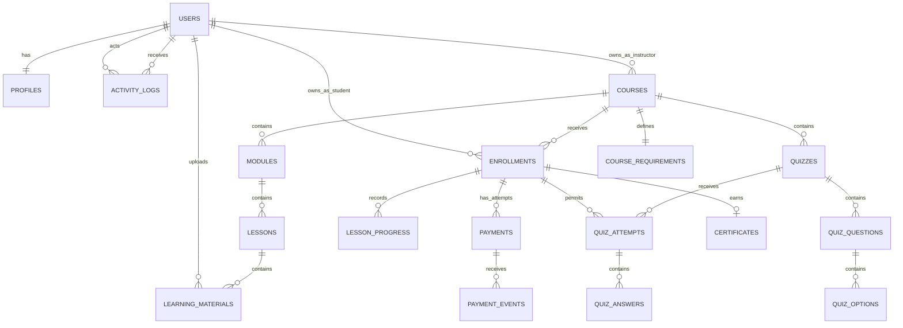

## 11. Database tables

### `users`

Standard Laravel Fortify authentication table.

| Column | Type | Rules |
|---|---|---|
| `id` | BIGINT UNSIGNED | Primary key |
| `name` | VARCHAR | Required |
| `email` | VARCHAR | Unique, required |
| `email_verified_at` | TIMESTAMP | Nullable |
| `password` | VARCHAR | Hashed, at least 60 characters |
| `remember_token` | VARCHAR | Nullable, 100 characters |
| timestamps | TIMESTAMP | Required |

`users.name` is the canonical display name. Do not duplicate it in `profiles`.

### `profiles`

| Column | Type | Rules |
|---|---|---|
| `user_id` | BIGINT UNSIGNED | Primary key, foreign key to users |
| `role` | ENUM | `student`, `instructor`, `administrator` |
| `account_status` | ENUM | `active`, `suspended` |
| `must_change_password` | BOOLEAN | Default false |
| `avatar_path` | VARCHAR | Nullable, private Storage path |
| `bio` | TEXT | Nullable |
| timestamps | TIMESTAMP | Required |

Role and account status cannot be updated by the profile owner.

`avatar_path` is a later private Storage field. It is not part of the Phase 2 migration.

### `courses`

Phase 4A creates the Course table and its ownership relationship. Curriculum, enrollment, payment, and upload behavior stay in later phases.

| Column | Type | Rules |
|---|---|---|
| `id` | BIGINT UNSIGNED | Primary key |
| `instructor_id` | BIGINT UNSIGNED | Foreign key to users, delete restricted |
| `title` | VARCHAR | Required |
| `slug` | VARCHAR | Unique, required, server-generated |
| `description` | TEXT | Nullable while authoring |
| `learning_objectives` | TEXT | Nullable |
| `category` | VARCHAR | Nullable |
| `level` | ENUM | `beginner`, `intermediate`, `advanced`; default `beginner` |
| `course_type` | ENUM | `free`, `paid`; default `free` |
| `price_minor` | BIGINT UNSIGNED | Default 0, server-owned minor units |
| `currency` | CHAR(3) | `PHP`, default `PHP` |
| `status` | ENUM | `draft`, `published`, `archived`; default `draft` |
| `thumbnail_path` | VARCHAR | Nullable, protected by default, server-owned |
| `published_at` | TIMESTAMP | Nullable, server-owned |
| timestamps | TIMESTAMP | Required |

Constraints:

- Free Course has zero price.
- Paid Course has a positive price.
- Currency is always `PHP`.
- Level, Course type, and Course status accept only approved values.
- `slug` is unique.
- Index Instructor, status, type, category, and publication time for later catalog queries.
- `instructor_id`, `slug`, `price_minor`, `currency`, `status`, `published_at`, and `thumbnail_path` are not mass-assigned from a normal request.

### `modules`

Phase 4B creates the ordered Module relationship. Curriculum routes and actions come later.

| Column | Type | Rules |
|---|---|---|
| `id` | BIGINT UNSIGNED | Primary key |
| `course_id` | BIGINT UNSIGNED | Foreign key to courses, delete restricted |
| `title` | VARCHAR | Required |
| `description` | TEXT | Nullable |
| `position` | UNSIGNED INTEGER | Positive, unique within Course |
| `status` | ENUM | `draft`, `published`, `archived`; default `draft` |
| timestamps | TIMESTAMP | Required |

Constraints:

- `course_id`, `position`, and `status` are server-owned.
- Position is positive and unique within the Course.
- Index Course and status for later outline queries.

### `lessons`

| Column | Type | Rules |
|---|---|---|
| `id` | BIGINT UNSIGNED | Primary key |
| `module_id` | BIGINT UNSIGNED | Foreign key to modules, delete restricted |
| `title` | VARCHAR | Required |
| `slug` | VARCHAR | Unique within Module, server-generated |
| `summary` | TEXT | Nullable |
| `content_text` | LONGTEXT | Nullable when content comes from materials |
| `position` | UNSIGNED INTEGER | Positive, unique within Module |
| `status` | ENUM | `draft`, `published`, `archived`; default `draft` |
| `is_required` | BOOLEAN | Default true |
| `estimated_minutes` | UNSIGNED INTEGER | Nullable, positive |
| timestamps | TIMESTAMP | Required |

Constraints:

- `module_id`, `slug`, `position`, and `status` are server-owned.
- Position is positive and unique within the Module.
- Slug is unique within the Module.
- Estimated minutes must be positive when present.
- Index Module and status for later outline queries.

### `learning_materials`

Phase 4B stores Learning Material metadata only. It does not upload, validate, or serve files.

| Column | Type | Rules |
|---|---|---|
| `id` | BIGINT UNSIGNED | Primary key |
| `lesson_id` | BIGINT UNSIGNED | Foreign key to lessons, delete restricted |
| `uploaded_by` | BIGINT UNSIGNED | Foreign key to users, delete restricted |
| `title` | VARCHAR | Required |
| `material_type` | ENUM | `text`, `image`, `pdf`, `document`, `code`, `video_link`, `external_link` |
| `position` | UNSIGNED INTEGER | Positive, unique within Lesson |
| `content_text` | LONGTEXT | Nullable |
| `external_url` | TEXT | Nullable |
| `storage_disk` | VARCHAR | Nullable for links, server-owned |
| `storage_path` | VARCHAR | Nullable for links, unique within disk, server-owned |
| `mime_type` | VARCHAR | Nullable, server-owned |
| `byte_size` | BIGINT UNSIGNED | Nullable, server-owned |
| timestamps | TIMESTAMP | Required |

Constraints:

- `lesson_id`, `uploaded_by`, `position`, `storage_disk`, `storage_path`, `mime_type`, and `byte_size` are server-owned.
- Position is positive and unique within the Lesson.
- Storage path is unique within its disk when present.
- Type-specific content rules, URL allowlisting, file validation, and private downloads belong to later phases.

### `enrollments`

| Column | Type | Rules |
|---|---|---|
| `id` | BIGINT UNSIGNED | Primary key |
| `student_id` | BIGINT UNSIGNED | Foreign key to users |
| `course_id` | BIGINT UNSIGNED | Foreign key to courses |
| `status` | ENUM | `pending_payment`, `active`, `completed`, `cancelled` |
| `activated_at` | TIMESTAMP | Nullable |
| `completed_at` | TIMESTAMP | Nullable |
| `cancelled_at` | TIMESTAMP | Nullable |
| `last_accessed_at` | TIMESTAMP | Nullable |
| timestamps | TIMESTAMP | Required |

Unique constraint:

```text
(student_id, course_id)
```

### `payments`

| Column | Type | Rules |
|---|---|---|
| `id` | BIGINT UNSIGNED | Primary key |
| `enrollment_id` | BIGINT UNSIGNED | Foreign key to enrollments |
| `student_id` | BIGINT UNSIGNED | Foreign key to users |
| `course_id` | BIGINT UNSIGNED | Foreign key to courses |
| `amount_minor` | BIGINT UNSIGNED | Positive |
| `currency` | CHAR(3) | `PHP` |
| `status` | ENUM | `pending`, `paid`, `failed`, `cancelled`, `refunded` |
| `provider` | VARCHAR | `paymongo` |
| `provider_payment_id` | VARCHAR | Nullable, unique with provider when present |
| `provider_checkout_id` | VARCHAR | Nullable |
| `provider_reference` | VARCHAR | Nullable |
| `idempotency_key` | VARCHAR | Unique with enrollment |
| `failure_code` | VARCHAR | Nullable |
| `failure_message` | VARCHAR | Nullable |
| `paid_at` | TIMESTAMP | Nullable |
| `cancelled_at` | TIMESTAMP | Nullable |
| `refunded_at` | TIMESTAMP | Nullable |
| timestamps | TIMESTAMP | Required |

### `payment_events`

| Column | Type | Rules |
|---|---|---|
| `id` | BIGINT UNSIGNED | Primary key |
| `payment_id` | BIGINT UNSIGNED | Nullable foreign key to payments |
| `provider` | VARCHAR | `paymongo` |
| `provider_event_id` | VARCHAR | Unique with provider |
| `event_type` | VARCHAR | Sanitized provider type |
| `payload` | JSON | Sanitized or hashed, nullable |
| `signature_verified` | BOOLEAN | Required |
| `processing_status` | ENUM | `received`, `processed`, `ignored`, `failed` |
| `processing_error` | TEXT | Nullable, sanitized |
| `received_at` | TIMESTAMP | Required |
| `processed_at` | TIMESTAMP | Nullable |
| timestamps | TIMESTAMP | Required |

### `lesson_progress`

| Column | Type | Rules |
|---|---|---|
| `id` | BIGINT UNSIGNED | Primary key |
| `enrollment_id` | BIGINT UNSIGNED | Foreign key to enrollments |
| `student_id` | BIGINT UNSIGNED | Foreign key to users |
| `lesson_id` | BIGINT UNSIGNED | Foreign key to lessons |
| `status` | ENUM | `not_started`, `in_progress`, `completed` |
| `started_at` | TIMESTAMP | Nullable |
| `completed_at` | TIMESTAMP | Nullable |
| `last_viewed_at` | TIMESTAMP | Nullable |
| timestamps | TIMESTAMP | Required |

Unique constraint:

```text
(enrollment_id, lesson_id)
```

### `quizzes`

| Column | Type | Rules |
|---|---|---|
| `id` | BIGINT UNSIGNED | Primary key |
| `course_id` | BIGINT UNSIGNED | Foreign key to courses |
| `module_id` | BIGINT UNSIGNED | Nullable foreign key |
| `lesson_id` | BIGINT UNSIGNED | Nullable foreign key |
| `created_by` | BIGINT UNSIGNED | Foreign key to users |
| `title` | VARCHAR | Required |
| `description` | TEXT | Nullable |
| `instructions` | TEXT | Nullable |
| `position` | UNSIGNED INTEGER | Positive, unique within Course |
| `status` | ENUM | `draft`, `published`, `archived` |
| `is_required` | BOOLEAN | Default false |
| `passing_score_percent` | DECIMAL(5,2) | 0 to 100 |
| `max_attempts` | UNSIGNED INTEGER | Default 3, maximum 3 in V1 |
| timestamps | TIMESTAMP | Required |

V1 has no quiz timer field.

### `quiz_questions`

| Column | Type | Rules |
|---|---|---|
| `id` | BIGINT UNSIGNED | Primary key |
| `quiz_id` | BIGINT UNSIGNED | Foreign key to quizzes |
| `prompt` | TEXT | Required |
| `question_type` | ENUM | `multiple_choice` |
| `position` | UNSIGNED INTEGER | Positive, unique within Quiz |
| `points` | DECIMAL(8,2) | Positive |
| `explanation` | TEXT | Nullable, hidden before submission |
| timestamps | TIMESTAMP | Required |

### `quiz_options`

| Column | Type | Rules |
|---|---|---|
| `id` | BIGINT UNSIGNED | Primary key |
| `question_id` | BIGINT UNSIGNED | Foreign key to quiz_questions |
| `option_text` | TEXT | Required |
| `position` | UNSIGNED INTEGER | Positive, unique within Question |
| `is_correct` | BOOLEAN | Required, server-owned |
| `explanation` | TEXT | Nullable, hidden before submission |
| timestamps | TIMESTAMP | Required |

The Question editing Action must validate exactly one correct Option in a transaction.

### `quiz_attempts`

| Column | Type | Rules |
|---|---|---|
| `id` | BIGINT UNSIGNED | Primary key |
| `quiz_id` | BIGINT UNSIGNED | Foreign key to quizzes |
| `student_id` | BIGINT UNSIGNED | Foreign key to users |
| `enrollment_id` | BIGINT UNSIGNED | Foreign key to enrollments |
| `attempt_number` | UNSIGNED INTEGER | 1 to 3 |
| `status` | ENUM | `in_progress`, `passed`, `failed` |
| `started_at` | TIMESTAMP | Required |
| `submitted_at` | TIMESTAMP | Nullable |
| `score_points` | DECIMAL(8,2) | Nullable before submission |
| `total_points` | DECIMAL(8,2) | Nullable before submission |
| `score_percent` | DECIMAL(5,2) | Nullable before submission |
| `passed` | BOOLEAN | Nullable before submission |
| timestamps | TIMESTAMP | Required |

Unique constraint:

```text
(quiz_id, student_id, attempt_number)
```

Attempt creation uses a database transaction and row locking to prevent two concurrent first Attempts.

### `quiz_answers`

| Column | Type | Rules |
|---|---|---|
| `id` | BIGINT UNSIGNED | Primary key |
| `attempt_id` | BIGINT UNSIGNED | Foreign key to quiz_attempts |
| `question_id` | BIGINT UNSIGNED | Foreign key to quiz_questions |
| `selected_option_id` | BIGINT UNSIGNED | Foreign key to quiz_options |
| `is_correct` | BOOLEAN | Server-calculated |
| `points_awarded` | DECIMAL(8,2) | Server-calculated |
| `answered_at` | TIMESTAMP | Required |
| timestamps | TIMESTAMP | Required |

Unique constraint:

```text
(attempt_id, question_id)
```

### `certificates`

| Column | Type | Rules |
|---|---|---|
| `id` | BIGINT UNSIGNED | Primary key |
| `enrollment_id` | BIGINT UNSIGNED | Foreign key to enrollments |
| `student_id` | BIGINT UNSIGNED | Foreign key to users |
| `course_id` | BIGINT UNSIGNED | Foreign key to courses |
| `certificate_code` | VARCHAR | Unique, unpredictable |
| `student_name_snapshot` | VARCHAR | Required |
| `course_title_snapshot` | VARCHAR | Required |
| `completion_date` | DATE | Required |
| `issued_by` | BIGINT UNSIGNED | Nullable foreign key to users |
| `replaces_certificate_id` | BIGINT UNSIGNED | Nullable self-reference |
| `status` | ENUM | `issued`, `revoked` |
| `revoked_at` | TIMESTAMP | Nullable |
| `revocation_reason` | TEXT | Nullable |
| timestamps | TIMESTAMP | Required |

### `course_requirements`

| Column | Type | Rules |
|---|---|---|
| `course_id` | BIGINT UNSIGNED | Primary key and foreign key |
| `require_all_lessons` | BOOLEAN | Default true |
| `minimum_lesson_percent` | DECIMAL(5,2) | 0 to 100 |
| `require_required_quizzes` | BOOLEAN | Default true |
| `require_passing_score` | BOOLEAN | Default true |
| `certificate_enabled` | BOOLEAN | Default true |
| `updated_by` | BIGINT UNSIGNED | Nullable foreign key |
| timestamps | TIMESTAMP | Required |

### `activity_logs`

Phase 3 stores only role and account-status changes.

| Column | Type | Rules |
|---|---|---|
| `id` | BIGINT UNSIGNED | Primary key |
| `actor_id` | BIGINT UNSIGNED | Foreign key to users, required |
| `target_user_id` | BIGINT UNSIGNED | Foreign key to users, required |
| `event_type` | ENUM | `role_changed`, `account_status_changed` |
| `previous_role` | ENUM | Previous Student, Instructor, or Administrator; nullable for status events |
| `new_role` | ENUM | New Student, Instructor, or Administrator; nullable for status events |
| `previous_status` | ENUM | Previous active or suspended; nullable for role events |
| `new_status` | ENUM | New active or suspended; nullable for role events |
| timestamps | TIMESTAMP | Required |

Role and status changes write the Profile update and ActivityLog in one transaction. Activity records are read-only and are not deleted by Phase 3 user-management actions.


### `system_settings`

| Column | Type | Rules |
|---|---|---|
| `key` | VARCHAR | Primary key |
| `value` | JSON | Required |
| `updated_by` | BIGINT UNSIGNED | Nullable foreign key |
| timestamps | TIMESTAMP | Required |

Only allow-listed non-secret settings may be stored.

## 12. Key state machines

### Course

```text
draft → published → archived
  ↑         │
  └─────────┘ through approved unpublish action
```

### Enrollment

```text
pending_payment → active → completed
       │            │         │
       └────────────┴─────────┴→ cancelled
```

### Payment

```text
pending → paid
   ├────→ failed
   ├────→ cancelled
   └────→ refunded after paid
```

### Quiz Attempt

```text
in_progress → passed
            → failed
```

### Certificate

```text
issued → revoked → replacement issued
```

State changes must use an approved Action and a transaction when multiple records change.

## 13. Free enrollment workflow

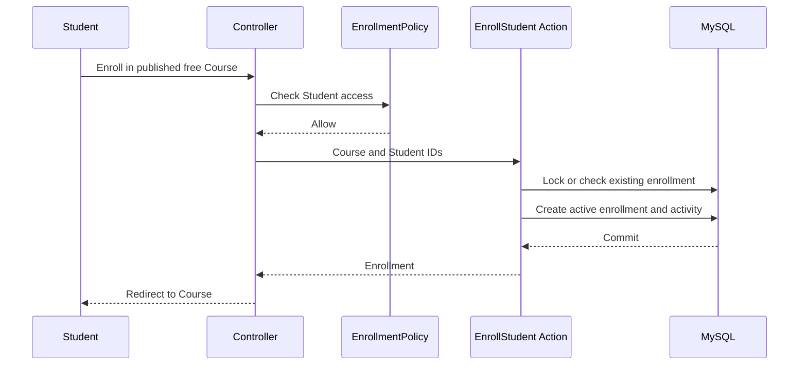

## 14. Payment workflow

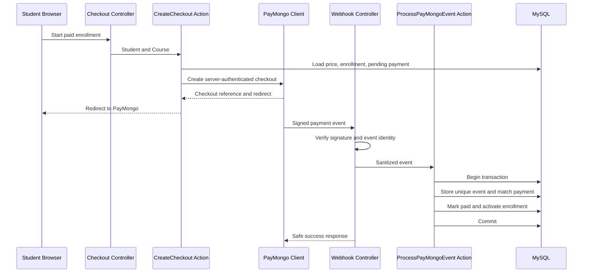

### Webhook rules

- Verify the event before reading sensitive business fields.
- Store `provider_event_id` under a unique constraint.
- Return a safe success response for a previously processed event.
- Record unmatched events for investigation without granting access.
- Do not activate Enrollment from a browser query parameter.
- Do not mark Payment paid from a browser form.
- Process the critical payment and enrollment transaction before returning success.
- Queue non-critical receipt or notification work only after commit.

## 15. Progress and completion

### Progress calculation

```text
completed required published Lessons
──────────────────────────────────────
total required published Lessons
```

The server calculates this value from `lesson_progress` and current Course content at the time progress is displayed.

### Completion transaction

The `CompleteCourse` Action must:

1. Lock or reload the Enrollment.
2. Confirm active status.
3. Load current Course requirements.
4. Recalculate required Lesson completion.
5. Confirm required Quiz passes.
6. Set Enrollment to `completed`.
7. Record `completed_at`.
8. Write an activity record.
9. Commit.

Later requirement changes do not silently change an existing completed Enrollment.

## 16. Quiz grading

The Student page loads:

- Quiz instructions
- Question prompts
- Option text
- Option identifiers
- Attempt state

The Student page never loads `quiz_options.is_correct` before submission.

The submission Action must:

1. Lock the Attempt.
2. Confirm ownership, Enrollment, Quiz, and in-progress state.
3. Validate Question and Option relationships.
4. Reject duplicate Question answers.
5. Load the server-only answer key.
6. Calculate points and percentage.
7. Compare with passing score.
8. Store answers, score, pass state, and submitted time.
9. Commit.
10. Record an activity event.

## 17. Certificate workflow

The `IssueCertificate` Action must:

1. Lock or reload the Enrollment.
2. Confirm completed status.
3. Re-run approved eligibility checks.
4. Confirm certificate generation is enabled.
5. Confirm no active certificate exists.
6. Generate a unique unpredictable code.
7. Store Student and Course snapshots.
8. Insert one certificate.
9. Record activity.
10. Commit.

Duplicate requests return the existing certificate or a safe completed response.

The V1 certificate is a printable server-rendered view. A PDF package is not required.

## 18. File storage

### Storage disks

| Disk | Development | Production | Access |
|---|---|---|---|
| `local` | Private local disk | Private mounted volume or approved private cloud disk | Server only |
| `learning-materials` | Private local disk | S3-compatible private bucket | Authorized temporary access |
| `profile-avatars` | Private local disk | S3-compatible private bucket | Owner and approved surfaces |
| `certificates` | Private local disk | S3-compatible private bucket | Owner and Administrator |
| `public` | Approved non-sensitive assets | Approved non-sensitive assets | Public |

Do not use `php artisan storage:link` for protected files.

### Upload flow

1. Authenticate User.
2. Authorize Instructor ownership or Administrator scope.
3. Validate Lesson and Course relationship.
4. Validate file size, MIME type, extension, and safe content.
5. For an external link, allow approved HTTPS schemes and hosts. Never fetch the URL on the server.
6. Generate a random server-side path for an uploaded file.
7. Store file on a private disk.
8. Store metadata in `learning_materials`.
9. Commit database record.
10. Delete an orphaned file if database persistence fails.

### Download flow

1. Authenticate User.
2. Resolve Material → Lesson → Module → Course.
3. Check Student access, Instructor ownership, or Administrator scope.
4. Return a streamed response or short-lived authorized URL.
5. Never reveal a permanent public path.

## 19. Events and jobs

### Events

- `RoleChanged`
- `EnrollmentActivated`
- `PaymentPaid`
- `PaymentRefunded`
- `LessonCompleted`
- `QuizPassed`
- `CourseCompleted`
- `CertificateIssued`
- `CertificateRevoked`

### Jobs

Use Jobs for work which should not block the browser response:

- Send payment receipt
- Prepare optional report export
- Send account or role notification
- Remove an orphan file after a failed workflow
- Clean up expired temporary checkout records

The first release does not need a complex event bus. Laravel Events and Listeners are enough.

Use the database queue during early development. Select a production queue driver before Jobs become required for business correctness.

## 20. Security rules

1. Use Laravel Fortify authentication for all protected browser routes.
2. Use Policies for all resource actions.
3. Repeat authorization inside Actions, Jobs, and webhook handlers.
4. Use Form Requests for validation.
5. Keep CSRF protection enabled for web forms.
6. Hash passwords through Laravel.
7. Regenerate sessions after login.
8. Invalidate sessions after logout.
9. Rate-limit login and sensitive endpoints.
10. Use Eloquent or parameter-bound queries.
11. Escape Blade output by default.
12. Sanitize any future rich HTML before rendering.
13. Protect mass assignment with `$fillable` and explicit field rules.
14. Keep `role`, account status, price, payment status, score, and completion server-owned.
15. Use database transactions for protected transitions.
16. Generate file paths on the server.
17. Keep protected files on private disks.
18. Verify PayMongo signatures using current official documentation.
19. Load webhook routes without browser session or CSRF middleware, then require provider signature verification.
20. Allow external resource links only through approved HTTPS and host rules. Never fetch user-supplied URLs on the server.
21. Keep provider secrets in environment variables.
22. Use `APP_DEBUG=false` in production.
23. Never log secrets, passwords, tokens, answer keys, or raw sensitive payment payloads.
24. Return safe user errors without stack traces or database details.
25. Generate temporary bootstrap passwords with a cryptographically secure random source.
26. Store temporary bootstrap passwords with Windows DPAPI outside the repository.
27. Require a password change before normal authenticated access when the profile flag is set.
28. Refuse local owner bootstrap in production by default.
29. Reject self-role and self-status changes.
30. Reject demotion or suspension of the final active Administrator.
31. Require verified target email before role assignment.
32. Write role/status changes and ActivityLog records in one transaction.
33. Keep Phase 3 ActivityLog data limited to role and account-status changes.
34. Enforce free/paid Course price rules in the database.
35. Enforce `PHP` as the Course currency in the database.
36. Generate Course slugs on the server and keep them unique.
37. Keep Course ownership and publication fields server-owned.
38. Keep curriculum positions, Lesson slugs, and content status server-owned.
39. Keep Learning Material storage paths on private metadata only.
40. Never treat a storage path as public access.
41. Validate external material URLs and uploaded files only in later approved actions.

## 21. Error handling and observability

### Safe user errors

Examples:

- "You must enroll in this course before accessing its lessons."
- "This payment could not be verified."
- "You do not have permission to perform this action."
- "The selected file type is not allowed."

### Server logs

Use structured logs with:

- Request or correlation ID
- Authenticated User ID when safe
- Route name
- Action name
- Result
- Safe exception class

Do not log secrets or full request bodies.

### Activity logs

Record important actions:

- Role change
- Account suspension
- Course publication
- Enrollment activation
- Payment state change
- Attempt reset
- Certificate issue, revocation, or reissue

Activity metadata must be sanitized.

## 22. Testing architecture

Use one test framework supplied by the selected Laravel starter kit. Do not mix Pest and PHPUnit in one project.

### Unit tests

- Progress calculation
- Quiz scoring
- Completion predicate
- Certificate code generation
- PHP formatting
- Payment amount validation

### Feature tests

- Registration creates Student
- Login and logout
- Password reset
- Suspended account access
- Role middleware
- Course Policies
- Enrollment Actions
- Quiz submission
- Certificate issuance
- Private file download
- Admin role change

### Database tests

- Foreign keys
- Unique enrollment
- Payment event idempotency
- Quiz attempt limit
- Certificate uniqueness
- Transaction rollback

### Webhook tests

- Invalid signature
- Unknown event
- Unmatched payment
- Successful payment
- Failed payment
- Cancelled payment
- Duplicate event
- Repeated delivery
- Amount or currency mismatch

### Browser tests

Test critical paths:

- Register and sign in
- Free enrollment
- Lesson completion
- Quiz submission
- Certificate print view
- Mobile navigation
- Light and dark themes
- Keyboard access

## 23. Quality gates

A change is not complete until:

- Relevant tests pass
- Full test suite passes
- Pint formatting check passes
- Composer audit passes
- Authorization tests cover the changed resource
- Migrations run on a clean test database
- No secret or `.env` file is committed
- Documentation matches the implemented behavior

## 24. Deployment architecture

### Local development

A beginner can use:

```text
PHP 8.3 or newer
Composer
MySQL from XAMPP or a local MySQL service
Laravel development server or Apache
Tailwind build watcher
```

The current development workstation uses MySQL Community Server 8.4.11 LTS through the `MySQL84-LMS` service on `127.0.0.1:3307`. The LMS uses the dedicated `lms` and `lms_test` databases. XAMPP MariaDB remains on port 3306 and is not used by the LMS.

Use a dedicated database and dedicated database user.

Never use the MySQL root account in `.env`.

### Production

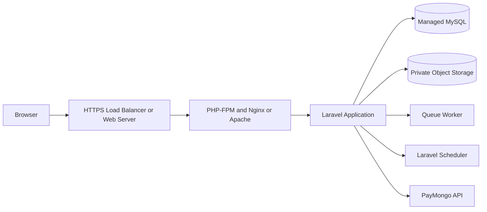

Production requirements:

- Document root points to `public/`
- `APP_DEBUG=false`
- HTTPS
- Secure cookies
- Environment secrets outside source control
- Managed or backed-up MySQL
- Private object storage
- Queue worker when Jobs are used
- Scheduler process when scheduled commands are used
- Database backups
- Application monitoring
- Deployment rollback plan

Laravel Forge or Laravel Cloud can be evaluated before deployment. The final provider remains deferred.

## 25. Deferred architecture decisions

| Decision | Safe default |
|---|---|
| Hosting provider | Do not deploy until a provider is selected |
| Managed database provider | Use a local dedicated MySQL database during development |
| Production Storage driver | Keep files on a private disk |
| Production queue driver | Use database queue until production load requires another driver |
| File-size limits | Reject uploads until approved limits exist |
| PDF generation | Use printable HTML in V1 |
| Public API | Do not add one |
| Public certificate verification | Keep access authenticated |
| Course ownership transfer | Keep one Instructor owner |
| Payment expiry | Keep Enrollment pending until explicit action |

## 26. Architecture definition of done

The architecture is ready for implementation when:

- Laravel 13 runs locally
- MySQL migrations create the approved tables
- Authentication creates Student accounts
- Policies protect every resource action
- Free enrollment works before payment work
- Learning progress persists
- Quiz grading remains server-owned
- Certificate issuance is idempotent
- PayMongo webhook processing is verified and idempotent
- Private files require authorization
- Critical workflows have automated tests
- Deployment documentation is verified
- The team can explain every layer and integration
