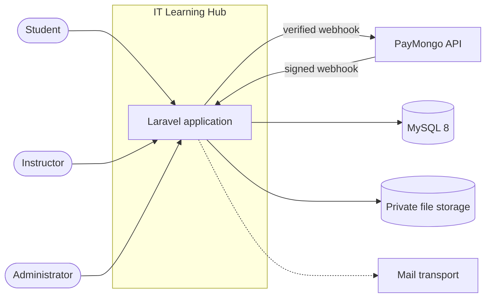
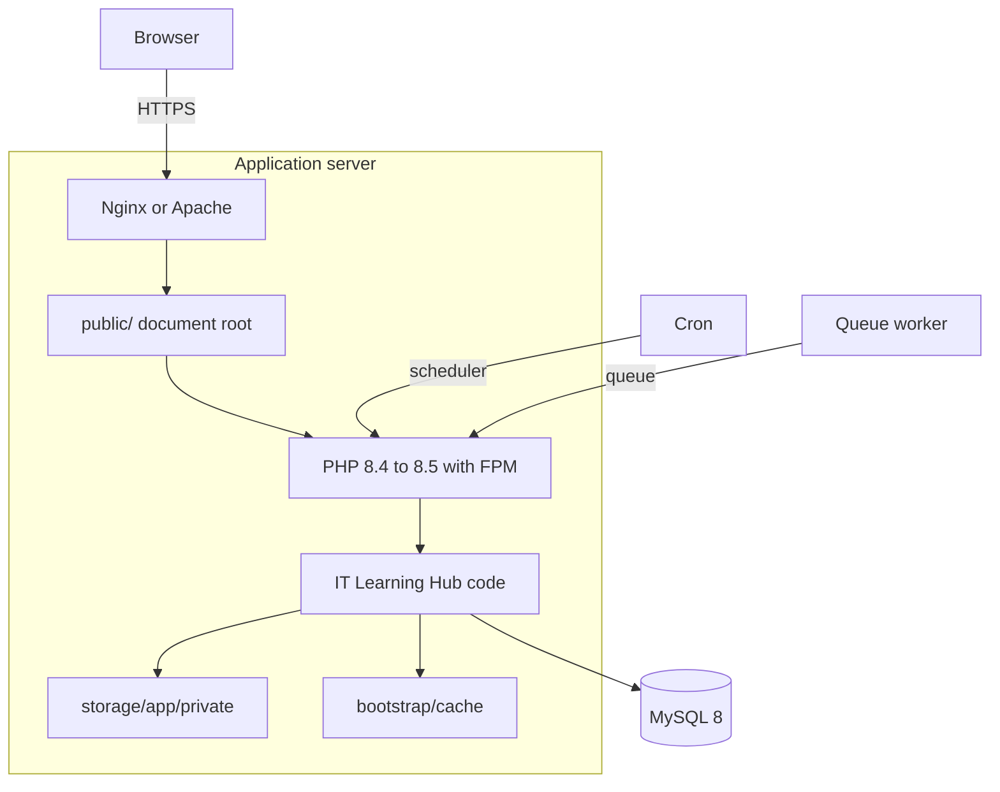
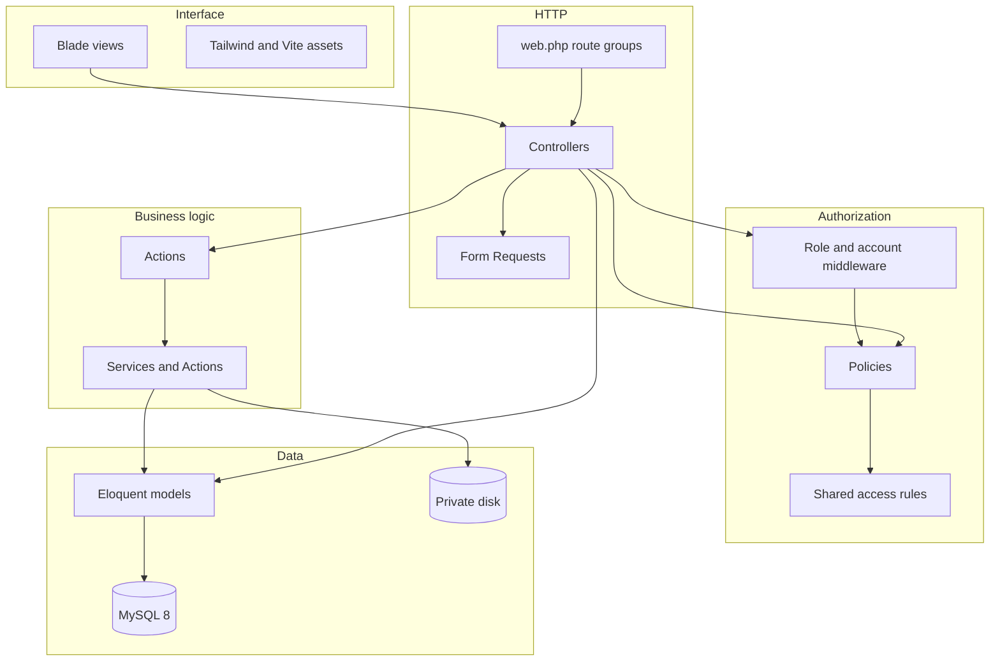
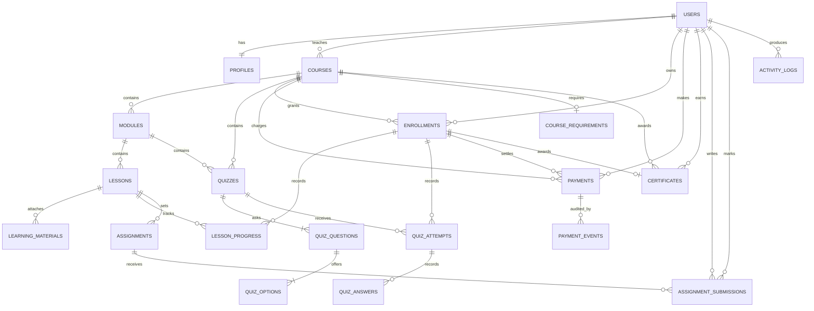
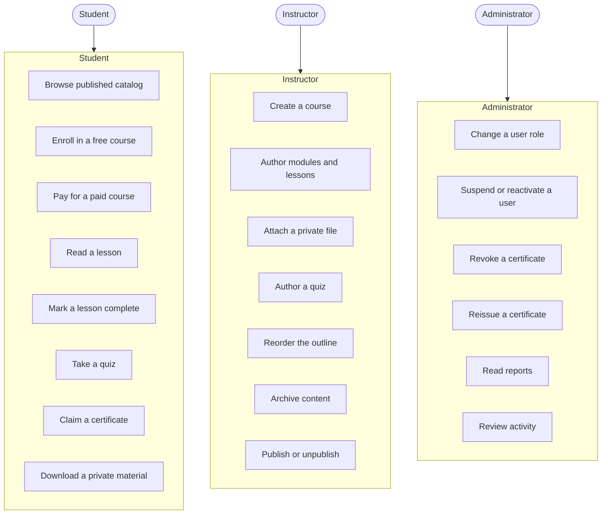
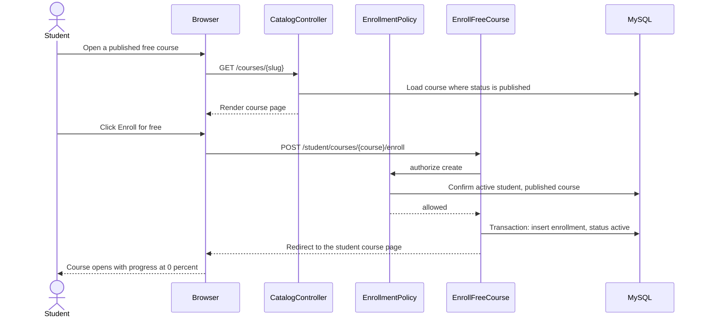
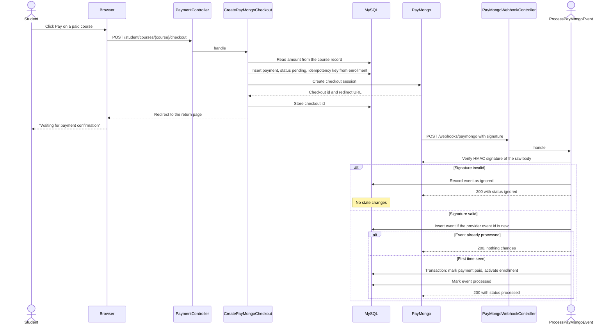

# IT Learning Hub defense guide

## 1. Document status

This document is the evidence pack for the SIA1 defense. It explains what the
system is, how it is built, why it is built that way, and how each claim was
verified.

It does not replace `architecture.md`, which remains the technical source of
truth. This document is organised for presenting, not for implementing.

## 2. What the system is

An online learning management system for a BSIT academic setting. Three roles,
no more:

| Role | Can do |
|---|---|
| Student | Enroll, read lessons, complete lessons, take quizzes, earn a certificate, pay for a paid course |
| Instructor | Create, edit, reorder, publish, and archive courses, modules, lessons, materials, and quizzes |
| Administrator | Manage user roles and account status, revoke and reissue certificates, read reports, review activity |

There is deliberately no owner role and no multi-role user. One account has
exactly one role, which keeps every authorization decision a single comparison
instead of a set intersection.

## 3. System context diagram

Who uses the system, and what the system depends on.



The system depends on exactly one third party that matters: the payment
provider. Mail is a local log in development, so the system is fully usable
without an external mail server.

## 4. Container and deployment diagram



The document root is `public/`, so application code, `.env`, and private
uploads are never reachable over HTTP.

## 5. Component diagram



The rule the team agreed on and kept: a controller decides nothing. It
validates input with a Form Request, checks authorization with a Policy, and
calls an Action. Anything that changes state lives in an Action inside a
transaction.

## 6. Entity relationship diagram



Seventeen business tables across seventeen migrations.

Two tables were added after this document was first written: `assignments` and
`assignment_submissions`. Both were deferred, and the deferral was enforced by a
test that failed if the table appeared. That test was removed deliberately: every
quiz in this system is marked automatically, so the only way to be assessed on
written work was a column the student could write.

There is still no `grades` table, on purpose. One student's hand-in carries one
mark, so a separate table would be a second place for that number to live, and two
places for one fact is two places for it to disagree.

Two design points worth defending out loud:

- `enrollments` is the single join between a Student and a Course. Lesson
  progress, quiz attempts, payments, and certificates all hang off the
  enrollment, never off the Student directly. That is what makes it possible
  to answer "was this Student ever in this Course" in one query.
- `quiz_options.is_correct` is the only place an answer key exists. No view
  ever reads it before submission.
- An assignment hangs off a **lesson**, not off a course, and a submission
  hangs off an **assignment**. A mark is a column, not a table. An instructor's
  `created_by` is `RESTRICT` so a brief outlives the account that wrote it, and a
  grader's `graded_by` is `SET NULL` so a mark outlives the person who typed it.

## 7. Use case diagram



## 8. Free enrollment sequence

The simplest complete path through the system.



Note that the browser never sends a status. The enrollment is created as
`active` by the server, or not created at all.

## 9. Payment webhook sequence

The most security-sensitive path in the system.



Four properties this sequence guarantees, each with a test:

| Property | Test |
|---|---|
| The amount can never come from the browser | `test_amount_comes_from_the_course_not_the_request` |
| A double click cannot create two charges | `test_a_duplicate_idempotency_key_cannot_create_two_payments` |
| A replayed webhook changes nothing | `test_a_repeated_event_changes_nothing` |
| A wrong signature changes nothing | `test_an_invalid_signature_cannot_change_state` |
| A Student is never active without a paid record | The activation is inside the same transaction as the payment |

## 10. Authorization matrix

The complete matrix, read directly from `app/Policies`.

| Ability | Student | Instructor | Administrator | Guest |
|---|---|---|---|---|
| Browse the public catalog | Yes | Yes | Yes | Yes |
| Enroll in a free course | Own only | No | No | Redirect to login |
| Pay for a paid course | Own pending enrollment | No | No | Redirect to login |
| Read a lesson | Enrolled, lesson and module published | Own course | No | Redirect to login |
| Mark a lesson complete | Same as reading | No | No | Redirect to login |
| Download a private material | Enrolled, published | Own course | Yes | Redirect to login |
| Take a quiz | Enrolled, quiz and course published | No | No | Redirect to login |
| See a quiz result | Own attempt only | No | No | Redirect to login |
| Claim a certificate | Own enrollment | No | No | Redirect to login |
| See a certificate | Own, while enrolled | No | No | Redirect to login |
| Create a course | No | Yes | No | Redirect to login |
| Edit a course | No | Own course | No | Redirect to login |
| Publish or unpublish | No | Own course | No | Redirect to login |
| Archive or restore content | No | Own course | No | Redirect to login |
| Reorder the outline | No | Own course | No | Redirect to login |
| Attach a private file | No | Own course | No | Redirect to login |
| Author a quiz | No | Own course | No | Redirect to login |
| Change a user role | No | No | Yes | Redirect to login |
| Suspend a user | No | No | Yes | Redirect to login |
| Revoke a certificate | No | No | Yes | Redirect to login |
| Reissue a certificate | No | No | Yes | Redirect to login |
| Read reports | No | No | Yes | Redirect to login |
| Review activity logs | No | No | Yes | Redirect to login |

Rules that apply to the whole matrix:

- A suspended account is refused at the middleware layer, before any
  controller runs.
- An unverified account is sent to verification first.
- A password change is required before anything else is reachable.
- Hiding a link is never the protection. Every protected action is authorized
  inside the controller, the Action, and the Policy.
- A role, price, payment status, score, completion flag, and owner id are
  never read from a request. Each one is `prohibited` in the Form Request when
  the request touches it at all.

## 11. Security checklist

Each row states the control and the evidence that proves it.

| Control | Evidence |
|---|---|
| Session authentication for every protected route | Middleware test in `tests/Feature/Auth` |
| Policies for every protected action | Ten policies, registered in `AppServiceProvider` |
| Authorization re-checked inside Actions | Every Action calls `Gate::forUser($actor)->authorize(...)` |
| Role, price, status, and owner never trusted from a request | Form Request tests per feature |
| Answer key never sent before submission | `test_student_sees_a_published_quiz_without_any_answer_key` |
| Quiz score calculated only on the server | `test_submission_rejects_injected_server_fields` |
| One valid certificate per enrollment, enforced by the database | Unique index on `active_slot` |
| Files stored on a private disk under a generated path | `test_the_stored_path_never_contains_the_original_filename` |
| Upload allow-list by extension and by real file content | `test_executable_and_script_uploads_are_rejected` |
| Downloads authorized per request, served as an attachment | `test_no_public_route_serves_a_storage_path` |
| Money stored as integer minor units with a currency code | `test_money_is_stored_as_integer_minor_units` |
| Webhook signature verified with a constant-time comparison | `test_a_wrong_signature_is_rejected` |
| Webhook processing idempotent by provider event id | `test_a_repeated_event_changes_nothing` |
| Payment activation and enrollment activation in one transaction | `ProcessPayMongoEvent` |
| Payment secrets never in a body, a log line, or a database row | `test_the_secret_never_appears_in_a_request_log_line` |
| No public storage link in production | `lms:check-production` |
| `APP_DEBUG=false` in production | `lms:check-production` |
| No secret committed to the repository | `.gitignore` covers `.env` and every `.env.*` variant |
| Archived content keeps enrollments and progress | `test_archived_course_keeps_enrollment_and_progress` |
| A blocked Student learns nothing about other Students' records | `test_another_student_cannot_complete_this_enrollment` |

## 12. Test results

```text
php artisan test          450 passed, 1618 assertions
./vendor/bin/pint --test  PASS on 224 files
npm run build             built
composer audit            no security vulnerability advisories
npm audit                 0 vulnerabilities
php artisan route:list    86 routes
```

What the suite is deliberately good at:

| Area | Shape of the tests |
|---|---|
| Authorization | Every feature tests Student, Instructor, Administrator, and Guest separately |
| Server-owned data | Every feature posts a spoofed status, amount, score, or owner id and asserts the real value survives |
| Cross-user access | Every feature creates a second user and asserts the first user's data is unreachable |
| Webhook safety | Valid, invalid, replayed, unknown, and out-of-order events |
| Idempotency | Repeat actions are called two or three times and asserted to change nothing |
| Concurrency safety | Unique constraints and row locks are asserted, not assumed |
| Empty and error states | A new account, an empty server, and a failed form are all covered |

The suite is not a coverage boast. It is a list of things that would be
dangerous if they broke.

## 13. Verified workflows

These were exercised in a real browser, not only in tests.

| Workflow | Result |
|---|---|
| Sign in as a Student | Redirects to the Student dashboard with real counts |
| Student dashboard | Courses enrolled, lessons completed, quizzes passed, certificates earned all match the database |
| Continue learning | Offers the most recently opened readable lesson |
| Enroll and read | Course opens, lesson reads, progress shows 0 percent |
| Mark a lesson complete | Badge reads Completed with a date, percentage rises to 100 percent |
| Take a quiz | Start, answer, submit, graded on the server, 100 percent, review page shows the key |
| Claim a certificate | Certificate shows the student name, course name, code, and a valid status |
| Instructor outline | Add module, add lesson, add material, add quiz, reorder, archive all work |
| Set work | Instructor sets instructions, a Google Form link, a briefing document, and a mark scale |
| Hand in work | Student uploads a file, the page says "Submitted, waiting for checking", and the file lands on the private disk |
| Replace a hand-in | Re-uploading replaces the file, keeps one row, and clears the previous mark |
| Mark work | Instructor records a mark against that assignment own scale; the student sees the mark and the note |
| Hand work back | No mark, a note is required, and the student may submit again |
| Assignment downloads | Briefing and hand-in served as attachments with `nosniff` and `no-store`, verified byte for byte |
| Student cannot mark | A Student posting a mark against their own work is refused with a 403 |
| Another instructor | Refused on the queue, on the hand-in, and on the mark, for a course they do not own |
| Administrator report | Enrollment rows with real amounts |
| Theme toggle | Changes the theme, the label, and the stored preference, verified with a real mouse click |
| Browser console | Empty through the whole Student flow |
| Assignment console | 47 assertions, 0 failures, 0 console errors, 0 blocked scripts |
| Network | No failed request through the whole Student flow |

## 14. Accessibility and quality audit

| Check | Scope | Result |
|---|---|---|
| Horizontal overflow | 16 pages at 390, 768, and 1440 px | 0 findings |
| Contrast, dark theme | 16 pages | 0 findings below WCAG AA |
| Contrast, light theme | 16 pages | 0 findings below WCAG AA |
| Tap target size | 20 combinations | 0 findings below 44 px |
| Unlabelled inputs | every page | 0 findings |
| Links without a destination | every page | 0 findings |
| Images without alt text | every page | 0 findings |
| Exactly one `h1` per page | every page | 0 findings |

## 15. Architecture tradeoffs

These are the decisions worth defending, with the reason and the cost.

### One row per hand-in, so re-submitting replaces

A Student has one row per assignment. Uploading again replaces it.

**Why.** A version history of a draft somebody meant to withdraw is not history
worth keeping, and a queue that listed three attempts from one student would
answer "how many people have handed this in" wrongly.

**Cost.** A student cannot see what they submitted last week, and a hand-back has
to clear the mark rather than sit beside it. Handing work back therefore puts the
row back to `pending` and drops the old mark, so a student whose work is being
looked at again is not still looking at the last person's number.

### No percentage anywhere in the data

A mark is stored as the instructor typed it. A percentage is derived at the moment
it is read.

**Why.** Storing both invites them to disagree, and nothing in the requirements
asks for a conversion the school has not defined.

**Cost.** Every read that wants a percentage divides. Three places do it, and
there is no column to check when two of them disagree.
### Archive instead of delete

Content is archived, never deleted.

**Why.** A Course holds a learning record. Deleting a module would silently
change what a Student's percentage means. Archiving hides content and keeps
enrollments, progress, attempts, payments, and certificates intact.

**Cost.** Every read must decide whether archived content is visible, so the
rule lives in one shared class per concern rather than being repeated. Every
query that must exclude archived rows has to say so.

### Reorder by position, renumbered server side

The browser sends a position per row. The Form Request turns that into an
order of IDs, and the Action renumbers every position itself.

**Why.** If the Action trusted a submitted position, a crafted request could
leave gaps or duplicates. The browser only expresses an intent; the server
decides the real numbers.

**Cost.** One extra normalization step, and rows must be parked out of range
during the update so the unique constraint is never violated mid-save.

### Unpublish keeps data, hides surfaces

Unpublishing a Course hides it from the catalog and hides the percentage,
while keeping enrollments and progress.

**Why.** A student project must be able to correct a publication mistake
without destroying a student's work. This was a deliberate decision, and the
known consequence is documented rather than hidden: a percentage can fall
after an unpublish and republish, because a lesson that went back to draft
returns to the denominator.

**Cost.** Two concepts, published and visible, that are not always the same
thing.

### Grading on the server, always

The client never sends a score, a percentage, or a pass flag.

**Why.** A Student could otherwise open the browser console and pass any quiz.

**Cost.** The student has to submit and wait. There is no optimistic result
screen.

### Payments decided by webhook, never by the return page

The provider redirects a Student back to a page that states plainly that it
does not confirm payment. Only a verified webhook settles anything.

**Why.** A return URL is a browser-controlled request. If it settled a
payment, a Student could visit it directly and grant themselves access.

**Cost.** The Student sees a waiting state, and the team must configure a real
webhook. A missed webhook means a delayed enrollment, which is why the
endpoint always returns 200 to stop the provider retrying forever.

### One valid certificate enforced by the database

`active_slot` is `1` while a certificate is valid and `NULL` once revoked. A
unique index on `(enrollment_id, course_id, active_slot)` allows any number of
revoked rows and exactly one valid one, because MySQL ignores NULLs in a unique
index.

**Why.** The first attempt used a plain unique constraint on enrollment and
course, which turned out to make reissue impossible. A check inside the
Action alone would have left a race.

**Cost.** One non-obvious column that needs a comment, which it has.

### A fake payment client in tests

`PayMongoClient` is a contract. The live implementation is bound by default;
the test suite binds a fake.

**Why.** The payment state machine is the most dangerous logic in the project.
It must be provable without credentials, offline, on every run.

**Cost.** A fake can pass while a real provider contract breaks. That is not a
theory here, it is the documented history of this integration. A fully green
suite sat behind six defects, none of which the fake could see:

| Defect | What the fake reported |
|---|---|
| Signature compared the wrong bytes and the wrong header field | Pass. Every real delivery was rejected. |
| A payment-level event correlated on the wrong field | Pass. Failure events silently went unmatched. |
| The endpoint was not exempt from CSRF | Pass. The suite skips CSRF, so real deliveries got `419`. |
| A paid enrollment never reached the checkout | Pass. The state machine was never entered. |
| The layout dropped the script stack | Pass. The return page could not update itself. |
| An https `APP_URL` produced http links | Pass. Redirects were silently downgraded. |

The signature defect is the important one. It is a complete failure of the money
path, and it passed every automated check because the fake was written to agree
with the implementation instead of with the provider. The lesson generalises: a
mock proves your own logic, never your understanding of someone else's contract.

That is why the runbook ends with a mandatory manual test-mode payment, and why
the pre-flight command refuses to pass while the webhook secret is missing.

### Blades only, no frontend framework

No SPA, no state library, no build step beyond Tailwind and Vite.

**Why.** The project is a server-rendered academic application. Every screen
is a form, a list, or a reading view. A client framework would add a build
pipeline, a second state model, and a class of bugs that a server render does
not have.

**Cost.** No instant optimistic feedback. Every action is a request and a
redirect, which is slower to feel but far easier to reason about and to
authorize.

## 16. Honest limitations

Saying these out loud is stronger than being asked about them.

- **A security audit found the debug error page leaking every secret.** The
  application is reached over a public tunnel, and `APP_DEBUG` was on. Rendering
  the real error page for one failed request produced the database password, the
  application encryption key, the payment provider secret key, and the webhook
  signing secret, together with the server file path, the stack trace, the source
  code and the request. Any anonymous visitor who asked for a broken URL received
  the whole system. `ConfineDebugOutput` now serves that page only to a loopback
  request with no proxy header, and the check fails closed on the presence of a
  header so a tunnel that forwards a client supplied `X-Forwarded-For` cannot be
  used to claim to be localhost. This is the single most important finding of the
  audit and it was invisible to 560 passing tests, because none of them rendered
  a public error page.
- **The application sent no browser security headers at all.** No content
  security policy, no frame protection, no sniffing protection, no referrer
  policy, and a transport security header that never appeared. All are now set,
  and the content security policy names a per request nonce rather than allowing
  inline scripts, because the layout and the payment return page both carry a
  small inline script.
- **The session cookie was not marked secure on an https address.** A tunnel
  forwards plain HTTP and is not a trusted proxy, so the framework could not tell
  the request was secure and dropped the flag. The cookie would have travelled in
  the clear to anything that downgraded the connection. The scheme now comes from
  one place, so the cookie flag, the generated links, and the transport security
  header cannot disagree.
- **The PayMongo webhook path is verified against the real provider.** A GCash
  test payment of ₱100 was placed through the hosted checkout, the provider
  delivered a signed event, and the enrollment activated from the webhook rather
  than from the browser returning. QR Ph and PayMaya were walked the same way on
  both outcomes, along with a retry after a failure, a replayed delivery, and a
  forged signature. The paid course was then carried through to a certificate.
- **The provider account holder's name appears on the hosted checkout page.** It
  is rendered by the provider from the account profile and cannot be changed
  through the API, which was confirmed by sending branding and merchant name
  overrides to the live test API: all returned `200` and stored nothing. The one
  merchant-controlled field, the description, now carries the product name. A
  support request is open.
- **A fake provider passed while the real provider would have failed.** This is
  the strongest argument for the rule "a real call is a release gate", and it is
  listed in full under the fake client decision above.
- **There is no quiz timer.** A Student may leave an attempt open
  indefinitely. This is a scope decision, not an oversight.
- **The progress percentage can move after an unpublish.** Documented above
  under unpublish semantics.
- **No email delivery in development.** Mail writes to the log, so password
  reset and verification links are read from the log file locally.
- **No file scanning.** The upload allow-list checks extension and real file
  content, which stops executables and scripts. It is not antivirus.
- **No rate limiting on the sign-in form beyond the framework default.** A
  production deployment behind a WAF should add more.
- **Reports are not paginated beyond a fixed limit.** Fine for a student
  project, not for a large institution.

## 17. Presenting this in fifteen minutes

1. Open the public catalog. Show a course.
2. Sign in as a Student. Enroll in the free course, open a lesson, mark it
   complete, and show the percentage move. This is the core loop.
3. Take a quiz. Show the result page and the revealed answer key.
4. Claim the certificate. Point at the code and the sentence saying it is not
   a public document.
5. Pay for a course. This is the strongest thing to show, so do not skip it.
   The checkout runs on the provider's test mode and moves no real money, and
   every step is repeatable. Show the unpaid card offering **Pay** instead of a
   dead link, then run the GCash test page, choose **Authorize Test Payment**,
   and let the webhook land. The return page confirms on its own. Open the
   course, complete the lesson, and claim the certificate, so the panel sees
   money become access and access become a certificate in one pass.
6. Sign in as an Instructor. Show the outline: publish, reorder, archive, and
   the quiz authoring with its exactly-one-correct-answer rule.
7. Sign in as an Administrator. Show the report, then revoke a certificate and
   reissue it.
8. Show the proof: the test count, the two race-condition tests, and the
   webhook replay test.
9. Close with the limitations. That is what makes the rest believable.
