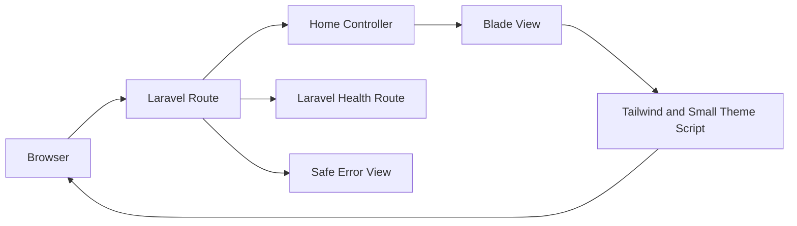
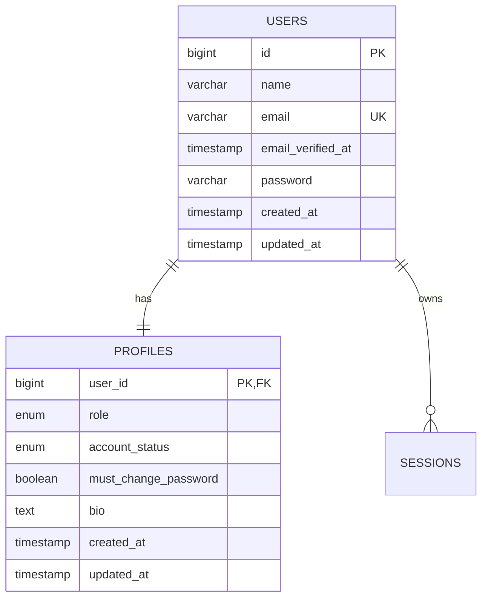
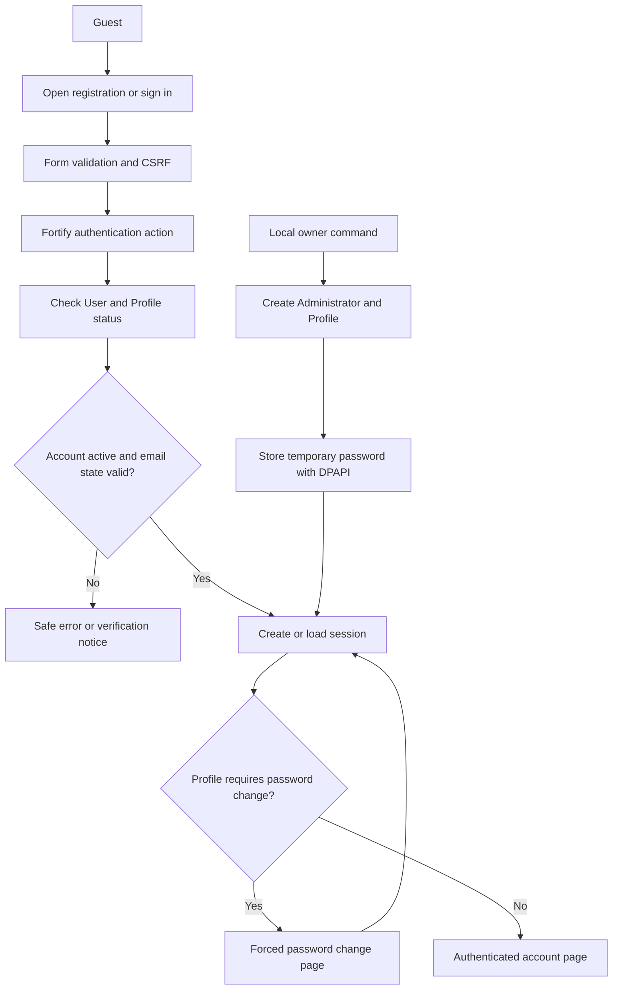

# Development roadmap

## 1. Purpose

This roadmap turns the approved LMS plan into small, testable steps.

Phase 0 is approved. Phase 1 implementation started on September 25, 2026. No later phase has started.

Do not skip directly to payment processing or dashboard polish.

## 2. Delivery rules

Every implementation slice must:

1. Solve one approved problem.
2. Keep the application runnable.
3. Add or update tests.
4. Pass the project quality checks.
5. Update the relevant documentation.
6. Avoid unrelated refactoring.
7. Avoid new dependencies without approval.

Use a vertical slice whenever possible.

Example:

```text
Registration → login → Student dashboard
```

A vertical slice proves the full path from browser input to database record and back.

### Required delivery lifecycle

Every feature and phase must follow this cycle:

```text
Data gathering
→ Create or update ERD and flowcharts
→ Develop
→ Build
→ Test
→ Find bugs
→ Fix
→ Test again
```

Required evidence for each cycle:

- Approved requirements and user flow
- Current data relationships
- Updated ERD when database records change
- Updated flowchart when process flow changes
- Passing build
- Test results
- Recorded bugs
- Fix evidence
- Passing retest
- Human review before moving to the next phase

### Input, process, and output review

Document every feature using:

```text
Input → Process → Output
```

**Input**

- Form fields
- Route parameters
- Uploaded files
- Authentication session
- External API data
- Signed webhook data

**Process**

- Validation
- Authentication
- Authorization
- Business rules
- Database transactions
- File authorization
- External service calls
- Audit logging

**Output**

- Rendered page
- Redirect
- Validation message
- Authorized file response
- Safe JSON response
- Webhook acknowledgement
- Database record
- Sanitized activity record

Do not begin development when required input, processing, or output behavior remains unclear.

## 3. Beginner learning path

Complete the relevant lesson before using a framework concept in the LMS.

### PHP review

- Functions and classes
- Arrays and collections
- Namespaces
- Exceptions
- File uploads
- Sessions and cookies
- PDO or MySQL queries
- Composer autoloading

### Laravel foundations

- Artisan commands
- Routing
- Controllers
- Blade layouts and components
- Form Requests
- Validation
- Migrations
- Eloquent models and relationships
- Authentication
- Middleware
- Policies
- Services and Actions
- Filesystem
- Events, Listeners, and Jobs
- Tests
- Deployment

### External integration

- HTTP requests
- JSON
- API authentication
- Webhooks
- Idempotency
- Retry behavior
- Safe logging

## 4. Phase 0: planning foundation

### Status

Approved.

### Deliverables

- Product plan
- Design system
- Laravel architecture
- Folder blueprint
- Technology decision
- Glossary
- Project audit
- Project instructions

### Evidence

- Documentation cross-links resolve
- No unresolved stack decision remains
- V1 exclusions are documented
- `FOR_UI` remains untouched

### Exit condition

The project owner approves the documentation set before application scaffolding.

## 5. Phase 1: Laravel foundation

### Goal

Create a clean Laravel 13 application with no LMS business logic yet.

### Status

Approved. Phase 2 authentication and profile implementation is approved to begin.

### Environment preflight

Current status:

- PHP 8.5.8: ready
- Required PHP extensions: ready
- Composer 2.10.3: installed and verified
- Node.js and npm: ready
- MySQL 8.4.11 LTS: installed as `MySQL84-LMS` on port 3307
- `lms` and `lms_test` databases: ready
- LMS database credentials: encrypted with Windows DPAPI
- XAMPP MariaDB: preserved on port 3306 and not used by the LMS

Phase 1 environment readiness: **PASS**.

### Phase 1 data gathering and flow

Approved inputs:

- Product scope in `docs/plan.md`
- Design rules in `docs/design.md`
- Laravel layers and route rules in `docs/architecture.md`
- Target file placement in `docs/folder-structure.md`
- Current Laravel 13 framework skeleton
- Current PHP, Composer, Node.js, npm, and MySQL environment

Phase 1 ERD decision:

- Do not create LMS business tables in Phase 1
- Do not create the `users` or password reset tables before Phase 2 data gathering
- Keep only framework infrastructure tables needed for sessions, cache, and database queues
- Create LMS tables through later vertical slices after their ERD and input, process, and output rules are approved

Phase 1 flow:



Phase 1 input, process, and output:

**Input**

- Public `GET /` request
- Public `GET /up` health request
- Browser HTTP error response
- Light or dark theme preference from browser storage
- Local environment configuration

**Process**

- Laravel routing
- Thin controller coordination
- Blade escaping
- Tailwind compilation
- Theme preference validation
- Safe exception handling
- MySQL connectivity check
- Automated tests and formatting checks

**Output**

- Public foundation page
- Successful health response
- Safe 401, 403, 404, 419, 429, 500, and 503 pages
- Persisted browser theme preference
- Compiled CSS and JavaScript assets
- Passing test and quality results

Phase 1 does not accept Student accounts, course data, enrollment data, Quiz data, certificate data, uploads, or payment input.

### Work

- Scaffold Laravel 13
- Configure `.env.example`
- Configure a dedicated local MySQL database
- Add Blade layout
- Add Tailwind CSS
- Add base light and dark themes
- Add public error pages
- Add health route
- Add formatting and test configuration
- Initialize Git if approved

### Implementation evidence

- Laravel 13.33.0 installed from the reviewed Composer manifest
- PHP Fileinfo enabled after the first dependency check exposed a missing extension
- `php artisan migrate --force` created only framework infrastructure tables
- `php artisan test` passed 7 tests and 26 assertions
- `vendor/bin/pint --test` passed
- `composer audit` passed with no advisories
- `npm audit` passed with no vulnerabilities
- `npm run build` passed
- `php artisan route:list` passed
- Configuration, route, and view caches built successfully
- HTTP smoke checks returned 200 for `/` and `/up` and a safe 404 page
- Theme source, runtime toggle, reload persistence, and WCAG contrast checks passed in Edge headless review
- Cached configuration correctly selected `lms_test` after the test harness fix
- Git repository initialized on the `main` branch with the approved repository-local identity

### Bugs found and fixed

- Composer install could not resolve Flysystem because PHP Fileinfo was not loaded. The PHP CLI configuration was corrected and Composer installation passed.
- The first cached-config test run selected the local `lms` database instead of `lms_test`. The test application now sets the test connection before database traits run, and the suite passed.
- The first Blade layout required a Vite manifest before tests could run. Asset inclusion is now conditional for first-run diagnostics, and a no-build test passed.

### Tests

- Application starts
- Home page renders
- Database connection test passes
- Light and dark theme preference persists
- Theme toggle changes and reload keeps the selected theme
- Mobile layout has no horizontal overflow
- Error pages render safe messages

### Do not add

- Course features
- Payment packages
- Role promotion
- Complex JavaScript
- Production deployment

### Exit condition

A new developer can install dependencies, configure `.env`, run migrations, start Laravel, and run the test suite.

## 6. Phase 2: authentication and profiles

### Goal

Create secure accounts, verified email access, editable own profiles, and one local Administrator owner for **IT Learning Hub**.

### Status

Approved on September 25, 2026. Implementation starts with the data and interface slices below.

### Confirmed decisions

- Product display name: `IT Learning Hub`
- Use Laravel Fortify for authentication routes and server flows
- Keep Blade and Tailwind CSS for the interface
- Public registration creates a Student only
- Initial owner: `Jayzee Bautista`
- Initial owner email: `bautista.jayzee@ncst.edu.ph`
- Initial owner role: `administrator`
- Initial owner account is active and verified for the local demo
- Generate a temporary password with a secure random source
- Store the temporary password with Windows DPAPI outside the repository
- Require a password change after the temporary password is used
- Require at least 12 characters and password confirmation
- Public registrations require email verification
- Use Laravel's log mailer for local verification and reset links
- Editable profile fields: display name and bio
- Profile visibility: own profile only
- Avatar upload: later phase
- Role middleware and role management: Phase 3
- PayMongo public test key: local ignored `.env` only
- No PayMongo package, payment table, checkout, or webhook in Phase 2

### Phase 2 data gathering and ERD update

Existing evidence:

- `plan.md` requires Laravel authentication, Student registration, password reset, account status, and safe profile access.
- `architecture.md` defines `users`, `profiles`, registration, session, and email-verification rules.
- `design.md` defines public authentication pages and accessible form states.
- The Phase 1 schema contains framework infrastructure tables only.

Phase 2 identity ERD:



Schema rules:

- `users.name` is the canonical display name.
- `profiles.user_id` is both the primary key and the foreign key.
- One User has exactly one Profile.
- `role` uses `student`, `instructor`, or `administrator`.
- `account_status` uses `active` or `suspended`.
- `must_change_password` defaults to `false` and is server-owned.
- `bio` is optional and limited to 500 characters.
- `email` changes and avatar uploads are outside Phase 2.
- No Course, Enrollment, Payment, or Progress tables are created in Phase 2.

### Phase 2 process flow



### Phase 2 Input, Process, and Output

**Input**

- Registration name, email, password, and password confirmation
- Login email and password
- Password-reset email
- Reset token and new password
- Email-verification token
- Own display name and bio
- Current password and new password for the forced change
- Local owner name, email, and generated temporary password

**Process**

- CSRF validation
- Fortify validation and authentication
- Password hashing
- User and Profile transaction
- Account-status check
- Email verification check
- Login throttling
- Session regeneration and invalidation
- Server-owned role and password-change flag
- Profile field allow-listing
- DPAPI-protected local secret storage
- Sanitized error responses and logs

**Output**

- Student account and Profile
- Verified or unverified User state
- Safe authenticated session
- Verification or password-reset message in the local log
- Own profile page
- Forced password-change redirect
- Local Administrator account
- No payment access or payment state

### Work

- Review and add the official `laravel/fortify` dependency
- Add `users` and `password_reset_tokens` migrations
- Add the `profiles` migration
- Add `User`, `Profile`, `UserRole`, and `UserAccountStatus` models or enums
- Add Fortify actions for registration, login, reset, and password rules
- Add email verification to the User model
- Add account-status checks to login
- Add the forced-password-change middleware
- Add own-profile view and update Form Request
- Add authentication Blade views
- Add the local owner bootstrap command
- Add local PayMongo public-key configuration without payment behavior
- Add authentication and profile feature tests
- Build, run browser checks, fix bugs, and retest

### Task list and acceptance criteria

- [x] Task 1: Add and verify Fortify
  - Acceptance: Composer manifest and lock file include the approved package; no unrelated package is added.
  - Verify: `composer validate`, `composer audit`, and Fortify route/config inspection.

- [x] Task 2: Add identity schema and models
  - Acceptance: `users`, `password_reset_tokens`, and `profiles` exist with the approved fields and relationships.
  - Verify: focused migration and model tests on `lms_test`.

- [ ] Task 3: Add registration, login, logout, reset, and verification
  - Acceptance: Student registration never accepts a role; invalid credentials and suspended accounts fail safely; logout invalidates the session.
  - Verify: auth feature tests and browser smoke flow.

- [ ] Task 4: Add forced password change and own profile
  - Acceptance: temporary-password users reach only the password change page; approved name and bio fields update; email and role fields cannot be changed through the profile form.
  - Verify: middleware, authorization, validation, and browser tests.

- [ ] Task 5: Add local Administrator bootstrap
  - Acceptance: local command creates the named Administrator, refuses unsafe promotion, stores the generated password with DPAPI, and never logs the secret.
  - Verify: command tests plus a local database inspection.

- [ ] Checkpoint: Phase 2 security and UI review
  - [ ] Full test suite passes.
  - [ ] Build passes.
  - [ ] Composer and npm audits pass.
  - [ ] Desktop and mobile authentication screens are keyboard usable.
  - [ ] Light and dark themes work.
  - [ ] Verification and reset links are available through the local log mailer.
  - [ ] No payment route or payment behavior exists.

### Security tests

- Registration cannot set a role.
- Passwords are hashed and never logged.
- Passwords require 12 characters and confirmation.
- Session regenerates after login.
- Logout invalidates the session and CSRF state.
- Suspended accounts cannot sign in.
- Unverified accounts cannot open verified-only pages.
- One User has one Profile.
- A User cannot edit role, account status, email, or password-change flag through the profile form.
- The forced password gate cannot be bypassed through a hidden link.
- Login attempts are throttled.
- Existing non-Administrator accounts are not silently promoted by the owner command.
- The temporary password is absent from Git, logs, and normal response bodies.

### Do not add

- Role management screens
- Instructor or Administrator promotion UI
- Course or enrollment features
- Payment packages or behavior
- Avatar upload
- Public profile pages
- Two-factor authentication
- Production deployment

### Exit condition

A Student can register, verify access, sign in, view and update an own profile, and sign out. The local Administrator can use the temporary password once, is forced to change it, and then reaches an authenticated account page. No payment workflow exists.

## 7. Phase 3: roles and authorization

### Goal

Protect every role-specific route and resource.

### Work

- Add Student, Instructor, and Administrator enums
- Add role assignment Action
- Add `AssignUserRole` Administrator action
- Add role and account-status middleware
- Add baseline Policies
- Add activity log model and migration
- Add role-specific navigation

### Tests

- Student cannot open Instructor or Administrator routes
- Instructor cannot open Administrator routes
- Administrator role change requires Administrator access
- A user cannot change own role
- The final Administrator cannot be removed without a safe recovery rule
- Every role change creates an activity record

### Exit condition

Role checks work on the server and are covered by tests.

## 8. Phase 4: database foundation

### Goal

Create the approved relational model before building dependent features.

### Work

- Add Course, Module, Lesson, and LearningMaterial migrations
- Add Enrollment and Payment migrations
- Add LessonProgress migration
- Add Quiz and Certificate migrations
- Add CourseRequirement migration
- Add system tables required by Laravel sessions, cache, and queues
- Add model relationships
- Add factories
- Add documented non-sensitive seeders

### Database tests

- Foreign keys reject invalid relationships
- Unique enrollment works
- Unique payment idempotency key works
- Unique provider event works
- Quiz attempt uniqueness works
- Certificate code uniqueness works
- Status constraints reject invalid values
- Free and paid price constraints work

### Exit condition

A clean test database can migrate from zero and seed documented test records.

## 9. Phase 5: course catalog

### Goal

Publish safe public Course metadata.

### Work

- Add public Course catalog
- Add search and approved filters
- Add Course details
- Add publication state
- Add Instructor Course list
- Add Create and Edit Course
- Add slug generation
- Add PHP price formatter

### Tests

- Guests see published Course metadata
- Draft and archived Courses stay private
- Instructors can manage owned Courses
- Instructors cannot manage another Instructor’s Course
- Administrators can manage all Courses
- Price uses validated database data

### Exit condition

An Instructor can create and publish a Course, and a guest can view safe public details.

## 10. Phase 6: curriculum and materials

### Goal

Manage ordered Modules, Lessons, and protected Learning Materials.

### Work

- Add Module create, update, archive, and reorder
- Add Lesson create, update, archive, and reorder
- Add private file upload
- Add approved external link
- Add material download controller
- Add private Storage disks
- Add safe file validation

### Tests

- Module and Lesson positions remain unique
- Parent relationships match
- Draft content stays private
- Student without enrollment cannot download material
- Instructor can manage material for owned Course
- Administrator can manage approved material
- Executable and unsafe file types fail validation

### Exit condition

An Instructor can build a complete Course outline with authorized material access.

## 11. Phase 7: free enrollment

### Goal

Prove the first complete learning access workflow before payment work.

### Work

- Add free enrollment Action
- Add Student My Courses page
- Add enrollment Policy
- Add duplicate prevention
- Add access-granting checks
- Add unpublish behavior

### Tests

- Published free Course creates one active enrollment
- Repeated requests reuse one enrollment
- Draft Course cannot be enrolled
- Unpublished Course blocks new enrollment
- Existing active access survives unpublishing
- One Student cannot read another Student’s enrollment

### Exit condition

A Student can enroll once in a free Course and open authorized published Lessons.

## 12. Phase 8: lesson access and progress

### Goal

Persist Lesson activity and calculate progress from records.

### Work

- Add Lesson access checks
- Add LessonProgress model and Action
- Add Mark as Complete interaction
- Add Continue Learning
- Add ProgressCalculator
- Add module and course progress queries

### Tests

- Unauthorized Lesson access fails
- Opening a Lesson records activity without completion
- Valid Mark as Complete updates one progress record
- Repeated completion requests remain idempotent
- Course percentage uses required published Lessons
- Browser-supplied percentages are ignored

### Exit condition

A Student can complete Lessons and see database-backed progress.

## 13. Phase 9: quizzes

### Goal

Deliver safe Questions and enforce server-side grading.

### Work

- Add Quiz, Question, and Option authoring
- Add exactly-one-correct-option validation
- Add safe Student Quiz projection
- Add StartQuizAttempt Action
- Add SubmitQuizAttempt Action
- Add QuizGrader
- Add Attempt result page
- Add audited Administrator reset

### Tests

- Answer keys never reach the Student before submission
- Maximum three Attempts
- Failed Attempt can be retried
- Passed Quiz blocks new Attempt
- Concurrent requests cannot create duplicate first Attempt
- Invalid Question and Option relationships fail
- Score and pass state are server-calculated

### Exit condition

A Student can complete a Quiz and receive a correct server-calculated result.

## 14. Phase 10: completion and certificates

### Goal

Verify Course completion and issue one certificate.

### Work

- Add CourseRequirement management
- Add CourseCompletionChecker
- Add CompleteCourse Action
- Add IssueCertificate Action
- Add certificate list and printable view
- Add revoke and reissue Actions

### Tests

- Required Lessons and Quizzes drive completion
- Ineligible Student receives no certificate
- Repeated issuance creates no duplicate
- Existing completion is not silently revoked after content edits
- Revocation records reason and actor
- Reissue creates a linked replacement after fresh validation

### Exit condition

An eligible Student receives one printable certificate with safe authenticated access.

## 15. Phase 11: payment architecture

### Goal

Finalize payment behavior before calling PayMongo.

### Work

- Add Payment and PaymentEvent records
- Add PayMongoClient interface
- Add checkout request and return routes
- Add amount and currency validation
- Add webhook route
- Add webhook fixtures
- Define retry, cancellation, refund, and logging behavior

### Tests

- Amount comes from Course data
- Browser cannot set payment status
- Duplicate idempotency key cannot create duplicate payment
- Repeated event cannot create duplicate access
- Invalid signature cannot change state
- Failed and cancelled events keep enrollment pending

### Exit condition

Payment state transitions are fully specified and testable without live credentials.

## 16. Phase 12: PayMongo integration

### Goal

Accept real PayMongo checkout and verified payment events.

### Work

- Check current official PayMongo documentation
- Configure server-only credentials
- Implement checkout request
- Implement signature verification
- Implement ProcessPayMongoEvent
- Activate Enrollment in one transaction
- Add return-page pending state
- Add receipt Job
- Add webhook monitoring

### Tests

Run the approved webhook scenarios from `plan.md` and `architecture.md`.

### Exit condition

A real test-mode payment activates one paid Enrollment once, and repeated delivery causes no duplicate.

## 17. Phase 13: dashboards and reports

### Goal

Add role-specific pages using real authorized data.

### Work

- Student dashboard
- Instructor dashboard
- Administrator dashboard
- Operational reports
- Loading, empty, error, and success states
- Theme and mobile navigation verification

### Tests

- Each role sees authorized data
- Cross-user data remains hidden
- Counts match database queries
- Empty accounts receive useful empty states
- Reports use real records only

### Exit condition

All dashboards work with real authorized data and approved empty states.

## 18. Phase 14: quality and accessibility

### Goal

Verify the complete V1 release.

### Automated checks

```text
php artisan test
./vendor/bin/pint --test
composer audit
php artisan route:list
```

### Browser checks

- Registration and login
- Free enrollment
- Lesson completion
- Quiz submission
- Certificate print view
- Paid checkout return
- Mobile navigation
- Light and dark themes
- Keyboard focus
- Screen-reader labels
- Loading, empty, error, and success states

### Security checks

- Anonymous direct-route access
- Student cross-user access
- Instructor cross-owner access
- Administrator payment invariant
- Private file access
- Webhook replay
- Upload validation
- Secret scanning
- Production debug configuration

### Exit condition

Every acceptance criterion in `plan.md` passes with recorded evidence.

## 19. Phase 15: deployment and defense

### Goal

Deploy a tested release and prepare the SIA1 presentation.

### Deployment work

- Select hosting and database providers
- Configure production environment variables
- Configure HTTPS and secure cookies
- Configure private Storage
- Configure queue worker and scheduler when required
- Configure backups
- Run deployment checks
- Document rollback steps

### Defense evidence

- System context diagram
- Container or deployment diagram
- Component diagram
- ER diagram
- Use-case or user-flow diagram
- Free enrollment sequence
- Payment webhook sequence
- Authorization matrix
- Security checklist
- Test results
- Screenshots of real workflows
- Reflection on architecture tradeoffs

### Exit condition

The deployed application works, the team can explain the architecture, and critical workflows remain testable.

## 20. Commands after scaffolding

Use the commands generated by the selected Laravel starter kit.

Expected commands include:

```text
php artisan serve
php artisan migrate
php artisan db:seed
php artisan test
php artisan route:list
./vendor/bin/pint --test
composer audit
npm run dev
npm run build
```

Do not run `migrate:fresh` against a shared or production database.

## 21. Definition of ready

A task is ready when:

- Approved requirement exists
- Affected tables are known
- Authorization rules are known
- User-visible states are known
- Tests are identified
- Documentation impact is known
- No unresolved product decision remains

## 22. Definition of done

A task is done when:

- Approved behavior works
- Tests pass
- Quality checks pass
- Authorization is covered
- Validation and error paths are covered
- Documentation matches behavior
- No secret is committed
- No unrelated file changed
- The team can explain the change

## 23. Current next action

The current next action is documentation review.

Environment preflight is complete. The current next action is owner readiness review. Application scaffolding begins only after owner confirmation.
