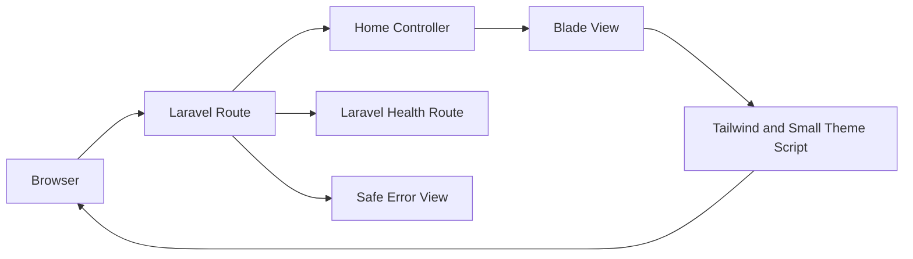
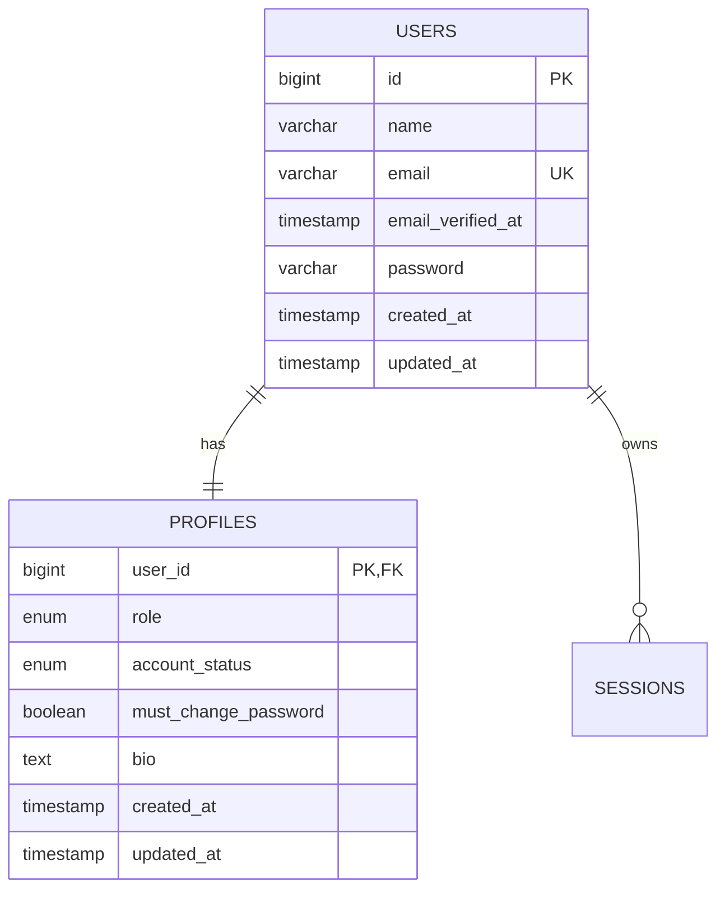
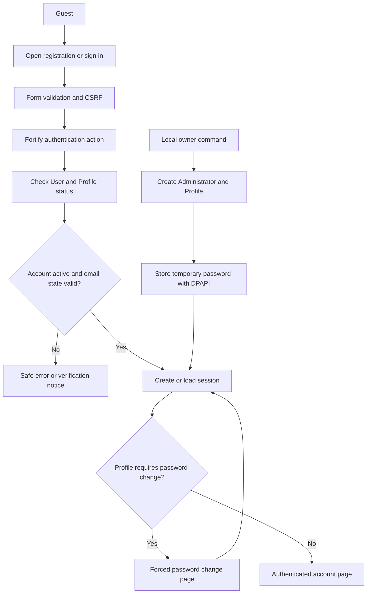
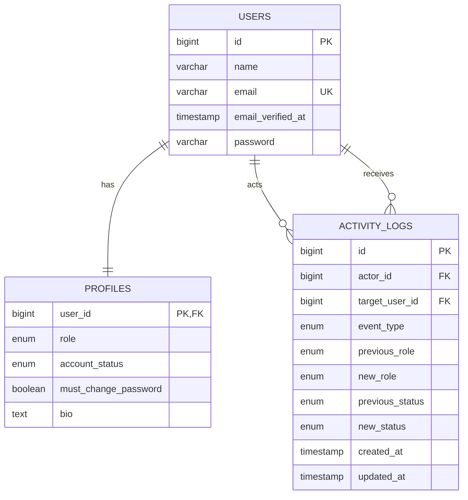
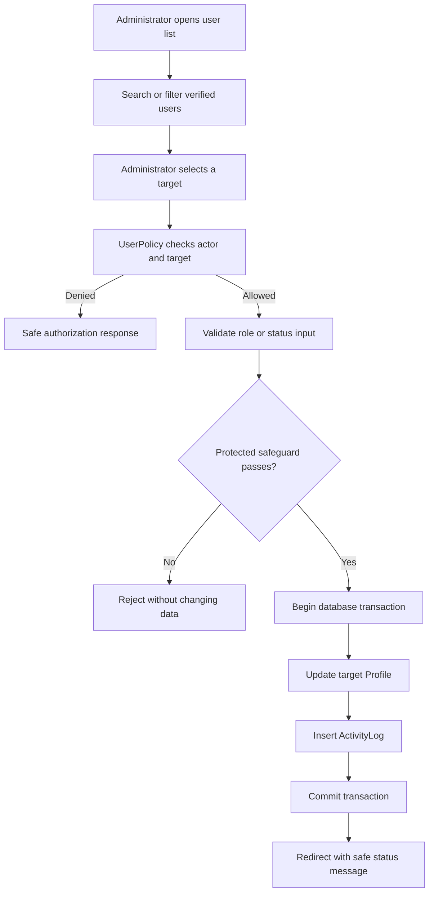
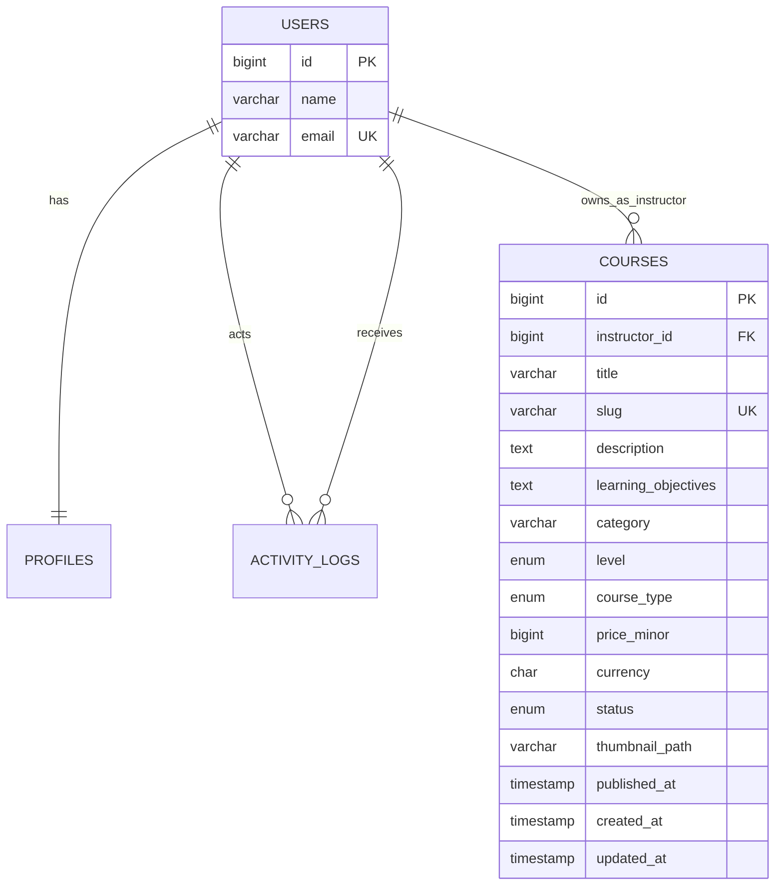
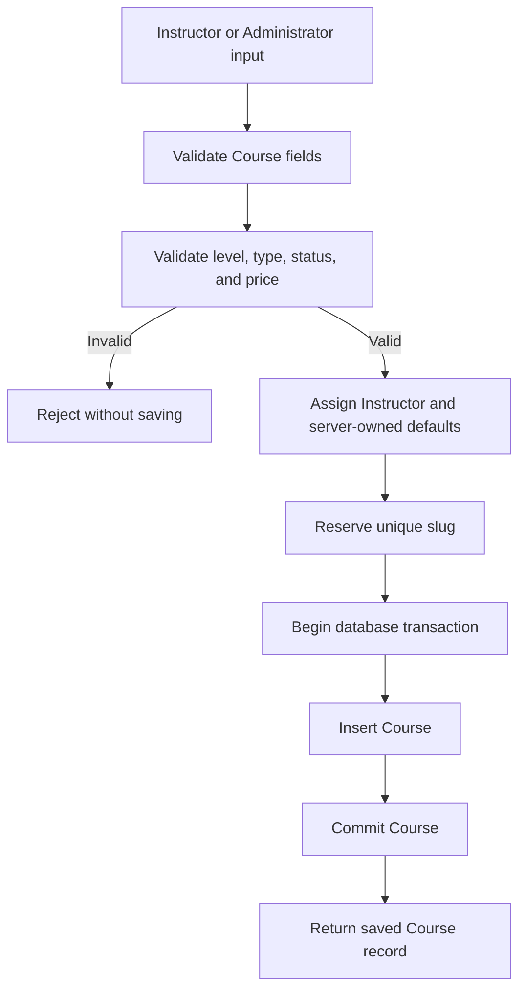
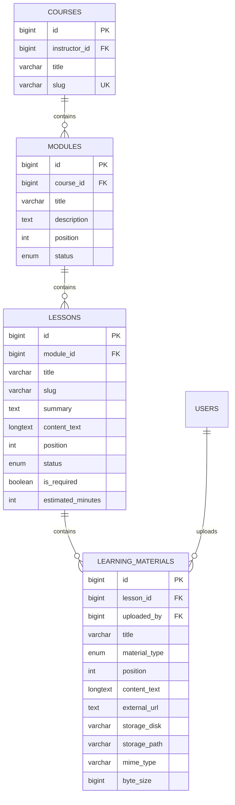
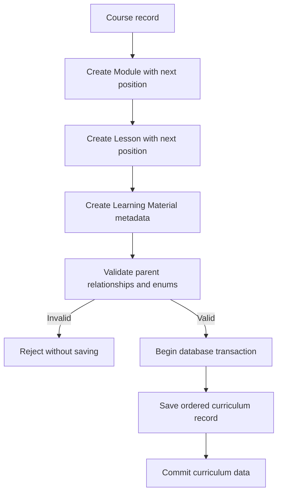

# Development roadmap

## 1. Purpose

This roadmap turns the approved LMS plan into small, testable steps.

Phase 0 is approved. Phase 1 is complete. Phase 2, Phase 3, Phase 4A, and Phase 4B are human-approved. Phase 5A Instructor Course Outline UI is in progress. No later business phase has started.

Do not skip directly to payment processing or dashboard polish.

## 2. Delivery rules

Every implementation slice must:

1. Solve one approved problem.
2. Keep the application runnable.
3. Add or update tests.
4. Pass the project quality checks.
5. Update the relevant documentation.
6. Avoid unrelated refactoring.
7. Avoid new dependencies without approval.

Use a vertical slice whenever possible.

Example:

```text
Registration → login → Student dashboard
```

A vertical slice proves the full path from browser input to database record and back.

### Required delivery lifecycle

Every feature and phase must follow this cycle:

```text
Data gathering
→ Create or update ERD and flowcharts
→ Develop
→ Build
→ Test
→ Find bugs
→ Fix
→ Test again
```

Required evidence for each cycle:

- Approved requirements and user flow
- Current data relationships
- Updated ERD when database records change
- Updated flowchart when process flow changes
- Passing build
- Test results
- Recorded bugs
- Fix evidence
- Passing retest
- Human review before moving to the next phase

### Input, process, and output review

Document every feature using:

```text
Input → Process → Output
```

**Input**

- Form fields
- Route parameters
- Uploaded files
- Authentication session
- External API data
- Signed webhook data

**Process**

- Validation
- Authentication
- Authorization
- Business rules
- Database transactions
- File authorization
- External service calls
- Audit logging

**Output**

- Rendered page
- Redirect
- Validation message
- Authorized file response
- Safe JSON response
- Webhook acknowledgement
- Database record
- Sanitized activity record

Do not begin development when required input, processing, or output behavior remains unclear.

## 3. Beginner learning path

Complete the relevant lesson before using a framework concept in the LMS.

### PHP review

- Functions and classes
- Arrays and collections
- Namespaces
- Exceptions
- File uploads
- Sessions and cookies
- PDO or MySQL queries
- Composer autoloading

### Laravel foundations

- Artisan commands
- Routing
- Controllers
- Blade layouts and components
- Form Requests
- Validation
- Migrations
- Eloquent models and relationships
- Authentication
- Middleware
- Policies
- Services and Actions
- Filesystem
- Events, Listeners, and Jobs
- Tests
- Deployment

### External integration

- HTTP requests
- JSON
- API authentication
- Webhooks
- Idempotency
- Retry behavior
- Safe logging

## 4. Phase 0: planning foundation

### Status

Approved.

### Deliverables

- Product plan
- Design system
- Laravel architecture
- Folder blueprint
- Technology decision
- Glossary
- Project audit
- Project instructions

### Evidence

- Documentation cross-links resolve
- No unresolved stack decision remains
- V1 exclusions are documented
- `FOR_UI` remains untouched

### Exit condition

The project owner approves the documentation set before application scaffolding.

## 5. Phase 1: Laravel foundation

### Goal

Create a clean Laravel 13 application with no LMS business logic yet.

### Status

Approved. Phase 1 implementation is complete, Phase 2 and Phase 3 are human-approved, and Phase 4A is implemented pending human review.

### Environment preflight

Current status:

- PHP 8.5.8: ready
- Required PHP extensions: ready
- Composer 2.10.3: installed and verified
- Node.js and npm: ready
- MySQL 8.4.11 LTS: installed as `MySQL84-LMS` on port 3307
- `lms` and `lms_test` databases: ready
- LMS database credentials: encrypted with Windows DPAPI
- XAMPP MariaDB: preserved on port 3306 and not used by the LMS

Phase 1 environment readiness: **PASS**.

### Phase 1 data gathering and flow

Approved inputs:

- Product scope in `docs/plan.md`
- Design rules in `docs/design.md`
- Laravel layers and route rules in `docs/architecture.md`
- Target file placement in `docs/folder-structure.md`
- Current Laravel 13 framework skeleton
- Current PHP, Composer, Node.js, npm, and MySQL environment

Phase 1 ERD decision:

- Do not create LMS business tables in Phase 1
- Do not create the `users` or password reset tables before Phase 2 data gathering
- Keep only framework infrastructure tables needed for sessions, cache, and database queues
- Create LMS tables through later vertical slices after their ERD and input, process, and output rules are approved

Phase 1 flow:



Phase 1 input, process, and output:

**Input**

- Public `GET /` request
- Public `GET /up` health request
- Browser HTTP error response
- Light or dark theme preference from browser storage
- Local environment configuration

**Process**

- Laravel routing
- Thin controller coordination
- Blade escaping
- Tailwind compilation
- Theme preference validation
- Safe exception handling
- MySQL connectivity check
- Automated tests and formatting checks

**Output**

- Public foundation page
- Successful health response
- Safe 401, 403, 404, 419, 429, 500, and 503 pages
- Persisted browser theme preference
- Compiled CSS and JavaScript assets
- Passing test and quality results

Phase 1 does not accept Student accounts, course data, enrollment data, Quiz data, certificate data, uploads, or payment input.

### Work

- Scaffold Laravel 13
- Configure `.env.example`
- Configure a dedicated local MySQL database
- Add Blade layout
- Add Tailwind CSS
- Add base light and dark themes
- Add public error pages
- Add health route
- Add formatting and test configuration
- Initialize Git if approved

### Implementation evidence

- Laravel 13.33.0 installed from the reviewed Composer manifest
- PHP Fileinfo enabled after the first dependency check exposed a missing extension
- `php artisan migrate --force` created only framework infrastructure tables
- `php artisan test` passed 7 tests and 26 assertions
- `vendor/bin/pint --test` passed
- `composer audit` passed with no advisories
- `npm audit` passed with no vulnerabilities
- `npm run build` passed
- `php artisan route:list` passed
- Configuration, route, and view caches built successfully
- HTTP smoke checks returned 200 for `/` and `/up` and a safe 404 page
- Theme source, runtime toggle, reload persistence, and WCAG contrast checks passed in Edge headless review
- Cached configuration correctly selected `lms_test` after the test harness fix
- Git repository initialized on the `main` branch with the approved repository-local identity

### Bugs found and fixed

- Composer install could not resolve Flysystem because PHP Fileinfo was not loaded. The PHP CLI configuration was corrected and Composer installation passed.
- The first cached-config test run selected the local `lms` database instead of `lms_test`. The test application now sets the test connection before database traits run, and the suite passed.
- The first Blade layout required a Vite manifest before tests could run. Asset inclusion is now conditional for first-run diagnostics, and a no-build test passed.

### Tests

- Application starts
- Home page renders
- Database connection test passes
- Light and dark theme preference persists
- Theme toggle changes and reload keeps the selected theme
- Mobile layout has no horizontal overflow
- Error pages render safe messages

### Do not add

- Course features
- Payment packages
- Role promotion
- Complex JavaScript
- Production deployment

### Exit condition

A new developer can install dependencies, configure `.env`, run migrations, start Laravel, and run the test suite.

## 6. Phase 2: authentication and profiles

### Goal

Create secure accounts, verified email access, editable own profiles, and one local Administrator owner for **IT Learning Hub**.

### Status

Approved on September 25, 2026. Human review confirmed the Phase 2 authentication and profile slice. Phase 3 and Phase 4A are now implemented; Phase 4A awaits human review.

### Confirmed decisions

- Product display name: `IT Learning Hub`
- Use Laravel Fortify for authentication routes and server flows
- Keep Blade and Tailwind CSS for the interface
- Public registration creates a Student only
- Initial owner: `Jayzee Bautista`
- Initial owner email: `bautista.jayzee@ncst.edu.ph`
- Initial owner role: `administrator`
- Initial owner account is active and verified for the local demo
- Generate a temporary password with a secure random source
- Store the temporary password with Windows DPAPI outside the repository
- Require a password change after the temporary password is used
- Require at least 12 characters and password confirmation
- Public registrations require email verification
- Use Laravel's log mailer for local verification and reset links
- Editable profile fields: display name and bio
- Profile visibility: own profile only
- Avatar upload: later phase
- Role middleware and role management: Phase 3
- PayMongo public test key: local ignored `.env` only
- No PayMongo package, payment table, checkout, or webhook in Phase 2

### Phase 2 data gathering and ERD update

Existing evidence:

- `plan.md` requires Laravel authentication, Student registration, password reset, account status, and safe profile access.
- `architecture.md` defines `users`, `profiles`, registration, session, and email-verification rules.
- `design.md` defines public authentication pages and accessible form states.
- The Phase 1 schema contains framework infrastructure tables only.
- The Phase 2 migrations now add `users`, `password_reset_tokens`, and `profiles` without business tables.

Phase 2 identity ERD:



Schema rules:

- `users.name` is the canonical display name.
- `profiles.user_id` is both the primary key and the foreign key.
- One User has exactly one Profile.
- `role` uses `student`, `instructor`, or `administrator`.
- `account_status` uses `active` or `suspended`.
- `must_change_password` defaults to `false` and is server-owned.
- `bio` is optional and limited to 500 characters.
- `email` changes and avatar uploads are outside Phase 2.
- No Course, Enrollment, Payment, or Progress tables are created in Phase 2.

### Phase 2 process flow



### Phase 2 Input, Process, and Output

**Input**

- Registration name, email, password, and password confirmation
- Login email and password
- Password-reset email
- Reset token and new password
- Email-verification token
- Own display name and bio
- Current password and new password for the forced change
- Local owner name, email, and generated temporary password

**Process**

- CSRF validation
- Fortify validation and authentication
- Password hashing
- User and Profile transaction
- Account-status check
- Email verification check
- Login throttling
- Session regeneration and invalidation
- Server-owned role and password-change flag
- Profile field allow-listing
- DPAPI-protected local secret storage
- Sanitized error responses and logs

**Output**

- Student account and Profile
- Verified or unverified User state
- Safe authenticated session
- Verification or password-reset message in the local log
- Own profile page
- Forced password-change redirect
- Local Administrator account
- No payment access or payment state

### Work

- Review and add the official `laravel/fortify` dependency
- Add `users` and `password_reset_tokens` migrations
- Add the `profiles` migration
- Add `User`, `Profile`, `UserRole`, and `UserAccountStatus` models or enums
- Add Fortify actions for registration, login, reset, and password rules
- Add email verification to the User model
- Add account-status checks to login
- Add the forced-password-change middleware
- Add own-profile view and update Form Request
- Add authentication Blade views
- Add the local owner bootstrap command
- Add local PayMongo public-key configuration without payment behavior
- Add authentication and profile feature tests
- Build, run browser checks, fix bugs, and retest

### Task list and acceptance criteria

- [x] Task 1: Add and verify Fortify
  - Acceptance: Composer manifest and lock file include the approved package; no unrelated package is added.
  - Verify: `composer validate`, `composer audit`, and Fortify route/config inspection.

- [x] Task 2: Add identity schema and models
  - Acceptance: `users`, `password_reset_tokens`, and `profiles` exist with the approved fields and relationships.
  - Verify: focused migration and model tests on `lms_test`.

- [x] Task 3: Add registration, login, logout, reset, and verification
  - Acceptance: Student registration never accepts a role; invalid credentials and suspended accounts fail safely; logout invalidates the session.
  - Verify: auth feature tests and browser smoke flow.

- [x] Task 4: Add forced password change and own profile
  - Acceptance: temporary-password users reach only the password change page; approved name and bio fields update; email and role fields cannot be changed through the profile form.
  - Verify: middleware, authorization, validation, and browser tests.

- [x] Task 5: Add local Administrator bootstrap
  - Acceptance: local command creates the named Administrator, refuses unsafe promotion, stores the generated password with DPAPI, and never logs the secret.
  - Verify: command tests plus a local database inspection.

- [x] Checkpoint: Phase 2 security and UI review
  - [x] Full test suite passes.
  - [x] Build passes.
  - [x] Composer and npm audits pass.
  - [x] Desktop and mobile authentication screens are keyboard usable.
  - [x] Light and dark themes work.
  - [x] Verification and reset links are available through the local log mailer.
  - [x] No payment route or payment behavior exists.

### Phase 2 implementation evidence

- `laravel/fortify` v1.40.0 is installed with passkeys and two-factor authentication disabled.
- `users`, `password_reset_tokens`, and `profiles` migrations run on `lms_test` and local `lms`.
- Student registration creates a User and Profile in one transaction and rejects privileged fields.
- Login blocks invalid credentials and suspended accounts, regenerates the session, and throttles repeated failures.
- Password reset uses a generic response for known and unknown email addresses.
- The local owner command created `Jayzee Bautista` as a verified Administrator with `must_change_password = true`.
- The temporary owner password is stored at the configured external path with Windows DPAPI.
- The automated suite passes 28 tests and 141 assertions.
- Vite build, Composer validation/audit, npm audit, route listing, and cache checks pass.
- Edge headless review at 1440px and 390px confirmed the sign-in layout has no horizontal overflow, 44px submit controls, visible labels, password-manager autocomplete, keyboard focus, and no role input on registration.
- Edge evaluation confirmed the theme toggle changes the document theme and persists `lms-theme` in browser storage.
- A real local Administrator login reached `/account/password` without printing the temporary password.
- Laravel's local log mailer recorded a password-reset link; the temporary reset token was deleted after the check.

Bugs found and fixed during this phase:

- The local owner name needed quoting in `.env`.
- Fortify’s default unknown-email reset response exposed account state, so the project now uses a safe generic response.
- The owner command test initially reused the real local secret path, so the test now uses a unique temporary path outside the repository.
- The password-change middleware initially allowed the page route but not its POST route, so the gate now permits both password-change endpoints.
- Registration normalization initially assumed name and email keys existed, so missing-field validation now returns errors instead of a server error.

### Security tests

- Registration cannot set a role.
- Passwords are hashed and never logged.
- Passwords require 12 characters and confirmation.
- Session regenerates after login.
- Logout invalidates the session and CSRF state.
- Suspended accounts cannot sign in.
- Unverified accounts cannot open verified-only pages.
- One User has one Profile.
- A User cannot edit role, account status, email, or password-change flag through the profile form.
- The forced password gate cannot be bypassed through a hidden link.
- Login attempts are throttled.
- Existing non-Administrator accounts are not silently promoted by the owner command.
- The temporary password is absent from Git, logs, and normal response bodies.

### Do not add

- Role management screens
- Instructor or Administrator promotion UI
- Course or enrollment features
- Payment packages or behavior
- Avatar upload
- Public profile pages
- Two-factor authentication
- Production deployment

### Exit condition

A Student can register, verify access, sign in, view and update an own profile, and sign out. The local Administrator can use the temporary password once, is forced to change it, and then reaches an authenticated account page. No payment workflow exists.

## 7. Phase 3: roles and authorization

### Goal

Protect every role-specific route and resource with server-side role checks, safe Administrator account controls, and auditable role/status changes.

### Status

Human review confirmed the Phase 3 roles, activity-log, Administrator, and authorization slices. Phase 3 is approved. Phase 4A Course foundation is now the active slice.

### Confirmed decisions

- Reuse the existing `UserRole` and `UserAccountStatus` enums
- Keep one role per account: Student, Instructor, or Administrator
- Add Administrator user management with search, filters, and pagination
- Allow direct Administrator role assignment for verified accounts
- Allow account suspension and reactivation
- Reject self-role and self-status changes
- Reject demotion or suspension of the final active Administrator
- Require one database transaction for each account change and ActivityLog record
- Add a read-only `/admin/activity` page with 25 records per page
- Add minimal authorized `/student`, `/instructor`, and `/admin` pages
- Redirect users to the landing page for their current role after login or forced password change
- Block suspended sessions on the next request and require sign-in after reactivation
- Do not add deletion, archive, bulk actions, IP addresses, user-agent data, or multi-role accounts

### Phase 3 data gathering and ERD update

Existing evidence:

- `plan.md` requires protected role assignment, suspension/reactivation, and role-change audit records.
- `architecture.md` defines role middleware, Policies, and an Administration domain.
- `profiles.role` and `profiles.account_status` already exist from Phase 2.
- No ActivityLog table exists in the current schema.
- No role-specific routes or policies exist yet.

Phase 3 identity and audit ERD:



Schema rules:

- `activity_logs.actor_id` references the acting User.
- `activity_logs.target_user_id` references the changed User.
- `event_type` uses `role_changed` or `account_status_changed`.
- Role fields are populated for role events and null for status events.
- Status fields are populated for status events and null for role events.
- ActivityLog rows are read-only after creation in Phase 3.
- Foreign keys prevent deleting Users referenced by an activity record.
- The Profile update and ActivityLog insert use one transaction.

### Phase 3 process flow



### Phase 3 Input, Process, and Output

**Input**

- Administrator session
- Search text
- Role filter
- Account-status filter
- Target User ID
- New role or account status
- Target current role and status
- Current active Administrator count

**Process**

- Authenticate the actor
- Verify the actor's email and active account
- Run `UserPolicy`
- Reject self-target changes
- Reject unverified role-change targets
- Reject invalid enum values
- Reject last-Administrator demotion or suspension
- Update the Profile on the server
- Insert a sanitized ActivityLog record
- Commit both records together
- Redirect to a role-based landing page
- End or block suspended sessions

**Output**

- Protected Student, Instructor, or Administrator landing page
- Searchable Administrator user list
- Updated Profile role or account status
- Auditable role/status ActivityLog record
- Safe success or authorization message
- No deletion, bulk action, or fabricated business data

### Work

- Reuse existing UserRole and UserAccountStatus enums
- Add ActivityLog migration and model
- Add AssignUserRole and UpdateAccountStatus Actions
- Add UserPolicy
- Add EnsureUserHasRole and EnsureAccountIsActive middleware
- Add role-based login/password-change redirects
- Add minimal Student, Instructor, and Administrator pages
- Add Administrator user list, search, filters, and pagination
- Add protected role and status mutation routes
- Add read-only Administrator activity page
- Add authorization, transaction, and browser tests

### Task list and acceptance criteria

- [x] Task 1: Update Phase 3 data and authorization contracts
  - Acceptance: ERD, flow, route rules, policy rules, and Input/Process/Output match the approved specification.
  - Verify: documentation review and `git diff --check`.

- [x] Task 2: Add activity-log schema and model
  - Acceptance: `activity_logs` stores actor, target, event type, previous/new role or status, and timestamps. No secrets or request metadata are stored.
  - Verify: migration, model, relationship, and constraint tests.

- [x] Task 3: Add role and status Actions
  - Acceptance: only an Administrator can change another verified user's role or status; self and last-admin changes fail; Profile and ActivityLog save atomically.
  - Verify: focused Action tests on `lms_test`.

- [x] Task 4: Add middleware, Policies, and role redirects
  - Acceptance: role and active-account middleware protect routes; policies repeat authorization; login and password change redirect by role.
  - Verify: role matrix and session tests.

- [x] Task 5: Add Administrator user management and activity UI
  - Acceptance: searchable/filterable/paginated user list and read-only activity page work on desktop and mobile.
  - Verify: feature tests, build, and browser review.

- [x] Task 6: Add minimal role landing pages
  - Acceptance: each role sees only its authorized page and no fake courses, payments, or progress data.
  - Verify: role matrix, view, accessibility, and responsive checks.

- [x] Checkpoint: Phase 3 strict security gate
  - [x] Full test suite passes.
  - [x] Build passes.
  - [x] Composer and npm audits pass.
  - [x] Role matrix tests pass.
  - [x] Policy and self/last-admin tests pass.
  - [x] ActivityLog transaction tests pass.
  - [x] Desktop and mobile admin pages are usable.
  - [x] Human approval is recorded before Phase 4A.

### Phase 3 implementation evidence

- ActivityLog migration, model, relationships, and read-only page are implemented.
- Role/status Actions enforce active Administrator authorization, verified role targets, self-change protection, and last-Administrator safeguards.
- Role and account-status updates use one database transaction.
- Role and active-account middleware protect all Phase 3 routes.
- Login and forced-password-change redirects use the current role.
- Administrator user search, filters, role forms, status forms, and activity records are implemented.
- Student, Instructor, and Administrator landing pages contain no fabricated business data.
- The automated suite passes 41 tests and 195 assertions, including role matrix, policy, transaction, and activity-page tests.
- Edge fallback review at 390px found the wide Administrator table caused page-level horizontal overflow; the user list now uses stacked mobile cards and passes the mobile width check.
- Final Edge review confirmed role-based login redirect to `/admin`, desktop table layout, mobile card layout, 44px visible controls, no page-level overflow, and no password field on the activity page.

### Security tests

- Student cannot open Instructor or Administrator routes.
- Instructor cannot open Administrator routes.
- Administrator can open only Administrator routes.
- A Student cannot change any role or status.
- An Administrator cannot change their own role or status.
- A role change requires a verified target email.
- The final active Administrator cannot be demoted or suspended.
- Suspended users cannot authenticate or continue an existing session.
- Reactivation creates an activity record and allows later sign-in.
- Role/status update and ActivityLog record succeed or fail together.
- ActivityLog page contains no password, token, IP, or user-agent data.
- Blade visibility cannot bypass server authorization.

### Do not add

- Instructor applications or invitations
- Multi-role accounts
- Hard deletion or archive states
- Bulk role/status actions
- Course management
- Enrollment, quizzes, or certificates
- Payment behavior
- Production deployment

### Exit condition

An Administrator can search users, assign an approved role, suspend or reactivate an account, and review a read-only activity record. Every protected role and account action is enforced on the server and covered by tests. Phase 3 is human-approved.

## 8. Phase 4A: Course foundation

### Goal

Create the approved Course data foundation before building catalog, curriculum, enrollment, or payment behavior.

### Status

Approved on September 25, 2026. Human review approved the Course ERD, constraints, migration, model, factory, and automated tests. Phase 4B is now the active slice.

### Confirmed decisions

- Reuse the existing User identity for Course ownership
- Add `CourseLevel`, `CourseType`, and `CourseStatus` enums
- Add only the `courses` table in this slice
- Default level to `beginner`
- Default Course type to `free`
- Default price to zero minor units
- Default currency to `PHP`
- Default status to `draft`
- Keep `published_at` nullable
- Keep `thumbnail_path` nullable and protected
- Generate slugs server-side in a later Course action
- Do not add catalog, curriculum, enrollment, payment, upload, or seeder behavior

### Phase 4A ERD update



### Phase 4A process flow



### Phase 4A Input, Process, and Output

**Input**

- Instructor User ID
- Course title
- Description
- Learning objectives
- Category
- Level
- Course type
- Price in minor units
- Currency

**Process**

- Validate the Instructor relationship
- Validate approved enum values
- Validate price and Course type together
- Apply server-owned defaults
- Reserve a unique slug
- Save the Course in a database transaction

**Output**

- Valid Course record
- Instructor relationship
- Safe draft/free defaults
- Database constraints and indexes
- No public catalog access
- No enrollment, payment, curriculum, or upload record

### Work

- Add CourseLevel, CourseType, and CourseStatus enums
- Add the courses migration with foreign key, checks, and indexes
- Add the Course model with guarded server-owned fields
- Add User ownership relationship
- Add Course factory
- Add Course foundation tests

### Task list and acceptance criteria

- [x] Task 1: Update Phase 4A data and flow contracts
  - Acceptance: plan, architecture, roadmap, design, folder structure, and audit describe the approved Course slice.
  - Verify: documentation review and `git diff --check`.

- [x] Task 2: Add failing Course schema tests
  - Acceptance: tests describe columns, indexes, foreign keys, enum values, defaults, price rules, and slug uniqueness.
  - Verify: tests fail before the migration exists.

- [x] Task 3: Add Course enums, migration, and model
  - Acceptance: a clean database migrates and creates valid Course records; invalid records are rejected by database constraints.
  - Verify: focused migration and model tests.

- [x] Task 4: Add Course factory and relationship tests
  - Acceptance: the factory creates a valid Course owned by an Instructor; the User relationship resolves correctly.
  - Verify: focused factory and relationship tests.

- [x] Task 5: Run the Phase 4A quality gate
  - Acceptance: full tests, Pint, PHP syntax, build, audits, route checks, and clean local migration pass.
  - Verify: recorded evidence in `docs/project-audit.md`.

### Phase 4A implementation evidence

- Added the `courses` migration with Instructor foreign key, unique slug, catalog indexes, enum columns, PHP currency check, and free/paid price check.
- Added `CourseLevel`, `CourseType`, and `CourseStatus` enums with model casts.
- Added the `Course` model with an Instructor relationship and guarded server-owned fields.
- Added `UserFactory::instructor()` and `CourseFactory` for valid test data.
- Added Phase 4A tests for columns, indexes, constraints, defaults, relationships, mass-assignment protection, and route boundaries.
- The full suite passes 55 tests and 235 assertions.
- Pint, PHP syntax checks, Vite build, Composer validation/audit, npm audit, and local migration all pass.
- No Course UI, curriculum, enrollment, payment, upload, or sample seeder behavior was added.

### Phase 4A security tests

- A Course cannot reference a missing Instructor User.
- A Course slug cannot be duplicated.
- Invalid level, Course type, status, or currency values are rejected.
- A free Course cannot have a positive price.
- A paid Course cannot have a zero price.
- Server-owned fields are not mass-assignable from a normal request.
- No public course route exists before the catalog phase.
- No payment, enrollment, curriculum, or upload record is created.

### Do not add

- Public catalog or course detail pages
- Instructor course forms
- Slug generation action
- Module, Lesson, or LearningMaterial tables
- Enrollment or payment tables
- Course seeders with sample content
- Thumbnail upload behavior
- PayMongo behavior

### Exit condition

A clean test database can migrate from zero and create valid Course records through the model and factory. No catalog, curriculum, enrollment, payment, or upload behavior has started.

### Phase 4A checkpoint

- [x] Human review confirms the Course foundation slice
- [x] Phase 4B may begin

## 9. Phase 4B: curriculum and material foundation

### Goal

Create the ordered Course outline and Learning Material metadata before curriculum routes, uploads, enrollment, or payment behavior.

### Status

Approved on September 26, 2026. Module, Lesson, and Learning Material metadata are implemented and awaiting human review.

### Confirmed decisions

- Reuse the existing Course and User identities
- Add `ContentStatus` for Module and Lesson status
- Add `LearningMaterialType` for material metadata
- Add only `modules`, `lessons`, and `learning_materials` tables
- Module and Lesson positions are positive and unique within their parent
- Lesson slugs are unique within their Module
- Material positions are positive and unique within their Lesson
- Module and Lesson status defaults to `draft`
- Lessons are required by default
- Estimated minutes are nullable but positive
- Storage metadata is server-owned
- No curriculum route, upload handler, private download, URL allowlist, enrollment, payment, or sample seeder

### Phase 4B ERD update



### Phase 4B process flow



### Phase 4B Input, Process, and Output

**Input**

- Parent Course, Module, or Lesson ID
- Title and safe description or summary fields
- Ordered position
- Content status
- Lesson required flag
- Estimated minutes
- Material type and safe metadata

**Process**

- Validate the parent relationship
- Validate approved status and material type values
- Validate positive ordering and duration values
- Enforce parent-scoped uniqueness
- Apply safe defaults
- Save metadata in a database transaction
- Do not accept or serve files in this phase

**Output**

- Ordered Module, Lesson, and Learning Material records
- Course → Module → Lesson → Material relationships
- No public curriculum route
- No upload or private download behavior
- No enrollment or payment record

### Work

- Add ContentStatus and LearningMaterialType enums
- Add the modules migration with ordering constraints and indexes
- Add the lessons migration with parent-scoped slug and ordering constraints
- Add the learning_materials migration with metadata and storage constraints
- Add Module, Lesson, and LearningMaterial models
- Add Course, User, and curriculum relationships
- Add Module, Lesson, and LearningMaterial factories
- Add curriculum foundation tests

### Task list and acceptance criteria

- [x] Task 1: Update Phase 4B data and flow contracts
  - Acceptance: plan, architecture, roadmap, design, folder structure, and audit describe the approved curriculum slice.
  - Verify: documentation review and `git diff --check`.

- [x] Task 2: Add failing Module and Lesson schema tests
  - Acceptance: tests describe columns, indexes, foreign keys, defaults, ordering, slug, and status rules.
  - Verify: tests fail before the migrations exist.

- [x] Task 3: Add Module and Lesson enums, migrations, and models
  - Acceptance: a clean database migrates and creates valid ordered Module and Lesson records; invalid records are rejected.
  - Verify: focused migration and model tests.

- [x] Task 4: Add Module and Lesson factories and relationships
  - Acceptance: factories create valid parent-scoped records; Course → Module → Lesson relationships resolve correctly.
  - Verify: focused factory and relationship tests.

- [x] Task 5: Add failing Learning Material tests
  - Acceptance: tests describe metadata columns, foreign keys, material types, positions, storage paths, and server-owned fields.
  - Verify: tests fail before the migration exists.

- [x] Task 6: Add Learning Material migration, model, and factory
  - Acceptance: valid metadata records save; invalid types, positions, and relationships fail safely.
  - Verify: focused migration and model tests.

- [x] Task 7: Run the Phase 4B quality gate
  - Acceptance: full tests, Pint, PHP syntax, build, audits, route checks, and clean local migration pass.
  - Verify: recorded evidence in `docs/project-audit.md`.

### Phase 4B increment 1 evidence

- Added `ContentStatus` and the Module and Lesson migrations.
- Enforced positive, parent-scoped positions and Lesson slug uniqueness.
- Added Module and Lesson models with Course → Module → Lesson relationships.
- Added Module and Lesson factories with safe draft defaults.
- Added server-owned field mass-assignment tests.
- The full suite passes 70 tests and 279 assertions.
- Pint, PHP syntax checks, and local migrations pass.
- No curriculum routes, uploads, Learning Materials, enrollment, or payment behavior has started.

### Phase 4B increment 2 evidence

- Added `LearningMaterialType` and the Learning Material migration.
- Enforced positive, Lesson-scoped positions and storage-path uniqueness within a disk.
- Added the `LearningMaterial` model with Lesson and uploader relationships.
- Added `LearningMaterialFactory` with safe text-material defaults.
- Added server-owned storage and ordering field tests.
- The full suite passes 80 tests and 308 assertions.
- Pint, PHP syntax checks, Vite build, Composer validation/audit, npm audit, caches, and local migrations pass.
- No upload handler, private download route, external URL fetching, enrollment, or payment behavior was added.

### Phase 4B security tests

- A Module cannot reference a missing Course.
- A Lesson cannot reference a missing Module.
- A Learning Material cannot reference a missing Lesson or User.
- Module and Lesson positions are positive and parent-scoped unique.
- Lesson slugs are unique within a Module.
- Material positions are positive and unique within a Lesson.
- Invalid status and material type values are rejected.
- Estimated minutes cannot be zero or negative.
- Server-owned fields are not mass-assignable from a normal request.
- No curriculum route or upload handler exists in Phase 4B.
- No file path is treated as public access.
- No enrollment or payment record is created.

### Do not add

- Curriculum routes or Blade pages
- Module, Lesson, or Material create/edit actions
- Reordering actions
- File uploads or Storage disks
- Private material download routes
- External URL validation or fetching
- Enrollment, progress, quizzes, certificates, or payments
- Sample curriculum seeders

### Exit condition

A clean test database can migrate from zero and create valid Module, Lesson, and Learning Material metadata through models and factories. No curriculum UI, upload, enrollment, or payment behavior has started.

### Phase 4B checkpoint

- [x] Module, Lesson, and Learning Material foundations pass automated checks
- [x] Human review confirms the Phase 4B curriculum and material metadata slice

## 10. Phase 4C: enrollment and progress foundation

Create Enrollment and LessonProgress tables after the curriculum foundation passes.

## 11. Phase 5A: Instructor Course Outline UI

### Goal

Create the first browser-reviewable Instructor Course screens without adding public catalog, enrollment, payment, or upload behavior.

### Status

Approved on September 26, 2026. Implementation starts with CoursePolicy, Form Requests, routes, and failing feature tests.

### Confirmed scope

- Instructor Course list
- Create Course form
- Read-only owned Course outline
- Course status, level, type, and PHP price display
- Module, Lesson, and Learning Material metadata display
- Clear empty states
- Active Instructor and ownership checks
- No public catalog, enrollment, payment, upload, or curriculum mutation

### Input, Process, and Output

**Input**

- Active Instructor session
- Course title, description, objectives, category, level, type, and integer minor-unit price

**Process**

- Run CoursePolicy authorization
- Validate approved fields and reject privileged fields
- Validate free/paid price consistency
- Generate a unique server-side slug
- Create a private draft Course in one transaction
- Redirect to the owned Course outline

**Output**

- Owned Course list
- Private draft Course
- Read-only Course outline with Module, Lesson, and Material metadata
- No public access, enrollment, payment, upload, or curriculum mutation

### Task list

- [x] Task 1: Update Phase 5A requirements, routes, policy, flow, and design documents
- [x] Task 2: Add failing CoursePolicy and Course page tests
- [x] Task 3: Add CreateCourse Form Request and Action
- [x] Task 4: Add Instructor Course controllers and routes
- [x] Task 5: Add accessible Course list, create, and outline Blade views
- [x] Task 6: Run browser, test, build, audit, and security gates

### Phase 5A security tests

- A Student cannot open Instructor Course routes.
- An Instructor cannot open another Instructor's Course.
- A suspended Instructor cannot open Course routes.
- Privileged Course fields are rejected or ignored.
- Slugs are generated and unique on the server.
- New Courses are private drafts.
- No public Course route exists.
- No payment, enrollment, upload, or download route exists.

### Phase 5A implementation evidence

- Added CoursePolicy, CreateCourseRequest, CreateCourse action, Instructor Course controller, routes, and views.
- Added owned Course list, create form, and read-only outline pages.
- New Courses are private drafts with server-generated unique slugs.
- Privileged fields are prohibited and ownership is enforced on the server.
- Added 92 automated tests with 356 assertions.
- Pint, PHP syntax checks, Vite build, Composer validation/audit, npm audit, caches, and local migrations pass.
- Edge browser review passed at desktop and 390px: no page overflow, visible controls are 44px, course creation works, mobile cards display correctly, and no upload/public/payment controls appear.
- No public catalog, enrollment, payment, upload, download, or curriculum authoring behavior was added.

### Phase 5A checkpoint

- [x] Automated tests, build, audits, and browser review pass
- [ ] Human review confirms the Instructor Course Outline UI

## 12. Phase 5B: course catalog

### Goal

Publish safe public Course metadata.

### Work

- Add public Course catalog
- Add search and approved filters
- Add Course details
- Add publication state
- Add Instructor Course list
- Add Create and Edit Course
- Add slug generation
- Add PHP price formatter

### Tests

- Guests see published Course metadata
- Draft and archived Courses stay private
- Instructors can manage owned Courses
- Instructors cannot manage another Instructor’s Course
- Administrators can manage all Courses
- Price uses validated database data

### Exit condition

An Instructor can create and publish a Course, and a guest can view safe public details.

## 13. Phase 6: curriculum and materials

### Goal

Manage ordered Modules, Lessons, and protected Learning Materials.

### Work

- Add Module create, update, archive, and reorder
- Add Lesson create, update, archive, and reorder
- Add private file upload
- Add approved external link
- Add material download controller
- Add private Storage disks
- Add safe file validation

### Tests

- Module and Lesson positions remain unique
- Parent relationships match
- Draft content stays private
- Student without enrollment cannot download material
- Instructor can manage material for owned Course
- Administrator can manage approved material
- Executable and unsafe file types fail validation

### Exit condition

An Instructor can build a complete Course outline with authorized material access.

## 14. Phase 7: free enrollment

### Goal

Prove the first complete learning access workflow before payment work.

### Work

- Add free enrollment Action
- Add Student My Courses page
- Add enrollment Policy
- Add duplicate prevention
- Add access-granting checks
- Add unpublish behavior

### Tests

- Published free Course creates one active enrollment
- Repeated requests reuse one enrollment
- Draft Course cannot be enrolled
- Unpublished Course blocks new enrollment
- Existing active access survives unpublishing
- One Student cannot read another Student’s enrollment

### Exit condition

A Student can enroll once in a free Course and open authorized published Lessons.

## 15. Phase 8: lesson access and progress

### Goal

Persist Lesson activity and calculate progress from records.

### Work

- Add Lesson access checks
- Add LessonProgress model and Action
- Add Mark as Complete interaction
- Add Continue Learning
- Add ProgressCalculator
- Add module and course progress queries

### Tests

- Unauthorized Lesson access fails
- Opening a Lesson records activity without completion
- Valid Mark as Complete updates one progress record
- Repeated completion requests remain idempotent
- Course percentage uses required published Lessons
- Browser-supplied percentages are ignored

### Exit condition

A Student can complete Lessons and see database-backed progress.

## 16. Phase 9: quizzes

### Goal

Deliver safe Questions and enforce server-side grading.

### Work

- Add Quiz, Question, and Option authoring
- Add exactly-one-correct-option validation
- Add safe Student Quiz projection
- Add StartQuizAttempt Action
- Add SubmitQuizAttempt Action
- Add QuizGrader
- Add Attempt result page
- Add audited Administrator reset

### Tests

- Answer keys never reach the Student before submission
- Maximum three Attempts
- Failed Attempt can be retried
- Passed Quiz blocks new Attempt
- Concurrent requests cannot create duplicate first Attempt
- Invalid Question and Option relationships fail
- Score and pass state are server-calculated

### Exit condition

A Student can complete a Quiz and receive a correct server-calculated result.

## 17. Phase 10: completion and certificates

### Goal

Verify Course completion and issue one certificate.

### Work

- Add CourseRequirement management
- Add CourseCompletionChecker
- Add CompleteCourse Action
- Add IssueCertificate Action
- Add certificate list and printable view
- Add revoke and reissue Actions

### Tests

- Required Lessons and Quizzes drive completion
- Ineligible Student receives no certificate
- Repeated issuance creates no duplicate
- Existing completion is not silently revoked after content edits
- Revocation records reason and actor
- Reissue creates a linked replacement after fresh validation

### Exit condition

An eligible Student receives one printable certificate with safe authenticated access.

## 18. Phase 11: payment architecture

### Goal

Finalize payment behavior before calling PayMongo.

### Work

- Add Payment and PaymentEvent records
- Add PayMongoClient interface
- Add checkout request and return routes
- Add amount and currency validation
- Add webhook route
- Add webhook fixtures
- Define retry, cancellation, refund, and logging behavior

### Tests

- Amount comes from Course data
- Browser cannot set payment status
- Duplicate idempotency key cannot create duplicate payment
- Repeated event cannot create duplicate access
- Invalid signature cannot change state
- Failed and cancelled events keep enrollment pending

### Exit condition

Payment state transitions are fully specified and testable without live credentials.

## 19. Phase 12: PayMongo integration

### Goal

Accept real PayMongo checkout and verified payment events.

### Work

- Check current official PayMongo documentation
- Configure server-only credentials
- Implement checkout request
- Implement signature verification
- Implement ProcessPayMongoEvent
- Activate Enrollment in one transaction
- Add return-page pending state
- Add receipt Job
- Add webhook monitoring

### Tests

Run the approved webhook scenarios from `plan.md` and `architecture.md`.

### Exit condition

A real test-mode payment activates one paid Enrollment once, and repeated delivery causes no duplicate.

## 20. Phase 13: dashboards and reports

### Goal

Add role-specific pages using real authorized data.

### Work

- Student dashboard
- Instructor dashboard
- Administrator dashboard
- Operational reports
- Loading, empty, error, and success states
- Theme and mobile navigation verification

### Tests

- Each role sees authorized data
- Cross-user data remains hidden
- Counts match database queries
- Empty accounts receive useful empty states
- Reports use real records only

### Exit condition

All dashboards work with real authorized data and approved empty states.

## 21. Phase 14: quality and accessibility

### Goal

Verify the complete V1 release.

### Automated checks

```text
php artisan test
./vendor/bin/pint --test
composer audit
php artisan route:list
```

### Browser checks

- Registration and login
- Free enrollment
- Lesson completion
- Quiz submission
- Certificate print view
- Paid checkout return
- Mobile navigation
- Light and dark themes
- Keyboard focus
- Screen-reader labels
- Loading, empty, error, and success states

### Security checks

- Anonymous direct-route access
- Student cross-user access
- Instructor cross-owner access
- Administrator payment invariant
- Private file access
- Webhook replay
- Upload validation
- Secret scanning
- Production debug configuration

### Exit condition

Every acceptance criterion in `plan.md` passes with recorded evidence.

## 22. Phase 15: deployment and defense

### Goal

Deploy a tested release and prepare the SIA1 presentation.

### Deployment work

- Select hosting and database providers
- Configure production environment variables
- Configure HTTPS and secure cookies
- Configure private Storage
- Configure queue worker and scheduler when required
- Configure backups
- Run deployment checks
- Document rollback steps

### Defense evidence

- System context diagram
- Container or deployment diagram
- Component diagram
- ER diagram
- Use-case or user-flow diagram
- Free enrollment sequence
- Payment webhook sequence
- Authorization matrix
- Security checklist
- Test results
- Screenshots of real workflows
- Reflection on architecture tradeoffs

### Exit condition

The deployed application works, the team can explain the architecture, and critical workflows remain testable.

## 23. Commands after scaffolding

Use the commands generated by the selected Laravel starter kit.

Expected commands include:

```text
php artisan serve
php artisan migrate
php artisan db:seed
php artisan test
php artisan route:list
./vendor/bin/pint --test
composer audit
npm run dev
npm run build
```

Do not run `migrate:fresh` against a shared or production database.

## 24. Definition of ready

A task is ready when:

- Approved requirement exists
- Affected tables are known
- Authorization rules are known
- User-visible states are known
- Tests are identified
- Documentation impact is known
- No unresolved product decision remains

## 25. Definition of done

A task is done when:

- Approved behavior works
- Tests pass
- Quality checks pass
- Authorization is covered
- Validation and error paths are covered
- Documentation matches behavior
- No secret is committed
- No unrelated file changed
- The team can explain the change

## 26. Current next action

The current next action is Phase 5A Instructor Course Outline UI implementation.

Environment preflight, the Laravel foundation, Phase 2 identity/authentication, Phase 3 roles and authorization, the human-approved Phase 4A Course foundation, and Phase 4B curriculum metadata are complete. Do not add public catalog, enrollment, payment, upload, or curriculum mutation behavior.
