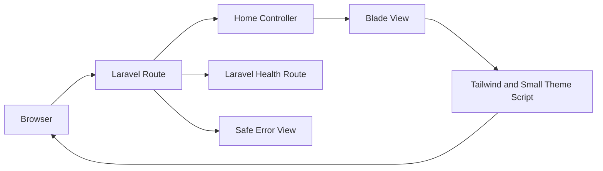
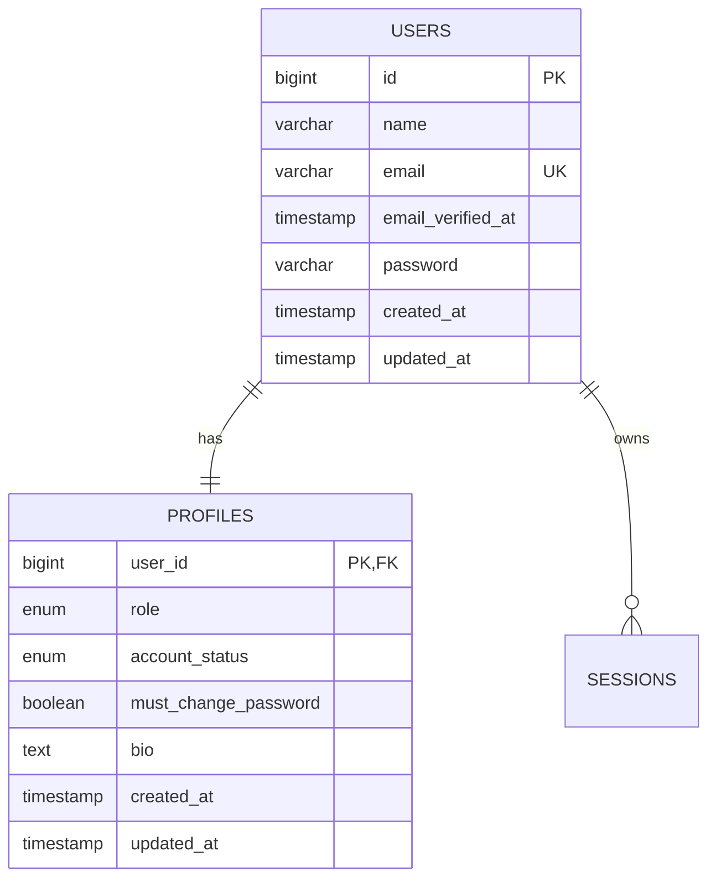
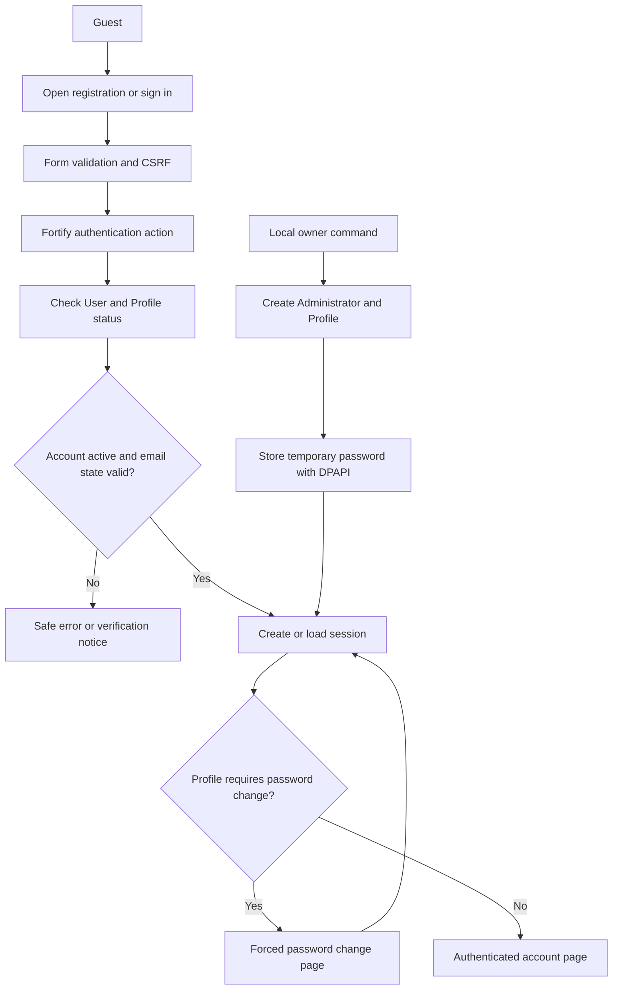
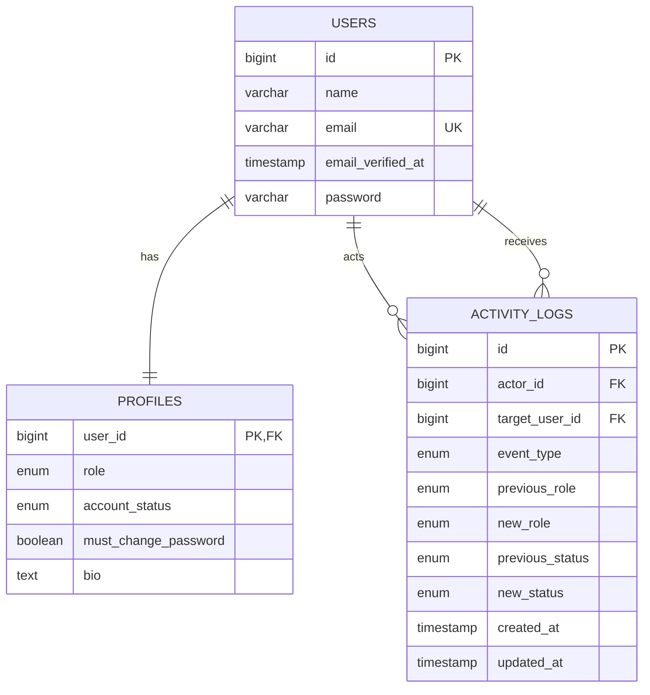
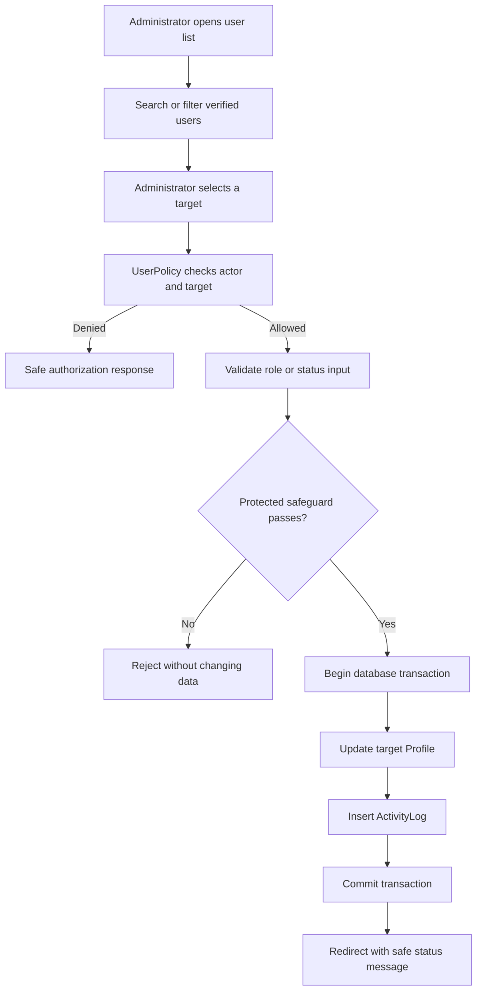
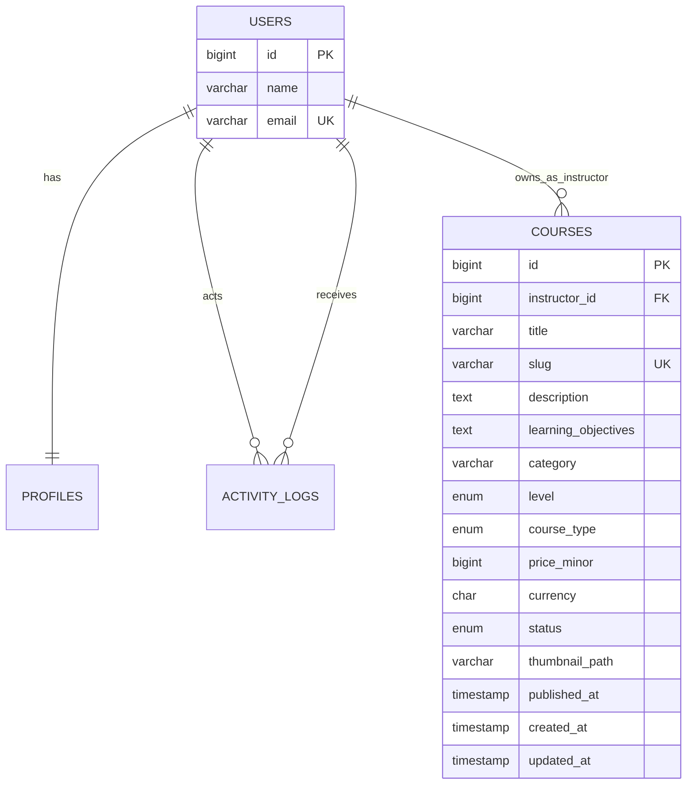
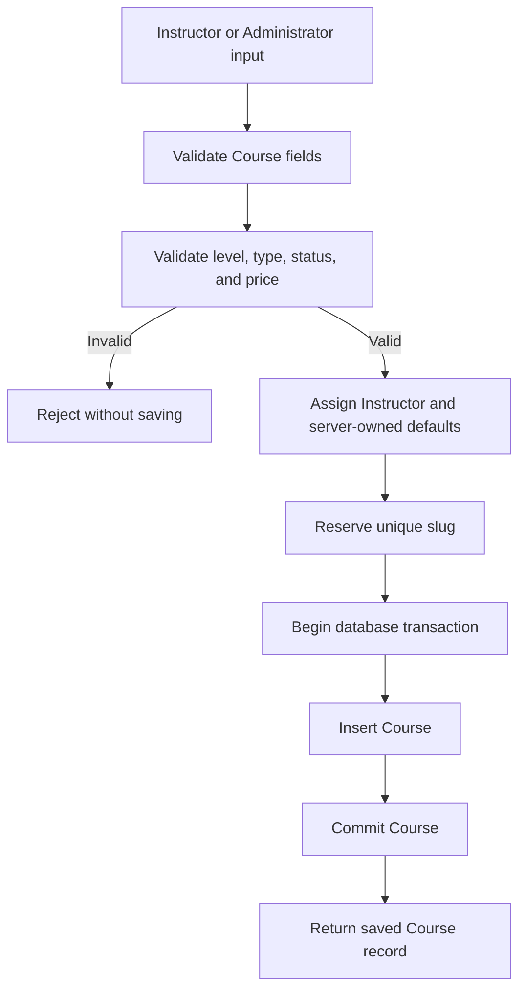
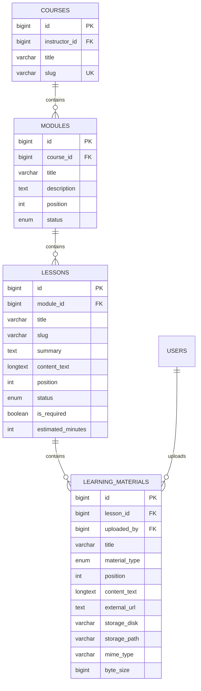
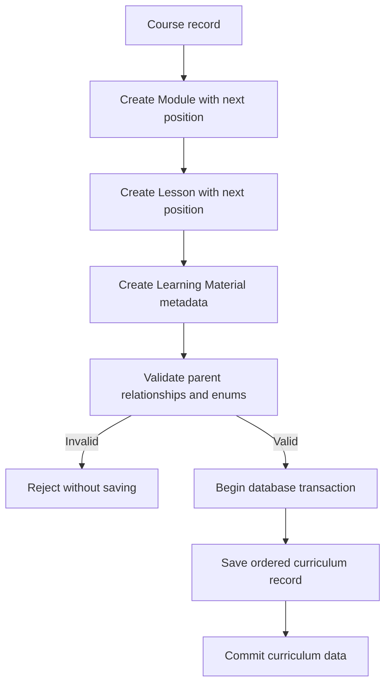

# Development roadmap

## 1. Purpose

This roadmap turns the approved LMS plan into small, testable steps.

Phase 0 is approved. Phase 1 is complete. Phase 2, Phase 3, Phase 4A, Phase 4B, Phase 5A through Phase 5F, Phase 6A, Phase 6B, and Phase 6C are human-approved. Phase 6D lesson progress foundation is implemented and awaiting human schema confirmation.

Do not skip directly to payment processing or dashboard polish.

## 1A. Interface system pass

This is a presentation pass, not a phase. It adds no feature, no route, no
table, and no business rule, so it is recorded here rather than as a phase.

### Why

`docs/design.md` was approved before most of the interface was built, and the
result had drifted from it. Three gaps mattered:

- Section 7 requires one authenticated shell for all three roles. Every
  authenticated page was using the public header, so a Student, an Instructor,
  and an Administrator each navigated by a row of links in a public bar.
- Section 26 recorded that no mark was approved, and the product had no mark in
  any layout. The owner has now supplied one.
- Several pages carried wording that was true when written and false now, most
  visibly the home page claiming quizzes, certificates, and payments were
  unbuilt.

### Scope

- The authenticated shell, its sidebar, its account menu, and the mobile
  drawer, as `design.md` section 7 describes.
- The brand mark, in every approved placement.
- A shared component set, so one token change reaches every page.
- Consistent status wording, money formatting, and page hierarchy across the
  public, Student, Instructor, and Administrator areas.
- Removal of stale copy that contradicts a built feature.

### Explicitly out of scope

- No route, controller, Policy, Action, migration, or dependency change.
- No new feature, no new navigation destination, no new data page.
- No change to authorization, and no reliance on hidden links for protection.

### Input, process, and output

**Input**

- `docs/design.md` as the source of truth for the visual direction
- `FOR_UI/adminator (FOR USER DASHBOARD)` read only, for shell and layout shape
- The source brand artwork in `resources/` as the approved mark
- The existing routes, Policies, and report service as the only data sources

**Process**

- Read every existing view and note the drift against `design.md`
- Build the shell, the components, and the wording helpers
- Restyle the pages without changing a control, a label a test relies on, or a
  value the server owns
- Replace stale copy with what the application actually does
- Format every amount through one class, so minor units are never printed raw

**Output**

- One shell for all three roles, with a sidebar, a header, and an account menu
- The mark in the shell, the header, the footer, authentication, and the
  certificate
- A component library and three wording helpers
- Rewritten page copy, with the home page describing built features
- 639 tests and 2939 assertions passing, plus Pint, both audits, the build,
  the route list, and the cache builds

### Evidence

Recorded in `docs/project-audit.md` under "Interface system pass", including
the eleven defects the pass found and fixed.

## 2. Delivery rules

Every implementation slice must:

1. Solve one approved problem.
2. Keep the application runnable.
3. Add or update tests.
4. Pass the project quality checks.
5. Update the relevant documentation.
6. Avoid unrelated refactoring.
7. Avoid new dependencies without approval.

Use a vertical slice whenever possible.

Example:

```text
Registration → login → Student dashboard
```

A vertical slice proves the full path from browser input to database record and back.

### Required delivery lifecycle

Every feature and phase must follow this cycle:

```text
Data gathering
→ Create or update ERD and flowcharts
→ Develop
→ Build
→ Test
→ Find bugs
→ Fix
→ Test again
```

Required evidence for each cycle:

- Approved requirements and user flow
- Current data relationships
- Updated ERD when database records change
- Updated flowchart when process flow changes
- Passing build
- Test results
- Recorded bugs
- Fix evidence
- Passing retest
- Human review before moving to the next phase

### Input, process, and output review

Document every feature using:

```text
Input → Process → Output
```

**Input**

- Form fields
- Route parameters
- Uploaded files
- Authentication session
- External API data
- Signed webhook data

**Process**

- Validation
- Authentication
- Authorization
- Business rules
- Database transactions
- File authorization
- External service calls
- Audit logging

**Output**

- Rendered page
- Redirect
- Validation message
- Authorized file response
- Safe JSON response
- Webhook acknowledgement
- Database record
- Sanitized activity record

Do not begin development when required input, processing, or output behavior remains unclear.

## 3. Beginner learning path

Complete the relevant lesson before using a framework concept in the LMS.

### PHP review

- Functions and classes
- Arrays and collections
- Namespaces
- Exceptions
- File uploads
- Sessions and cookies
- PDO or MySQL queries
- Composer autoloading

### Laravel foundations

- Artisan commands
- Routing
- Controllers
- Blade layouts and components
- Form Requests
- Validation
- Migrations
- Eloquent models and relationships
- Authentication
- Middleware
- Policies
- Services and Actions
- Filesystem
- Events, Listeners, and Jobs
- Tests
- Deployment

### External integration

- HTTP requests
- JSON
- API authentication
- Webhooks
- Idempotency
- Retry behavior
- Safe logging

## 4. Phase 0: planning foundation

### Status

Approved.

### Deliverables

- Product plan
- Design system
- Laravel architecture
- Folder blueprint
- Technology decision
- Glossary
- Project audit
- Project instructions

### Evidence

- Documentation cross-links resolve
- No unresolved stack decision remains
- V1 exclusions are documented
- `FOR_UI` remains untouched

### Exit condition

The project owner approves the documentation set before application scaffolding.

## 5. Phase 1: Laravel foundation

### Goal

Create a clean Laravel 13 application with no LMS business logic yet.

### Status

Approved. Phase 1 implementation is complete, Phase 2 and Phase 3 are human-approved, and Phase 4A is implemented pending human review.

### Environment preflight

Current status:

- PHP 8.5.8: ready
- Required PHP extensions: ready
- Composer 2.10.3: installed and verified
- Node.js and npm: ready
- MySQL 8.4.11 LTS: installed as `MySQL84-LMS` on port 3307
- `lms` and `lms_test` databases: ready
- LMS database credentials: encrypted with Windows DPAPI
- XAMPP MariaDB: preserved on port 3306 and not used by the LMS

Phase 1 environment readiness: **PASS**.

### Phase 1 data gathering and flow

Approved inputs:

- Product scope in `docs/plan.md`
- Design rules in `docs/design.md`
- Laravel layers and route rules in `docs/architecture.md`
- Target file placement in `docs/folder-structure.md`
- Current Laravel 13 framework skeleton
- Current PHP, Composer, Node.js, npm, and MySQL environment

Phase 1 ERD decision:

- Do not create LMS business tables in Phase 1
- Do not create the `users` or password reset tables before Phase 2 data gathering
- Keep only framework infrastructure tables needed for sessions, cache, and database queues
- Create LMS tables through later vertical slices after their ERD and input, process, and output rules are approved

Phase 1 flow:



Phase 1 input, process, and output:

**Input**

- Public `GET /` request
- Public `GET /up` health request
- Browser HTTP error response
- Light or dark theme preference from browser storage
- Local environment configuration

**Process**

- Laravel routing
- Thin controller coordination
- Blade escaping
- Tailwind compilation
- Theme preference validation
- Safe exception handling
- MySQL connectivity check
- Automated tests and formatting checks

**Output**

- Public foundation page
- Successful health response
- Safe 401, 403, 404, 419, 429, 500, and 503 pages
- Persisted browser theme preference
- Compiled CSS and JavaScript assets
- Passing test and quality results

Phase 1 does not accept Student accounts, course data, enrollment data, Quiz data, certificate data, uploads, or payment input.

### Work

- Scaffold Laravel 13
- Configure `.env.example`
- Configure a dedicated local MySQL database
- Add Blade layout
- Add Tailwind CSS
- Add base light and dark themes
- Add public error pages
- Add health route
- Add formatting and test configuration
- Initialize Git if approved

### Implementation evidence

- Laravel 13.33.0 installed from the reviewed Composer manifest
- PHP Fileinfo enabled after the first dependency check exposed a missing extension
- `php artisan migrate --force` created only framework infrastructure tables
- `php artisan test` passed 7 tests and 26 assertions
- `vendor/bin/pint --test` passed
- `composer audit` passed with no advisories
- `npm audit` passed with no vulnerabilities
- `npm run build` passed
- `php artisan route:list` passed
- Configuration, route, and view caches built successfully
- HTTP smoke checks returned 200 for `/` and `/up` and a safe 404 page
- Theme source, runtime toggle, reload persistence, and WCAG contrast checks passed in Edge headless review
- Cached configuration correctly selected `lms_test` after the test harness fix
- Git repository initialized on the `main` branch with the approved repository-local identity

### Bugs found and fixed

- Composer install could not resolve Flysystem because PHP Fileinfo was not loaded. The PHP CLI configuration was corrected and Composer installation passed.
- The first cached-config test run selected the local `lms` database instead of `lms_test`. The test application now sets the test connection before database traits run, and the suite passed.
- The first Blade layout required a Vite manifest before tests could run. Asset inclusion is now conditional for first-run diagnostics, and a no-build test passed.

### Tests

- Application starts
- Home page renders
- Database connection test passes
- Light and dark theme preference persists
- Theme toggle changes and reload keeps the selected theme
- Mobile layout has no horizontal overflow
- Error pages render safe messages

### Do not add

- Course features
- Payment packages
- Role promotion
- Complex JavaScript
- Production deployment

### Exit condition

A new developer can install dependencies, configure `.env`, run migrations, start Laravel, and run the test suite.

## 6. Phase 2: authentication and profiles

### Goal

Create secure accounts, verified email access, editable own profiles, and one local Administrator owner for **IT Learning Hub**.

### Status

Approved on September 25, 2026. Human review confirmed the Phase 2 authentication and profile slice. Phase 3 and Phase 4A are now implemented; Phase 4A awaits human review.

### Confirmed decisions

- Product display name: `IT Learning Hub`
- Use Laravel Fortify for authentication routes and server flows
- Keep Blade and Tailwind CSS for the interface
- Public registration creates a Student only
- Initial owner: `Jayzee Bautista`
- Initial owner email: `bautista.jayzee@ncst.edu.ph`
- Initial owner role: `administrator`
- Initial owner account is active and verified for the local demo
- Generate a temporary password with a secure random source
- Store the temporary password with Windows DPAPI outside the repository
- Require a password change after the temporary password is used
- Require at least 12 characters and password confirmation
- Public registrations require email verification
- Use Laravel's log mailer for local verification and reset links
- Editable profile fields: display name and bio
- Profile visibility: own profile only
- Avatar upload: later phase
- Role middleware and role management: Phase 3
- PayMongo public test key: local ignored `.env` only
- No PayMongo package, payment table, checkout, or webhook in Phase 2

### Phase 2 data gathering and ERD update

Existing evidence:

- `plan.md` requires Laravel authentication, Student registration, password reset, account status, and safe profile access.
- `architecture.md` defines `users`, `profiles`, registration, session, and email-verification rules.
- `design.md` defines public authentication pages and accessible form states.
- The Phase 1 schema contains framework infrastructure tables only.
- The Phase 2 migrations now add `users`, `password_reset_tokens`, and `profiles` without business tables.

Phase 2 identity ERD:



Schema rules:

- `users.name` is the canonical display name.
- `profiles.user_id` is both the primary key and the foreign key.
- One User has exactly one Profile.
- `role` uses `student`, `instructor`, or `administrator`.
- `account_status` uses `active` or `suspended`.
- `must_change_password` defaults to `false` and is server-owned.
- `bio` is optional and limited to 500 characters.
- `email` changes and avatar uploads are outside Phase 2.
- No Course, Enrollment, Payment, or Progress tables are created in Phase 2.

### Phase 2 process flow



### Phase 2 Input, Process, and Output

**Input**

- Registration name, email, password, and password confirmation
- Login email and password
- Password-reset email
- Reset token and new password
- Email-verification token
- Own display name and bio
- Current password and new password for the forced change
- Local owner name, email, and generated temporary password

**Process**

- CSRF validation
- Fortify validation and authentication
- Password hashing
- User and Profile transaction
- Account-status check
- Email verification check
- Login throttling
- Session regeneration and invalidation
- Server-owned role and password-change flag
- Profile field allow-listing
- DPAPI-protected local secret storage
- Sanitized error responses and logs

**Output**

- Student account and Profile
- Verified or unverified User state
- Safe authenticated session
- Verification or password-reset message in the local log
- Own profile page
- Forced password-change redirect
- Local Administrator account
- No payment access or payment state

### Work

- Review and add the official `laravel/fortify` dependency
- Add `users` and `password_reset_tokens` migrations
- Add the `profiles` migration
- Add `User`, `Profile`, `UserRole`, and `UserAccountStatus` models or enums
- Add Fortify actions for registration, login, reset, and password rules
- Add email verification to the User model
- Add account-status checks to login
- Add the forced-password-change middleware
- Add own-profile view and update Form Request
- Add authentication Blade views
- Add the local owner bootstrap command
- Add local PayMongo public-key configuration without payment behavior
- Add authentication and profile feature tests
- Build, run browser checks, fix bugs, and retest

### Task list and acceptance criteria

- [x] Task 1: Add and verify Fortify
  - Acceptance: Composer manifest and lock file include the approved package; no unrelated package is added.
  - Verify: `composer validate`, `composer audit`, and Fortify route/config inspection.

- [x] Task 2: Add identity schema and models
  - Acceptance: `users`, `password_reset_tokens`, and `profiles` exist with the approved fields and relationships.
  - Verify: focused migration and model tests on `lms_test`.

- [x] Task 3: Add registration, login, logout, reset, and verification
  - Acceptance: Student registration never accepts a role; invalid credentials and suspended accounts fail safely; logout invalidates the session.
  - Verify: auth feature tests and browser smoke flow.

- [x] Task 4: Add forced password change and own profile
  - Acceptance: temporary-password users reach only the password change page; approved name and bio fields update; email and role fields cannot be changed through the profile form.
  - Verify: middleware, authorization, validation, and browser tests.

- [x] Task 5: Add local Administrator bootstrap
  - Acceptance: local command creates the named Administrator, refuses unsafe promotion, stores the generated password with DPAPI, and never logs the secret.
  - Verify: command tests plus a local database inspection.

- [x] Checkpoint: Phase 2 security and UI review
  - [x] Full test suite passes.
  - [x] Build passes.
  - [x] Composer and npm audits pass.
  - [x] Desktop and mobile authentication screens are keyboard usable.
  - [x] Light and dark themes work.
  - [x] Verification and reset links are available through the local log mailer.
  - [x] No payment route or payment behavior exists.

### Phase 2 implementation evidence

- `laravel/fortify` v1.40.0 is installed with passkeys and two-factor authentication disabled.
- `users`, `password_reset_tokens`, and `profiles` migrations run on `lms_test` and local `lms`.
- Student registration creates a User and Profile in one transaction and rejects privileged fields.
- Login blocks invalid credentials and suspended accounts, regenerates the session, and throttles repeated failures.
- Password reset uses a generic response for known and unknown email addresses.
- The local owner command created `Jayzee Bautista` as a verified Administrator with `must_change_password = true`.
- The temporary owner password is stored at the configured external path with Windows DPAPI.
- The automated suite passes 28 tests and 141 assertions.
- Vite build, Composer validation/audit, npm audit, route listing, and cache checks pass.
- Edge headless review at 1440px and 390px confirmed the sign-in layout has no horizontal overflow, 44px submit controls, visible labels, password-manager autocomplete, keyboard focus, and no role input on registration.
- Edge evaluation confirmed the theme toggle changes the document theme and persists `lms-theme` in browser storage.
- A real local Administrator login reached `/account/password` without printing the temporary password.
- Laravel's local log mailer recorded a password-reset link; the temporary reset token was deleted after the check.

Bugs found and fixed during this phase:

- The local owner name needed quoting in `.env`.
- Fortify’s default unknown-email reset response exposed account state, so the project now uses a safe generic response.
- The owner command test initially reused the real local secret path, so the test now uses a unique temporary path outside the repository.
- The password-change middleware initially allowed the page route but not its POST route, so the gate now permits both password-change endpoints.
- Registration normalization initially assumed name and email keys existed, so missing-field validation now returns errors instead of a server error.

### Security tests

- Registration cannot set a role.
- Passwords are hashed and never logged.
- Passwords require 12 characters and confirmation.
- Session regenerates after login.
- Logout invalidates the session and CSRF state.
- Suspended accounts cannot sign in.
- Unverified accounts cannot open verified-only pages.
- One User has one Profile.
- A User cannot edit role, account status, email, or password-change flag through the profile form.
- The forced password gate cannot be bypassed through a hidden link.
- Login attempts are throttled.
- Existing non-Administrator accounts are not silently promoted by the owner command.
- The temporary password is absent from Git, logs, and normal response bodies.

### Do not add

- Role management screens
- Instructor or Administrator promotion UI
- Course or enrollment features
- Payment packages or behavior
- Avatar upload
- Public profile pages
- Two-factor authentication
- Production deployment

### Exit condition

A Student can register, verify access, sign in, view and update an own profile, and sign out. The local Administrator can use the temporary password once, is forced to change it, and then reaches an authenticated account page. No payment workflow exists.

## 7. Phase 3: roles and authorization

### Goal

Protect every role-specific route and resource with server-side role checks, safe Administrator account controls, and auditable role/status changes.

### Status

Human review confirmed the Phase 3 roles, activity-log, Administrator, and authorization slices. Phase 3 is approved. Phase 4A Course foundation is now the active slice.

### Confirmed decisions

- Reuse the existing `UserRole` and `UserAccountStatus` enums
- Keep one role per account: Student, Instructor, or Administrator
- Add Administrator user management with search, filters, and pagination
- Allow direct Administrator role assignment for verified accounts
- Allow account suspension and reactivation
- Reject self-role and self-status changes
- Reject demotion or suspension of the final active Administrator
- Require one database transaction for each account change and ActivityLog record
- Add a read-only `/admin/activity` page with 25 records per page
- Add minimal authorized `/student`, `/instructor`, and `/admin` pages
- Redirect users to the landing page for their current role after login or forced password change
- Block suspended sessions on the next request and require sign-in after reactivation
- Do not add deletion, archive, bulk actions, IP addresses, user-agent data, or multi-role accounts

### Phase 3 data gathering and ERD update

Existing evidence:

- `plan.md` requires protected role assignment, suspension/reactivation, and role-change audit records.
- `architecture.md` defines role middleware, Policies, and an Administration domain.
- `profiles.role` and `profiles.account_status` already exist from Phase 2.
- No ActivityLog table exists in the current schema.
- No role-specific routes or policies exist yet.

Phase 3 identity and audit ERD:



Schema rules:

- `activity_logs.actor_id` references the acting User.
- `activity_logs.target_user_id` references the changed User.
- `event_type` uses `role_changed` or `account_status_changed`.
- Role fields are populated for role events and null for status events.
- Status fields are populated for status events and null for role events.
- ActivityLog rows are read-only after creation in Phase 3.
- Foreign keys prevent deleting Users referenced by an activity record.
- The Profile update and ActivityLog insert use one transaction.

### Phase 3 process flow



### Phase 3 Input, Process, and Output

**Input**

- Administrator session
- Search text
- Role filter
- Account-status filter
- Target User ID
- New role or account status
- Target current role and status
- Current active Administrator count

**Process**

- Authenticate the actor
- Verify the actor's email and active account
- Run `UserPolicy`
- Reject self-target changes
- Reject unverified role-change targets
- Reject invalid enum values
- Reject last-Administrator demotion or suspension
- Update the Profile on the server
- Insert a sanitized ActivityLog record
- Commit both records together
- Redirect to a role-based landing page
- End or block suspended sessions

**Output**

- Protected Student, Instructor, or Administrator landing page
- Searchable Administrator user list
- Updated Profile role or account status
- Auditable role/status ActivityLog record
- Safe success or authorization message
- No deletion, bulk action, or fabricated business data

### Work

- Reuse existing UserRole and UserAccountStatus enums
- Add ActivityLog migration and model
- Add AssignUserRole and UpdateAccountStatus Actions
- Add UserPolicy
- Add EnsureUserHasRole and EnsureAccountIsActive middleware
- Add role-based login/password-change redirects
- Add minimal Student, Instructor, and Administrator pages
- Add Administrator user list, search, filters, and pagination
- Add protected role and status mutation routes
- Add read-only Administrator activity page
- Add authorization, transaction, and browser tests

### Task list and acceptance criteria

- [x] Task 1: Update Phase 3 data and authorization contracts
  - Acceptance: ERD, flow, route rules, policy rules, and Input/Process/Output match the approved specification.
  - Verify: documentation review and `git diff --check`.

- [x] Task 2: Add activity-log schema and model
  - Acceptance: `activity_logs` stores actor, target, event type, previous/new role or status, and timestamps. No secrets or request metadata are stored.
  - Verify: migration, model, relationship, and constraint tests.

- [x] Task 3: Add role and status Actions
  - Acceptance: only an Administrator can change another verified user's role or status; self and last-admin changes fail; Profile and ActivityLog save atomically.
  - Verify: focused Action tests on `lms_test`.

- [x] Task 4: Add middleware, Policies, and role redirects
  - Acceptance: role and active-account middleware protect routes; policies repeat authorization; login and password change redirect by role.
  - Verify: role matrix and session tests.

- [x] Task 5: Add Administrator user management and activity UI
  - Acceptance: searchable/filterable/paginated user list and read-only activity page work on desktop and mobile.
  - Verify: feature tests, build, and browser review.

- [x] Task 6: Add minimal role landing pages
  - Acceptance: each role sees only its authorized page and no fake courses, payments, or progress data.
  - Verify: role matrix, view, accessibility, and responsive checks.

- [x] Checkpoint: Phase 3 strict security gate
  - [x] Full test suite passes.
  - [x] Build passes.
  - [x] Composer and npm audits pass.
  - [x] Role matrix tests pass.
  - [x] Policy and self/last-admin tests pass.
  - [x] ActivityLog transaction tests pass.
  - [x] Desktop and mobile admin pages are usable.
  - [x] Human approval is recorded before Phase 4A.

### Phase 3 implementation evidence

- ActivityLog migration, model, relationships, and read-only page are implemented.
- Role/status Actions enforce active Administrator authorization, verified role targets, self-change protection, and last-Administrator safeguards.
- Role and account-status updates use one database transaction.
- Role and active-account middleware protect all Phase 3 routes.
- Login and forced-password-change redirects use the current role.
- Administrator user search, filters, role forms, status forms, and activity records are implemented.
- Student, Instructor, and Administrator landing pages contain no fabricated business data.
- The automated suite passes 41 tests and 195 assertions, including role matrix, policy, transaction, and activity-page tests.
- Edge fallback review at 390px found the wide Administrator table caused page-level horizontal overflow; the user list now uses stacked mobile cards and passes the mobile width check.
- Final Edge review confirmed role-based login redirect to `/admin`, desktop table layout, mobile card layout, 44px visible controls, no page-level overflow, and no password field on the activity page.

### Security tests

- Student cannot open Instructor or Administrator routes.
- Instructor cannot open Administrator routes.
- Administrator can open only Administrator routes.
- A Student cannot change any role or status.
- An Administrator cannot change their own role or status.
- A role change requires a verified target email.
- The final active Administrator cannot be demoted or suspended.
- Suspended users cannot authenticate or continue an existing session.
- Reactivation creates an activity record and allows later sign-in.
- Role/status update and ActivityLog record succeed or fail together.
- ActivityLog page contains no password, token, IP, or user-agent data.
- Blade visibility cannot bypass server authorization.

### Do not add

- Instructor applications or invitations
- Multi-role accounts
- Hard deletion or archive states
- Bulk role/status actions
- Course management
- Enrollment, quizzes, or certificates
- Payment behavior
- Production deployment

### Exit condition

An Administrator can search users, assign an approved role, suspend or reactivate an account, and review a read-only activity record. Every protected role and account action is enforced on the server and covered by tests. Phase 3 is human-approved.

## 8. Phase 4A: Course foundation

### Goal

Create the approved Course data foundation before building catalog, curriculum, enrollment, or payment behavior.

### Status

Approved on September 25, 2026. Human review approved the Course ERD, constraints, migration, model, factory, and automated tests. Phase 4B is now the active slice.

### Confirmed decisions

- Reuse the existing User identity for Course ownership
- Add `CourseLevel`, `CourseType`, and `CourseStatus` enums
- Add only the `courses` table in this slice
- Default level to `beginner`
- Default Course type to `free`
- Default price to zero minor units
- Default currency to `PHP`
- Default status to `draft`
- Keep `published_at` nullable
- Keep `thumbnail_path` nullable and protected
- Generate slugs server-side in a later Course action
- Do not add catalog, curriculum, enrollment, payment, upload, or seeder behavior

### Phase 4A ERD update



### Phase 4A process flow



### Phase 4A Input, Process, and Output

**Input**

- Instructor User ID
- Course title
- Description
- Learning objectives
- Category
- Level
- Course type
- Price in minor units
- Currency

**Process**

- Validate the Instructor relationship
- Validate approved enum values
- Validate price and Course type together
- Apply server-owned defaults
- Reserve a unique slug
- Save the Course in a database transaction

**Output**

- Valid Course record
- Instructor relationship
- Safe draft/free defaults
- Database constraints and indexes
- No public catalog access
- No enrollment, payment, curriculum, or upload record

### Work

- Add CourseLevel, CourseType, and CourseStatus enums
- Add the courses migration with foreign key, checks, and indexes
- Add the Course model with guarded server-owned fields
- Add User ownership relationship
- Add Course factory
- Add Course foundation tests

### Task list and acceptance criteria

- [x] Task 1: Update Phase 4A data and flow contracts
  - Acceptance: plan, architecture, roadmap, design, folder structure, and audit describe the approved Course slice.
  - Verify: documentation review and `git diff --check`.

- [x] Task 2: Add failing Course schema tests
  - Acceptance: tests describe columns, indexes, foreign keys, enum values, defaults, price rules, and slug uniqueness.
  - Verify: tests fail before the migration exists.

- [x] Task 3: Add Course enums, migration, and model
  - Acceptance: a clean database migrates and creates valid Course records; invalid records are rejected by database constraints.
  - Verify: focused migration and model tests.

- [x] Task 4: Add Course factory and relationship tests
  - Acceptance: the factory creates a valid Course owned by an Instructor; the User relationship resolves correctly.
  - Verify: focused factory and relationship tests.

- [x] Task 5: Run the Phase 4A quality gate
  - Acceptance: full tests, Pint, PHP syntax, build, audits, route checks, and clean local migration pass.
  - Verify: recorded evidence in `docs/project-audit.md`.

### Phase 4A implementation evidence

- Added the `courses` migration with Instructor foreign key, unique slug, catalog indexes, enum columns, PHP currency check, and free/paid price check.
- Added `CourseLevel`, `CourseType`, and `CourseStatus` enums with model casts.
- Added the `Course` model with an Instructor relationship and guarded server-owned fields.
- Added `UserFactory::instructor()` and `CourseFactory` for valid test data.
- Added Phase 4A tests for columns, indexes, constraints, defaults, relationships, mass-assignment protection, and route boundaries.
- The full suite passes 55 tests and 235 assertions.
- Pint, PHP syntax checks, Vite build, Composer validation/audit, npm audit, and local migration all pass.
- No Course UI, curriculum, enrollment, payment, upload, or sample seeder behavior was added.

### Phase 4A security tests

- A Course cannot reference a missing Instructor User.
- A Course slug cannot be duplicated.
- Invalid level, Course type, status, or currency values are rejected.
- A free Course cannot have a positive price.
- A paid Course cannot have a zero price.
- Server-owned fields are not mass-assignable from a normal request.
- No public course route exists before the catalog phase.
- No payment, enrollment, curriculum, or upload record is created.

### Do not add

- Public catalog or course detail pages
- Instructor course forms
- Slug generation action
- Module, Lesson, or LearningMaterial tables
- Enrollment or payment tables
- Course seeders with sample content
- Thumbnail upload behavior
- PayMongo behavior

### Exit condition

A clean test database can migrate from zero and create valid Course records through the model and factory. No catalog, curriculum, enrollment, payment, or upload behavior has started.

### Phase 4A checkpoint

- [x] Human review confirms the Course foundation slice
- [x] Phase 4B may begin

## 9. Phase 4B: curriculum and material foundation

### Goal

Create the ordered Course outline and Learning Material metadata before curriculum routes, uploads, enrollment, or payment behavior.

### Status

Approved on September 26, 2026. Module, Lesson, and Learning Material metadata are implemented and awaiting human review.

### Confirmed decisions

- Reuse the existing Course and User identities
- Add `ContentStatus` for Module and Lesson status
- Add `LearningMaterialType` for material metadata
- Add only `modules`, `lessons`, and `learning_materials` tables
- Module and Lesson positions are positive and unique within their parent
- Lesson slugs are unique within their Module
- Material positions are positive and unique within their Lesson
- Module and Lesson status defaults to `draft`
- Lessons are required by default
- Estimated minutes are nullable but positive
- Storage metadata is server-owned
- No curriculum route, upload handler, private download, URL allowlist, enrollment, payment, or sample seeder

### Phase 4B ERD update



### Phase 4B process flow



### Phase 4B Input, Process, and Output

**Input**

- Parent Course, Module, or Lesson ID
- Title and safe description or summary fields
- Ordered position
- Content status
- Lesson required flag
- Estimated minutes
- Material type and safe metadata

**Process**

- Validate the parent relationship
- Validate approved status and material type values
- Validate positive ordering and duration values
- Enforce parent-scoped uniqueness
- Apply safe defaults
- Save metadata in a database transaction
- Do not accept or serve files in this phase

**Output**

- Ordered Module, Lesson, and Learning Material records
- Course → Module → Lesson → Material relationships
- No public curriculum route
- No upload or private download behavior
- No enrollment or payment record

### Work

- Add ContentStatus and LearningMaterialType enums
- Add the modules migration with ordering constraints and indexes
- Add the lessons migration with parent-scoped slug and ordering constraints
- Add the learning_materials migration with metadata and storage constraints
- Add Module, Lesson, and LearningMaterial models
- Add Course, User, and curriculum relationships
- Add Module, Lesson, and LearningMaterial factories
- Add curriculum foundation tests

### Task list and acceptance criteria

- [x] Task 1: Update Phase 4B data and flow contracts
  - Acceptance: plan, architecture, roadmap, design, folder structure, and audit describe the approved curriculum slice.
  - Verify: documentation review and `git diff --check`.

- [x] Task 2: Add failing Module and Lesson schema tests
  - Acceptance: tests describe columns, indexes, foreign keys, defaults, ordering, slug, and status rules.
  - Verify: tests fail before the migrations exist.

- [x] Task 3: Add Module and Lesson enums, migrations, and models
  - Acceptance: a clean database migrates and creates valid ordered Module and Lesson records; invalid records are rejected.
  - Verify: focused migration and model tests.

- [x] Task 4: Add Module and Lesson factories and relationships
  - Acceptance: factories create valid parent-scoped records; Course → Module → Lesson relationships resolve correctly.
  - Verify: focused factory and relationship tests.

- [x] Task 5: Add failing Learning Material tests
  - Acceptance: tests describe metadata columns, foreign keys, material types, positions, storage paths, and server-owned fields.
  - Verify: tests fail before the migration exists.

- [x] Task 6: Add Learning Material migration, model, and factory
  - Acceptance: valid metadata records save; invalid types, positions, and relationships fail safely.
  - Verify: focused migration and model tests.

- [x] Task 7: Run the Phase 4B quality gate
  - Acceptance: full tests, Pint, PHP syntax, build, audits, route checks, and clean local migration pass.
  - Verify: recorded evidence in `docs/project-audit.md`.

### Phase 4B increment 1 evidence

- Added `ContentStatus` and the Module and Lesson migrations.
- Enforced positive, parent-scoped positions and Lesson slug uniqueness.
- Added Module and Lesson models with Course → Module → Lesson relationships.
- Added Module and Lesson factories with safe draft defaults.
- Added server-owned field mass-assignment tests.
- The full suite passes 70 tests and 279 assertions.
- Pint, PHP syntax checks, and local migrations pass.
- No curriculum routes, uploads, Learning Materials, enrollment, or payment behavior has started.

### Phase 4B increment 2 evidence

- Added `LearningMaterialType` and the Learning Material migration.
- Enforced positive, Lesson-scoped positions and storage-path uniqueness within a disk.
- Added the `LearningMaterial` model with Lesson and uploader relationships.
- Added `LearningMaterialFactory` with safe text-material defaults.
- Added server-owned storage and ordering field tests.
- The full suite passes 80 tests and 308 assertions.
- Pint, PHP syntax checks, Vite build, Composer validation/audit, npm audit, caches, and local migrations pass.
- No upload handler, private download route, external URL fetching, enrollment, or payment behavior was added.

### Phase 4B security tests

- A Module cannot reference a missing Course.
- A Lesson cannot reference a missing Module.
- A Learning Material cannot reference a missing Lesson or User.
- Module and Lesson positions are positive and parent-scoped unique.
- Lesson slugs are unique within a Module.
- Material positions are positive and unique within a Lesson.
- Invalid status and material type values are rejected.
- Estimated minutes cannot be zero or negative.
- Server-owned fields are not mass-assignable from a normal request.
- No curriculum route or upload handler exists in Phase 4B.
- No file path is treated as public access.
- No enrollment or payment record is created.

### Do not add

- Curriculum routes or Blade pages
- Module, Lesson, or Material create/edit actions
- Reordering actions
- File uploads or Storage disks
- Private material download routes
- External URL validation or fetching
- Enrollment, progress, quizzes, certificates, or payments
- Sample curriculum seeders

### Exit condition

A clean test database can migrate from zero and create valid Module, Lesson, and Learning Material metadata through models and factories. No curriculum UI, upload, enrollment, or payment behavior has started.

### Phase 4B checkpoint

- [x] Module, Lesson, and Learning Material foundations pass automated checks
- [x] Human review confirms the Phase 4B curriculum and material metadata slice

## 10. Phase 4C: enrollment and progress foundation

Superseded. The enrollment table is now Phase 6A, and progress records belong to the lesson access phase.

## 11. Phase 5A: Instructor Course Outline UI

### Goal

Create the first browser-reviewable Instructor Course screens without adding public catalog, enrollment, payment, or upload behavior.

### Status

Human review approved the Phase 5A Instructor Course Outline UI. Phase 5B curriculum authoring is now the active slice.

### Confirmed scope

- Instructor Course list
- Create Course form
- Read-only owned Course outline
- Course status, level, type, and PHP price display
- Module, Lesson, and Learning Material metadata display
- Clear empty states
- Active Instructor and ownership checks
- No public catalog, enrollment, payment, upload, or curriculum mutation

### Input, Process, and Output

**Input**

- Active Instructor session
- Course title, description, objectives, category, level, type, and integer minor-unit price

**Process**

- Run CoursePolicy authorization
- Validate approved fields and reject privileged fields
- Validate free/paid price consistency
- Generate a unique server-side slug
- Create a private draft Course in one transaction
- Redirect to the owned Course outline

**Output**

- Owned Course list
- Private draft Course
- Read-only Course outline with Module, Lesson, and Material metadata
- No public access, enrollment, payment, upload, or curriculum mutation

### Task list

- [x] Task 1: Update Phase 5A requirements, routes, policy, flow, and design documents
- [x] Task 2: Add failing CoursePolicy and Course page tests
- [x] Task 3: Add CreateCourse Form Request and Action
- [x] Task 4: Add Instructor Course controllers and routes
- [x] Task 5: Add accessible Course list, create, and outline Blade views
- [x] Task 6: Run browser, test, build, audit, and security gates

### Phase 5A security tests

- A Student cannot open Instructor Course routes.
- An Instructor cannot open another Instructor's Course.
- A suspended Instructor cannot open Course routes.
- Privileged Course fields are rejected or ignored.
- Slugs are generated and unique on the server.
- New Courses are private drafts.
- No public Course route exists.
- No payment, enrollment, upload, or download route exists.

### Phase 5A implementation evidence

- Added CoursePolicy, CreateCourseRequest, CreateCourse action, Instructor Course controller, routes, and views.
- Added owned Course list, create form, and read-only outline pages.
- New Courses are private drafts with server-generated unique slugs.
- Privileged fields are prohibited and ownership is enforced on the server.
- Added 93 automated tests with 359 assertions.
- Pint, PHP syntax checks, Vite build, Composer validation/audit, npm audit, caches, and local migrations pass.
- Edge browser review passed at desktop and 390px: no page overflow, visible controls are 44px, course creation works, mobile cards display correctly, and no upload/public/payment controls appear.
- No public catalog, enrollment, payment, upload, download, or curriculum authoring behavior was added.

### Phase 5A checkpoint

- [x] Automated tests, build, audits, and browser review pass
- [ ] Human review confirms the Instructor Course Outline UI

## 12. Phase 5B: Instructor curriculum authoring

### Goal

Let an Instructor add ordered Module and Lesson records to an owned Course from the existing outline page.

### Status

Approved on September 26, 2026. Module and Lesson authoring is implemented, tested, and human-approved.

### Confirmed scope

- Add Module to an owned Course
- Add Lesson to an owned Module
- Server assigns parent IDs, positions, status, and Lesson slug
- Draft content only
- Ownership checks on every mutation
- No public catalog, enrollment, payment, upload, or material download

### Input, Process, and Output

**Input**

- Owned Course or Module ID
- Module title and description
- Lesson title, summary, content, required flag, and estimated minutes

**Process**

- Run the relevant resource Policy
- Validate the Form Request
- Reject privileged position, status, and parent fields
- Assign the next position inside the server transaction
- Generate a unique Lesson slug inside the Module
- Save a draft Module or Lesson
- Redirect to the owned Course outline

**Output**

- Ordered Module and Lesson records
- Updated read-only outline page
- No public content access
- No file or payment behavior

### Task list

- [x] Task 1: Update Phase 5B requirements, routes, policies, and flow
- [x] Task 2: Add failing Module and Lesson authoring tests
- [x] Task 3: Add Module and Lesson Form Requests and Actions
- [x] Task 4: Add Policies, routes, and controller mutations
- [x] Task 5: Add accessible outline authoring forms
- [x] Task 6: Run test, build, and security gates
- [ ] Task 7: Human browser review of Module and Lesson authoring

### Phase 5B implementation evidence

- `app/Http/Requests/Courses/CreateModuleRequest.php`
- `app/Http/Requests/Courses/CreateLessonRequest.php`
- `app/Actions/Courses/Curriculum/CreateModule.php`
- `app/Actions/Courses/Curriculum/CreateLesson.php`
- `app/Policies/ModulePolicy.php`
- `app/Policies/LessonPolicy.php`
- `app/Http/Controllers/Instructor/CurriculumController.php`
- `resources/views/instructor/courses/show.blade.php`
- `tests/Feature/Phase5B/CurriculumAuthoringTest.php`

### Phase 5B automated evidence

- `php artisan test` passes with 104 tests and 406 assertions
- `./vendor/bin/pint --test` passes on 113 files
- `npm run build` succeeds
- `composer validate` and `composer audit` pass
- `npm audit` reports 0 vulnerabilities
- Route, config, and view cache checks pass
- No database migration was needed for Phase 5B

### Phase 5B security notes

- Parent IDs, positions, status, and Lesson slugs are prohibited in the request
- Module position and Lesson position are assigned inside a database transaction
- Lesson slugs are generated by the server and made unique inside the Module
- `abort_unless` stops a Module that belongs to another Course
- Policy checks run in the controller and again inside each Action
- A failed form keeps the typed text and reopens the same form

### Phase 5B security tests

- An Instructor can add content only to an owned Course or Module.
- Students and other Instructors cannot add content.
- Parents, positions, status, and slugs are server-owned.
- Duplicate Lesson slugs inside one Module are rejected.
- Draft content is not public.
- No upload, download, payment, or enrollment route exists.

### Phase 5B checkpoint

Human review approved Module and Lesson authoring on September 26, 2026.

## 13. Phase 5C: Instructor content editing

### Goal

Let an Instructor correct an owned Course, Module, or Lesson after it is created.

### Status

Approved on September 26, 2026. Editing is implemented and passes 120 tests. Human browser review is the open checkpoint.

### Confirmed scope

- Edit Course title, description, learning objectives, category, level, type, and price
- Edit Module title and description
- Edit Lesson title, summary, content, required state, and estimated minutes
- Keep owner, parent, position, status, currency, and slugs server-owned
- Ownership checks on every edit page and every update
- No delete, archive, reorder, publish, upload, enrollment, or payment behavior

### Explicitly not included

Delete is not part of this phase. Hard delete can remove student progress, grades, and payment links that do not exist yet. A later phase will use status-based archiving instead of row deletion.

### Input, Process, and Output

**Input**

- Owned Course, Module, or Lesson ID
- Course title, description, learning objectives, category, level, type, and price
- Module title and description
- Lesson title, summary, content, required state, and estimated minutes

**Process**

- Run CoursePolicy, ModulePolicy, or LessonPolicy
- Validate the Form Request
- Reject owner, parent, position, status, currency, and slug fields
- Re-check the free and paid price rules
- Save only the editable fields
- Keep the existing slug so links stay stable
- Redirect to the owned Course outline

**Output**

- Corrected Course, Module, or Lesson records
- Updated owned Course outline
- Unchanged owner, order, status, and slugs
- No delete, public, upload, enrollment, or payment behavior

### Task list

- [x] Task 1: Update Phase 5C requirements, routes, policies, and flow
- [x] Task 2: Add failing Course, Module, and Lesson editing tests
- [x] Task 3: Add Update Form Requests and Actions
- [x] Task 4: Add controller edit and update methods with routes
- [x] Task 5: Add accessible edit forms and outline edit links
- [x] Task 6: Run test, build, and security gates
- [ ] Task 7: Human browser review of editing

### Phase 5C implementation evidence

- `app/Support/CoursePrice.php`
- `app/Http/Requests/Courses/UpdateCourseRequest.php`
- `app/Http/Requests/Courses/UpdateModuleRequest.php`
- `app/Http/Requests/Courses/UpdateLessonRequest.php`
- `app/Actions/Courses/UpdateCourse.php`
- `app/Actions/Courses/Curriculum/UpdateModule.php`
- `app/Actions/Courses/Curriculum/UpdateLesson.php`
- `app/Http/Controllers/Instructor/CourseController.php`
- `app/Http/Controllers/Instructor/CurriculumController.php`
- `resources/views/instructor/courses/edit.blade.php`
- `resources/views/instructor/courses/modules/edit.blade.php`
- `resources/views/instructor/courses/lessons/edit.blade.php`
- `tests/Feature/Phase5C/ContentEditingTest.php`

### Phase 5C automated evidence

- `php artisan test` passes with 120 tests and 499 assertions
- `./vendor/bin/pint --test` passes on 121 files
- `npm run build` succeeds
- `composer validate`, `composer audit`, and `npm audit` pass
- Route, config, and view cache checks pass
- No database migration was needed for Phase 5C

### Phase 5C security notes

- Owner, parent, position, status, currency, publication time, thumbnail, and slug fields are prohibited
- `CoursePrice` keeps the free and paid price rules identical for create and update
- Update Actions re-check authorization and only fill editable fields
- `abort_unless` stops a Module from another Course and a Lesson from another Module
- Edit pages and update routes both run Policies
- A Course or Lesson slug never changes on edit

### Phase 5C security tests

- An Instructor can edit only owned content.
- Students and other Instructors receive `403`.
- Owner, parent, position, status, currency, and slug fields are rejected.
- A Course slug does not change when the title changes.
- Free and paid price rules still apply on update.
- No delete, upload, download, payment, or enrollment route exists.

### Phase 5C checkpoint

Human review approved Course, Module, and Lesson editing on September 26, 2026.

### Phase 5D status

Phase 5C content editing is human-approved.

## 14. Phase 5D: Learning Material metadata authoring

### Goal

Let an Instructor add and edit Learning Material records on an owned Lesson without any file upload.

### Status

Approved on September 26, 2026. Material metadata authoring is implemented, tested, and human-approved.

### Confirmed scope

- Add text, code, video link, and external link materials to an owned Lesson
- Edit those same material fields
- Server-owned parent, uploader, position, and storage metadata
- Reject file types and any upload field in this phase
- Link materials must carry a valid link
- Text and code materials must carry their content
- No upload, download, delete, archive, publish, enrollment, or payment behavior

### Explicitly not included

- No file upload for image, PDF, or document materials
- No upload form, no file field, and no download route
- Storage disk, path, MIME type, and byte size stay server-owned and empty

### Input, Process, and Output

**Input**

- Owned Lesson ID
- Material title
- Material type: `text`, `code`, `video_link`, or `external_link`
- Material content text for `text` and `code`
- Material link for `video_link` and `external_link`

**Process**

- Run LearningMaterialPolicy against the Lesson owner
- Validate the Form Request
- Reject `lesson_id`, `uploaded_by`, `position`, `storage_disk`, `storage_path`, `mime_type`, `byte_size`, and any `file` input
- Reject image, PDF, and document types with a clear message
- Require content for text and code materials
- Require a valid link for video link and external link materials
- Assign the next position inside the Lesson and record the acting Instructor as uploader
- Save inside a database transaction
- Redirect to the owned Course outline

**Output**

- Ordered Learning Material metadata
- Updated owned Course outline
- Empty storage metadata
- No public content, upload, download, delete, enrollment, or payment behavior

### Task list

- [x] Task 1: Update Phase 5D requirements, routes, policies, and flow
- [x] Task 2: Add failing Learning Material authoring tests
- [x] Task 3: Add Learning Material Form Requests and Actions
- [x] Task 4: Add LearningMaterialPolicy, routes, and controller methods
- [x] Task 5: Add accessible material forms and outline edit links
- [x] Task 6: Run test, build, and security gates
- [ ] Task 7: Human browser review of material authoring

### Phase 5D implementation evidence

- `app/Policies/LearningMaterialPolicy.php`
- `app/Http/Requests/Courses/CreateLearningMaterialRequest.php`
- `app/Http/Requests/Courses/UpdateLearningMaterialRequest.php`
- `app/Actions/Courses/Curriculum/CreateLearningMaterial.php`
- `app/Actions/Courses/Curriculum/UpdateLearningMaterial.php`
- `app/Http/Controllers/Instructor/CurriculumController.php`
- `app/Providers/AppServiceProvider.php`
- `resources/views/instructor/courses/materials/edit.blade.php`
- `resources/views/instructor/courses/show.blade.php`
- `tests/Feature/Phase5D/LearningMaterialAuthoringTest.php`

### Phase 5D automated evidence

- `php artisan test` passes with 136 tests and 574 assertions
- `./vendor/bin/pint --test` passes on 127 files
- `npm run build` succeeds
- `composer validate`, `composer audit`, and `npm audit` pass
- Route, config, and view cache checks pass
- No database migration was needed for Phase 5D

### Phase 5D security notes

- `lesson_id`, `uploaded_by`, `position`, `storage_disk`, `storage_path`, `mime_type`, `byte_size`, and `file` are prohibited
- Image, PDF, and document types are rejected with a clear message because uploads are not built
- Link materials must carry a valid `http` or `https` link
- Text and code materials must carry their content
- Position and uploader are assigned by the server inside a database transaction
- Storage metadata stays empty and is never accepted from a request
- `lessonBelongsToCourse` and a Lesson ownership check stop cross-lesson and cross-course edits
- Earlier Phase 4B and Phase 5B guards were updated to check the new upload route name instead of the now-approved material store route
- Human review fixed the material row label from `Position 1` to `Material 1` so it matches Module and Lesson wording

### Phase 5D security tests

### Phase 5D checkpoint

Human review approved Learning Material metadata authoring on September 26, 2026.

## 15. Phase 5E: Course publishing

### Goal

Let an Instructor publish and unpublish an owned Course so the public catalog has real content in a later phase.

### Status

Approved on September 26, 2026. Publishing is implemented, tested, and human-approved.

### Confirmed scope

- Publish and unpublish actions on an owned Course
- `draft` to `published` and `published` to `draft` transitions only
- Publishing requires at least one Module and at least one Lesson
- Publishing also moves owned Module and Lesson content to `published`
- Unpublishing returns that content to `draft` and keeps the first publish time
- `published_at` is set by the server on publish and never accepted from a request
- Publish and unpublish controls on the Course list and outline
- No archive, delete, reorder, upload, download, catalog, enrollment, or payment behavior

### Explicitly not included

- The `archived` state stays unused. Archiving is a later approved phase.
- No price lock on publish. That rule belongs to the enrollment phase.
- No public catalog page yet. That is Phase 5F.

### Input, Process, and Output

**Input**

- Owned Course ID
- No other field. A publish request carries no trusted data.

**Process**

- Run CoursePolicy publish or unpublish ownership checks
- Reject the action when the Course is not in the required starting state
- Reject publish when the Course has no Module or no Lesson
- Update the Course status inside a database transaction
- Set `published_at` on the server when publishing
- Move owned Module and Lesson content to the matching status in the same transaction
- Redirect to the owned Course outline

**Output**

- A published or draft Course with matching content status
- A server-owned `published_at` value
- No public page, enrollment, payment, upload, or delete behavior

### Task list

- [x] Task 1: Update Phase 5E requirements, routes, policies, and flow
- [x] Task 2: Add failing publish and unpublish tests
- [x] Task 3: Add PublishCourse and UnpublishCourse Actions
- [x] Task 4: Add CoursePolicy abilities, routes, and controller methods
- [x] Task 5: Add publish and unpublish controls to the list and outline
- [x] Task 6: Run test, build, and security gates
- [ ] Task 7: Human browser review of publishing

### Phase 5E implementation evidence

- `app/Actions/Courses/PublishCourse.php`
- `app/Actions/Courses/UnpublishCourse.php`
- `app/Policies/CoursePolicy.php`
- `app/Http/Controllers/Instructor/CourseController.php`
- `app/Models/Course.php`
- `resources/views/instructor/courses/show.blade.php`
- `resources/views/instructor/courses/index.blade.php`
- `tests/Feature/Phase5E/CoursePublishingTest.php`

### Phase 5E automated evidence

- `php artisan test` passes with 149 tests and 633 assertions
- `./vendor/bin/pint --test` passes on 130 files
- `npm run build` succeeds
- `composer validate`, `composer audit`, and `npm audit` pass
- Route, config, and view cache checks pass
- No database migration was needed for Phase 5E

### Phase 5E security notes

- A publish request carries no trusted body fields
- `status` and `published_at` are only written by the Actions
- Only a `draft` Course can be published, and only a `published` Course can be unpublished
- Publishing requires at least one Module and at least one Lesson
- Course, Module, and Lesson status changes run in one database transaction
- Unpublish keeps `published_at` for audit and never deletes content
- `CoursePolicy` `publish` and `unpublish` require active Instructor ownership
- The Phase 5C guard was updated to block the future archive route instead of the now-approved publish route

### Phase 5E security tests

- An Instructor can publish and unpublish only an owned Course.
- Students, other Instructors, and suspended accounts are blocked.
- A Course with no Module or no Lesson cannot be published.
- A published Course cannot be published again, and a draft Course cannot be unpublished.
- Injected `status`, `published_at`, or `instructor_id` values are ignored.
- No archive, delete, catalog, enrollment, payment, or upload route exists.

## 16. Phase 5F: course catalog

### Goal

Publish safe public Course metadata so a guest can browse published Courses.

### Status

Approved on September 26, 2026. The public catalog is implemented and passes 168 tests. Human browser review is the open checkpoint.

### Confirmed scope

- Public Course catalog at `/courses`
- Public Course details at `/courses/{slug}`
- Only `published` Courses are listed or viewable
- Search by title, filter by category, level, and free or paid type
- Pagination and a clear empty state
- Public outline structure: Module titles, Lesson titles, minutes, and required state
- Instructor display name only, never an email address
- A Courses link in the shared header and on the home page

### Explicitly not included

- No Lesson content, no Lesson summary text, and no Learning Material title, content, or link on a public page
- No enrollment button, no payment, no progress, and no certificate
- No thumbnail image, because uploads are not built
- No student or Instructor accounts required to browse
- No archive, delete, reorder, or upload behavior

### Public visibility rule

A public page may show only these fields:

- Course title, description, learning objectives, category, level, type, price, currency
- Instructor display name
- Module title and position
- Lesson title, position, estimated minutes, and required state
- Course published time

Everything else stays behind enrollment in a later phase.

### Input, Process, and Output

**Input**

- Optional `q` search text
- Optional `category`, `level`, and `course_type` filters
- Optional `page` for pagination
- Optional Course slug on the details page

**Process**

- Sanitize filter values and drop unknown values instead of failing
- Query only Courses where status is `published`
- Apply search on the title and the approved filters with bound query values
- Load only published Modules and published Lessons for a details page
- Load only the Instructor display name, never the email
- Return `404` for a draft or archived Course slug
- Paginate the catalog

**Output**

- A public list of published Courses
- A public details page with the outline structure only
- No Lesson content, no material links, no enrollment, and no payment

### Task list

- [x] Task 1: Update Phase 5F requirements, routes, and flow
- [x] Task 2: Add failing public catalog tests
- [x] Task 3: Add the catalog Form Request and controller
- [x] Task 4: Add catalog and details views with accessible filters
- [x] Task 5: Add the Courses link to the header and home page
- [x] Task 6: Run test, build, and security gates
- [ ] Task 7: Human browser review of the catalog

### Phase 5F implementation evidence

- `app/Http/Requests/Catalog/CourseCatalogRequest.php`
- `app/Http/Controllers/Catalog/CourseCatalogController.php`
- `resources/views/catalog/index.blade.php`
- `resources/views/catalog/show.blade.php`
- `resources/views/layouts/app.blade.php`
- `resources/views/public/home.blade.php`
- `routes/web.php`
- `tests/Feature/Phase5F/PublicCourseCatalogTest.php`

### Phase 5F automated evidence

- `php artisan test` passes with 168 tests and 713 assertions
- `./vendor/bin/pint --test` passes on 133 files
- `npm run build` succeeds
- `composer validate`, `composer audit`, and `npm audit` pass
- Route, config, and view cache checks pass
- No database migration was needed for Phase 5F

### Phase 5F security notes

- The catalog query filters on `status = published` in every listing and details request
- A draft or archived Course slug returns `404`, even for the owner
- Only published Modules and published Lessons load on a public page
- Lesson content, Lesson summary, and Learning Material data are never rendered publicly
- The Instructor relation loads `id,name` only, so an email cannot leak
- Filter values are sanitized in a Form Request and unknown values are dropped
- Search and filters use bound query values
- The public details route binds by `slug`, so database IDs stay out of public URLs
- Earlier Phase 4A, Phase 5A, Phase 5B, and Phase 5E guards were updated to check still-absent routes

### Phase 5F security tests

- A guest sees only published Courses.
- A draft or archived Course returns `404` on the public details page.
- Lesson content, Lesson summary, and Learning Material data never appear on a public page.
- A draft Module or Lesson inside a published Course is hidden from the public outline.
- An Instructor email address never appears on a public page.
- Course title text is HTML escaped.
- Unknown filter values are ignored instead of causing an error.
- No enrollment, payment, progress, download, or upload route exists.

### Exit condition

An Instructor can publish a Course, and a guest can browse it and open safe public details.

## 17. Phase 6A: enrollment foundation

### Goal

Create the canonical enrollment record before any enrollment UI or payment work.

### Status

Approved on September 26, 2026. The foundation is implemented and passes 183 tests. Human review of the schema and migration evidence is complete.

### Confirmed scope

- `enrollments` table exactly as documented in `architecture.md`
- `EnrollmentStatus` enum with `pending_payment`, `active`, `completed`, `cancelled`
- `Enrollment` model with Student and Course relationships
- `User::enrollments()` and `Course::enrollments()` relationships
- Enrollment factory
- Migration and model tests

### Explicitly not included

- No enrollment route, form, or page
- No payment record and no PayMongo behavior
- No lesson access and no progress record
- No archive, delete, or reorder behavior

### Schema

| Column | Type | Rules |
|---|---|---|
| `id` | BIGINT UNSIGNED | Primary key |
| `student_id` | BIGINT UNSIGNED | Foreign key to users, restrict on delete |
| `course_id` | BIGINT UNSIGNED | Foreign key to courses, restrict on delete |
| `status` | ENUM | `pending_payment`, `active`, `completed`, `cancelled`, default `pending_payment` |
| `activated_at` | TIMESTAMP | Nullable |
| `completed_at` | TIMESTAMP | Nullable |
| `cancelled_at` | TIMESTAMP | Nullable |
| `last_accessed_at` | TIMESTAMP | Nullable |
| timestamps | TIMESTAMP | Required |

Indexes and constraints:

- Unique `(student_id, course_id)` so a Student has one canonical enrollment per Course
- Index on `course_id` and on `status` for access checks
- Both foreign keys restrict deletion, so a Course with enrollments cannot be deleted

### Input, Process, and Output

**Input**

- No user input. This phase only creates the data foundation.

**Process**

- Create the `enrollments` table with the documented columns
- Add the unique and index rules
- Add the `EnrollmentStatus` enum
- Add the `Enrollment` model with casts and relationships
- Add the Enrollment factory
- Add User and Course relationships

**Output**

- An `enrollments` table that matches the documented design
- A tested `Enrollment` model and enum
- No UI, no payment, and no access behavior

### Task list

- [x] Task 1: Record the approved enrollment schema
- [x] Task 2: Add failing enrollment foundation tests
- [x] Task 3: Add the migration, enum, model, and factory
- [x] Task 4: Add User and Course relationships
- [x] Task 5: Run test, build, and security gates
- [ ] Task 6: Human review of the schema and migration evidence

### Phase 6A implementation evidence

- `database/migrations/0001_01_01_000008_create_enrollments_table.php`
- `app/Enums/EnrollmentStatus.php`
- `app/Models/Enrollment.php`
- `app/Models/User.php` gained `enrollments()`
- `app/Models/Course.php` gained `enrollments()`
- `database/factories/EnrollmentFactory.php`
- `tests/Feature/Phase6A/EnrollmentFoundationTest.php`

### Phase 6A checkpoint

Human approval received on September 26, 2026. The reviewer reviews browser pages and skipped the manual table walkthrough, so the approval rests on the automated schema evidence: migration, rollback, and 15 foundation tests that prove the columns, the unique rule, both restrict-on-delete rules, and the status values.

### Phase 6A automated evidence

- `php artisan test` passes with 183 tests and 743 assertions
- `./vendor/bin/pint --test` passes on 138 files
- `php artisan migrate` and `php artisan migrate:rollback` both succeed on the local database
- `npm run build`, `composer validate`, `composer audit`, and `npm audit` pass
- Route, config, and view cache checks pass
- Four earlier guards that blocked the `enrollments` table now check the still-absent `lesson_progress` and `payments` tables

### Phase 6A security notes

- The unique `(student_id, course_id)` rule makes a duplicate enrollment impossible at the database level
- Both foreign keys restrict deletion, so a Course or User with enrollments cannot be removed
- The enum cast rejects an unknown status before it reaches the database, and MySQL rejects it too
- `status` and every timestamp stay server-owned. Nothing in this phase writes them from a request.
- No enrollment route, form, or page exists yet

### Phase 6A security tests

- A Student can have only one enrollment per Course.
- Deleting a Course that has enrollments is rejected by the database.
- Deleting a User that has enrollments is rejected by the database.
- Status accepts only the four documented values.
- Timestamps stay nullable until a later action sets them.

## 18. Phase 6B: free enrollment UI

### Goal

Let a Student enroll once in a published free Course and see their own enrollments.

### Status

Approved on September 26, 2026. Free enrollment is implemented and human-approved. Paid enrollment and payment stay out of this phase.

### Confirmed scope

- Enroll action for a published free Course
- Student `My courses` page
- `EnrollmentPolicy` for student-owned records
- Duplicate prevention that reuses an existing enrollment
- Enroll, Enrolled, and Sign in states on the public Course details page
- No payment and no PayMongo behavior

### Explicitly not included

- No paid enrollment, no `pending_payment` activation, and no payment record
- No lesson content delivery and no progress
- No cancel, refund, reactivation, or delete behavior

### Rules

- Only the student role can enroll, and only through the authenticated student group.
- A draft or archived Course returns `404` so its existence is not confirmed.
- A published paid Course shows a clear message that paid enrollment opens later. It is not a `404`, because the Course is public.
- An existing `active` or `completed` enrollment is reused and never duplicated.
- An existing `cancelled` or `pending_payment` enrollment is refused with a clear message. Reactivation is not built yet.
- The unique database rule is the final duplicate guard, so a double click cannot create two records.
- `student_id`, `status`, and every timestamp come from the session and the server, never from the request.

### Input, Process, and Output

**Input**

- Student session with the student role
- Published free Course

**Process**

- Run `EnrollmentPolicy` for the acting Student
- Return `404` when the Course is not published
- Return a clear message when the Course is paid
- Reuse an existing access-granting enrollment
- Create one `active` enrollment with `activated_at` set on the server
- Redirect to the Student `My courses` page

**Output**

- One active enrollment per Student and Course
- A student-owned course list that no other Student can read
- No payment, no lesson access, and no progress

### Task list

- [x] Task 1: Update Phase 6B requirements, routes, policies, and flow
- [x] Task 2: Add failing free enrollment tests
- [x] Task 3: Add EnrollmentPolicy and the EnrollStudent Action
- [x] Task 4: Add controller, routes, My courses page, and catalog Enroll states
- [x] Task 5: Run test, build, and security gates
- [ ] Task 6: Human browser review of free enrollment

### Phase 6B implementation evidence

- `app/Policies/EnrollmentPolicy.php`
- `app/Actions/Enrollment/EnrollStudent.php`
- `app/Http/Controllers/Student/EnrollmentController.php`
- `resources/views/student/courses/index.blade.php`
- `resources/views/catalog/show.blade.php`
- `resources/views/roles/student.blade.php`
- `app/Providers/AppServiceProvider.php`
- `tests/Feature/Phase6B/FreeEnrollmentTest.php`

### Phase 6B automated evidence

- `php artisan test` passes with 200 tests and 807 assertions
- `./vendor/bin/pint --test` passes on 142 files
- `npm run build` succeeds
- `composer validate`, `composer audit`, and `npm audit` pass
- Route, config, and view cache checks pass
- No database migration was needed for Phase 6B
- Six earlier guards that blocked the enrollment routes now check the still-absent lesson access, progress, cancel, and payment routes

### Phase 6B security notes

- The student route group keeps `auth`, `account.active`, `verified`, and `password.change` middleware
- The controller hides an unpublished Course with `404` before any message
- `student_id`, `status`, and every timestamp come from the session and the server
- The unique database rule plus a caught duplicate error makes a double submit harmless
- The My courses query is scoped to the signed-in Student id
- A cancelled or pending enrollment is refused instead of silently reactivated
- A paid Course returns a clear message and creates nothing
- The public page only reveals enrollment state to the signed-in Student
- Unpublishing never touches an enrollment. The Student keeps the record, and `My courses` explains the state without a dead link.

### Phase 6B security tests

- A published free Course creates one active enrollment
- Repeated requests reuse the same enrollment
- A draft or archived Course cannot be enrolled
- A published paid Course shows a clear message and creates nothing
- Injected `student_id`, `status`, and timestamp fields are ignored
- One Student cannot see another Student's enrollment
- A suspended or unverified Student cannot enroll
- An Instructor or Administrator cannot enroll
- The public details page shows Sign in, Enroll, or Enrolled correctly
- No payment, lesson access, or progress route exists

### Exit condition

A Student can enroll once in a free Course and see only their own enrollments.

## 19. Phase 6C: lesson access for enrolled students


### Goal

Let an enrolled Student open a published Lesson and read its content and Learning Materials.

### Status

Approved on September 26, 2026. Lesson access is implemented and passes 218 tests. Human browser review is the open checkpoint.

### Confirmed scope

- Student-owned Course page at `/student/courses/{course}`
- Student Lesson page at `/student/courses/{course}/lessons/{lesson}`
- Lesson content, summary, required state, and estimated minutes
- Learning Material titles, text and code content, and safe link materials
- `LessonPolicy` student access checks
- Enrollment-based authorization instead of publication-based authorization

### Explicitly not included

- No `Mark as complete`, no progress record, and no progress percentage
- No quiz, certificate, payment, upload, or download behavior
- No file material download, because uploads are not built
- No Instructor or Administrator version of these pages

### Access rule

Access is decided in this order:

1. The viewer must be an active, verified Student.
2. The Student must have an enrollment for that Course with a status of `active` or `completed`.
3. The Lesson and its Module must be `published`.

Publication is not part of the gate. A Student keeps access through an enrollment, so the student-owned pages still work after an Instructor unpublishes. Only published content is readable, which is the documented interpretation of the unpublish rule.

### Reported conflict

Two approved rules pull in different directions:

- `plan.md` says unpublishing "preserves existing active or completed access".
- Phase 5E, which was approved, also returns Modules and Lessons to `draft` when a Course is unpublished.

This slice follows the reading above: the enrollment and the history are preserved, and unpublished content is not readable until the Instructor publishes again. The alternative, decoupling the Phase 5E cascade so content stays readable, is a small reversible change.

### Input, Process, and Output

**Input**

- Student session with the student role
- Enrolled Course ID
- Lesson ID inside that Course

**Process**

- Apply `auth`, `account.active`, `verified`, `password.change`, and `role:student` middleware
- Run `LessonPolicy` against the Student's enrollment
- Return `403` when the Student has no enrollment that grants access
- Return `404` when the Lesson or Module does not belong to the Course in the URL
- Return `403` when the Lesson or its Module is not `published`
- Load only Learning Materials for that Lesson
- Render text and code material content and safe `http` or `https` links
- Never render material storage paths or file bytes

**Output**

- A Student Course page with published Lesson titles
- A Lesson page with content and Learning Materials
- No progress, no quiz, no payment, and no download

### Task list

- [x] Task 1: Update Phase 6C requirements, routes, policy, and flow
- [x] Task 2: Add failing student lesson access tests
- [x] Task 3: Add LessonPolicy student abilities and the shared access rule
- [x] Task 4: Add controller, routes, Course page, and Lesson page
- [x] Task 5: Link My courses to the student Course page
- [x] Task 6: Run test, build, and security gates
- [ ] Task 7: Human browser review of lesson access

### Phase 6C implementation evidence

- `app/Support/StudentCourseAccess.php`
- `app/Policies/LessonPolicy.php` gained `viewForStudent`
- `app/Policies/CoursePolicy.php` gained `viewCourseForStudent`
- `app/Http/Controllers/Student/EnrollmentController.php`
- `resources/views/student/courses/show.blade.php`
- `resources/views/student/lessons/show.blade.php`
- `resources/views/student/courses/index.blade.php`
- `tests/Feature/Phase6C/StudentLessonAccessTest.php`

### Phase 6C automated evidence

- `php artisan test` passes with 218 tests and 867 assertions
- `./vendor/bin/pint --test` passes on 144 files
- `npm run build` succeeds
- `composer validate`, `composer audit`, and `npm audit` pass
- Route, config, and view cache checks pass
- No database migration was needed for Phase 6C
- Six earlier guards that blocked `student.lessons.show` now check the still-absent `student.lessons.complete` and progress routes

### Phase 6C security notes

- The authenticated student group applies, so `auth`, `account.active`, `verified`, and `password.change` all run
- `StudentCourseAccess` is the single shared rule for "may this Student read this Course"
- Access needs an enrollment with status `active` or `completed`, so `pending_payment` and `cancelled` grant nothing
- Publication is not part of the gate, so an enrolled Student keeps access after an Instructor unpublishes
- The Lesson and its Module must both be `published`
- A Lesson from another Course in the URL returns `404` before any content is loaded
- Material storage disk, path, MIME type, and byte size are never rendered
- Link materials open in a new tab with `rel="noopener noreferrer"`
- Lesson text is escaped by Blade and paragraphs are split on blank lines only

### Phase 6C assisted review evidence

The desktop browser connector was not connected to the session, so the review was run without it. The reviewer approved running it in this shape.

Method:

- A scripted HTTP walkthrough with real login sessions and cookies, covering the guest, student, unenrolled student, and instructor paths.
- Headless Edge driven over the DevTools protocol, which allows a real session cookie to be set, so authenticated pages could be measured and captured.

Walkthrough results: 17 checks, all passing. Guest sees the catalog and the sign-in prompt, a student enrolls once, the student course page lists the published lesson, the lesson page shows content and both materials, the course page flips to `Enrolled`, storage details and progress controls are absent, an unenrolled student gets `403`, an instructor gets `403`, a cross-course lesson id gets `404`, and a guest is redirected to sign in.

Findings and fixes:

- The shared header could not shrink below about 440 pixels, so on a 390 pixel viewport the actions were pushed past the edge. The brand text now truncates, the subtitle is hidden on small screens, the header can wrap, and the buttons use smaller padding and size on mobile. This is a layout hardening change on a shared component.
- The catalog filter buttons sat in a non-wrapping row, so `Clear filters` was pushed off a narrow screen. The row now stacks on mobile and sits in one row from `sm` up.
- The footer still claimed that enrollment and lesson content were not enabled. The copy now matches the built behavior.

Measured overflow after the fixes, at 390 and 1440 pixels, for the catalog, the public course page, `My courses`, the student course page, the lesson page, and the forbidden page: `scrollWidth` equals `clientWidth` on every page and no element extends past the right edge.

Screenshots reviewed at 390 and 1440 pixels: catalog, public course page, `My courses`, student course page, lesson page, and the 403 page. All render correctly, no clipped content, no leaked lesson text on the forbidden page.

Cleanup: the temporary review course, modules, lessons, materials, enrollment, and three temporary accounts were deleted, and the database was verified back to its original three users, two courses, and one enrollment.

Limitation: layout is verified by measurement and screenshots, not by an automated layout regression test, because this project has no browser test runner.

### Phase 6C connected browser review evidence

After the reviewer connected the OpenCode desktop browser, the Phase 6C flow was walked again in a real browser by typing into forms and clicking controls, with temporary fixtures that were deleted afterwards.

Interactive results:

- Sign in as a Student by typing email and password, then land on the Student home page.
- The public course page offers `Enroll free` to the signed-in Student.
- Clicking `Enroll free` creates the enrollment and lands on `My courses`.
- `My courses` shows the course, the `Active` status, the enrolled date, the Instructor, `Open course`, and `Public page`.
- `Open course` reaches the student course page, which lists the published Module and Lesson.
- The Lesson link opens the lesson page with both content paragraphs, the text material, and the link material.
- The lesson page shows no completion control, and no storage path, MIME type, or file path appears.
- The theme toggle switches between light and dark, updates its accessible label, and persists in local storage.
- An unenrolled Student opening the same lesson address gets `Access denied` with no lesson text.
- An Instructor opening the same lesson address also gets `Access denied` with no lesson text.
- The console shows no warnings and the network log shows no failed requests.

Findings and fixes from this pass:

- The enrollment success message still said lesson content opens in a later release, which stopped being true in Phase 6C. It now tells the Student to open the course.
- The public course page `Enrolled` banner had the same stale wording and was corrected.
- The home page still said enrollment and lesson content were later work. Corrected.
- The Instructor course list empty state said nothing becomes public in this phase, which stopped being true in Phase 5E. Corrected.
- The Create course page still said publication and enrollment were not enabled. Corrected.

A copy audit then re-checked every "not available yet" string in the views against the built behavior. The remaining ones are accurate: file downloads, progress tracking, paid enrollment, quizzes, uploads, reordering, deletion, and archiving.

Cleanup: the temporary course, module, lesson, two materials, enrollment, and three accounts were deleted. The database was verified back to three users, two courses, one enrollment, and two materials.

### Phase 6C security tests

- A Student with a granting enrollment reads a published Lesson.
- A Student with no enrollment receives `403`.
- A Student enrolled in another Course receives `403`.
- A draft Lesson or a Lesson in a draft Module receives `403`.
- A Lesson from another Course in the URL receives `404`.
- A guest is redirected to sign in, and a suspended or unverified Student is blocked.
- An Instructor and an Administrator receive `403` on the student pages.
- Material storage paths and file bytes never appear on a student page.
- No progress, quiz, payment, or download route exists.

### Exit condition

An enrolled Student can open a published Lesson and read its content and materials.

## 20. Phase 6D: lesson progress foundation

### Goal

Create the Lesson progress record before any progress interface.

### Status

Approved on September 26, 2026 with Option A for unpublishing. The foundation is implemented and passes 232 tests. Human confirmation of the schema and migration evidence is the open checkpoint.

### Confirmed scope

- `lesson_progress` table exactly as documented in `architecture.md`
- `LessonProgressStatus` enum with `not_started`, `in_progress`, and `completed`
- `LessonProgress` model with Enrollment, Student, and Lesson relationships
- `Enrollment::lessonProgress()`, `Lesson::progressRecords()`, and `User::lessonProgress()`
- Lesson progress factory with `inProgress` and `completed` states
- Migration and model tests

### Unpublish decision, Option A

When an Instructor unpublishes a Course:

- Progress rows are kept. Nothing is deleted.
- Percentages are hidden while the Course is not published.
- Publishing again restores the recorded progress.

This keeps learning history intact and matches the enrollment decision from Phase 6B.

### Explicitly not included

- No Mark as Complete control
- No percentage display
- No Continue Learning
- No quiz or certificate behavior
- No instructor progress report

### Input, Process, and Output

**Input**

- No user input. This phase creates the data foundation only.

**Process**

- Create the `lesson_progress` table with the documented columns
- Add the unique rule on `(enrollment_id, lesson_id)`
- Index `lesson_id` and `student_id`
- Add three restrict-on-delete foreign keys so history cannot be lost
- Add the enum, model, relationships, and factory

**Output**

- A `lesson_progress` table that matches the documented design
- A tested model and enum
- No interface and no progress calculation

### Task list

- [x] Task 1: Add failing lesson progress foundation tests
- [x] Task 2: Add the migration and enum
- [x] Task 3: Add the model, relationships, and factory
- [x] Task 4: Run test, build, and migration gates
- [ ] Task 5: Human confirmation of the schema and migration evidence

### Phase 6D implementation evidence

- `database/migrations/0001_01_01_000009_create_lesson_progress_table.php`
- `app/Enums/LessonProgressStatus.php`
- `app/Models/LessonProgress.php`
- `app/Models/Enrollment.php` gained `lessonProgress()`
- `app/Models/Lesson.php` gained `progressRecords()`
- `app/Models/User.php` gained `lessonProgress()`
- `database/factories/LessonProgressFactory.php`
- `tests/Feature/Phase6D/LessonProgressFoundationTest.php`

### Phase 6D automated evidence

- `php artisan test` passes with 232 tests and 897 assertions
- `./vendor/bin/pint --test` passes on 149 files
- `php artisan migrate`, `php artisan migrate:rollback --step=1`, and `php artisan migrate` all succeed on the local database
- `npm run build`, `composer validate`, `composer audit`, and `npm audit` pass
- Route, config, and view cache checks pass
- Five earlier guards that blocked the `lesson_progress` table now check the still-absent `quizzes` table

### Phase 6D security notes

- The unique `(enrollment_id, lesson_id)` rule makes a duplicate progress row impossible
- All three foreign keys restrict deletion, so learning history cannot be lost
- The enum cast rejects an unknown status before it reaches the database, and MySQL rejects it too
- `status`, `started_at`, `completed_at`, and `last_viewed_at` are only written by Actions in Phase 6E
- The factory keeps `student_id` consistent with the enrollment through an `afterMaking` hook
- A test proves unpublishing a Course keeps the progress rows and the active enrollment, which is Option A
- No progress, quiz, or certificate route exists yet

### Phase 6D security tests

- One progress row per enrollment and lesson, enforced by the database.
- All three foreign keys reject deletion, so history is preserved.
- Status accepts only the three documented values.
- Timestamps stay nullable and server-owned.
- Unpublishing a Course keeps progress records.
- No progress, quiz, or certificate route exists.

## 21. Phase 6E: lesson progress interface

### Goal

Let a Student mark a Lesson complete and see a real completion percentage.

### Status

Built, tested, and reviewed in a real browser.

### Confirmed scope

- `Mark as complete` on the Lesson page
- Recording lesson activity when a Lesson is opened
- A completion percentage on the Student course page and in `My courses`
- Required and Completed markers on the Lesson list
- A `ProgressCalculator` service that reads records

### Progress rules

- Percentage equals completed required published Lessons divided by total required published Lessons.
- Optional Lessons never affect the percentage.
- A Course with no required published Lessons shows `0%`, never a division error.
- Marking complete is idempotent.
- A browser-supplied percentage is always ignored.
- While a Course is unpublished, the percentage is hidden and the records are kept. This is Option A.

### Explicitly not included

- No Continue Learning, quiz, certificate, or instructor report
- No progress on optional Lessons
- No payment behavior

### Tests

- Opening a Lesson records activity without completing it
- Mark as complete sets the status and `completed_at` on the server
- Repeated completion requests keep one record
- The percentage uses required published Lessons only
- A browser-supplied percentage changes nothing
- An unpublished Course hides the percentage and keeps the records
- Another Student cannot see or change this progress

### Built files

| File | Purpose |
|---|---|
| `app/Services/ProgressCalculator.php` | The only place a percentage is produced |
| `app/Actions/Learning/RecordLessonActivity.php` | Upserts a progress row on Lesson open |
| `app/Actions/Learning/MarkLessonComplete.php` | Sets `completed` and `completed_at` once |
| `app/Policies/LessonPolicy.php` | New `completeForStudent` ability |
| `app/Http/Controllers/Student/EnrollmentController.php` | `showLesson` records activity, new `completeLesson` |
| `routes/web.php` | `POST /student/courses/{course}/lessons/{lesson}/complete` |
| `resources/views/student/lessons/show.blade.php` | Status message, Completed badge, `Mark as complete` |
| `resources/views/student/courses/show.blade.php` | Progress panel and Completed markers |
| `resources/views/student/courses/index.blade.php` | Percentage or `Hidden` per enrollment |
| `tests/Feature/Phase6E/LessonProgressTest.php` | 20 tests, 73 assertions |

### Evidence

- `php artisan test` gives 253 passed and 987 assertions.
- `./vendor/bin/pint --test` gives PASS on 153 files.
- `npm run build` succeeds.
- `composer audit` and `npm audit` report no advisories.
- `php artisan route:list --name=student` shows exactly 6 student routes and only one new POST route.
- A Blade `@use` directive miscompiled to `<?php use \; ?>`, so the view receives a `visible` flag from the controller instead of importing an enum in Blade.
- A scripted walkthrough of 71 checks passes with 0 failures. It covers the percentage rule, idempotent completion, optional and draft Lessons, `403` for an unenrolled Student and for an Instructor, `404` for a cross-course Lesson, guest redirects, and the unpublished Course path.
- Headless Edge over the DevTools protocol measured five pages at 390, 768, and 1440 pixels. No page overflows at any width, and every control on the Lesson page is at least 44 pixels tall.
- The connected desktop browser confirmed the full flow by typing and clicking: sign in, read `0%`, open a Lesson, select **Mark as complete**, and see the `Completed` badge with a date. The console was empty and no request failed on any page.
- The review found three defects, all stale copy. The footer, the home page, and the Student dashboard still described progress as missing. All three are corrected, and a test now fails if any page claims progress is missing.
- A draft Lesson returns `403` rather than `404`. This matches the existing rule that a denied resource is forbidden and only a wrong-course Lesson is missing.

### Exit condition

A Student can mark Lessons complete and sees a database-backed percentage.

## 22. Phase 7: curriculum reorder, archive, and private uploads

### Status

Built and tested in three slices: 7A reorder, 7B archive, 7C private files.

### Evidence

- `php artisan test` gives 308 passed and 1186 assertions.
- `./vendor/bin/pint --test` gives PASS on 163 files.
- Reorder, archive, and download routes are listed in `architecture.md`.

### Goal

Finish curriculum management and protected file delivery.

### Work

- Add Module and Lesson reorder
- Add Module, Lesson, and Course archive
- Add private file upload on a private Storage disk
- Add approved external link handling
- Add an authorized material download controller
- Add safe file validation

### Tests

- Module and Lesson positions remain unique after a reorder
- Archived content stays out of the public catalog
- A Student without enrollment cannot download a material
- An Instructor can manage material for an owned Course
- An Administrator can manage approved material
- Executable and unsafe file types fail validation

### Exit condition

An Instructor can build a complete Course outline with authorized material access.

## 23. Phase 8: continue learning

### Goal

Surface where a Student left off using the `last_viewed_at` column recorded in Phase 6D.

### Work

- Add a Continue Learning card to the Student dashboard
- Query the most recent `last_viewed_at` for the Student
- Keep the record server-owned

### Tests

- Continue Learning shows the most recent readable Lesson
- A Student with no history sees an empty state
- One Student cannot see another Student's history
- An unpublished Course is not offered

### Exit condition

A returning Student lands on the Lesson they last opened.

## 24. Phase 9: quizzes

### Status

Built and tested. Schema, Instructor authoring, and Student attempts are all in place.

### Evidence

- `php artisan test` gives 365 passed and 1376 assertions.
- `./vendor/bin/pint --test` gives PASS on 192 files.
- `php artisan route:list` shows 76 routes.
- `php artisan migrate`, `php artisan migrate:rollback --step=1`, and `php artisan migrate` all succeed.
- Quiz routes, security rules, and the flow diagram are recorded in `architecture.md`.

### Goal

Deliver safe Questions and enforce server-side grading.

### Work

- Add Quiz, Question, and Option authoring
- Add exactly-one-correct-option validation
- Add safe Student Quiz projection
- Add StartQuizAttempt Action
- Add SubmitQuizAttempt Action
- Add QuizGrader
- Add Attempt result page
- Add audited Administrator reset

### Tests

- Answer keys never reach the Student before submission
- Maximum three Attempts
- Failed Attempt can be retried
- Passed Quiz blocks new Attempt
- Concurrent requests cannot create duplicate first Attempt
- Invalid Question and Option relationships fail
- Score and pass state are server-calculated

### Exit condition

A Student can complete a Quiz and receive a correct server-calculated result.

## 25. Phase 10: completion and certificates

### Status

Built and tested. Eligibility, issuance, revocation, and reissue are in place.

### Evidence

- `php artisan test` gives 392 passed and 1445 assertions.
- `./vendor/bin/pint --test` gives PASS on 207 files.
- `php artisan migrate`, `php artisan migrate:rollback --step=1`, and `php artisan migrate` all succeed.
- One valid certificate per enrollment is enforced by the database, not only by the Action.

### Goal

Verify Course completion and issue one certificate.

### Work

- Add CourseRequirement management
- Add CourseCompletionChecker
- Add CompleteCourse Action
- Add IssueCertificate Action
- Add certificate list and printable view
- Add revoke and reissue Actions

### Tests

- Required Lessons and Quizzes drive completion
- Ineligible Student receives no certificate
- Repeated issuance creates no duplicate
- Existing completion is not silently revoked after content edits
- Revocation records reason and actor
- Reissue creates a linked replacement after fresh validation

### Exit condition

An eligible Student receives one printable certificate with safe authenticated access.

## 26. Phase 11: payment architecture

### Status

Built and tested. The state machine is fully verified with a fake provider, so no live credentials are needed to prove it.

### Evidence

- `php artisan test` gives 434 passed and 1529 assertions.
- `./vendor/bin/pint --test` gives PASS on 221 files.
- The webhook replay, invalid signature, amount spoofing, and idempotency scenarios are all covered.

### Goal

Finalize payment behavior before calling PayMongo.

### Work

- Add Payment and PaymentEvent records
- Add PayMongoClient interface
- Add checkout request and return routes
- Add amount and currency validation
- Add webhook route
- Add webhook fixtures
- Define retry, cancellation, refund, and logging behavior

### Tests

- Amount comes from Course data
- Browser cannot set payment status
- Duplicate idempotency key cannot create duplicate payment
- Repeated event cannot create duplicate access
- Invalid signature cannot change state
- Failed and cancelled events keep enrollment pending

### Exit condition

Payment state transitions are fully specified and testable without live credentials.

## 27. Phase 12: PayMongo integration

### Status

Built and tested. The client is bound by default and swapped for a fake in tests. The **checkout path is now verified against the real PayMongo test API**. The webhook path still needs the webhook signing secret.

### Evidence

- 17 tests cover signature verification, credential handling, the documented request contract, and provider errors.
- `Http::fake` proves the secret key travels as basic auth and never appears in a request body.
- A test pins `show_description` to a real JSON boolean, because a fake response cannot catch a type error.
- A tampered body with a valid original signature is rejected.

### Live verification against the real test API

Verified on September 26, 2026 with a test-mode secret key held only in the local, git-ignored `.env`:

| Check | Result |
|---|---|
| `GET /v1/payments` with the credential | `200`, so the credential authenticates |
| `POST /v1/checkout_sessions` | Accepted, returned a real `checkout_id` and `checkout_url` |
| Amount and currency | 125000 minor units, PHP, read from the course record |

This call found a real contract bug that the fake-based tests could not: `show_description` was being sent as the string `true`, and the provider rejected it with `invalid_request_body` and the message `Parameter show_description must be a boolean (true or false)`. The client now sends a real boolean, and a test pins the type so the fake can never hide it again.

It also exposed a local environment gap: this XAMPP install shipped no CA certificate bundle, so every outbound HTTPS call failed with `cURL error 60: unable to get local issuer certificate`. Certificate verification was **not** disabled. A CA bundle was installed and pointed at from `curl.cainfo` and `openssl.cafile`. See `docs/deployment.md`.

### Still required

`PAYMONGO_WEBHOOK_SECRET` is not configured, so the webhook path is still unverified against the real provider. A checkout is created, but no payment would settle, so no enrollment would be activated. `php artisan lms:check-production` fails with that exact explanation and will not pass until the secret is set. Confirm one test-mode payment end to end after setting it.

### Goal

Accept real PayMongo checkout and verified payment events.

### Work

- Check current official PayMongo documentation
- Configure server-only credentials
- Implement checkout request
- Implement signature verification
- Implement ProcessPayMongoEvent
- Activate Enrollment in one transaction
- Add return-page pending state
- Add receipt Job
- Add webhook monitoring

### Tests

Run the approved webhook scenarios from `plan.md` and `architecture.md`.

### Exit condition

A real test-mode payment activates one paid Enrollment once, and repeated delivery causes no duplicate.

## 28. Phase 13: dashboards and reports

### Status

Built and tested. All three dashboards and the enrollment report use one report service.

### Evidence

- `php artisan test` gives 449 passed and 1585 assertions.
- `./vendor/bin/pint --test` gives PASS on 224 files.
- Cross-role tests prove a Student, an Instructor, and a guest cannot reach the report.

### Goal

Add role-specific pages using real authorized data.

### Work

- Student dashboard
- Instructor dashboard
- Administrator dashboard
- Operational reports
- Loading, empty, error, and success states
- Theme and mobile navigation verification

### Tests

- Each role sees authorized data
- Cross-user data remains hidden
- Counts match database queries
- Empty accounts receive useful empty states
- Reports use real records only

### Exit condition

All dashboards work with real authorized data and approved empty states.

## 29. Phase 14: quality and accessibility

### Status

Audited and fixed. Every page was measured in a real browser.

### Evidence

- `php artisan test` gives 450 passed and 1618 assertions.
- `./vendor/bin/pint --test` gives PASS on 224 files.
- `npm run build` succeeds. `composer audit` and `npm audit` are clean.
- `php artisan route:list` shows 86 routes.

### Audit results

| Check | Scope | Result |
|---|---|---|
| Horizontal overflow | 16 pages at 390, 768, and 1440 px | 0 findings |
| Text contrast in the dark theme | 16 pages | 0 findings below WCAG AA |
| Text contrast in the light theme | 16 pages | 0 findings below WCAG AA |
| Tap target size | 20 page and width combinations | 0 findings below 44 px |
| Unlabelled inputs | every page | 0 findings |
| Links without a destination | every page | 0 findings |
| Images without alt text | every page | 0 findings |
| Pages without exactly one `h1` | every page | 0 findings |
| Browser console | full student flow | empty |
| Failed network requests | full student flow | none |

The theme toggle was verified with both a DOM click and a real trusted mouse click, so it changes the theme, the label, and the stored preference.

### Bugs found and fixed

- `resources/views/student/courses/show.blade.php` still said certificates were not built. It now points at the quiz requirement instead.
- `resources/views/layouts/app.blade.php` still said quizzes and certificates were not enabled. It now names what is actually live.
- A guard test now fails if any page claims a built feature is missing.

### Goal

Verify the complete V1 release.

### Automated checks

```text
php artisan test
./vendor/bin/pint --test
composer audit
php artisan route:list
```

### Browser checks

- Registration and login
- Free enrollment
- Lesson completion
- Quiz submission
- Certificate print view
- Paid checkout return
- Mobile navigation
- Light and dark themes
- Keyboard focus
- Screen-reader labels
- Loading, empty, error, and success states

### Security checks

- Anonymous direct-route access
- Student cross-user access
- Instructor cross-owner access
- Administrator payment invariant
- Private file access
- Webhook replay
- Upload validation
- Secret scanning
- Production debug configuration

### Exit condition

Every acceptance criterion in `plan.md` passes with recorded evidence.

## 30. Phase 15: deployment and defense

### Status

Build complete. Deployment is prepared and verifiable; the actual hosting
account is a human step and is not part of the repository.

### Evidence

- `php artisan lms:check-production` exists and correctly fails on a
  development server.
- `php artisan config:cache`, `route:cache`, and `view:cache` all succeed, and
  the cached routes serve 200 responses.
- `php artisan test` gives 464 passed and 1665 assertions.
- `./vendor/bin/pint --test` gives PASS on 226 files.
- The secret scan is proven: planting `sk_live_...` in a tracked file makes the
  test fail, and removing it makes the test pass.
- `docs/deployment.md` is the runbook. `docs/defense.md` is the evidence pack.

### Added in this phase

- `app/Console/Commands/CheckProductionReadiness.php`, a hard-gate pre-flight
  check with a non-zero exit code
- Trust proxy configuration in `bootstrap/app.php`, with a `TRUSTED_PROXIES`
  environment value
- PayMongo placeholders in `.env.example`
- `docs/deployment.md`, the deployment and rollback runbook
- `docs/defense.md`, the SIA1 evidence pack

### Still a human step

None. The real test-mode payment has been made, and hosting has been decided
against in favour of running on an ngrok tunnel. The payment state machine was
first proven with a fake provider, and the fake agreed with the implementation
rather than with the provider, so it hid a signature bug that rejected every
real delivery. Only the live call found it, which is why the runbook keeps the
manual payment as a release gate rather than treating the green suite as
sufficient.

### Goal

Deploy a tested release and prepare the SIA1 presentation.

### Deployment work

- Select hosting and database providers
- Configure production environment variables
- Configure HTTPS and secure cookies
- Configure private Storage
- Configure queue worker and scheduler when required
- Configure backups
- Run deployment checks
- Document rollback steps

### Defense evidence

- System context diagram
- Container or deployment diagram
- Component diagram
- ER diagram
- Use-case or user-flow diagram
- Free enrollment sequence
- Payment webhook sequence
- Authorization matrix
- Security checklist
- Test results
- Screenshots of real workflows
- Reflection on architecture tradeoffs

### Exit condition

The deployed application works, the team can explain the architecture, and critical workflows remain testable.

## 31. Commands after scaffolding

Use the commands generated by the selected Laravel starter kit.

Expected commands include:

```text
php artisan serve
php artisan migrate
php artisan db:seed
php artisan test
php artisan route:list
./vendor/bin/pint --test
composer audit
npm run dev
npm run build
```

Do not run `migrate:fresh` against a shared or production database.

## 32. Definition of ready

A task is ready when:

- Approved requirement exists
- Affected tables are known
- Authorization rules are known
- User-visible states are known
- Tests are identified
- Documentation impact is known
- No unresolved product decision remains

## 33. Definition of done

A task is done when:

- Approved behavior works
- Tests pass
- Quality checks pass
- Authorization is covered
- Validation and error paths are covered
- Documentation matches behavior
- No secret is committed
- No unrelated file changed
- The team can explain the change

## 34. Current next action

All fifteen phases are implemented, tested, and connected-browser reviewed. The
PayMongo integration is verified against the live test API. The paid course to
certificate chain is verified end to end in a browser with a real test payment.

### 34.1 Approved V2 work: messaging, notifications, announcements, automation

Approved 27 September 2026, recorded in `docs/plan.md` section 17.1. The
requirements source is
`docs/Messaging, Notifications, Announcements, and Automation system.md` and the
plan is `docs/messaging-plan.md`. The plan is the authority for scope; this
section records only the build order.

Fourteen vertical slices. Each one is independently shippable, ends green on
the full suite, and has its tests written before it is called done.

| # | Slice | Depends on | Status |
| --- | --- | --- | --- |
| 1 | `notification-core`: the table, the type vocabulary, the write seam, the dedup key, mark read | none | **done 27 September 2026** |
| 2 | `domain-events`: event classes and the `afterCommit` dispatch points, emitting nothing yet | none | **done 28 September 2026** |
| 3 | `automation`, lessons: `LESSON_STARTED`, `LESSON_COMPLETED`, the completion recheck | 2 | **done 28 September 2026** |
| 4 | `automation`, quizzes: started, completed, passed, failed, retake required | 2 | **done 28 September 2026** |
| 5 | `automation`, certificates and enrollment: enrollment, course completed, certificate available, revoked, reissued | 2 | **done 28 September 2026** |
| 6 | batched authorization on `LessonPolicy`: the whole access composite in one query | none | **done 28 September 2026** |
| 7 | `automation`, content fan-out: `COURSE_CONTENT_PUBLISHED` for lessons, modules, materials, course publish | 1, 6 | **done 28 September 2026, with the dispatch point moved** |
| 8 | `conversations`: shared thread and message storage, and thread authorization | 1 | **done 28 September 2026** |
| 9 | `course-messaging`: enrollment-scoped student and instructor threads | 8, 2 | **done 28 September 2026, minus the `LessonSent` automation from slice 2** |
| 10 | `support-threads`: user and administrator report threads | 8, 2 | **done 28 September 2026, minus the automation from slice 2** |
| 11 | `announcements`: course and platform announcements with fan-out | 1, 7 | **done 28 September 2026** |
| 12 | `notification-centre`: badge, list, mark read, mark all read | 1 | **done 28 September 2026** |
| 13 | `messaging-ui`: thread list, thread view, composer | 9, 10 | **done 28 September 2026** |
| 14 | `dashboard-integration`: the three dashboards and the two navigation items | all | **partly done 28 September 2026: the Messages nav entry and the topbar control, which slice 8 unblocked** |

Slice 1, as built. `notifications` carries a `NotificationType` enum column, a
unique index on `(user_id, dedup_key)` that makes idempotency the database's
property rather than a check, and indexes on `(user_id, id)` and
`(user_id, read_at)`. `NotificationType` holds seventeen values: fifteen kept
from the specification and two added, with the six that cannot be produced
documented as absent rather than reserved. `RecordNotification` is the only
writer; it refuses a blank or overlong title, a course-scoped type with no
course, a platform type pinned to a course, a blank or overlong dedup key, and
any link that is not a path inside this application. A link is stored only when
the caller can show the recipient may follow it, and is dropped otherwise while
the notice is still delivered. `NotificationPolicy` gives read state to the
recipient alone, with no administrator override. Forty seven tests.

The plan's test list for this module asks that "a recipient with no access
receives nothing". What slice 1 can prove is the half it owns: the seam never
stores a link the recipient would be refused. Suppressing a notice entirely is
the fan-out's job and is proven with the batched composite in slices 6 and 7.

### 34.3 The shell pass, and the one topbar control deliberately absent

The topbar was rebuilt to the reference layout on 27 September 2026: a derived
breadcrumb trail on the left, and search, notifications, theme and account on the
right. Four faults were found and fixed while doing it, none of which a feature
test could see.

- **The drawer showed bare icons.** The label was `hidden xl:inline`, correct for
  the icon rail and wrong for the drawer, which exists only below lg and never
  reaches xl. It is now one element, `lg:sr-only xl:not-sr-only`.
- **The sidebar did not stick.** `overflow-x-hidden` on the html and the body
  made the document a scroll container, so `position: sticky` anchored to
  something that never scrolled. Measured at 1095px of drift on a 1200px scroll.
  Changed to `overflow-x-clip`, which clips without creating a scroll container.
- **The theme control appeared three times**, so a phone showed the same switch
  twice. It is in the topbar at every width now.
- **The sidebar marked nothing as the current page on any sub page.** Each item
  declares its area with a pattern such as `admin.users.*`, and the comparison
  was exact, so only the dashboard matched. `aria-current` came from the same
  answer, so assistive technology was told nothing either. `Navigation::isCurrent`
  now matches with `Str::is`.

**Messages is the one reference control that is absent, on purpose.** The
conversation, message and participant tables are slice 8 and are not built, so a
message button would be a control that goes nowhere. The project's own
`IconGeometryTest` refuses a configured icon that no view renders, which is the
correct behaviour and the reason the `message-square` drawing is not in
`config/icons.php`. Adding the control means building slice 8 first.

Thirty five tests cover the shell and the topbar. The rendered measurements live
in three probes: `check-nav-labels.mjs`, `check-sticky.mjs` and `shoot-topbar.mjs`.

### 34.4 The responsive sweep, and three faults in the measurement

A twelve width sweep over six pages found no horizontal overflow, nothing past
the right edge and no clipped text. It did find two targets below the WCAG 2.5.8
AA minimum of 24 by 24 pixels, both now on `row-target`, which has a 24 pixel
floor and grows to 44 on a coarse pointer:

- a breadcrumb crumb at 20, added with the topbar trail
- an activity agenda label link at 19, which had been there all along

It also found that the brand name was never actually hidden on a narrow phone.
The rule was `min-[400px]:inline`, and the logo component's own name element
carries `display: block`. Both are display utilities of equal weight, so which
one applies is decided by their order in the stylesheet and not by the order they
appear in the attribute. A minimum width variant can never switch a `block` off.
`max-[399px]:hidden` is emitted inside a media query after the base utilities and
does win. Verified at 320, 390 and 500.

**Three of the sweep's own reports were faults in the sweep.** Recorded because
each one looked like an application bug and would have sent the next person
chasing the wrong file.

- It reported every screen reader only element in the document as clipped text.
  Clipped to a single pixel is what `sr-only` does on purpose.
- It measured a card at 317 pixels on a 320 pixel screen, 29 pixels too wide.
  `setEmitTouchEventsForMouse` alongside touch emulation widens the layout
  viewport past the width being measured. A second tool measuring the same card
  without that call agreed at 288, which is 320 less the page padding, and the
  screenshot at 320 showed nothing cut off.
- It reported a brand name clipped eleven minutes after that same name had been
  measured working, because it requests each URL twelve times in a row and the
  browser served the first response's HTML for the rest of the run.

A layout sweep that measures a cached page, or a screen reader only span, or a
viewport it has quietly widened, is worse than no sweep, because it produces
confident numbers about things that are fine. `Network.setCacheDisabled` is now
on, and the exclusions are in the probe.

### 34.5 Components that discarded the class a caller passed them

Two cards side by side had their headings at different distances from their own
borders, and the measurement said **1 pixel against 21**. The bar chart and the
activity agenda put their heading, description and list straight inside
`<section class="card">` instead of using `card-header` and `card-body` like
every other card. Both now use the shared pieces, so the alignment is structural
rather than a padding somebody has to remember.

Chasing that led somewhere worse. `card` is only a border and a background; the
padding comes from whatever is inside it. Several components were writing their
class literally on the root element, which means Blade's attribute bag was thrown
away and **every class a caller passed was a silent no-op**:

| Component | Call sites affected | What was lost |
| --- | --- | --- |
| `form-errors` | 28 | the margin, so every error summary in the application sat flush against the field above it |
| `bar-chart`, `activity-agenda` | 6 | `lg:col-span-2`, which is why all three dashboards had a dead third column |
| `status` | several | `shrink-0` on a badge |
| `footer`, `error-state`, `course-card`, `bar-row` | none today | nothing, yet |

Nothing warned and nothing threw. The view reads as though the spacing is
handled, and the rendered page disagrees, which is the worst kind of layout fault
to review. All of them merge the bag now. `ComponentAttributesTest` walks every
component, fails on one that discards a caller class, and separately proves the
single remaining exemption, `skeleton`, is still justified rather than taken on
trust.

Measured after the fix, at 1440: grid of three 343 pixel columns, chart 711,
agenda 343, dead space **0**. Every card heading on the page sits 21 pixels in
and 17 pixels down.

One report is still open and is not a fault: the admin activity table is a
full bleed card with no inset, which is deliberate, because `table-head th` and
`table-cell` carry their own `px-4 py-3` and `px-4 py-4`. A table that scrolled
sideways inside an inset card would be worse.

Slices 1 and 2 are independent of each other and can run in parallel. Slices 3
to 5 are independent of each other. Slice 6 must land before slice 7. Slices 8
to 11 can run in parallel once 1 and 2 are in.

Slices 1 to 7 deliver the automation with **no user-facing surface**, which is
deliberate: the events are correct and quiet before anything is rendered, so a
mistake in a listener is not also a visible mistake.

Two measurements are already recorded and they change the design, so they are
not to be re-derived:

- `StudentCourseAccess::allows()` costs one query per call, so a per-student
  fan-out is an N+1. It also ignores role and account status, so the batched
  sibling belongs on `LessonPolicy`, which holds the composite rule. Reproduce
  with `php tools/verify-fanout-query.php`.
- The web document root must point at `public/`. While it points at the project
  directory, `.git` and `.env` are downloadable and the application refuses to
  answer at all. `php artisan lms:check-production --document-root=<path>`
  reports it.

### 34.2 Remaining project work

There is no other open implementation task. What remains is project work, not
code:

- **Defense preparation.** Section 30 lists the deliverables. Diagrams, the
  authorization matrix, and the security checklist are the gaps.
- **Hosting: decided, and the answer is no.** The project runs on an ngrok
  tunnel from the development machine and is not being deployed to a host. A
  free cloud instance was considered and set aside, along with a paid virtual
  private server. This is a closed question, not an open one, and it is recorded
  here so it does not get reopened. The cost of the choice, which is that the
  application is unreachable whenever the machine is asleep, is written down in
  `docs/deployment.md` rather than left to be discovered.
- **Provider account display name.** The hosted checkout page shows the account
  holder's name. It cannot be changed through the API and a support request is
  open. The one merchant-controlled field, the description, now carries the
  product name.

### Verified against the live provider

Recorded because a green test suite did not catch any of these. Each was a real
defect found by running the integration, not by reading it.

| Defect | Effect if unfixed |
|---|---|
| Signature compared the wrong bytes and the wrong header field | Every delivery rejected, no payment ever settled |
| Payment-level events correlated on `reference_number` only | Failed and duplicate events silently unmatched |
| Endpoint not exempt from CSRF | 419 to every delivery; invisible to the suite, which skips CSRF |
| Paid enrollment never entered checkout | Dead end after paying |
| Layout dropped `@stack('scripts')` | Return page could not update itself |
| `APP_URL` over https generated http links | Redirects downgraded under a tunnel |

### Local checks that fail by design

`php artisan lms:check-production` reports nine failures on a development
machine: `APP_ENV`, `APP_DEBUG`, route cache, config cache, compiled views,
secure session cookie, trusted proxies, payments switched off, and error page
contents. Every one is an environment setting that is correct to leave off
locally. None is a code defect, and the command is not expected to pass until
the application is deployed.

---

## 35. Messaging slices 8, 9, 10, 13 and 14, and what measuring them found

28 September 2026. Slices 8, 9, 10, 13 and 14 of `docs/messaging-plan.md` are
built. Slices 2 to 7 and 11 are not: there are still no domain events, so nothing
automatically notifies anybody when a lesson is completed or a quiz is passed,
and there are no announcements. The bell fills from messaging only.

**Input.** A student, an instructor who owns a course they share, and an
administrator.

**Process.** `conversations`, `conversation_participants` and
`conversation_messages`; `ConversationPolicy`; `StartConversation`, `PostMessage`
and `ThreadState`; the thread list, the thread view, the composer, the support
form, the administration support list, and the topbar control.

**Output.** Eleven routes. A student can open one thread per instructor per
course and message in it. Any active account can raise a support request, and
only the person who raised it and an administrator can read it. A thread is
reachable only by its participants, which is the whole of the authorization.

### The three answers the plan calls out, and how they are enforced

- An instructor cannot read a support thread, including about a student they
  teach, because they are not a participant. That falls out of the rule rather
  than needing a special case.
- An administrator cannot post into a course thread, and cannot read one they are
  not in. Administration is not teaching.
- A student cannot reach a thread for a course they are not enrolled in, because
  the course is resolved through the enrollment and the policy checks it.

### Defects the tests found

| Defect | Why it was not obvious |
| --- | --- |
| The unique key was `(kind, course_id, requester_id)` | A thread belongs to a *pair*, so when both people reached out the two rows differed in `requester_id` and both passed. Replaced with `thread_key`, the pair in a fixed order. |
| Unread was `created_at > last_read_at` | Every timestamp column here holds whole seconds, so a message sent in the same second as the read was dropped. Replaced with `last_read_message_id`. |
| One `NEW_MESSAGE` type for both kinds of thread | A course thread has a course and a support one does not, and the seam checks the type, so one kind became unwritable. Split into `COURSE_MESSAGE` and `SUPPORT_MESSAGE`. |
| Support threads keyed on the requester | Two separate problems from one person collapsed into one thread. Each raise is now its own thread. |
| `sharedCourse` asked for a course taught by the counterpart | An instructor reaching out to a student silently got nothing. Resolved by role. |
| The composer had no textarea | `x-form-field` renders its own control and takes no slot, so a textarea passed as a child was discarded and a one-line input appeared. |
| The thread row read "messages, people" | The `withCount` aliases did not match the attributes the view asked for, so both counts were null. |
| The topbar message control navigated instead of opening | It was a link, so the click opened the panel and navigated away. Now a button, like the bell. |
| The message list cost two queries per thread | `unreadCountFor()` was called per row from the view. Now one grouped aggregate. |
| The controller computed a total unread the view never read | A query discarded on every page load. The total is now summed from the grouped map, for free. |
| Two `use` statements were silently absent | PHP resolves an unimported short name against the file's namespace and only fails at the point of use, so this read as a broken feature. `tools/check-imports.php` and `ImportIntegrityTest` now make it a build failure. |

### Three lessons worth keeping

- **`withMax` takes two arguments in this Laravel version.** A third is accepted
  without complaint and then ignored, so asking for an alias looks like it worked
  and quietly does not. `Conversation::getLatestMessageIdAttribute` hides it.
- **A test that posts to a route never loads the page a person types on.** Every
  one of the composer, count and button defects above passed a green suite. They
  were found by measuring the rendered page, which is why
  `TopbarMessagingCostTest` reads the query log and the messaging tests assert on
  markup.
- **A cost test that cannot fail is worse than none.** The first version of
  `TopbarMessagingCostTest` allowed a tolerance of four queries and built one
  thread, so it passed with a deliberate N+1 in place. The fixture is now six
  threads against an allowance of six, and the N+1 was reintroduced on purpose to
  confirm the test fails before it was removed.

## 36. Automation, slices 2 to 7

28 September 2026. Nine event classes, nine listeners and one provider. The
system now tells people what happened without anybody asking it to.

**Input.** A real Action completing a real transaction.

**Process.** `StudentEnrolled`, `LessonStarted`, `LessonCompleted`, `QuizStarted`,
`QuizGraded`, `CourseCompleted`, `CertificateRevoked`, `CertificateReissued` and
`ContentPublished`, each implementing `ShouldDispatchAfterCommit`. Listeners in
`app/Listeners/Notifications/`, wired by a hand written map in
`App\Providers\EventServiceProvider` rather than by type hints.

**Output.** A student is told when they pass or fail a quiz, and offered a retake
only when the quiz's own `max_attempts` says one is left. An instructor is told
when somebody enrolls, opens a lesson, finishes a lesson, starts a quiz or submits
one. Everybody in a course is told when it is published. A student is told when
their certificate is withdrawn, with the reason recorded by the administrator,
and when a replacement is issued.

### Four decisions worth stating

**The after-commit rule lives on the event class, not at the call site.** Written
as `->afterCommit()` on the dispatch it is one thing every caller has to
remember, and the first caller that forgets produces a notification about a
transaction that then rolled back. Implementing `ShouldDispatchAfterCommit` makes
it impossible to dispatch one of these early, and a test asserts the interface on
all nine rather than trusting nine call sites.

**`LessonStarted` and `LessonCompleted` are dispatched from the affected row
count, not from the call.** `RecordLessonActivity` advances the progress row from
not started to in progress and captures how many rows that touched. Zero means
the lesson was already open, so nothing fires. Opening the same lesson five times
produces one notice because there is no second state change to hang a notice on,
which is a fact about the database rather than a counter or a time window.

**`MarkLessonComplete` reads the previous status first.** Its `upsert` reports
affected rows, not whether the status changed, and it deliberately rewrites the
status every time so a second press still repairs a half written row. That is
right for the write and the wrong signal for a notice. Two requests arriving
together can both read not-complete, and the unique index on the dedup key is
the backstop, exactly as it is for the quiz rows.

**`QuizGraded` is one event, not four.** The outcome is on the attempt, so a
separate event per outcome would mean several dispatch sites in one Action and
several chances to dispatch the wrong pair. The listener reads the graded result
and decides what is true, so the pass, fail and retake notices cannot disagree
about the same submission.

### Three defects the tests found

| Defect | Why it was not obvious |
| --- | --- |
| `LESSON_STARTED` and `LESSON_COMPLETED` shared one dedup key | The key is unique per recipient, so a student who opened a lesson and then finished it produced the second row against the first and the instructor heard about one of the two. The plan gives that key for both. |
| `QUIZ_STARTED` and `QUIZ_COMPLETED` shared one dedup key | Same shape, and the plan gives `attempt:{id}` for both. An instructor would never learn that a quiz was handed in. |
| The content fan-out dispatched from the `Create*` actions | All three write a draft, and a draft lesson answers 403, so the notice would point at a page that refuses. Nothing in the application publishes an individual lesson, so this would have announced something permanently invisible. The dispatch moved to `PublishCourse`, and the plan records why. |

### The two plan amendments

Both are recorded in `docs/messaging-plan.md` where the plan states them, with the
measurement that forced them: the deduplicated keys above, and the content
fan-out's dispatch point.

### A pre-existing fault this work uncovered

`use RefreshDatabase` had been stripped from a test file by the same mechanism
that strips imports. A test class without it **commits every row it writes**, so
its enrollments leaked into the 88 tests that ran after it in the webhook suite,
with counts of active enrollments that grew by a few on every run and a total
failure count that moved with execution order. Nothing in any failing test pointed
at the cause; it took bisecting the suite to pairs.

`tools/check-imports.php` now also fails on any test class that writes to the
database and applies no isolation trait, next to the missing-import check. The
rule was verified by removing the trait and confirming the scanner notices, and
narrowed once after it produced a false positive on a test that only resolves a
middleware out of the container. A guard that cries wolf is worse than none.

This was worth recording because the failure looked like a broken feature. It
was a broken test.

---

## 37. Announcements, slice 11

28 September 2026. The last unbuilt slice of `docs/messaging-plan.md`.

**Input.** An instructor with a course, or an administrator with the platform.

**Process.** The `announcements` table, `AnnouncementScope`, `Announcement`,
`AnnouncementPolicy`, `PublishAnnouncement`, `AnnouncementPublished`,
`NotifyRecipientsOfAnnouncement`, `AnnouncementController`, two views, three new
routes and two publish routes inside the role groups that already exist.

**Output.** An instructor publishes to their own course; the students of that
course are told. An administrator publishes to everybody; every active account is
told. Anybody may read the announcements addressed to them, and only those.

### The four answers the plan asks for, and how each is enforced

- **A course announcement reaches only enrolled students.** The recipient set is
  `LessonPolicy::authorizedStudentIdsForCourse`, the same batched query the
  content fan-out uses, so cancelled and pending-payment enrollments are absent
  and the cost is one query rather than one per student.
- **A platform announcement reaches active accounts only.** One query over the
  profile, filtered on account status. Students, instructors and administrators
  alike, because an instructor who is never told about a maintenance window finds
  out the hard way.
- **A suspended account receives nothing.** The batched query checks account
  status, which `StudentCourseAccess::allows()` does not, and the platform query
  filters on it directly.
- **Read state is the notification's read state.** There is no `read_at` on the
  table, and a test asserts the column does not exist. Opening an announcement
  marks that person's notice read, and `Announcement::isReadBy` asks the notice
  rather than storing an answer, so the two cannot disagree.

### One defect the tests caught, and it is the second of its kind

`ANNOUNCEMENT` was marked as **not** course scoped in slice 1, on the reasoning
that both announcement types were platform notices. The plan's own automation
matrix lists `ANNOUNCEMENT` as course scope and `SYSTEM_ANNOUNCEMENT` as
platform. So the write seam refused to store the notice for a course
announcement, with `announcement belongs to a course, so a course is required`.

That is the same shape as the `NEW_MESSAGE` split in slice 8: a scope rule
written from a plausible assumption rather than from the plan, and the seam —
working exactly as designed — refusing to write the row. The correction is
recorded in `docs/messaging-plan.md`.

### A design decision worth stating

**The publish abilities are called directly rather than through Gate.** The
`AnnouncementPolicy` is registered against `Announcement`, but `createCourse`
takes a `Course` and `createPlatform` takes nothing. Gate would look for
`CoursePolicy::createCourse`, find nothing and refuse everybody. This is the same
situation as `ConversationPolicy::startCourseThread`, and it is why the Action
asks the Policy directly for those two and uses Gate for `view` and `delete`,
which do have a model.

### Where the plan was corrected

Three places, each recorded in `docs/messaging-plan.md` beside what it states:
the deduplicated keys, the content fan-out's dispatch point, and now the
`ANNOUNCEMENT` scope.

### Still open

- Slice 14's dashboard work beyond the nav entry and the topbar control.
- Analytics and statistics. The dashboards carry counts and one bar chart. Trends,
  distributions and a reporting view are not built, and this roadmap does not
  claim otherwise.

## 38. Outgoing email, and the enumeration hole it uncovered

### Input

A request to confirm whether the mailer actually sends, and to use the
Administrator's Gmail account over Gmail SMTP for system email. Two accounts
also exchanged addresses as part of the same request.

### Process

The question "is the mailer configured" was answered by running the real code
path rather than by reading the configuration. `tools/probe-mailer.php` calls
the same password broker the Forgot Password form calls, and then reports the
transport the framework actually resolved.

The answer was no. `MAIL_MAILER=log` with the literal string `null` as both
username and password means nothing had ever been sent: a reset link was being
written to `storage/logs/laravel.log` and nowhere else. Turning delivery on is
what found the rest.

**The enumeration hole.** The broker answers `passwords.sent` for an address
that has an account and `passwords.user` for one that does not. Fortify's
controller turns that difference into two different response classes, and only
the failure branch had been hardened. The success branch still returned the
package's own "We have emailed your password reset link." So a stranger could
type addresses into a public form and learn who studies here. The log mailer
had been concealing it, because nobody was reading the log who was not already
inside.

`SafePasswordResetLinkResponse` now implements both response contracts, so the
two branches are one class and the sentence is one constant. The test that
claimed to cover this asserted only that a session key was present, which is
true of both branches; it now compares the actual text for a browser and for a
JSON caller.

**Three configuration traps, all silent.** This mailer rejects the old `tls`
spelling for `MAIL_SCHEME` outright. An unquoted Gmail app password breaks the
whole environment file rather than just the mail settings, because dotenv reads
the spaces as a syntax error, so every `artisan` command stops working. And
`MAIL_FROM_ADDRESS` must be the account the server authenticates as: Gmail
accepts the connection and then discards the message.

`lms:check-production` gained a **Mail is able to send** check for the last of
those, because a deployment that looks healthy and silently loses every password
reset is the worst shape this can fail in. It passes without comment when
`MAIL_MAILER=log`, because a server that sends nothing has made no claim.

**The exchange of addresses broke three more things,** all found by looking
rather than by a test failing:

- `CourseCatalogSeeder` binds the catalog to one address and set the role of
  whoever sits there to Instructor. With the addresses swapped, `db:seed` would
  have demoted the Administrator, who would then have been unable to sign in to
  the dashboard that would have reported it. The seeder now refuses rather than
  reshaping an account, in the same spirit as `owner:bootstrap`, which had
  already refused to promote a non-Administrator.
- `tools/seed-topbar-demo.php` and `tools/seed-dashboard-demo.php` found their
  three accounts by address. Both now find them by role, so an address can
  never change who gets seeded.
- `OWNER_EMAIL` in the local `.env` pointed at the account that had just become
  an Instructor, which made `owner:bootstrap` refuse. Corrected to the
  Administrator.

### Output

- Real delivery through Gmail SMTP, verified by `passwords.sent` over the
  `smtp` transport with 0 bytes reaching the log. A wrong app password throws
  rather than reporting a false success.
- The Administrator is `jayzeeb65@gmail.com` and the Instructor is
  `bautista.jayzee@ncst.edu.ph`, read back from the database, with no duplicate
  address and no row left on a parking value.
- One answer from the Forgot Password form either way, in one class.
- The test suite is unaffected by any of this: `phpunit.xml` pins
  `MAIL_MAILER=array`, so a change to the local mail settings cannot reach a
  test or send a real message.
- `plan.md` excludes email, SMS and push for **notifications**. That is
  unchanged. This is the transport that password reset and email verification
  already required; no notification was given a new delivery channel.

## 39. Defect pass before the analytics slices

### Input

Fix the defects until the system is sound, before starting the analytics and
statistics work that was the last unmet request.

### Process

Two questions, asked of the running application rather than the source, because
a static reading cannot answer either: does every page render for every role, and
does every control and identifier actually do what it appears to do.

- `tools/probe-routes.php` walked all 48 readable routes as a guest and as each
  of the three roles. 192 requests, each reporting a status and a query count.
  Authorization and performance came out of the same walk.
- A browser sweep opened every page those requests resolved to, at 1440 and at
  390 pixels, as all four roles, collecting console errors, failed subresources,
  overflow, dead controls, unlabelled fields, nameless controls, missing `alt`,
  repeated identifiers, unsafe `target=_blank` and undersized tap targets.

The route walk reported no 500s other than the one below, and role separation was
correct on every route: 403 across the board where a role does not belong, and the
two deliberate exceptions are documented in `ConversationPolicy`. No page needed
more than 38 queries, so there was no N+1 to fix.

### Output

Three real defects fixed, each reproduced before it was fixed.

1. `/user/confirm-password` returned 500 for every signed-in person. The route is
   registered whenever any Fortify view is enabled, but the response it returns is
   an interface bound only by `confirmPasswordView`, which nothing had called.
2. The Instructor course outline repeated thirty element identifiers, so eighteen
   of nineteen `title` fields were announced with the wrong label and a script
   looking one up would edit the wrong row.
3. A course card was clickable only on its title row. The stretched link resolved
   against an inner positioning context rather than the card, so the overlay
   covered 316 by 26 of a 358 by 314 card and the rest activated nothing.

A fourth finding was a test, not the application: `CourseCardHitAreaTest` asserted
that two elements inside the card were positioned, which is what caused defect 3.
The intent behind it was sound and has been kept; the second positioning context
was not needed for it.

Two weaknesses in the tests written during this pass were found by removing the
code under test and watching the test pass, and both are recorded in
`docs/qa-session-log.md`. One accepted a redirect as a refusal, which a successful
write also returns. The other used a reorder payload that validation turned away,
so the case never reached the Policy.

### Still open

- Analytics and statistics. The dashboards carry counts and one bar chart. Trends,
  distributions and a reporting view are not built, and this roadmap does not
  claim otherwise.
- The material upload, store and download path has never run against a real file
  in the development database, so it is worth one end-to-end pass before release.

## 40. The approved reporting gaps, and two breadcrumb defects on the way

### Input

Build the analytics the plan approves, and keep reviewing the completed slices
for defects rather than only working on the new work.

### Process

The scope came from `plan.md` rather than from the roadmap, because the roadmap
had drifted. `plan.md` L799 states that V1 reports include "real counts, tables,
statuses, and simple course-level progress", and L801 rules out "advanced
business intelligence, predictive analytics, or fabricated sample metrics". An
earlier note in the roadmap described the missing work as "trends and
distributions", which is not what the plan approves. The approved gaps were
measured against the running pages rather than assumed.

Two approved items were missing, and they were added:

1. The enrollment report had a table and statuses but **no counts and no
   course-level progress**, which L799 approves.
2. The Instructor had a panel naming the learners furthest behind and a panel of
   recent results, and **no view of a learner's progress at all**, which L785 lists
   under the Instructor dashboard.

Both are the kind of thing that is only findable by reading the plan's list
against the built pages one item at a time.

### Output

**The report** gained a strip of four count tiles and a per-course progress table.
The mean in each row is the mean of the per-enrollment percentages a learner
sees on their own course page, read through `ProgressCalculator`, so the report
and the course page cannot disagree. A course with nobody enrolled says so
rather than showing a zero, because a zero reads as a failure.

**The Instructor gained a learner list** at `/instructor/courses/{course}/students`,
guarded by a new `viewStudents` ability. The policy is asked for that name rather
than `view` even though the two answer the same today, so the rule is written in
one place and a later change to who may open a Course does not silently change who
may read its roster. It lives on the Course because a dashboard can only carry a
panel's worth of learners, and "how is this cohort doing" is a question about one
Course.

Both were checked for a query count that does not grow with the data, and both
guards were verified by breaking the code and watching the test fail: the report
went from 10 queries to 45 with ten enrollments and 85 with thirty under a
per-enrollment read, and the learner list from 10 to 26 and 66.

### Two defects found in completed work, in `Navigation`

Both were found by opening pages and reading the breadcrumb, and both affected
pages nobody had opened since they were written.

1. **Every page in a section announced itself as the section.** `pageLabel`
   returned the label of whichever navigation item *matched* the current route.
   The Instructor sidebar has one item, "My courses", whose match list covers
   `instructor.courses.*`, so the course outline, the edit form, the module
   editor, the lesson editor and the new learner list all ended in the same two
   words. The last crumb carries `aria-current="page"`, so a screen reader
   announced the reader as being on "My courses" whatever page they were on.

2. **Every page in the Account group was announced as living under Announcements.**
   The section crumb was taken from the first item of whatever group the page was
   in. In the Learning, Teaching and Operations groups the first item is the
   Dashboard, which really is a section index. In the Account group the first item
   is Announcements, so `/account/profile` read "Learning workspace >
   Announcements > Profile" and `/messages` was presented as living under
   Announcements. Those are siblings in one group, not a parent and a child, so
   the trail was sending somebody to a page that does not contain theirs.

The fix names every page from a written list rather than from the navigation,
because a route name headlined into words produces things like "Attempts Show",
which is how a person finds out that a string was split on a full stop. Only the
role's own Dashboard is treated as a section index now. Every page reads
`Workspace > Dashboard > the page it is`.

### Two test weaknesses found in the new tests

- The first version of the report test asserted the word `Courses`, whose only
  capitalised occurrence was a tile later removed for a layout reason, so it
  failed for a reason that had nothing to do with the counts. It asserts the
  labels as written now.
- The first sabotage attempt at the learner list query guard reported a pass,
  because the replacement had not actually matched and the file had been left
  with a parse error. A sabotaged file that does not parse tests nothing. The
  sabotage was redone as whole-statement replacements and linted before running,
  and only then did it report 26 against 66.

### Not done, and why

`plan.md` rules out predictive analytics, advanced business intelligence and
fabricated metrics for this release, so there is no time series, no forecast and
no invented figure anywhere in this work. A "trend" line would have been the
obvious thing to add and is the one thing the plan does not approve.

## 41. The reference, and the bar chart that was not a bar chart

### Input

The school quiz platform at `qyzen.space` was supplied as a design and workflow
reference for the three dashboards, with an explicit instruction not to copy it
blindly and to keep the LMS's own architecture and design direction.

### Process

The screenshots were studied one at a time, alongside the three dashboards as
they actually render. Two things came out of that, and they are unrelated.

#### The reference, and what was taken from it

Taken: the shape of a dashboard that has a consistent right rail, so the page
has an anchor rather than alternating two thirds and one thirds; the idea that a
card's facts belong in a definition list with a pinned action; a table cell that
stacks the raw score over the percentage.

Not taken, and the reason in each case:

- **The donut chart for "Average by subject".** A donut encodes part of a whole.
  Average by subject is not parts of a whole, and their chart had one subject in
  it, so it drew a ring. Our horizontal bars are the correct form for a handful
  of values that share one unit, and copying the donut would have made the
  figures harder to read.
- **The square icon controls in their stat tiles.** They look pressable and may
  not be. That is decoration pretending to be an affordance.
- **Their orange chips, their subject, section and term filters, and a topbar
  with no search box.** Those are their domain and their choices.
- **The calendar.** Not approved in `plan.md`, and `plan.md` L929 explicitly
  excludes scheduled publishing, so it waits on the plan rather than on the
  reference.

#### The bar chart

Reading the dashboards against the reference is what put a finger on the chart,
because a chart of counts has to compare counts.

**Every bar in every chart was drawn at one hundred percent.**

The cause was the application's own content security policy. `style-src 'self'`
forbids the `style` attribute, and the bar fill carried its width as
`style="width: 42%"`. The browser discarded the declaration, the fill fell back
to its natural width, and every bar drew full. The browser reported eight CSP
violations on the Administrator dashboard and rendered the page anyway.

So "Enrollments by state" showed three states holding nothing as three full bars
in a different colour, and a chart of counts encoded no counts at all.

The sibling `progress` component already avoided this, and its comment says so:
it uses a native `<progress>` and a generated width class, precisely because
"the value never depends on a percentage painted in an inline style, which the
content security policy does not allow". The same rule had been applied to one
component and not to the other.

The fix reuses the arrangement that was already in the project. `progress-step-*`
sets a custom property and a new `.bar-fill` rule reads it, so no inline style
is involved and the two kinds of bar cannot drift apart.

### A second fault underneath it

With the widths correct, the chart was still wrong. A row supplying no maximum
was scaled against **its own value**, so every non-zero bar was still full width:
a course with two learners and a course with one learner drew as two identical
bars. `bar-chart` now computes one scale for the whole chart, and a row may
still pin its own maximum, which is how the student progress chart stays on a
fixed 0 to 100 scale.

Measured after the fix, on the Instructor dashboard:

| Course | Learners | Bar |
|---|---|---|
| Web Development Fundamentals | 0 | 0% |
| Introduction to Cybersecurity | 0 | 0% |
| Programming Fundamentals with Python | 0 | 0% |
| Computer Fundamentals and Digital Literacy | 1 | 50% |
| Introduction to Information Technology | 2 | 100% |

### Why the existing chart test did not catch it

`DashboardChartTest` opens with a comment saying its tests are about "the two
ways a chart of real numbers most often goes wrong: showing a full bar for a
zero, and showing a grid of nothing on a system that has no data yet."

The first of those was exactly right, and the test for it covered a system with
**no data at all**, where a chart of four zeros is replaced by an empty state and
nothing is drawn. It said nothing about a system that has data, which is the only
case where the bars were wrong. The test pinned the symptom that was anticipated
and therefore missed the mechanism that was present.

The new tests are written the other way round: one forbids the inline style
outright, so the mechanism cannot come back, and one asserts that a zero row and
a full row are drawn differently, so the symptom cannot come back either.

### Output

| | before | after |
|---|---|---|
| Bars per chart | all full width | proportional |
| CSP violations on the Administrator dashboard | 8 | 0 |
| A chart of counts encoded | nothing | the counts |

Also, from the same review pass:

- The Student's activity feed had no lesson source, while its own docblock listed
  "a lesson finished" among its events. A learner with 21 completed lessons saw
  "Nothing has happened on your account yet" two panels below the count.
- `tools/seed-dashboard-demo.php` created active enrollments without
  `activated_at`, by passing `status` as a factory attribute override, which
  replaces the state that sets the date with it. That is a row the application
  cannot produce, and every panel reading real dates treated the learner as
  having never started. Fixed at the source, and the two existing rows repaired
  by a new idempotent tool.
- The Continue Learning card badged a lesson "Completed" over a button reading
  "Resume this lesson". The service was left alone, because offering a finished
  lesson is deliberate and covered; only the wording and the badge colour were
  wrong.
- Dashboard content cards were stretched to the height of the tallest card in
  their row, leaving about 230 pixels of empty panel under the Student's
  progress and Continue Learning cards.
- The Administrator dashboard had two panels both called "Recent activity".
  Renamed to "Latest changes" and "Account and role changes". Nothing was
  removed: the mixed feed is chronological and the three categorised panels
  below it are not, so it answers a question they do not.
- "1 instructors · 1 administrators" on the Students tile. The count and its
  noun were two fixed strings.

## 42. The topbar: what the reference asked for, and what the data allowed

### Input

The school quiz platform supplied as a reference for the notification panel, the
chat panel, the avatar menu and the topbar interactions.

### Process

The reference was compared against the built topbar rather than described. Four
things came out of it: two genuine gaps, one thing the application could not
honestly copy, and one thing it already had.

#### The message panel could not say what a thread was about

It listed a course title and a time. Two threads on two courses looked identical
apart from those two facts, and the only unread figure anywhere was the total on
the button, so a reader holding five threads with three unread could not tell
which three.

Both facts needed were already on the model. `Conversation` had a `lastMessage`
method and an `unreadCountFor` method, and neither was in the query the shell ran.
The panel was not showing data the application could not produce. It was not
asking for it.

`lastMessage` was `messages()->orderByDesc('id')->first()`, a method with a body
rather than a relation, so it could not be eager loaded and cost a query per
thread. `ConversationController` carried a comment explaining that it had to fetch
message counts separately to avoid the pattern. That was a workaround for a shape
the model did not need to be in. It is a `HasOne` with `latestOfMany` now, and
the workaround is gone from both places at once.

#### The unread rule was written twice

`ConversationController::unreadByThread` and the topbar's badge aggregate were
separate queries expressing the same rule. Two expressions of one rule is how a
badge and the page directly beneath it come to disagree about how many messages
are unread.

It is one method on the model now, `Conversation::unreadCountsFor`, taking an
optional set of ids so a paginated list and a topbar badge can both use it. The
messages page no longer has a private copy, and the badge total is the sum of the
same map the panel reads, so the number on the button and the numbers in the list
are one read of the same rows.

#### A stored column that was never read

`notifications.type` is an enum of eighteen values. It was written, filtered,
counted, and rendered nowhere. Every notice arrived as a title, a body and a
time, so "Exam moved to Friday", "Your certificate is ready" and "You have a new
message" were three unlabelled sentences a reader had to sort by reading them.

`StatusLabel` exists precisely to turn stored state into words, and it carries a
list, `coveredEnums`, whose stated purpose is to force a new enum to decide how it
reads. `NotificationType` was not on it. All eighteen now have written sentences
and a tone, on the same page as every other status, and the list includes it.

The sentences say what happened rather than naming the column. A learner who did
not pass is told "Quiz not passed", not "Quiz failed". A retake is "Retake
available", not "Retake required", because there is an action waiting and the
other reads as a reprimand.

#### What was not copied, and why

**Who sent each notification.** The reference names a person on every row. This
application cannot: the table has `user_id`, which is the recipient, and no
column for whoever triggered the notice. Rendering a sender would mean a migration
and an audit of every writer in the application. That is a change to the data
model, not to a panel, and it is not something a screenshot should decide.

**A right hand drawer.** Both reference panels are full height drawers. Ours are
dropdowns, and they already close on Escape, on a click outside, and return focus
to the button that opened them. Rebuilding the shell's interaction primitive on
the strength of a screenshot would be a large change with no evidence of benefit.

**All and Inbox tabs.** A filter over five rows in a dropdown. The full centre
page has the whole history and no filter, which is a reasonable place for one.

**Delete all.** There is no delete in this notification model. There is read and
there is archive, and inventing a destructive action to match a screenshot would
be the wrong kind of adaptation.

**New message in the chat header.** A general compose button needs a rule for who
may be messaged cold, and there is no approved one. Students reach an instructor
through the course they are enrolled on, which is the rule the application
actually enforces.

**The theme toggle inside the avatar menu.** We have one, and it is a topbar
button rather than something buried two menus deep.

### The cost, measured rather than argued

The topbar is on every signed in page, and `TopbarMessagingCostTest` pins its
conversation queries. The preview is not free, so it was measured on all three
dashboards:

| | before | after |
|---|---|---|
| student dashboard | 42 | 43 |
| administrator dashboard | 38 | 39 |
| instructor dashboard | 32 | 33 |

Exactly one query, for the whole panel, on every page. That is the price of a
message panel that says what was said.

Two things were dropped to keep it at one. The author's name is not loaded in the
dropdown: it is worth a query on the message list, where there is room and the
reader is choosing a thread on purpose, and it is not worth a query on every page
of the application for a five row shortcut.

The message list page allowance moved from six conversation queries to seven. The
test says a seventh "has to say why", so `tools/probe-message-page-queries.php`
prints the actual statements and the seven are listed in the test. The
authoritative assertion is the one that the cost does not move with the amount of
data, and that still holds.

One attempt to remove even that seventh was made and reverted: registering the
view composer for the message list as well as the shell, so the page could read
the badge's map instead of computing its own. The layout renders inside the child
view, so a composer listed for both fires twice, and the page went from seven
conversation queries to nine. That is recorded in the provider rather than left
as a mystery, because the next person will try it.

### A test that was wrong, and was corrected rather than satisfied

The first version of the notification test asserted that no label equals the
mechanical fallback, reasoning that a coincidence would prove no decision had been
made. It failed on `course_completed`, where the sentence actually written for it
is also what the fallback produces.

That is not a defect in the sentence. "Course completed" is what the rest of the
application calls that state, and a deliberately different wording would have been
worse English to satisfy a test. The test was replaced with an explicit table of
all eighteen readings, which is the form the design system actually wants: one
agreed sentence per stored state, recorded where the agreement is kept.

### Output

- The message panel shows what was said, and how many of that thread's messages
  are unread.
- Every notification says what kind of notice it is, in the panel and on the
  centre page, in the same words as every other status in the application.
- The unread rule exists once, on the model, so the badge and the list cannot
  disagree.
- `lastMessage` is a relation, so both the panel and the list can load it in one
  query instead of one each.
- A dead accessor and a dead import removed with the code that needed them.
## 43. The site that went unresponsive under refresh

### Input

A report about the public address: refresh it repeatedly and eventually the
interface crashes, and sometimes the whole site stops answering until the page is
reloaded. It listed eleven things it might be, from memory leaks to race
conditions, and asked for the underlying fault rather than a workaround.

### Process

The list of possibilities was worked through by measurement, not by reading, and
every candidate was wrong. Memory was 54 MB and flat over thirteen hours. Handles
were 181 and flat. Sessions and cache are in the database, so nothing grew on
disk. The live server wrote 0 bytes to the log across the whole session. The
application was green at 1680 tests.

The answer was one line of the process table. The public address was served by
PHP's built in web server, one process, and that server answers one request at a
time. `PHP_CLI_SERVER_WORKERS` would change that and Windows cannot do it, because
the setting needs `fork()`.

The signature was measured rather than assumed, and it is unambiguous: throughput
was 23 requests a second at one connection and 23 requests a second at
forty-eight. Only the waiting changed. A queue is exactly a server that adds
concurrency and gets none of it.

Three arrangements were built. php-cgi over FastCGI worked, once the script name
was stated in both the forms php-cgi looks at, and six of them lifted throughput
from 23 to 84 a second before collapsing past sixteen concurrent requests with 503s
and "Got bogus version 0". The documented remedy is refused by this Apache build,
so that ceiling moved instead of disappearing and the arrangement was dropped.

What runs now is Apache in front and a pool of the same workers the project always
used, balanced across. Apache answers the stylesheet, the script, the images and
the icon from disk, so a page view spends a worker on the page and nothing else.

### The fault that arrived with the fix

With the pool in place every page returned 200 and every page arrived with no
stylesheet. Apache replaces the `Host` header with the worker's own address, so
every asset address the application generated pointed at `127.0.0.1:8101` and the
content security policy refused them.

Neither the test suite nor `tools/probe-routes.php` can see this, because both run
the application without a web server in front of it. A browser test found it, and
only because it checks whether the stylesheet applied rather than whether the page
had words on it. That check is now part of the harness, and an unstyled page counts
as a failure next to a blank one.

### Output

| Measurement | One worker | Pool of six |
|---|---|---|
| Sign in page, throughput | 23 a second | 77 a second |
| Sign in page, worst case at 48 connections | 2455 ms | 900 ms |
| Sign in page, failures at 48 connections | 0 | 0 |
| Dashboard, throughput | 9 a second | 26 a second |
| Dashboard, at 16 connections | 1756 ms | 596 ms |

- 200 reloads of a signed in dashboard through the public address: every one came
  back whole, styled, with the session intact, no failed requests, no console
  errors and no uncaught exceptions. Slowest 536 ms.
- 87 pages across 29 routes and 3 roles over real HTTP: no server errors, no asset
  pointing at a worker address, and the three roles correctly distinguished
  (200 for their own area, 403 for another role's).
- `tools/serve-concurrently.php` builds the arrangement, starts it, proves the sign
  in page renders, and can stop it. `tools/server-router.php` moved into the
  repository so it survives a reboot and there is one copy of the rule.
- No application code was changed, so no feature behaviour moved. The 1680 test
  suite is the gate.
## 44. Making the communication features usable

### Input

Ask what is still unfinished, across every role, every workflow, the database, the
interface and the deployment, and finish it.

### Process

A page returning 200 says a page rendered. It says nothing about whether the thing
that page is for can be reached. So the question was asked of every page each role
can reach: 66 pages, 339 distinct form actions, compared against the write routes
the route table declares.

Four write routes had no form on any page. Two were real faults in approved
features, and every test for them had passed because the tests posted to the
routes directly rather than through the pages a person uses.

Announcements could be read and withdrawn but never written. An Instructor had
built a whole course and had no way to say a word to the people taking it. An
Administrator had no way to announce anything to anybody. Both now have a compose
form, sharing one component so the fields cannot drift apart, and each says who
will read it before the button is pressed.

A Student could open a support request and could reply inside a thread, and could
never once start one with the Instructor of the course they were taking, which is
the conversation the plan lists first. The Student course page now offers it, and
offers a link to the thread instead once it exists.

The gate was the quiet part and it is worth writing down. `@can('createPlatform')`
with no model binds nothing, so there is no policy to look in and the answer is
always false. `@can('createCourse', $course)` looked for a method on CoursePolicy
that does not exist. Both abilities are on AnnouncementPolicy, so both gates have
to name it. Measured, not reasoned about: the two wrong shapes both answer false
and the right ones answer true.

### Two faults underneath

The course in a thread address was decorative. `startCourseThread` re-derived the
course with `first()` over the pair's shared courses, so a Student in two courses
by one Instructor who asked about the second was handed the first. The action now
takes the course from the request and proves the pair shares that one.

The thread key was the pair alone, so a request about course two returned course
one's thread. The docblock said this was guaranteed by "the unique index on (kind,
course_id, requester_id)". There is no such index; the one that exists is on
`(kind, thread_key)`, and the key did not say which course. The course is in the
key now. No migration, because the column and the index already exist and only the
value changes.

### Output

- An Instructor publishes to a course from that course's page, and an
  Administrator publishes to everybody from the announcements page. Both reach the
  people they were addressed to and nobody else.
- A Student opens a thread with the Instructor of the course they are taking, and
  the button becomes a link once it exists.
- 1690 tests, up from 1680. The new ones go through the pages, because posting to
  a route directly is what let the gap exist unnoticed.
- `tools/seed-completion-demo.php` runs the real quiz and completion actions, so
  two students hold certificates they earned and grading, the notices and the
  eligibility re-check have all run at least once against real records.
- `serve-concurrently.php` can now run a second instance, found by using it the way
  a person would.

### What was checked and found sound, so it is not checked again by reading

- 27 pages, 3 roles, 2 widths: no unstyled page, no console error, no uncaught
  exception, no server error, nothing overflowing at 390 pixels.
- The private file path against a real PDF: 622 bytes in, 622 out, correct MIME,
  `no-store`, refused for an Administrator and for a signed out visitor, and a
  renamed text file refused as a PDF.
- Six role crossings, all refused. A wrong password refused, without saying which
  half was wrong. Odd addresses answered without leaking a stack trace.
