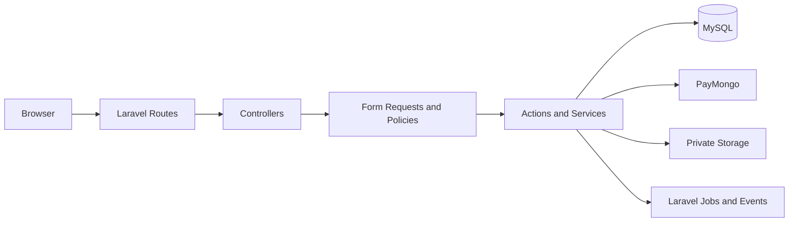

# Technology decision

## Decision

Use this target stack for the BSIT Academic LMS:

```text
Laravel 13
PHP 8.3 to 8.5
Blade templates
Tailwind CSS
MySQL 8.x
Laravel built-in authentication
Laravel Policies and Gates
Laravel Events, Listeners, and Jobs
Laravel Storage
PayMongo server integration
Composer
Git and GitHub
```

The application will be a monolithic Laravel web application.

A separate frontend repository and a separate backend repository are not required.

## Why this decision fits

The developer already has experience with:

- PHP
- HTML
- Custom CSS
- MySQL
- XAMPP
- Basic server-side request handling

Laravel adds a clear structure around familiar concepts:

| Existing concept | Laravel concept |
|---|---|
| PHP page or controller | Route and controller |
| `include` or `require` | Blade layout and component |
| HTML form | Blade form and Form Request |
| PHP session | Laravel authentication session |
| Manual role checks | Policy and Gate |
| PDO or MySQL queries | Eloquent model and query builder |
| SQL schema file | Database migration |
| PHP `$_FILES` | Validated upload and Laravel Storage |
| cURL payment code | Server-only PayMongo service |
| Cron script | Scheduled command or queued Job |

This reduces the number of unrelated technologies the team must learn.

## SIA1 fit

Systems Integration and Architecture 1 commonly values clear system boundaries, data relationships, integration flows, security, deployment, and the ability to explain design decisions.

Laravel supports an easy defense explanation:



The project can present:

- Client-server architecture
- MVC architecture
- Layered application design
- Relational database design
- Middleware and session security
- Role-based authorization
- External API integration
- Webhook processing
- File storage access control
- Queue-based background work
- Deployment architecture

The exact course requirements must still be checked against the school syllabus.

## Options considered

### Plain PHP and MySQL

Advantages:

- Closest to current experience
- Few framework concepts
- Direct control over code

Costs:

- Authentication and authorization must be built carefully
- Role permissions become custom code
- File access control becomes custom code
- Payment and webhook retries require custom infrastructure
- Large files become difficult to navigate
- Testing helpers require additional packages

This option is possible but offers less structure for an academic architecture project.

### Laravel, Blade, and MySQL

Advantages:

- Uses the existing PHP skill
- Includes authentication and session support
- Provides migrations, policies, validation, jobs, events, mail, and storage
- Keeps frontend and backend in one understandable application
- Supports clear MVC and layered architecture
- Fits SIA1 system-design explanations
- Has one dependency manager through Composer

Costs:

- Requires learning Laravel conventions
- Requires Composer
- Requires careful separation between Blade, controllers, policies, actions, and models

This is the selected option.

### Next.js, TypeScript, and Supabase

Advantages:

- Modern full-stack TypeScript
- Good Vercel deployment path
- Strong managed authentication, database, and storage services
- Clear React user-interface components

Costs:

- Requires React, TypeScript, App Router, and server-client boundaries
- Requires learning Supabase and Row Level Security
- Splits responsibilities across Next.js and several managed services
- Uses a different language from the developer's current experience
- Makes local architecture and authorization harder for a beginner to explain

This option remains viable for a JavaScript-focused team. It is not selected for this project.

## Architecture consequences

### Positive consequences

- One application owns routes, UI, authentication, authorization, and business workflows.
- MySQL remains familiar.
- Laravel provides standard locations for each responsibility.
- External services stay behind server-side services.
- Tests can cover complete browser requests and database rules.

### Costs and risks

- The team must learn MVC and service-layer boundaries.
- Eloquent can hide important queries. Developers must understand SQL used by critical workflows.
- Model methods must not become dumping grounds for business logic.
- Blade templates must not contain authorization decisions.
- Client-side JavaScript must never decide access, payment, score, or completion.
- Queues and webhooks add deployment requirements and must be tested.

## Reference repository assessment

The external repository below was reviewed as reference data:

```text
https://github.com/aliameenco-creator/lms-project-ali-amin-ai-web-development
```

Useful ideas:

- Grouping application code under `src/`
- Course and lesson route organization
- Curriculum-builder concepts
- Student course-player concepts
- Admin table and dashboard concepts
- External video-link handling

Parts not approved for reuse:

- Authentication route
- Role selection during registration
- Client-side role checks
- Browser local-storage data store
- Manual payment approval as payment proof
- Database migration and RLS policies
- Mock identities
- Branding and visual assets

The reference repository also lacks a clear license file. Code must not be copied without permission.

Because Laravel has a standard directory structure, the final project will follow Laravel conventions instead of copying the reference repository's `src/` tree.

## Deferred technical decisions

The following choices remain open until implementation:

- Production hosting provider
- Managed MySQL provider
- Production object-storage provider
- Queue driver for non-critical background work
- Exact file-size limits
- Final institution name and certificate wording
- PayMongo methods and event names

PayMongo details must be checked against current official documentation before payment work begins.

## Official references

Checked on September 24, 2026:

- Laravel releases: <https://laravel.com/docs/releases>
- Laravel directory structure: <https://laravel.com/docs/structure>
- Laravel authentication: <https://laravel.com/docs/authentication>
- Laravel authorization: <https://laravel.com/docs/authorization>
- Laravel queues: <https://laravel.com/docs/queues>
- Laravel filesystem: <https://laravel.com/docs/filesystem>
- Laravel deployment: <https://laravel.com/docs/deployment>

Laravel 13 is the current major release documented by Laravel and requires PHP 8.3 or newer.
